# 🖥️ Network Servers - Complete Implementation Guide

<div align="center">


**Comprehensive Guide to Network Services Configuration**

[](.)
[](.)
[](.)

[📖 Overview](#-overview) • [🌐 DNS](#-dns-server) • [📧 EMAIL](#-email-server) • [📁 FTP](#-ftp-server) • [🌍 HTTP](#-http-server) • [🔢 DHCP](#-dhcp-server) • [🔐 RADIUS AAA](#-radius-aaa-server) • [⏰ NTP](#-ntp-server) • [📝 SYSLOG](#-syslog-server) • [🏠 IoT](#-iot-server)

</div>

---

## 📖 Overview

**Network Servers** provide essential services that make networks functional and manageable. Each server serves a specific purpose in the network infrastructure.

### Servers Covered:

| Server | Purpose | Port | Protocol |
|--------|---------|------|----------|
| **DNS** | Domain Name Resolution | 53 | UDP/TCP |
| **DHCP** | Automatic IP Assignment | 67/68 | UDP |
| **HTTP** | Web Services | 80 | TCP |
| **FTP** | File Transfer | 20/21 | TCP |
| **EMAIL** | Email Services (SMTP/POP3) | 25/110 | TCP |
| **RADIUS AAA** | Authentication, Authorization, Accounting | 1812/1813 | UDP |
| **NTP** | Network Time Synchronization | 123 | UDP |
| **SYSLOG** | Centralized Logging | 514 | UDP |
| **IoT** | Internet of Things Management | 8181 | TCP |

---

## 📚 Table of Contents

- [🌐 DNS Server](#-dns-server)
- [🔢 DHCP Server](#-dhcp-server)
- [🌍 HTTP Server](#-http-server)
- [📁 FTP Server](#-ftp-server)
- [📧 EMAIL Server](#-email-server)
- [🔐 RADIUS AAA Server](#-radius-aaa-server)
- [⏰ NTP Server](#-ntp-server)
- [📝 SYSLOG Server](#-syslog-server)
- [🏠 IoT Server](#-iot-server)
- [📊 Server Comparison](#-server-comparison)
- [📝 Quick Reference](#-quick-reference)

---

## 🌐 DNS Server

### Concept

<div align="center">

| Feature | Details |
|---------|---------|
| **Full Name** | Domain Name System |
| **Purpose** | Translates domain names to IP addresses |
| **Port** | 53 (UDP/TCP) |
| **Example** | www.google.com → 142.250.185.46 |
| **Analogy** | Phone book for the internet |

</div>

### 🔑 Key Points:

**DNS (Domain Name System)** is like a phone book that converts human-readable domain names into IP addresses that computers understand.

#### How It Works:
```
User types: www.example.com
     ↓
DNS Server looks up the domain
     ↓
Returns IP: 192.168.1.100
     ↓
Browser connects to 192.168.1.100
```

#### Real-Life Example:
```
Instead of remembering: 142.250.185.46
You simply type: www.google.com

DNS Server does the translation for you!
```

#### Why Use DNS?
- ✅ **Easy to remember** - Names instead of numbers
- ✅ **Flexibility** - IP can change, domain stays same
- ✅ **Scalability** - One domain, multiple IPs
- ✅ **Organization** - Hierarchical naming structure

#### Common DNS Record Types:

| Record | Purpose | Example |
|--------|---------|---------|
| **A** | Maps domain to IPv4 | example.com → 192.168.1.1 |
| **AAAA** | Maps domain to IPv6 | example.com → 2001:db8::1 |
| **CNAME** | Alias (points to another domain) | www → example.com |
| **MX** | Mail server | mail.example.com |
| **NS** | Name server | ns1.example.com |

---

### Lab Implementation - DNS Server

#### 📊 Network Setup:

<p align="center">
  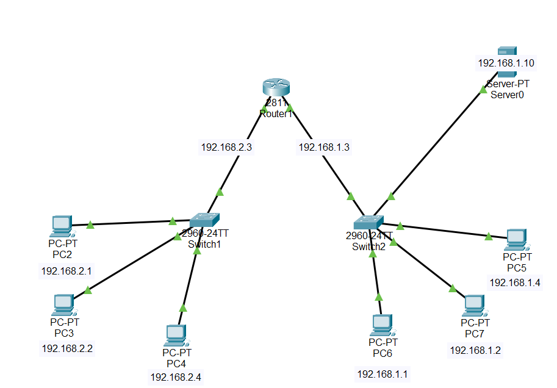
</p>

#### Configuration Steps:

**Step 1: DNS Server Configuration**

1. Add a **Server** device in Packet Tracer
2. Configure IP address (e.g., 192.168.1.10)
3. Go to **Services** tab → **DNS**
4. Turn **DNS Service ON**
5. Add DNS records:
   ```
   Name: www.example.com
   Address: 192.168.1.100
   Type: A Record
   ```

**Step 2: Client Configuration**

1. Go to PC → **Desktop** → **IP Configuration**
2. Set DNS Server: `192.168.1.10`
3. Test by opening **Web Browser**
4. Type: `www.example.com`

---

### Results - DNS Server

#### ✅ DNS Configuration:

<p align="center">
  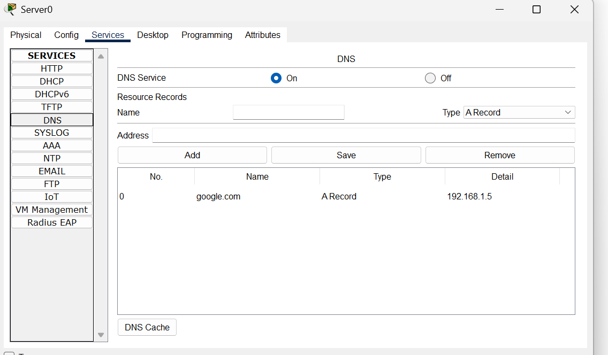
</p>

**Result:** ✅ DNS records configured and resolving correctly

---

#### ✅ DNS Resolution Test:

<p align="center">
  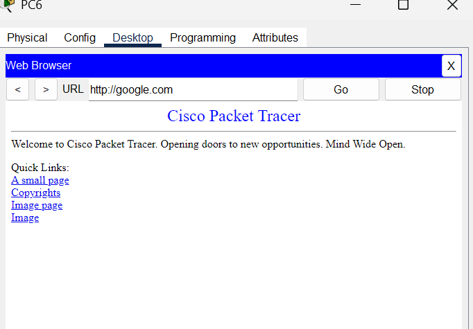
</p>

**Result:** ✅ Domain name successfully resolved to IP address

---

## 🔢 DHCP Server

### Concept

<div align="center">

| Feature | Details |
|---------|---------|
| **Full Name** | Dynamic Host Configuration Protocol |
| **Purpose** | Automatic IP address assignment |
| **Port** | 67 (Server), 68 (Client) |
| **Protocol** | UDP |
| **Lease Time** | Temporary IP assignment duration |

</div>

### 🔑 Key Points:

**DHCP** automatically assigns IP addresses to devices on a network, eliminating manual configuration.

#### How It Works (DORA Process):

```
1. DISCOVER - Client broadcasts: "I need an IP!"
2. OFFER - Server responds: "Here's 192.168.1.50"
3. REQUEST - Client says: "I'll take it!"
4. ACKNOWLEDGE - Server confirms: "It's yours for 24 hours"
```

#### Real-Life Example:
```
Without DHCP:
- Connect to WiFi
- Manually enter: IP, Subnet, Gateway, DNS
- Prone to errors and conflicts

With DHCP:
- Connect to WiFi
- Everything configured automatically! ✓
```

#### DHCP Components:

| Component | Description |
|-----------|-------------|
| **DHCP Server** | Manages IP address pool |
| **IP Pool** | Range of available addresses |
| **Lease Time** | How long client keeps IP |
| **Default Gateway** | Router IP for internet access |
| **DNS Server** | Domain name resolution |

#### Why Use DHCP?
- ✅ **Automatic configuration** - No manual IP setup
- ✅ **Prevents conflicts** - No duplicate IPs
- ✅ **Centralized management** - Easy to manage IPs
- ✅ **Efficient utilization** - IPs released when not in use
- ✅ **Mobility support** - Devices get IP when they connect

---

### Lab Implementation - DHCP Server

#### 📊 Network Setup:

<p align="center">
  
</p>

#### Configuration Steps:

**Step 1: DHCP Server Configuration**

1. Add a **Server** device
2. Configure static IP: `192.168.1.10`
3. Go to **Services** → **DHCP**
4. Turn **DHCP Service ON**
5. Configure pool:
   ```
   Pool Name: LAN-Pool
   Default Gateway: 192.168.1.1
   DNS Server: 192.168.1.10
   Start IP Address: 192.168.1.100
   Subnet Mask: 255.255.255.0
   Maximum Users: 50
   ```
6. Click **Save**

**Step 2: Client Configuration**

1. Go to PC → **Desktop** → **IP Configuration**
2. Select **DHCP** (instead of Static)
3. Wait for IP assignment
4. Verify received:
   - IP Address
   - Subnet Mask
   - Default Gateway
   - DNS Server

---

### Results - DHCP Server

#### ✅ DHCP Server Configuration:

<p align="center">
  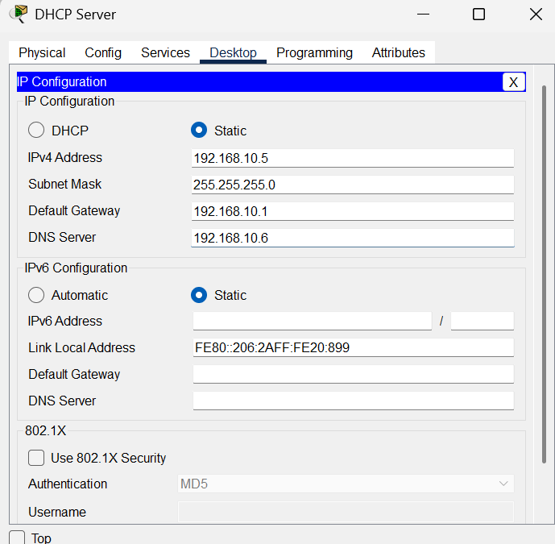
</p>

**Configuration:**
```
Pool Name: LAN-Pool
Default Gateway: 192.168.1.1
DNS Server: 192.168.1.10
Start IP: 192.168.1.100
Subnet Mask: 255.255.255.0
Max Users: 50
```

**Result:** ✅ DHCP pool configured successfully

---

#### ✅ Client Receiving DHCP IP:

<p align="center">
  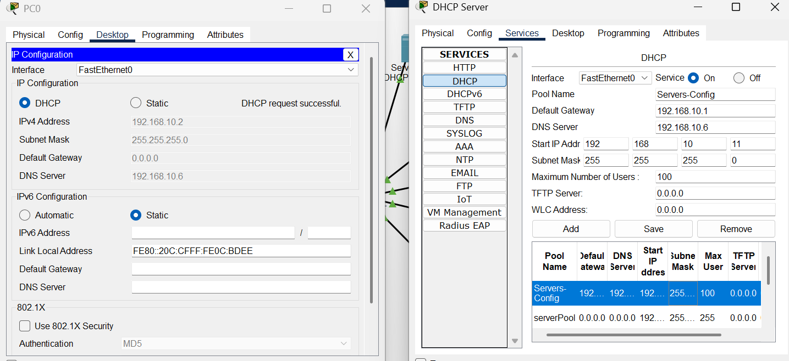
</p>

**Client Received:**
```
IP Address: 192.168.1.100 (from DHCP)
Subnet Mask: 255.255.255.0
Default Gateway: 192.168.1.1
DNS Server: 192.168.1.10
```

**Result:** ✅ Client successfully obtained IP via DHCP

---

## 🌍 HTTP Server

### Concept

<div align="center">

| Feature | Details |
|---------|---------|
| **Full Name** | Hypertext Transfer Protocol |
| **Purpose** | Web page hosting and delivery |
| **Port** | 80 (HTTP), 443 (HTTPS) |
| **Protocol** | TCP |
| **Content** | HTML, CSS, JavaScript, Images |

</div>

### 🔑 Key Points:

**HTTP Server** hosts websites and web applications that users access through browsers.

#### How It Works:
```
User opens browser
     ↓
Types: www.example.com
     ↓
DNS resolves to server IP
     ↓
Browser sends HTTP request
     ↓
Server sends HTML/CSS/JS files
     ↓
Browser displays the webpage
```

#### Real-Life Example:
```
HTTP Server = Library
Webpages = Books
Browser = You (reader)
Request = "I want this book"
Response = Librarian gives you the book
```

#### HTTP vs HTTPS:

| Feature | HTTP | HTTPS |
|---------|------|-------|
| **Security** | ❌ Not encrypted | ✅ Encrypted (SSL/TLS) |
| **Port** | 80 | 443 |
| **Data Protection** | Plain text | Encrypted |
| **Use Case** | Public info | Sensitive data (banking, login) |

#### Why Use HTTP Server?
- ✅ **Host websites** - Company websites, blogs
- ✅ **Web applications** - Online tools, dashboards
- ✅ **Information sharing** - Documentation, resources
- ✅ **User interfaces** - Device management pages

---

### Lab Implementation - HTTP Server

#### 📊 Network Setup:

<p align="center">
  
</p>

#### Configuration Steps:

**Step 1: HTTP Server Configuration**

1. Add a **Server** device
2. Configure IP address: `192.168.1.100`
3. Go to **Services** → **HTTP**
4. Turn **HTTP Service ON**
5. Create/edit HTML page:
   ```html
   <html>
   <head><title>Welcome</title></head>
   <body>
   <h1>Welcome to My Website!</h1>
   <p>This is hosted on HTTP Server</p>
   </body>
   </html>
   ```

**Step 2: DNS Configuration (Optional)**

1. Add DNS record:
   ```
   Name: www.mysite.com
   IP: 192.168.1.100
   ```

**Step 3: Client Access**

1. PC → **Desktop** → **Web Browser**
2. Enter URL: `http://192.168.1.100` or `www.mysite.com`
3. Webpage loads!

---

### Results - HTTP Server

#### ✅ HTTP Server Configuration:

<p align="center">
  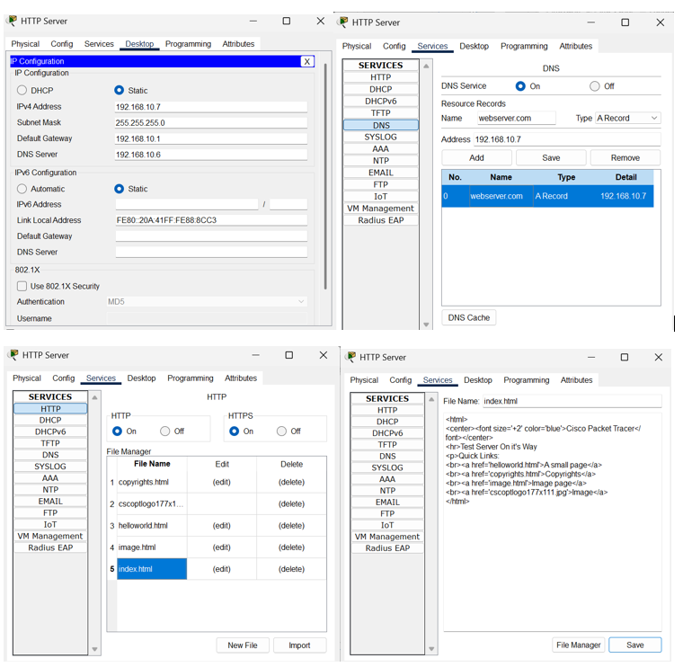
</p>

**Result:** ✅ HTTP service enabled and webpage configured

---

#### ✅ Accessing Website:

<p align="center">
  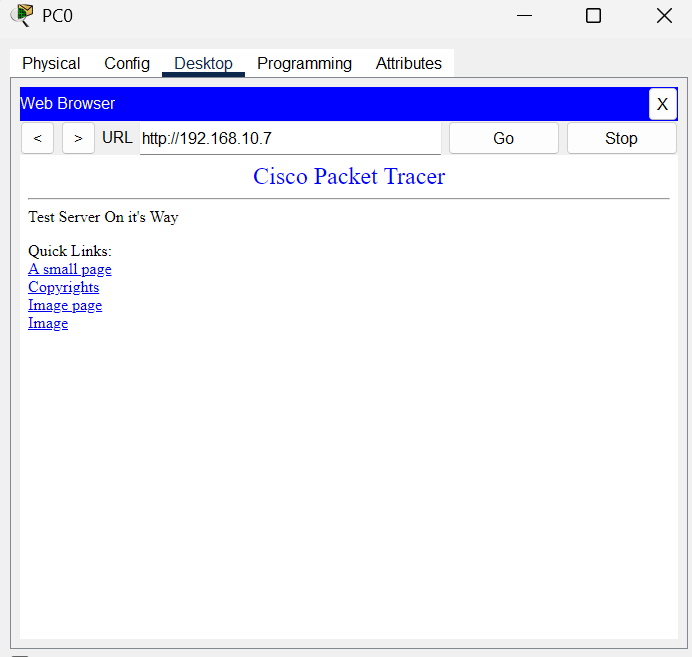
</p>

**Result:** ✅ Website successfully accessible from client browser

---

## 📁 FTP Server

### Concept

<div align="center">

| Feature | Details |
|---------|---------|
| **Full Name** | File Transfer Protocol |
| **Purpose** | File upload and download |
| **Ports** | 20 (Data), 21 (Control) |
| **Protocol** | TCP |
| **Authentication** | Username and Password |

</div>

### 🔑 Key Points:

**FTP Server** allows users to upload and download files over a network.

#### How It Works:
```
Client connects to FTP Server
     ↓
Authenticates with username/password
     ↓
Browses files and folders
     ↓
Uploads/Downloads files
     ↓
Disconnects
```

#### Real-Life Example:
```
FTP Server = Cloud Storage (like Google Drive)
Users = People with access
Files = Documents, images, videos
Upload = Put files in the cloud
Download = Get files from the cloud
```

#### FTP Modes:

| Mode | Description |
|------|-------------|
| **Active** | Server initiates data connection |
| **Passive** | Client initiates both connections |

#### Common FTP Commands:

| Command | Purpose |
|---------|---------|
| **ls** | List files |
| **cd** | Change directory |
| **get** | Download file |
| **put** | Upload file |
| **delete** | Remove file |

#### Why Use FTP Server?
- ✅ **File sharing** - Share large files
- ✅ **Backup storage** - Store important files
- ✅ **Website management** - Upload website files
- ✅ **Centralized storage** - One place for all files

---

### Lab Implementation - FTP Server

#### 📊 Network Setup:

<p align="center">
  
</p>

#### Configuration Steps:

**Step 1: FTP Server Configuration**

1. Add a **Server** device
2. Configure IP: `192.168.1.20`
3. Go to **Services** → **FTP**
4. Turn **FTP Service ON**
5. Create user account:
   ```
   Username: admin
   Password: admin123
   Permissions: Read, Write, Delete, Rename, List
   ```
6. Click **Add**

**Step 2: Client Access**

1. PC → **Desktop** → **Command Prompt**
2. FTP command:
   ```
   ftp 192.168.1.20
   Username: admin
   Password: admin123
   ```
3. Commands:
   ```
   ftp> ls         (list files)
   ftp> get file.txt   (download)
   ftp> put doc.pdf    (upload)
   ftp> quit       (exit)
   ```

---

### Results - FTP Server

#### ✅ FTP Server Configuration:

<p align="center">
  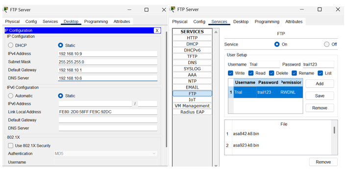
</p>

**User Configuration:**
```
Username: admin
Password: admin123
Permissions: Full Access
```

**Result:** ✅ FTP server configured with user authentication

---

#### ✅ FTP Access Test:

<p align="center">
  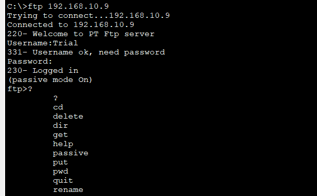
</p>

**Result:** ✅ Successfully connected and transferred files

---

## 📧 EMAIL Server

### Concept

<div align="center">

| Feature | Details |
|---------|---------|
| **Purpose** | Send and receive emails |
| **Protocols** | SMTP (send), POP3/IMAP (receive) |
| **SMTP Port** | 25 |
| **POP3 Port** | 110 |
| **IMAP Port** | 143 |

</div>

### 🔑 Key Points:

**EMAIL Server** handles sending and receiving email messages within a network.

#### Email Protocols:

**SMTP (Simple Mail Transfer Protocol):**
```
Purpose: Sending emails
Port: 25
Flow: Your email client → SMTP Server → Recipient's server
```

**POP3 (Post Office Protocol v3):**
```
Purpose: Receiving emails
Port: 110
Behavior: Downloads emails to device, removes from server
```

**IMAP (Internet Message Access Protocol):**
```
Purpose: Receiving emails
Port: 143
Behavior: Syncs emails across devices, keeps on server
```

#### How Email Works:
```
Sender writes email
     ↓
SMTP sends to recipient's server
     ↓
Email stored in recipient's mailbox
     ↓
Recipient retrieves via POP3/IMAP
     ↓
Email appears in inbox
```

#### Real-Life Example:
```
EMAIL Server = Post Office
SMTP = Sending letters
POP3/IMAP = Receiving letters from your PO box
Email Address = Your PO box number
```

#### Why Use EMAIL Server?
- ✅ **Internal communication** - Company emails
- ✅ **Centralized management** - All emails in one place
- ✅ **Controlled environment** - No external dependencies
- ✅ **Privacy** - Emails stay within network

---

### Lab Implementation - EMAIL Server

#### 📊 Network Setup:

<p align="center">
  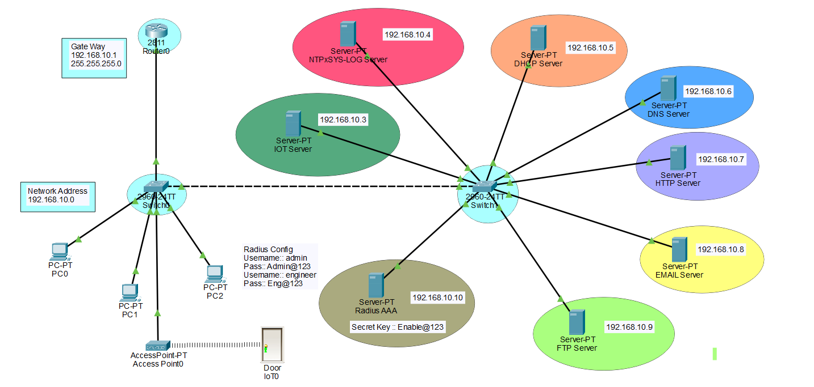
</p>

#### Configuration Steps:

**Step 1: EMAIL Server Configuration**

1. Add a **Server** device
2. Configure IP: `192.168.1.30`
3. Set domain name: `mail.example.com`
4. Go to **Services** → **EMAIL**
5. Turn **Email Service ON**
6. Create user accounts:
   ```
   User: alice@mail.example.com
   Password: alice123
   
   User: bob@mail.example.com
   Password: bob123
   ```

**Step 2: Client Configuration**

1. PC → **Desktop** → **Email**
2. Configure email client:
   ```
   Your Name: Alice
   Email Address: alice@mail.example.com
   Incoming Mail Server: 192.168.1.30
   Outgoing Mail Server: 192.168.1.30
   Username: alice
   Password: alice123
   ```
3. Click **Save**

**Step 3: Send/Receive Email**

1. Compose new email
2. To: `bob@mail.example.com`
3. Subject: `Test Email`
4. Send!
5. Bob receives the email

---

### Results - EMAIL Server

#### ✅ EMAIL Server Configuration:

<p align="center">
  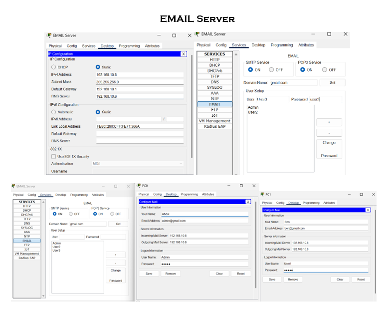
</p>

**Users Created:**
```
alice@mail.example.com
bob@mail.example.com
```

**Result:** ✅ Email server configured with user accounts

---

#### ✅ Sending Email:

<p align="center">
  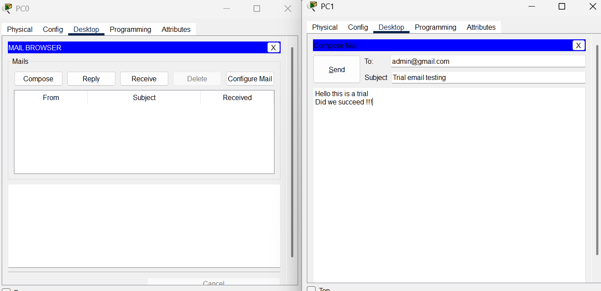
</p>

**Result:** ✅ Email sent successfully from Alice to Bob

---

#### ✅ Receiving Email:

<p align="center">
  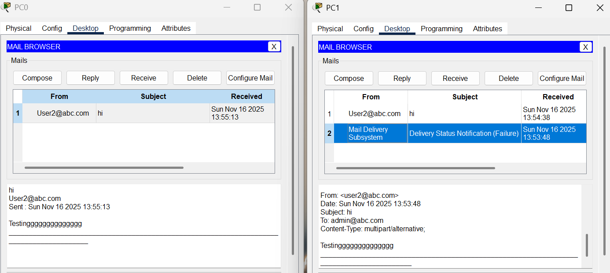
</p>

**Result:** ✅ Email received successfully in Bob's inbox

---

## 🔐 RADIUS AAA Server

### Concept

<div align="center">

| Feature | Details |
|---------|---------|
| **Full Name** | Remote Authentication Dial-In User Service |
| **AAA** | Authentication, Authorization, Accounting |
| **Port** | 1812 (Auth), 1813 (Accounting) |
| **Protocol** | UDP |
| **Use Case** | Centralized network access control |

</div>

### 🔑 Key Points:

**RADIUS AAA Server** provides centralized authentication, authorization, and accounting for network access.

#### The 3 A's Explained:

**1. Authentication (Who are you?)**
```
User tries to login
     ↓
Router asks RADIUS: "Is this user valid?"
     ↓
RADIUS checks credentials
     ↓
Response: "Yes, it's Alice" or "No, invalid user"
```

**2. Authorization (What can you do?)**
```
User authenticated successfully
     ↓
RADIUS determines access level
     ↓
Response: "Privilege level 15" (full admin) or "Level 1" (limited)
```

**3. Accounting (What did you do?)**
```
User logs in and works
     ↓
RADIUS records:
- Login time: 10:30 AM
- Logout time: 11:45 AM
- Commands executed
- Source IP address
     ↓
Audit trail created for security
```

#### Real-Life Example:
```
RADIUS = Building Security System

Authentication = ID card scan at entrance
"Is this person an employee?" ✓

Authorization = Floor access based on role
"Engineers go to 3rd floor, HR to 2nd floor"

Accounting = Log entry/exit times
"Who entered when and left when?"
```

#### Why Use RADIUS?
- ✅ **Centralized management** - One place for all users
- ✅ **Security** - Strong authentication and encryption
- ✅ **Audit trails** - Track who did what
- ✅ **Scalability** - Manage thousands of users
- ✅ **Role-based access** - Different permissions per user

---

### RADIUS Requirements

**REQUIREMENT 1: Physical Layer**
```
✓ PC connected to Switch
✓ Switch connected to Router
✓ All cables working (green lights)
```

**REQUIREMENT 2: Network Layer**
```
✓ PC IP: 192.168.10.x
✓ Router IP: 192.168.10.1
✓ Same subnet
✓ Ping successful
```

**REQUIREMENT 3: Application Layer**
```
✓ SSH/Telnet command from PC
✓ Router queries RADIUS
✓ RADIUS authenticates
✓ Access granted/denied
```

⚠️ **IMPORTANT:** RADIUS only works at Layer 3! Layers 1 & 2 must be ready first!

---

### Why SSH Instead of Telnet?

<p align="center">
  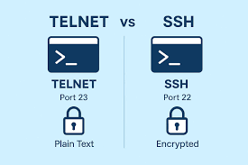
</p>

| Feature | Telnet | SSH |
|---------|--------|-----|
| **Encryption** | ❌ Plain text | ✅ Encrypted |
| **Security** | ❌ Low | ✅ High |
| **Password Protection** | ❌ Visible on network | ✅ Protected |
| **Port** | 23 | 22 |
| **Modern Usage** | ❌ Deprecated | ✅ Standard |

**Simple:** Telnet is like sending a postcard (anyone can read), SSH is like a sealed envelope! 🔒

---

### Lab Implementation - RADIUS AAA Server

#### 📊 Network Topology:

<p align="center">
  
</p>

---

### Configuration Steps Explained

#### Step-by-Step Command Breakdown:

**1. Setting up Hostname**
```cisco
Router(config)# hostname Router0
```
**Why?** Helps SSH identify the router  
**Before:** `Router(config)`  
**After:** `Router0(config)` ← Name changed

---

**2. Setting Domain Name**
```cisco
Router0(config)# ip domain-name lab.com
```
**Why?** Required for SSH key generation  
**Without:** `Router0`  
**With:** `Router0.lab.com` ← Fully Qualified Domain Name (FQDN)

---

**3. Generating Encryption Key**
```cisco
Router0(config)# crypto key generate rsa
How many bits in the modulus [512]: 1024
```
**What happens:**
```
Step 1: Router does mathematical calculation
Step 2: Creates two keys (public + private)
Step 3: Public key shared with clients
Step 4: Private key stays on router
```
**Output:**
```
Generating 1024 bit RSA keys... [OK]
```

---

**4. Activating AAA Framework**
```cisco
Router0(config)# aaa new-model
```
**What happens:** Router's memory activates AAA database  
**Now accepts:**
- `aaa authentication`
- `aaa authorization`
- `aaa accounting`

---

**5. Adding RADIUS Server**
```cisco
Router0(config)# radius-server host 192.168.10.10 key cisco123
```
**Explanation:**
- **host 192.168.10.10** = RADIUS server IP address
- **key cisco123** = Shared secret (password between router and RADIUS)

**For Multiple Servers:**
```cisco
radius-server host 192.168.10.10 key cisco123  ← Primary
radius-server host 192.168.10.20 key cisco123  ← Backup
```

**Security Check:**
```
Request includes key
     ↓
RADIUS checks: "Does key match?"
     ↓
Wrong key = Request REJECTED ❌
Correct key = Request ACCEPTED ✅
```

---

**6. Setting up Authentication**
```cisco
Router0(config)# aaa authentication login default group radius local
```
**Breakdown:**
- **aaa authentication** = Authentication configuration
- **login** = For login attempts
- **default** = Apply everywhere (all lines)
- **group radius** = Try RADIUS first
- **local** = If RADIUS fails, use local database

**Flow:**
```
User tries to login
     ↓
1. Check RADIUS server
     ↓ (if RADIUS down)
2. Check local database
     ↓
Grant/Deny access
```

---

**7. Setting up Authorization**
```cisco
Router0(config)# aaa authorization exec default group radius local
```
**Purpose:** Determines access level after authentication

**Flow:**
```
User authenticated successfully ✅
     ↓
"What level of access?"
     ↓
RADIUS replies: "Privilege level 15"
     ↓
User gets full admin access: Router0#
```

---

**8. Setting up Accounting**
```cisco
Router0(config)# aaa accounting exec default start-stop group radius
```
**Purpose:** Track and log user activities

**Logs Recorded:**
```
Username: admin
Login time: 10:30 AM
Logout time: 11:45 AM
Duration: 1 hour 15 minutes
Commands executed: show run, configure terminal, etc.
Source IP: 192.168.10.20
```

---

**9. Adding Local Backup User**
```cisco
Router0(config)# username backup privilege 15 secret Backup@123
```
**Breakdown:**
- **username backup** = Username is "backup"
- **privilege 15** = Full admin access
- **secret Backup@123** = Encrypted password

**Privilege Levels:**
```
0 = Nothing
1 = User EXEC (Router>)
15 = Privileged EXEC (Router#) - Full admin
```

**Use Case:** RADIUS down? Network issue? No problem! Login with local user.

---

**10. Configuring Virtual Terminal Lines**
```cisco
Router0(config)# line vty 0 4
```
**What is VTY?** Virtual Teletype (remote access lines)  
**0 - 4** = 5 simultaneous connections (lines 0, 1, 2, 3, 4)

---

**11. Restricting to SSH Only**
```cisco
Router0(config-line)# transport input ssh
```
**Options:**
```
transport input telnet       ← Only Telnet (insecure) ❌
transport input ssh          ← Only SSH (secure) ✅
transport input telnet ssh   ← Both allowed
transport input all          ← All protocols
transport input none         ← Block everything
```

---

**12. Applying Authentication to VTY**
```cisco
Router0(config-line)# login authentication default
```
**What happens:**
```
User tries SSH/Telnet to VTY
     ↓
1. Check RADIUS
2. If RADIUS fails, check local
```

---

**13. Saving Configuration**
```cisco
Router0(config-line)# exit
Router0(config)# exit
Router0# write memory
```
**or**
```cisco
Router0# copy running-config startup-config
```

---

### Complete Configuration Flow

```
[Setup Phase]
1. hostname → Router identity
2. domain-name → FQDN for SSH
3. crypto keys → Enable SSH encryption

[AAA Setup]
4. aaa new-model → Turn on AAA framework
5. radius-server → Server address + shared key

[Authentication]
6. aaa authentication → Who can login?

[Authorization]
7. aaa authorization → What access level?

[Accounting]
8. aaa accounting → Log all activities

[Backup]
9. username backup → Emergency local user

[VTY Setup]
10. line vty 0 4 → Remote access lines
11. transport ssh → Only SSH allowed
12. login auth → Apply AAA rules

[Save]
13. write memory → Save configuration
```

---

### Lab Implementation

#### Setting up RADIUS Server:

<p align="center">
  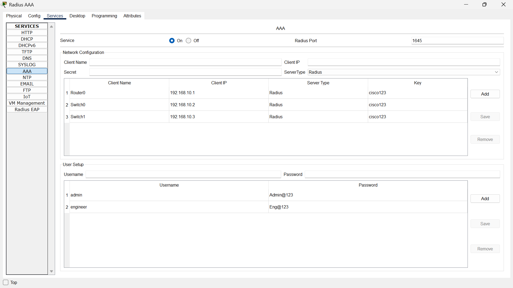
</p>

**Server Configuration:**
1. Add **Server** device
2. IP: `192.168.10.10`
3. **Services** → **AAA**
4. Turn **AAA Service ON**
5. Add users:
   ```
   Username: admin
   Password: Admin@123
   Privilege Level: 15
   ```
6. Set **Network Configuration**:
   ```
   Client IP: 192.168.10.1 (Router IP)
   Secret Key: cisco123
   ```

---

### Router Configuration:

<p align="center">
  
</p>

**Complete Router Commands:**
```cisco
! Hostname and Domain
hostname Router0
ip domain-name lab.com

! Generate SSH Keys
crypto key generate rsa
1024

! AAA Configuration
aaa new-model
radius-server host 192.168.10.10 key cisco123

! Authentication
aaa authentication login default group radius local

! Authorization
aaa authorization exec default group radius local

! Accounting
aaa accounting exec default start-stop group radius

! Local Backup User
username backup privilege 15 secret Backup@123

! VTY Lines Configuration
line vty 0 4
 transport input ssh
 login authentication default
 exit

! Save Configuration
write memory
```

---

### Switch Configuration:

<p align="center">
  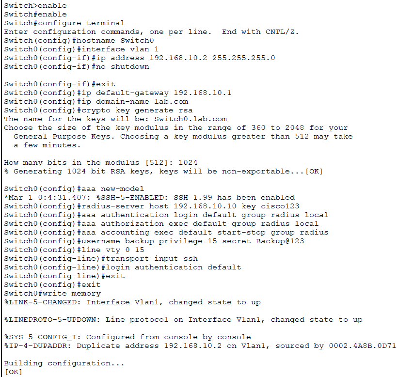
</p>

**Switch 0 Commands:**
```cisco
hostname Switch0
ip domain-name lab.com
crypto key generate rsa
aaa new-model
radius-server host 192.168.10.10 key cisco123
aaa authentication login default group radius local
line vty 0 4
 transport input ssh
 login authentication default
```

---

<p align="center">
  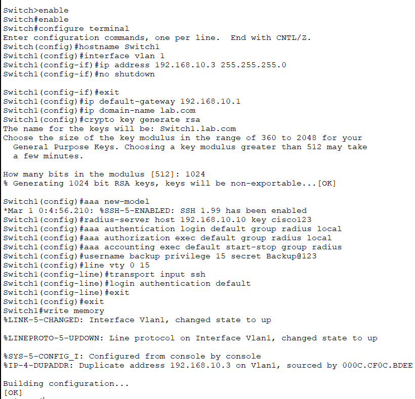
</p>

**Switch 2 Commands:**
```cisco
hostname Switch2
ip domain-name lab.com
crypto key generate rsa
aaa new-model
radius-server host 192.168.10.10 key cisco123
aaa authentication login default group radius local
line vty 0 4
 transport input ssh
 login authentication default
```

---

### Setting Router Password on PC:

<p align="center">
  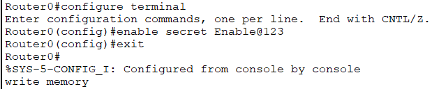
</p>

---

### Results - RADIUS AAA

#### ✅ PC Test - Successful Authentication:

<p align="center">
  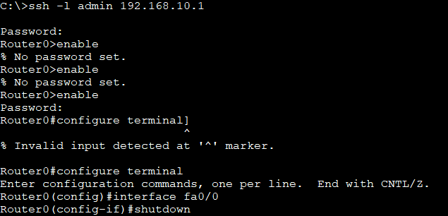
</p>

**Test from PC:**
```
PC> ssh -l admin 192.168.10.1
Password: Admin@123
```

**Flow:**
```
PC sends SSH request
     ↓
Router0 asks RADIUS: "Is admin valid?"
     ↓
RADIUS checks and responds: "Yes, privilege 15"
     ↓
Access granted! Router0#
```

**Result:** ✅ Successfully authenticated via RADIUS server

---

## ⏰ NTP Server

### Concept

<div align="center">

| Feature | Details |
|---------|---------|
| **Full Name** | Network Time Protocol |
| **Purpose** | Synchronize time across network devices |
| **Port** | 123 |
| **Protocol** | UDP |
| **Accuracy** | Milliseconds |

</div>

### 🔑 Key Points:

**NTP (Network Time Protocol)** ensures all devices on a network have synchronized, accurate time.

#### Why Accurate Time Matters:

**1. Logging and Troubleshooting:**
```
Without NTP:
Router1 log: [14:30] Link Down
Router2 log: [09:15] Link Down  ← Wrong time!

Problem: Which failed first? Can't tell!

With NTP:
Router1 log: [14:30:05] Link Down
Router2 log: [14:30:06] Link Down

Answer: Router1 failed first! ✓
```

**2. Security:**
```
Security certificates check time
Wrong time = Certificate invalid = Connection fails
```

**3. Banking/Transactions:**
```
Transaction timestamp must be accurate
Wrong time = Transaction rejected
```

**4. Automated Tasks:**
```
Backups scheduled at 2:00 AM
Without NTP: Each device has different time
Result: Backups happen at random times!

With NTP: All devices sync
Result: All backups at exactly 2:00 AM ✓
```

#### Real-Life Example:
```
NTP Server = Master clock in railway station
All clocks in station = Network devices
Everyone syncs to master = Same time everywhere
Trains run on time = Network operates correctly
```

#### How NTP Works:
```
NTP Client asks: "What time is it?"
     ↓
NTP Server responds: "14:30:25.123"
     ↓
Client adjusts its clock
     ↓
All devices synchronized! ✓
```

#### NTP Stratum Levels:

| Stratum | Description | Example |
|---------|-------------|---------|
| **0** | Reference clock | Atomic clock, GPS |
| **1** | Primary time servers | Connected directly to Stratum 0 |
| **2** | Secondary servers | Syncs from Stratum 1 |
| **3-15** | Client devices | Syncs from higher stratum |

---

### Lab Implementation - NTP Server

#### 📊 Network Setup:

<p align="center">
  
</p>

---

### Configuration - NTP Server (Router as Server)

```cisco
! Configure Router as NTP Server
Router> enable
Router# configure terminal
Router(config)# hostname NTP-Server

! Make this router an NTP server
Router(config)# ntp master 1

! Set timezone (Pakistan Standard Time = GMT+5)
Router(config)# clock timezone PKT 5

! Exit to privileged mode to set time
Router(config)# exit

! Set current date and time
NTP-Server# clock set 14:30:00 11 Dec 2025
```

**Command Explanation:**
```
ntp master 1
     ↑      ↑
     |      └─ Stratum level (1-15)
     |         1 = highest priority
     └─ Make this device NTP master
```

---

### Configuration - NTP Client (Router)

```cisco
! Configure Client Router
Router> enable
Router# configure terminal
Router(config)# hostname Client-Router

! Point to NTP Server (use server's IP)
Client-Router(config)# ntp server 192.168.1.1

! Set timezone
Client-Router(config)# clock timezone PKT 5

! Exit configuration mode
Client-Router(config)# exit
```

---

### Configuration - NTP Client (Switch)

```cisco
! Configure Switch as NTP Client
Switch> enable
Switch# configure terminal

! Point to NTP Server
Switch(config)# ntp server 192.168.1.1

! Set timezone
Switch(config)# clock timezone PKT 5

! Exit
Switch(config)# exit
```

---

### Verification Commands

```cisco
! Check current time
Router# show clock
Output: 14:32:15.234 PKT Wed Dec 11 2025

! Check NTP status
Router# show ntp status
Output:
Clock is synchronized, stratum 2
Reference is 192.168.1.1

! Check NTP associations (which servers syncing from)
Router# show ntp associations
Output:
address         ref clock     st  when  poll
192.168.1.1     .LOCL.        1   24    64
* master (synced), # master (unsynced)
```

---

### Results - NTP Server

#### ✅ NTP Configuration:

<p align="center">
  
</p>

**NTP Server Commands:**
```
ntp master 1
clock timezone PKT 5
clock set 14:30:00 11 Dec 2025
```

**Client Commands:**
```
ntp server 192.168.1.1
clock timezone PKT 5
```

**Result:** ✅ NTP server configured and clients synchronizing

---

### Important Notes:

⚠️ **Synchronization Time:**
```
NTP synchronization takes 2-3 minutes
Be patient! Don't expect instant sync
```

**Stratum Priority:**
```
ntp master 1  ← Highest priority (most trusted)
ntp master 15 ← Lowest priority (least trusted)
```

**Multiple Clients:**
```
One NTP server can serve hundreds of clients
All will have synchronized time
```

---

## 📝 SYSLOG Server

### Concept

<div align="center">

| Feature | Details |
|---------|---------|
| **Purpose** | Centralized log collection and management |
| **Port** | 514 |
| **Protocol** | UDP |
| **Log Levels** | 0-7 (Emergency to Debug) |

</div>

### 🔑 Key Points:

**SYSLOG Server** collects log messages from network devices in one central location.

#### Why Use SYSLOG?

**Without SYSLOG:**
```
Router1 logs stored on Router1
Router2 logs stored on Router2
Switch1 logs stored on Switch1

Problem:
- Must check each device separately
- Logs lost if device reboots
- Hard to correlate events
- Time-consuming troubleshooting
```

**With SYSLOG:**
```
All logs sent to central server
     ↓
One place to check everything
     ↓
Logs preserved even if device reboots
     ↓
Easy to search and analyze
     ↓
Quick troubleshooting! ✓
```

#### Real-Life Example:
```
SYSLOG Server = Security camera recording system
Devices = Individual cameras
Logs = Video footage
Central storage = Can review everything from one place
```

#### SYSLOG Severity Levels:

| Level | Keyword | Description | Example |
|-------|---------|-------------|---------|
| **0** | Emergency | System unusable | Complete device failure |
| **1** | Alert | Immediate action needed | Temperature critical |
| **2** | Critical | Critical condition | Hardware failure |
| **3** | Error | Error condition | Interface down |
| **4** | Warning | Warning condition | High CPU usage |
| **5** | Notice | Normal but significant | Config saved |
| **6** | Informational | Informational | User logged in |
| **7** | Debug | Debug messages | Detailed protocol info |

#### How SYSLOG Works:
```
Device generates log message
     ↓
Sent to SYSLOG server (UDP 514)
     ↓
Server stores the message
     ↓
Administrator reviews logs
     ↓
Troubleshoot or analyze events
```

---

### Lab Implementation - SYSLOG Server

#### Configuration - SYSLOG Server

**Step 1: Setup Server**
1. Add **Server** device
2. Configure IP: `192.168.1.50`
3. Go to **Services** → **SYSLOG**
4. Turn **SYSLOG Service ON**
5. Server ready to receive logs

---

### Configuration - Network Devices

**Router Configuration:**
```cisco
Router(config)# logging 192.168.1.50
Router(config)# logging trap informational
Router(config)# logging on
```

**Switch Configuration:**
```cisco
Switch(config)# logging 192.168.1.50
Switch(config)# logging trap warnings
Switch(config)# logging on
```

**Commands Explained:**
```
logging 192.168.1.50
     └─ SYSLOG server IP address

logging trap informational
     └─ Send logs level 6 and higher (0-6)

logging on
     └─ Enable logging globally
```

---

### Verification

```cisco
! Check logging configuration
Router# show logging

! Generate test log
Router# configure terminal
Router(config)# interface gi0/0
Router(config-if)# shutdown
Router(config-if)# no shutdown
```

**Check SYSLOG Server:** You'll see interface up/down messages!

---

## 🏠 IoT Server

### Concept

<div align="center">

| Feature | Details |
|---------|---------|
| **Full Name** | Internet of Things Server |
| **Purpose** | Manage and control IoT devices |
| **Port** | 8181 (default in Packet Tracer) |
| **Access** | Web-based interface |
| **Devices** | Smart home, sensors, actuators |

</div>

### 🔑 Key Points:

**IoT Server** provides centralized management for Internet of Things devices like smart doors, lights, thermostats, and sensors.

#### Real-Life Example:
```
IoT Server = Smart Home Hub (like Google Home, Alexa)
IoT Devices = Smart lights, door locks, thermostats
Network = WiFi connection
Control = Use app to control everything from one place
```

#### How It Works:
```
IoT Device (Smart Door)
     ↓
Connects to Access Point
     ↓
Registers with IoT Server
     ↓
User controls via web browser
     ↓
Commands sent to device
     ↓
Device responds (door opens/closes)
```

#### Why Use IoT Server?
- ✅ **Centralized control** - All devices in one dashboard
- ✅ **Remote access** - Control from anywhere
- ✅ **Monitoring** - See device status
- ✅ **Automation** - Set rules and schedules
- ✅ **Alerts** - Get notified of events

---

### Lab Implementation - IoT Server

#### 📊 Network Setup:

<p align="center">
  
</p>

---

### Configuration Steps

**Step 1: Enable IoT Service**

<p align="center">
  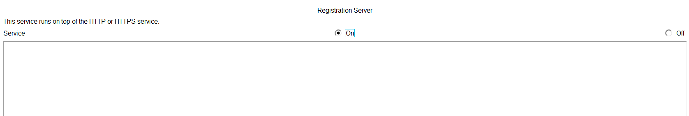
</p>

1. Add **Server** device
2. Configure IP: `192.168.1.60`
3. Go to **Services** → **IoT**
4. Turn **IoT Service ON**

---

**Step 2: Access IoT Server**

<p align="center">
  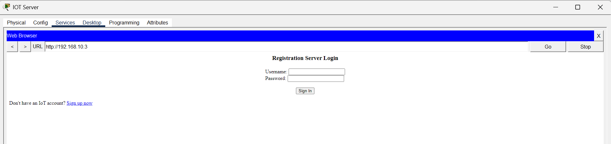
</p>

1. From PC, open **Web Browser**
2. Enter IoT Server IP: `192.168.1.60`
3. IoT login page appears

---

**Step 3: Create Account**

<p align="center">
  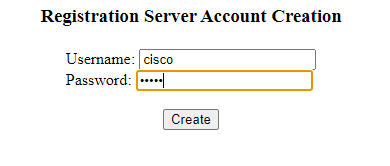
</p>

1. Click **Sign up now**
2. Enter:
   ```
   Username: admin
   Password: admin123
   ```
3. Click **Register**

---

**Step 4: Login to IoT Server**

<p align="center">
  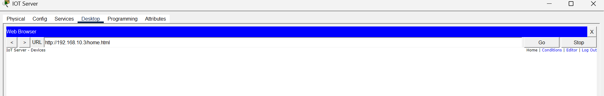
</p>

**Result:** Account created, no devices yet

---

**Step 5: Add Access Point**

<p align="center">
  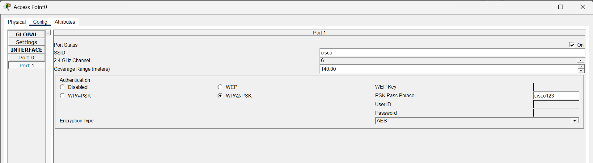
</p>

**Important:** IoT devices can't connect directly to switches!

1. Add **Wireless Access Point (AP-PT)**
2. Connect AP to switch
3. Configure AP settings

---

**Step 6: Add IoT Device**

<p align="center">
  
</p>

1. Add IoT device (e.g., **Smart Door**)
2. Place near Access Point
3. Device ready for configuration

---

**Step 7: Configure IoT Device**

<p align="center">
  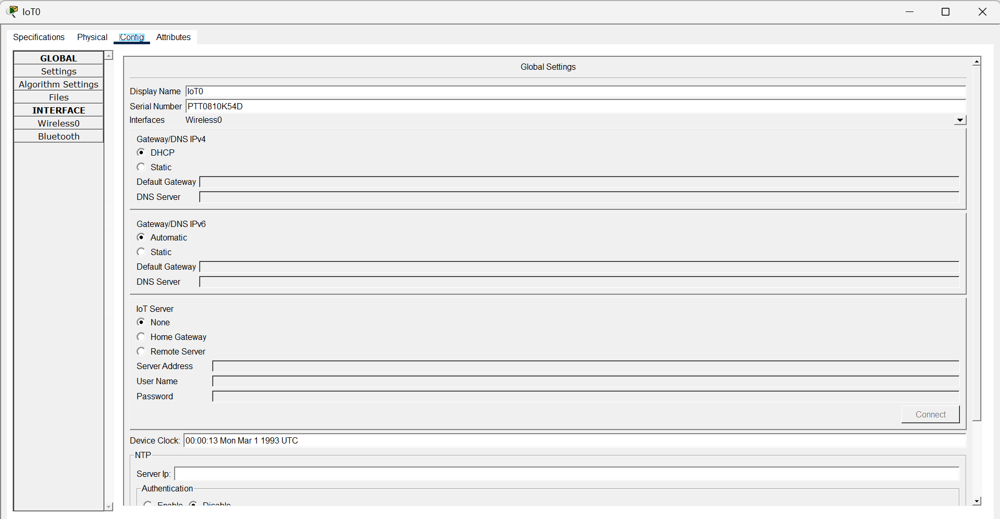
</p>

**Configuration Steps:**
1. Click on IoT device (Door)
2. Go to **Config** tab
3. Select **Remote Server**
4. Enter details:
   ```
   Server IP: 192.168.1.60
   Username: admin
   Password: admin123
   ```

---

**Step 8: Connect to Server**

<p align="center">
  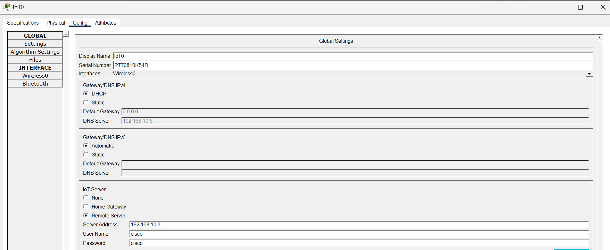
</p>

1. Verify all details entered correctly
2. Click **Connect**
3. Wait for connection...

---

### Results - IoT Server

#### ✅ Device Connected:

<p align="center">
  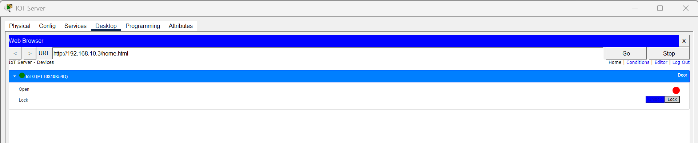
</p>

**Dashboard shows:**
```
Device: Smart Door
Status: Connected
Controls: Open/Close
```

**Result:** ✅ IoT device successfully registered and controllable

---

#### ✅ Server Credentials Verification:

<p align="center">
  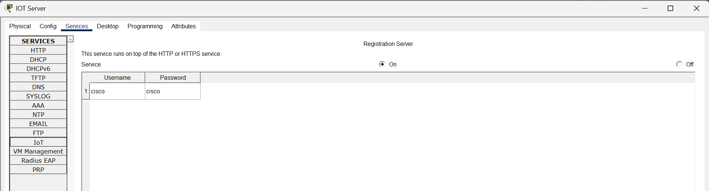
</p>

**To verify IoT server username/password:**
1. Go to server device
2. **Services** → **IoT**
3. View configured credentials

---
**Result:** ✅ IoT server fully operational with devices managed centrally
---

## 📊 Server Comparison

### Quick Comparison Table

<div align="center">

| Server | Primary Function | Port | When to Use |
|--------|------------------|------|-------------|
| **DNS** | Name → IP translation | 53 | Need domain names instead of IPs |
| **DHCP** | Automatic IP assignment | 67/68 | Automate IP configuration |
| **HTTP** | Host websites | 80/443 | Serve web content |
| **FTP** | File transfer | 20/21 | Share/transfer large files |
| **EMAIL** | Email communication | 25/110/143 | Internal email system |
| **RADIUS AAA** | Centralized authentication | 1812/1813 | Secure network access control |
| **NTP** | Time synchronization | 123 | Accurate timestamps needed |
| **SYSLOG** | Centralized logging | 514 | Collect logs from all devices |
| **IoT** | IoT device management | 8181 | Control smart devices |

</div>

---

### Server Dependencies

```
Common Setup Order:

1. DHCP Server (Automatic IP assignment)
     ↓
2. DNS Server (Domain name resolution)
     ↓
3. NTP Server (Time synchronization)
     ↓
4. RADIUS AAA (Security and authentication)
     ↓
5. SYSLOG Server (Centralized logging)
     ↓
6. HTTP/FTP/EMAIL (Application services)
     ↓
7. IoT Server (Smart device management)
```

---

### Use Case Scenarios

#### Small Office Network:
```
Required Servers:
✓ DHCP (automatic IP)
✓ DNS (easy access to resources)
✓ HTTP (company intranet)
✓ EMAIL (internal communication)
```

#### Enterprise Network:
```
Required Servers:
✓ DHCP (hundreds of devices)
✓ DNS (internal domain)
✓ RADIUS AAA (security)
✓ NTP (synchronized time)
✓ SYSLOG (monitoring)
✓ HTTP (web services)
✓ EMAIL (communication)
✓ FTP (file sharing)
```

#### Smart Building:
```
Required Servers:
✓ DHCP (device connectivity)
✓ DNS (service discovery)
✓ IoT Server (device management)
✓ NTP (automation timing)
✓ SYSLOG (device monitoring)
```

---

## 📝 Quick Reference

### Common Server Ports

```
DNS:        53    (UDP/TCP)
DHCP:       67/68 (UDP)
HTTP:       80    (TCP)
HTTPS:      443   (TCP)
FTP:        20/21 (TCP)
SSH:        22    (TCP)
Telnet:     23    (TCP)
SMTP:       25    (TCP)
POP3:       110   (TCP)
IMAP:       143   (TCP)
RADIUS:     1812/1813 (UDP)
NTP:        123   (UDP)
SYSLOG:     514   (UDP)
IoT:        8181  (TCP - Packet Tracer)
```

---

### Verification Commands

#### DNS:
```cisco
nslookup www.example.com
ping www.example.com
```

#### DHCP:
```cisco
ipconfig /release    (Windows)
ipconfig /renew      (Windows)
show ip dhcp binding (Router)
```

#### RADIUS:
```cisco
show aaa servers
show aaa sessions
debug radius authentication
```

#### NTP:
```cisco
show clock
show ntp status
show ntp associations
```

#### SYSLOG:
```cisco
show logging
```

---

### Troubleshooting Tips

**DNS Not Resolving:**
```
✓ Check DNS server is reachable (ping)
✓ Verify DNS service is ON
✓ Check DNS records are configured
✓ Ensure client has correct DNS server IP
```

**DHCP Not Working:**
```
✓ Verify DHCP service is ON
✓ Check IP pool has available addresses
✓ Ensure switch/router forwarding DHCP
✓ Check client set to "DHCP" mode
```

**RADIUS Authentication Fails:**
```
✓ Verify Physical → Network → Application layers
✓ Check shared key matches on both sides
✓ Ensure user exists in RADIUS database
✓ Verify router can reach RADIUS server
✓ Check privilege levels are correct
```

**NTP Not Syncing:**
```
✓ Wait 2-3 minutes for synchronization
✓ Verify NTP server is reachable
✓ Check "ntp master" is configured
✓ Ensure timezone is set correctly
```

**IoT Device Won't Connect:**
```
✓ Verify Access Point is connected
✓ Check IoT service is ON
✓ Ensure correct server IP entered
✓ Verify username/password match
✓ Check device in range of AP
```

---

## 📁 Repository Structure

```
Network-Servers/
│
├── README.md                              # Complete documentation
│
└── images/                                # All screenshots
    ├── servers-banner.png                 # Hero image
    │
    ├── DNS/
    │   ├── dns-server-setup.png
    │   ├── dns-server-config.png
    │   └── dns-resolution-test.png
    │
    ├── DHCP/
    │   ├── dhcp-server-setup.png
    │   ├── dhcp-server-config.png
    │   └── dhcp-client-config.png
    │
    ├── HTTP/
    │   ├── http-server-setup.png
    │   ├── http-server-config.png
    │   └── http-server-result.png
    │
    ├── FTP/
    │   ├── ftp-server-setup.png
    │   ├── ftp-server-config.png
    │   └── ftp-server-test.png
    │
    ├── EMAIL/
    │   ├── email-server-setup.png
    │   ├── email-server-config.png
    │   ├── email-send-test.png
    │   └── email-receive-test.png
    │
    ├── RADIUS-AAA/
    │   ├── radius-why-ssh.png
    │   ├── radius-topology.png
    │   ├── radius-server-setup.png
    │   ├── radius-router-config.png
    │   ├── radius-switch0-config.png
    │   ├── radius-switch2-config.png
    │   ├── radius-router-password.png
    │   └── radius-pc-test.png
    │
    ├── NTP/
    │   ├── ntp-server-setup.png
    │   └── ntp-server-config.png
    │
    ├── SYSLOG/
    │   ├── syslog-server-setup.png
    │   └── syslog-server-config.png
    │
    └── IoT/
        ├── iot-server-initial.png
        ├── iot-service-enable.png
        ├── iot-web-browser.png
        ├── iot-signup.png
        ├── iot-account-created.png
        ├── iot-ap-setup.png
        ├── iot-door-device.png
        ├── iot-device-config.png
        ├── iot-details-entered.png
        ├── iot-device-connected.png
        ├── iot-server-credentials.png
        └── iot-successful-config.png
```

---

## 🎓 What I Learned

### DNS Server:
✅ Domain name to IP address resolution  
✅ DNS record types (A, CNAME, MX, NS)  
✅ Importance of DNS in network operations  
✅ DNS configuration and testing  

### DHCP Server:
✅ Automatic IP address assignment (DORA process)  
✅ DHCP pool configuration  
✅ Lease management  
✅ Benefits over static IP assignment  

### HTTP Server:
✅ Web service hosting  
✅ HTTP vs HTTPS security  
✅ HTML content serving  
✅ Web-based applications  

### FTP Server:
✅ File transfer protocol operation  
✅ User authentication and permissions  
✅ Upload/download functionality  
✅ FTP client usage  

### EMAIL Server:
✅ SMTP, POP3, IMAP protocols  
✅ Email account configuration  
✅ Sending and receiving emails  
✅ Internal communication systems  

### RADIUS AAA Server:
✅ Authentication, Authorization, Accounting (3 A's)  
✅ Centralized access control  
✅ SSH security configuration  
✅ Complete AAA framework setup  
✅ Backup user configuration  

### NTP Server:
✅ Network time synchronization  
✅ Importance of accurate time  
✅ NTP stratum levels  
✅ Time-dependent operations  

### SYSLOG Server:
✅ Centralized log collection  
✅ Log severity levels  
✅ Troubleshooting with logs  
✅ Event correlation  

### IoT Server:
✅ IoT device management  
✅ Remote server configuration  
✅ Access Point integration  
✅ Smart device control  

---

## 🚀 How to Use This Repository

1. **Clone the repository:**
   ```bash
   git clone https://github.com/your-username/Network-Servers.git
   ```

2. **Study each server:**
   - Understand the concept and purpose
   - Review configuration steps
   - Examine screenshots for clarity
   - Practice in Packet Tracer

3. **Build complete lab:**
   - Set up all servers in one topology
   - Configure dependencies correctly
   - Test each service thoroughly
   - Document your observations

4. **Real-world application:**
   - Understand where each server is used
   - Learn troubleshooting techniques
   - Practice security best practices

---

## 📞 Connect With Me

<div align="center">

[](mailto:a.wahid7860668@gmail.com)
[](https://www.linkedin.com/in/abdul-wahid022)
[](https://github.com/abdul-wahid022)

**💬 Questions? Need Packet Tracer files? Feel free to reach out!**

</div>

---

## 📄 License

This project is created for **educational purposes** and is open-source.

---

<div align="center">

### ⭐ If you found this helpful, please give it a star!

**Made with 💙 by ABDUL WAHID**

*Last Updated: January 2026*

</div>

