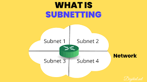

# 🌐 Subnetting 

<div align="center">



**Master IP Addressing and Network Division**

[](.)
[](.)
[](.)

[📖 Overview](#-overview) • [🎯 Basics](#-subnetting-basics) • [📊 Classes](#-ip-address-classes) • [🔢 Calculations](#-subnetting-calculations) • [💡 Examples](#-practical-examples)

</div>

---

## 📖 Overview

**Subnetting** is the process of dividing a large network into smaller, manageable sub-networks (subnets) for efficient IP address management and better network organization.

### Key Benefits:

| Feature | Benefit |
|---------|---------|
| **Organization** | Logical network structure |
| **Security** | Isolated network segments |
| **Performance** | Reduced broadcast traffic |
| **Efficiency** | Optimized IP usage |
| **Scalability** | Easy network expansion |

---

## 📚 Table of Contents

- [🎯 Subnetting Basics](#-subnetting-basics)
- [📊 IP Address Classes](#-ip-address-classes)
- [🎭 Subnet Mask](#-subnet-mask)
- [🔢 Subnetting Calculations](#-subnetting-calculations)
- [💡 Practical Examples](#-practical-examples)
- [📝 Quick Reference](#-quick-reference)

---

## 🎯 Subnetting Basics

### What is Subnetting?

Subnetting divides one large network into multiple smaller networks for better management and efficiency.

```
Without Subnetting:
Company (1000 computers) → One big network
Issues: Large broadcast domain, security risks, hard to manage

With Subnetting:
HR → Subnet 1
Sales → Subnet 2
IT → Subnet 3
Benefits: Better security, easier management, improved performance ✅
```

---

### Binary Numbers

**Why Binary?** Computers process IP addresses in binary (0s and 1s).

**Binary Place Values:**
```
128  64  32  16  8  4  2  1
 2⁷  2⁶  2⁵  2⁴ 2³ 2² 2¹ 2⁰
```

**Quick Examples:**
```
Decimal → Binary:
192 = 11000000
168 = 10101000
255 = 11111111
10  = 00001010

Binary → Decimal:
11000000 = 128 + 64 = 192
10101000 = 128 + 32 + 8 = 168
```

---

### IP Address Structure

**Format:** X.X.X.X (where X = 0-255)

**Two Parts:**
```
192.168.1.10
   ↓      ↓
Network  Host

Network Portion: Identifies the network
Host Portion: Identifies device on network
```

**In Binary:**
```
192.168.1.10 = 11000000.10101000.00000001.00001010
Total: 32 bits (4 octets × 8 bits)
```

---

## 📊 IP Address Classes

<div align="center">

| Class | Range | Default Mask | CIDR | Hosts | Use Case |
|-------|-------|--------------|------|-------|----------|
| **A** | 1.0.0.0 - 126.0.0.0 | 255.0.0.0 | /8 | 16,777,214 | Large organizations |
| **B** | 128.0.0.0 - 191.255.0.0 | 255.255.0.0 | /16 | 65,534 | Medium companies |
| **C** | 192.0.0.0 - 223.255.255.0 | 255.255.255.0 | /24 | 254 | Small networks |
| **D** | 224.0.0.0 - 239.255.255.255 | - | - | - | Multicast |
| **E** | 240.0.0.0 - 255.255.255.255 | - | - | - | Reserved |

</div>

### Class Identification (Binary)

```
Class A: First bit = 0     (0xxxxxxx)
Class B: First 2 bits = 10  (10xxxxxx)
Class C: First 3 bits = 110 (110xxxxx)
```

### Private IP Ranges

```
Class A: 10.0.0.0 to 10.255.255.255 (/8)
Class B: 172.16.0.0 to 172.31.255.255 (/12)
Class C: 192.168.0.0 to 192.168.255.255 (/16)
```

**Note:** Private IPs cannot be routed on the internet; used internally with NAT.

---

## 🎭 Subnet Mask

### What is Subnet Mask?

Subnet mask separates the network and host portions of an IP address.

**Binary Rule:**
```
1s = Network portion
0s = Host portion

Example:
IP:   192.168.1.10  = 11000000.10101000.00000001.00001010
Mask: 255.255.255.0 = 11111111.11111111.11111111.00000000
                      ↓Network↓ ↓Network↓ ↓Network↓ ↓Host↓
```

---

### CIDR Notation

CIDR (Classless Inter-Domain Routing) uses slash notation for subnet masks.

<div align="center">

| CIDR | Subnet Mask | Wildcard | Usable Hosts | Common Use |
|------|-------------|----------|--------------|------------|
| /8 | 255.0.0.0 | 0.255.255.255 | 16,777,214 | Class A |
| /16 | 255.255.0.0 | 0.0.255.255 | 65,534 | Class B |
| /24 | 255.255.255.0 | 0.0.0.255 | 254 | Class C |
| /25 | 255.255.255.128 | 0.0.0.127 | 126 | Half of /24 |
| /26 | 255.255.255.192 | 0.0.0.63 | 62 | Quarter of /24 |
| /27 | 255.255.255.224 | 0.0.0.31 | 30 | Small office |
| /28 | 255.255.255.240 | 0.0.0.15 | 14 | Tiny subnet |
| /30 | 255.255.255.252 | 0.0.0.3 | 2 | Point-to-point |

</div>

**Reading CIDR:**
```
/24 = 24 ones in subnet mask
11111111.11111111.11111111.00000000 = 255.255.255.0
```

---

## 🔢 Subnetting Calculations

### Magic Number Method

**Quick calculation method for subnetting:**

**Steps:**
```
1. Find the interesting octet (where subnetting occurs)
2. Magic Number = 256 - subnet mask value
3. Count by magic number to find subnet ranges
```

**Examples:**
```
Mask: 255.255.255.128 → Magic Number = 256 - 128 = 128
Subnets: 0, 128

Mask: 255.255.255.192 → Magic Number = 256 - 192 = 64
Subnets: 0, 64, 128, 192

Mask: 255.255.255.224 → Magic Number = 256 - 224 = 32
Subnets: 0, 32, 64, 96, 128, 160, 192, 224
```

---

### Formulas

**Number of Subnets:**
```
2ⁿ (where n = borrowed bits)
Example: /26 borrows 2 bits from /24
2² = 4 subnets
```

**Hosts per Subnet:**
```
2ʰ - 2 (where h = host bits)
Example: /26 has 6 host bits
2⁶ - 2 = 64 - 2 = 62 usable hosts
```

---

### Finding Network Information

**Key Addresses:**

```
Network Address: First address (all host bits = 0)
First Host: Network + 1
Last Host: Broadcast - 1
Broadcast Address: Last address (all host bits = 1)
```

**Example:**
```
IP: 192.168.1.75/26
Subnet Mask: 255.255.255.192
Magic Number: 256 - 192 = 64
Ranges: 0, 64, 128, 192

75 falls in range 64-127:
Network: 192.168.1.64
First Host: 192.168.1.65
Last Host: 192.168.1.126
Broadcast: 192.168.1.127
Usable Hosts: 62
```

---

## 💡 Practical Examples

### Example 1: Subnetting a /24 Network

**Scenario:** Divide 192.168.1.0/24 into 4 equal subnets

**Solution:**
```
Need 4 subnets: 2² = 4 (borrow 2 bits)
New mask: /24 + 2 = /26 (255.255.255.192)
Magic number: 256 - 192 = 64
Hosts per subnet: 2⁶ - 2 = 62

Subnet 1: 192.168.1.0/26
  Range: 192.168.1.1 - 192.168.1.62
  Broadcast: 192.168.1.63

Subnet 2: 192.168.1.64/26
  Range: 192.168.1.65 - 192.168.1.126
  Broadcast: 192.168.1.127

Subnet 3: 192.168.1.128/26
  Range: 192.168.1.129 - 192.168.1.190
  Broadcast: 192.168.1.191

Subnet 4: 192.168.1.192/26
  Range: 192.168.1.193 - 192.168.1.254
  Broadcast: 192.168.1.255
```

---

### Example 2: Office Network Design

**Scenario:** Company with 192.168.1.0/24 needs:
- Sales: 100 hosts
- HR: 50 hosts
- IT: 25 hosts

**Solution (VLSM):**
```
Sales (100 hosts):
Subnet: 192.168.1.0/25
Mask: 255.255.255.128
Range: 192.168.1.1 - 192.168.1.126
Hosts: 126 ✅

HR (50 hosts):
Subnet: 192.168.1.128/26
Mask: 255.255.255.192
Range: 192.168.1.129 - 192.168.1.190
Hosts: 62 ✅

IT (25 hosts):
Subnet: 192.168.1.192/27
Mask: 255.255.255.224
Range: 192.168.1.193 - 192.168.1.222
Hosts: 30 ✅
```

---

### Example 3: Point-to-Point Links

**Scenario:** Router-to-Router connection

**Solution:**
```
Use /30 (255.255.255.252)
Provides exactly 2 usable IPs

Link: 10.1.1.0/30
Router A: 10.1.1.1
Router B: 10.1.1.2
Broadcast: 10.1.1.3

Perfect for WAN links! ✅
```

---

## 📝 Quick Reference

### Common Subnet Masks

```
/24 = 255.255.255.0    → 254 hosts
/25 = 255.255.255.128  → 126 hosts
/26 = 255.255.255.192  → 62 hosts
/27 = 255.255.255.224  → 30 hosts
/28 = 255.255.255.240  → 14 hosts
/29 = 255.255.255.248  → 6 hosts
/30 = 255.255.255.252  → 2 hosts
```

---

### Powers of 2 (Quick Reference)

```
2¹ = 2       2⁹ = 512
2² = 4       2¹⁰ = 1,024
2³ = 8       2¹¹ = 2,048
2⁴ = 16      2¹² = 4,096
2⁵ = 32      2¹³ = 8,192
2⁶ = 64      2¹⁴ = 16,384
2⁷ = 128     2¹⁵ = 32,768
2⁸ = 256     2¹⁶ = 65,536
```

---

### Subnetting Cheat Sheet

**Step-by-Step Process:**
```
1. Determine required subnets/hosts
2. Choose appropriate subnet mask
3. Calculate magic number (256 - mask value)
4. List subnet ranges
5. Identify network, broadcast, valid range
```

**Key Formulas:**
```
Subnets: 2ⁿ
Hosts: 2ʰ - 2
Block Size: 2ʰ
Magic Number: 256 - mask value
```

---

### Troubleshooting Tips

```
✓ Always subtract 2 for usable hosts (network + broadcast)
✓ Network address = first IP (all host bits 0)
✓ Broadcast = last IP (all host bits 1)
✓ First host = network + 1
✓ Last host = broadcast - 1
✓ Count subnets starting from 0
✓ Use magic number for quick calculations
```

---

### Special IP Addresses

```
Loopback: 127.0.0.0/8 (127.0.0.1 = localhost)
APIPA: 169.254.0.0/16 (auto-configuration)
Default Route: 0.0.0.0/0
Broadcast: 255.255.255.255 (limited broadcast)
```

---

## 📁 Repository Structure

```
Subnetting-Guide/
│
├── README.md                    # Complete documentation
│
└── images/
    └── subnetting-banner.png    # Banner image
```

---

## 🎓 What I Learned

### IP Addressing:
✅ Binary to decimal conversion  
✅ IP address structure and classes  
✅ Private vs public IP ranges  
✅ CIDR notation understanding  

### Subnetting:
✅ Subnet mask function and purpose  
✅ Magic number calculation method  
✅ Network and broadcast identification  
✅ Valid host range determination  
✅ VLSM (Variable Length Subnet Masking)  

### Practical Skills:
✅ Network design for organizations  
✅ Efficient IP address allocation  
✅ Point-to-point link configuration  
✅ Quick subnet calculations  
✅ Problem-solving approach  

---

## 🚀 How to Use This Repository

1. **Understand the basics:**
   - Study IP address structure
   - Learn binary conversion
   - Master subnet masks

2. **Practice calculations:**
   - Use magic number method
   - Apply formulas
   - Work through examples

3. **Design networks:**
   - Plan subnets for requirements
   - Allocate IP addresses efficiently
   - Implement VLSM when needed

4. **Verify your work:**
   - Double-check calculations
   - Ensure no overlapping subnets
   - Document your design

---

## 📞 Connect With Me

<div align="center">

[](mailto:a.wahid7860668@gmail.com)

[](https://www.linkedin.com/in/abdul-wahid022)

[](https://github.com/abdul-wahid022)

**💬 Questions? Need help with subnetting? Feel free to reach out!**

</div>

---

## 📄 License

This project is created for **educational purposes** and is open-source.

---

<div align="center">

### ⭐ If you found this helpful, please give it a star!

**Made with ❤️ by ABDUL WAHID**

*Last Updated: January 2026*

</div>
