# 🔀 VLAN Configuration 

<div align="center">

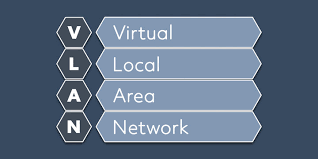

**Comprehensive Guide to Virtual LANs and Inter-VLAN Routing**

[](.)
[](.)
[](.)

[📖 Overview](#-overview) • [🔌 VLAN Basics](#-vlan-basics--trunk-configuration) • [🔄 Router on a Stick](#-router-on-a-stick-inter-vlan-routing) • [⚡ Layer 3 Switch](#-layer-3-switch-with-svi) • [🌐 Multi-Layer Switch](#-multi-layer-switch-configuration) • [🔢 DHCP with L3](#-dhcp-server-using-layer-3-switch) • [🔄 Hybrid Config](#-hybrid-configuration-layer-3-switch--router-on-a-stick)

</div>

---

## 📖 Overview

**VLANs (Virtual Local Area Networks)** allow you to segment a physical network into multiple logical networks, improving security, performance, and management.

### What You'll Learn:

| Topic | Description | Key Benefit |
|-------|-------------|-------------|
| **VLAN Basics** | Creating and configuring VLANs | Network segmentation |
| **Trunk Ports** | Carrying multiple VLANs | Switch-to-switch communication |
| **Router on a Stick** | Inter-VLAN routing with router | Simple inter-VLAN routing |
| **Layer 3 Switch (SVI)** | Inter-VLAN routing with switch | Faster routing performance |
| **Multi-Layer Switch** | Advanced L3 switching | Enterprise-grade solution |
| **DHCP on L3 Switch** | DHCP without dedicated server | Simplified architecture |
| **Hybrid Configuration** | L3 Switch + Router combined | Best of both worlds |

---

## 📚 Table of Contents

- [🔌 VLAN Basics & Trunk Configuration](#-vlan-basics--trunk-configuration)
- [🔄 Router on a Stick (Inter-VLAN Routing)](#-router-on-a-stick-inter-vlan-routing)
- [⚡ Layer 3 Switch with SVI](#-layer-3-switch-with-svi)
- [🌐 Multi-Layer Switch Configuration](#-multi-layer-switch-configuration)
- [🔢 DHCP Server using Layer 3 Switch](#-dhcp-server-using-layer-3-switch)
- [🔄 Hybrid Configuration: Layer 3 Switch + Router on a Stick](#-hybrid-configuration-layer-3-switch--router-on-a-stick)
- [🆚 Comparison: Different Inter-VLAN Routing Methods](#-comparison-different-inter-vlan-routing-methods)
- [📝 Quick Reference](#-quick-reference)

---

## 🔌 VLAN Basics & Trunk Configuration

### Concept

<div align="center">

| Feature | Details |
|---------|---------|
| **VLAN** | Virtual Local Area Network |
| **Purpose** | Logical network segmentation |
| **Range** | 1-4094 (1-1005 normal, 1006-4094 extended) |
| **Default VLAN** | VLAN 1 |
| **Benefits** | Security, Performance, Management |

</div>

### 🔑 Key Points:

**VLAN** = Virtual network within a physical network

#### Real-Life Example:
```
Physical Building = Switch
Different Departments = VLANs

Without VLAN:
Everyone in one big room (broadcast domain)
HR hears IT conversations
Sales hears Finance discussions
Network traffic visible to all

With VLAN:
VLAN 10 = HR Department (separate room)
VLAN 20 = IT Department (separate room)
VLAN 30 = Sales Department (separate room)
Each department isolated and secure! ✓
```

#### Why Use VLANs?

**1. Security:**
```
VLAN 10 (HR) = Payroll data
VLAN 20 (IT) = Network management
VLAN 30 (Guest) = Visitor access

Guests can't access HR or IT data! 🔒
```

**2. Performance:**
```
Without VLAN:
100 devices = 1 broadcast domain
Broadcast = All 100 devices receive

With VLAN:
VLAN 10 = 30 devices (broadcast to 30 only)
VLAN 20 = 40 devices (broadcast to 40 only)
VLAN 30 = 30 devices (broadcast to 30 only)

Less broadcast traffic = Better performance! ⚡
```

**3. Management:**
```
Need to change network settings for HR?
Only affect VLAN 10
Other VLANs unaffected! ✓
```

---

### Port Types

#### Access Port:
```
Purpose: Connect end devices (PCs, printers)
Carries: Single VLAN only
Configuration: Assign one VLAN to port

Example:
Port Fa0/1 = VLAN 10 (can only carry VLAN 10 traffic)
```

#### Trunk Port:
```
Purpose: Connect switches to switches
Carries: Multiple VLANs simultaneously
Configuration: Set to trunk mode

Example:
Trunk port carries VLAN 10, 20, 30 all together
Like a highway with multiple lanes (VLANs)
```

#### Real-Life Analogy:
```
Access Port = Single-lane road
- One type of traffic only
- PC → Switch (VLAN 10 only)

Trunk Port = Multi-lane highway
- Multiple types of traffic
- Switch ↔ Switch (VLAN 10, 20, 30 all at once)
```

---

### VLAN Tagging (802.1Q)

**How does a switch know which VLAN a frame belongs to on a trunk?**

```
Frame on Access Port:
[Data] → Untagged (no VLAN info needed)

Frame on Trunk Port:
[VLAN Tag 10][Data] → Tagged with VLAN ID
[VLAN Tag 20][Data] → Tagged with VLAN ID
[VLAN Tag 30][Data] → Tagged with VLAN ID

Receiving switch reads tag and forwards to correct VLAN!
```

---

### Lab Implementation - VLAN Trunk (Switch-to-Switch)

#### 📊 Network Topology:

<p align="center">
  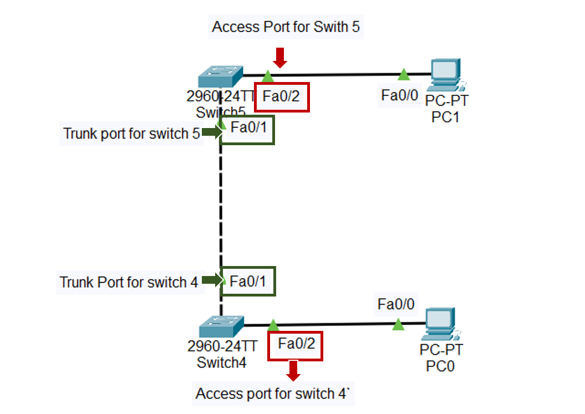
</p>

**Scenario:** Two switches connected via trunk port, multiple VLANs configured

---

### Configuration Commands

**Switch 1 Configuration:**
```cisco
! Create VLANs
Switch> enable
Switch# configure terminal
Switch(config)# vlan 10
Switch(config-vlan)# name HR
Switch(config-vlan)# exit

Switch(config)# vlan 20
Switch(config-vlan)# name IT
Switch(config-vlan)# exit

Switch(config)# vlan 30
Switch(config-vlan)# name Sales
Switch(config-vlan)# exit

! Configure Access Ports
Switch(config)# interface fastEthernet 0/1
Switch(config-if)# switchport mode access
Switch(config-if)# switchport access vlan 10
Switch(config-if)# exit

Switch(config)# interface fastEthernet 0/2
Switch(config-if)# switchport mode access
Switch(config-if)# switchport access vlan 20
Switch(config-if)# exit

! Configure Trunk Port to Switch 2
Switch(config)# interface gigabitEthernet 0/1
Switch(config-if)# switchport mode trunk
Switch(config-if)# switchport trunk allowed vlan 10,20,30
Switch(config-if)# exit

! Verification
Switch# show vlan brief
Switch# show interfaces trunk
```

**Switch 2 Configuration:**
```cisco
! Create same VLANs
Switch(config)# vlan 10
Switch(config-vlan)# name HR
Switch(config-vlan)# exit

Switch(config)# vlan 20
Switch(config-vlan)# name IT
Switch(config-vlan)# exit

Switch(config)# vlan 30
Switch(config-vlan)# name Sales
Switch(config-vlan)# exit

! Configure Access Ports
Switch(config)# interface fastEthernet 0/3
Switch(config-if)# switchport mode access
Switch(config-if)# switchport access vlan 10
Switch(config-if)# exit

! Configure Trunk Port to Switch 1
Switch(config)# interface gigabitEthernet 0/1
Switch(config-if)# switchport mode trunk
Switch(config-if)# switchport trunk allowed vlan 10,20,30
Switch(config-if)# exit
```

---

### Results - VLAN Trunk

#### ✅ VLAN Configuration:

<p align="center">
  
</p>

**Verification:**
```cisco
Switch# show vlan brief

VLAN Name                             Status    Ports
---- -------------------------------- --------- -------
1    default                          active    Fa0/4-24
10   HR                              active    Fa0/1
20   IT                              active    Fa0/2
30   Sales                           active    Fa0/3

Switch# show interfaces trunk

Port        Mode         Encapsulation  Status        Native vlan
Gi0/1       on           802.1q         trunking      1

Port        Vlans allowed on trunk
Gi0/1       10,20,30
```

**Result:** ✅ VLANs created and trunk port configured successfully

---

## 🔄 Router on a Stick (Inter-VLAN Routing)

### Concept

<div align="center">

| Feature | Details |
|---------|---------|
| **Purpose** | Enable communication between VLANs |
| **Method** | Router with subinterfaces |
| **Requirement** | One trunk link to router |
| **Encapsulation** | 802.1Q |
| **Use Case** | Small to medium networks |

</div>

### 🔑 Key Points:

**Problem:** VLANs are isolated - can't talk to each other!

```
VLAN 10 (HR): 192.168.10.0/24
VLAN 20 (IT): 192.168.20.0/24

PC in VLAN 10 wants to reach PC in VLAN 20
❌ Can't! Different broadcast domains
```

**Solution:** Router on a Stick!

```
Router acts as gateway between VLANs
One physical interface, multiple logical subinterfaces
Each subinterface = Different VLAN gateway
```

#### Real-Life Example:
```
VLANs = Different buildings on campus
Router = Shuttle bus service
Subinterfaces = Bus stops at each building

Want to go from HR building to IT building?
Take the shuttle bus (router)! ✓
```

---

### How Router on a Stick Works:

```
PC1 (VLAN 10) wants to reach PC2 (VLAN 20)

Step 1: PC1 sends to its gateway (Router subinterface .10)
     ↓
Step 2: Frame tagged with VLAN 10, sent to router
     ↓
Step 3: Router receives on Gi0/0.10, removes VLAN tag
     ↓
Step 4: Router routes to VLAN 20 network
     ↓
Step 5: Router sends out Gi0/0.20, adds VLAN 20 tag
     ↓
Step 6: Switch receives, forwards to PC2 in VLAN 20
     ↓
Result: Inter-VLAN communication successful! ✓
```

---

### Lab Implementation - Router on a Stick

#### 📊 Network Topology:

<p align="center">
  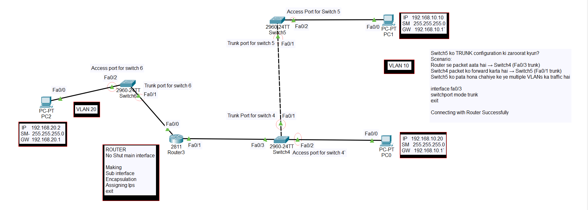
</p>

**Scenario:** One router with subinterfaces routing between multiple VLANs

---

### Configuration - Router

<p align="center">
  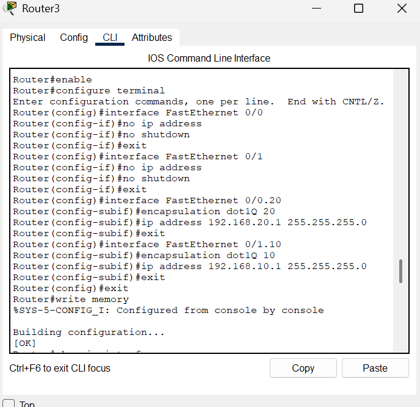
</p>

```cisco
! Router Configuration - Router on a Stick
Router> enable
Router# configure terminal
Router(config)# hostname R3

! Configure Physical Interface (trunk to switch)
R3(config)# interface gigabitEthernet 0/0
R3(config-if)# no shutdown
R3(config-if)# exit

! Subinterface for VLAN 10
R3(config)# interface gigabitEthernet 0/0.10
R3(config-subif)# encapsulation dot1Q 10
R3(config-subif)# ip address 192.168.10.1 255.255.255.0
R3(config-subif)# exit

! Subinterface for VLAN 20
R3(config)# interface gigabitEthernet 0/0.20
R3(config-subif)# encapsulation dot1Q 20
R3(config-subif)# ip address 192.168.20.1 255.255.255.0
R3(config-subif)# exit

! Subinterface for VLAN 30
R3(config)# interface gigabitEthernet 0/0.30
R3(config-subif)# encapsulation dot1Q 30
R3(config-subif)# ip address 192.168.30.1 255.255.255.0
R3(config-subif)# exit

! Verification
R3# show ip interface brief
R3# show vlans
```

**Command Explanation:**
```
encapsulation dot1Q 10
     ↑            ↑
     |            └─ VLAN ID (10, 20, 30)
     └─ 802.1Q tagging protocol

ip address 192.168.10.1 255.255.255.0
     └─ Gateway IP for this VLAN
```

---

### Configuration - Switch 6

<p align="center">
  
</p>

```cisco
! Switch 6 Configuration
Switch> enable
Switch# configure terminal
Switch(config)# hostname Switch6

! Create VLANs
Switch6(config)# vlan 10
Switch6(config-vlan)# name HR
Switch6(config-vlan)# exit

Switch6(config)# vlan 20
Switch6(config-vlan)# name IT
Switch6(config-vlan)# exit

Switch6(config)# vlan 30
Switch6(config-vlan)# name Sales
Switch6(config-vlan)# exit

! Configure Trunk to Router
Switch6(config)# interface gigabitEthernet 0/1
Switch6(config-if)# switchport mode trunk
Switch6(config-if)# switchport trunk allowed vlan 10,20,30
Switch6(config-if)# exit

! Configure Access Ports for PCs
Switch6(config)# interface range fastEthernet 0/1-10
Switch6(config-if-range)# switchport mode access
Switch6(config-if-range)# switchport access vlan 10
Switch6(config-if-range)# exit

Switch6(config)# interface range fastEthernet 0/11-20
Switch6(config-if-range)# switchport mode access
Switch6(config-if-range)# switchport access vlan 20
Switch6(config-if-range)# exit
```

---

### Configuration - Switch 4

<p align="center">
  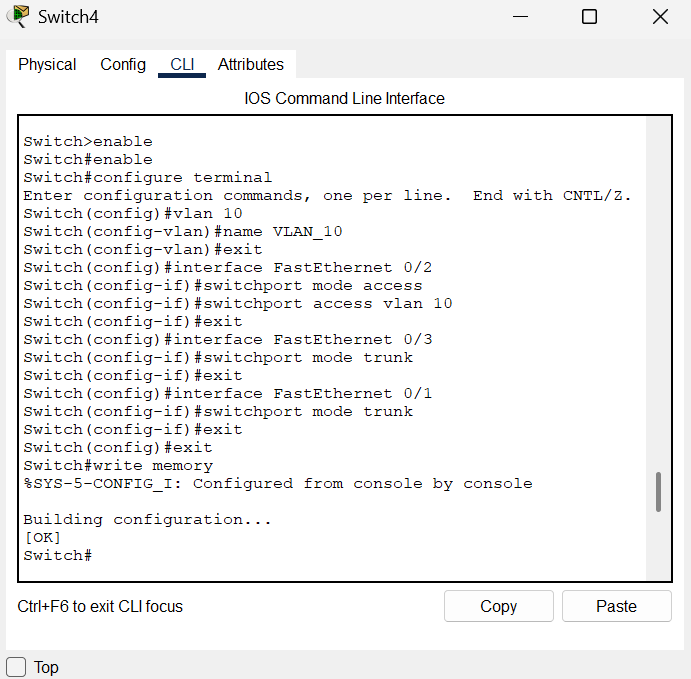
</p>

```cisco
! Switch 4 Configuration
Switch4(config)# vlan 10
Switch4(config-vlan)# name HR
Switch4(config-vlan)# exit

Switch4(config)# vlan 20
Switch4(config-vlan)# name IT
Switch4(config-vlan)# exit

! Trunk port to Switch 6
Switch4(config)# interface gigabitEthernet 0/1
Switch4(config-if)# switchport mode trunk
Switch4(config-if)# switchport trunk allowed vlan 10,20,30
Switch4(config-if)# exit

! Access ports
Switch4(config)# interface fastEthernet 0/1
Switch4(config-if)# switchport mode access
Switch4(config-if)# switchport access vlan 10
Switch4(config-if)# exit
```

---

### Configuration - Switch 5

<p align="center">
  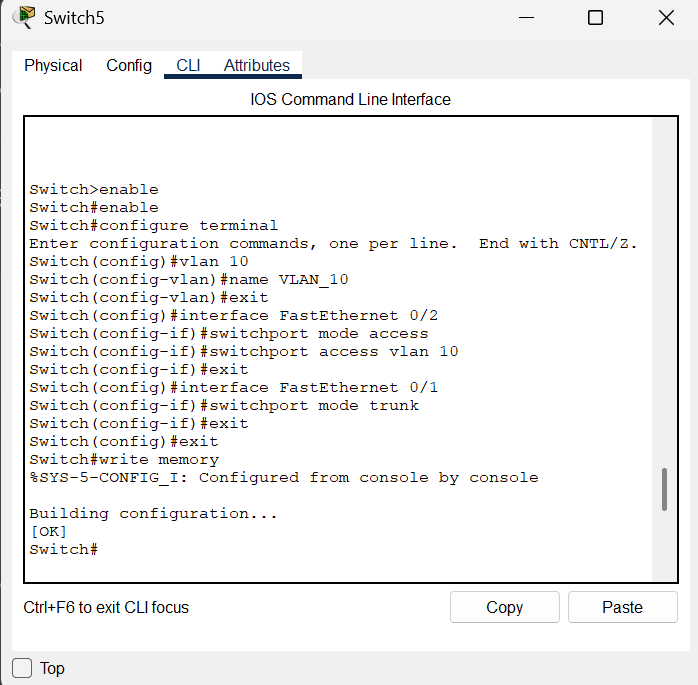
</p>

```cisco
! Switch 5 Configuration
Switch5(config)# vlan 30
Switch5(config-vlan)# name Sales
Switch5(config-vlan)# exit

! Trunk port to Switch 6
Switch5(config)# interface gigabitEthernet 0/1
Switch5(config-if)# switchport mode trunk
Switch5(config-if)# switchport trunk allowed vlan 10,20,30
Switch5(config-if)# exit

! Access ports
Switch5(config)# interface range fastEthernet 0/1-5
Switch5(config-if-range)# switchport mode access
Switch5(config-if-range)# switchport access vlan 30
Switch5(config-if-range)# exit
```

---

### Results - Router on a Stick

**Verification:**
```cisco
R3# show ip interface brief

Interface              IP-Address      Method  Status                Protocol
GigabitEthernet0/0     unassigned      manual  up                    up
GigabitEthernet0/0.10  192.168.10.1    manual  up                    up
GigabitEthernet0/0.20  192.168.20.1    manual  up                    up
GigabitEthernet0/0.30  192.168.30.1    manual  up                    up
```

**Testing:**
```
PC1 (VLAN 10): 192.168.10.10
Gateway: 192.168.10.1

PC2 (VLAN 20): 192.168.20.10
Gateway: 192.168.20.1

PC1> ping 192.168.20.10
Reply from 192.168.20.10 ✓
```

**Result:** ✅ Inter-VLAN routing working via Router on a Stick

---

## ⚡ Layer 3 Switch with SVI

### Concept

<div align="center">

| Feature | Details |
|---------|---------|
| **SVI** | Switch Virtual Interface |
| **Purpose** | Inter-VLAN routing at wire speed |
| **Advantage** | Much faster than router |
| **Requirement** | Layer 3 switch (multilayer switch) |
| **Command** | `ip routing` (enable routing) |

</div>

### 🔑 Key Points:

**SVI (Switch Virtual Interface)** = Virtual interface for each VLAN

#### Layer 2 Switch vs Layer 3 Switch:

| Feature | Layer 2 Switch | Layer 3 Switch |
|---------|----------------|----------------|
| **Function** | Switching only | Switching + Routing |
| **VLANs** | Create VLANs | Create VLANs + Route between them |
| **Speed** | Fast switching | Wire-speed routing |
| **Inter-VLAN** | Needs external router | Built-in routing |
| **Example** | Cisco 2960 | Cisco 3560, 3650 |

#### Real-Life Example:
```
Router on a Stick = Using elevator to change floors
- One elevator (router) for everyone
- Bottleneck during peak hours
- Slower

Layer 3 Switch = Stairs on every floor
- Direct path between floors
- No bottleneck
- Much faster! ⚡
```

---

### How SVI Works:

```
Traditional Routing (Router on a Stick):
VLAN 10 → Switch → Trunk → Router → Trunk → Switch → VLAN 20
(Slow, traffic leaves switch)

SVI Routing (Layer 3 Switch):
VLAN 10 → Layer 3 Switch → VLAN 20
(Fast, routing happens inside switch at hardware speed!)
```

---

### Lab Implementation - Layer 3 Switch with SVI

#### 📊 Network Topology:

<p align="center">
  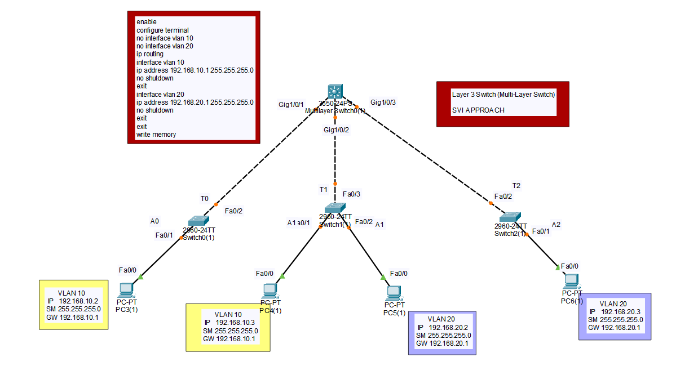
</p>

---

### Main Commands Reference:

<p align="center">
  
</p>

**Key Commands:**
```cisco
! Enable IP routing (make switch act as router)
Switch(config)# ip routing

! Create VLAN interface (SVI)
Switch(config)# interface vlan 10
Switch(config-if)# ip address 192.168.10.1 255.255.255.0
Switch(config-if)# no shutdown

! Configure port as Layer 3 routed port
Switch(config)# interface gigabitEthernet 0/1
Switch(config-if)# no switchport
Switch(config-if)# ip address 10.0.0.1 255.255.255.252
```

---

### Configuration - Switch 1 (Layer 3 Core)

<p align="center">
  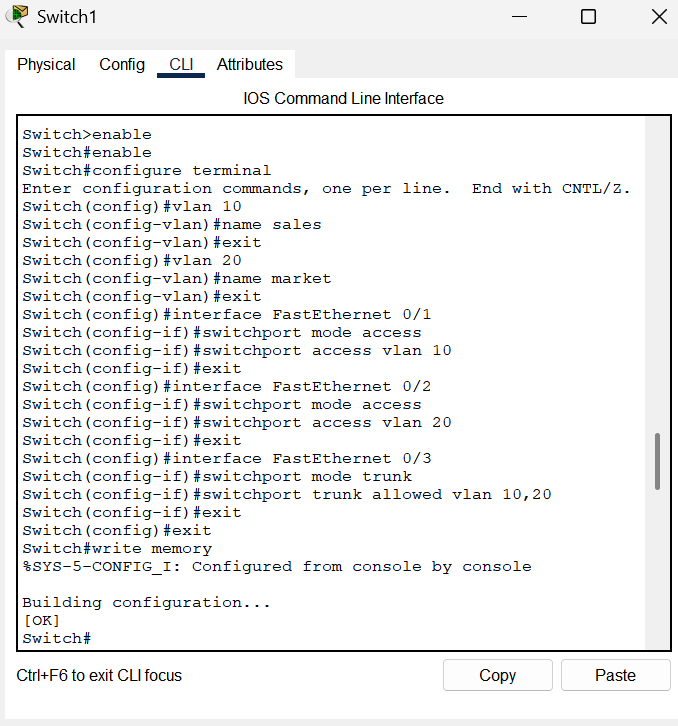
</p>

```cisco
! Switch 1 - Multilayer Switch Configuration
Switch> enable
Switch# configure terminal
Switch(config)# hostname CoreSwitch

! Enable IP Routing
CoreSwitch(config)# ip routing

! Create VLANs
CoreSwitch(config)# vlan 10
CoreSwitch(config-vlan)# name HR
CoreSwitch(config-vlan)# exit

CoreSwitch(config)# vlan 20
CoreSwitch(config-vlan)# name IT
CoreSwitch(config-vlan)# exit

CoreSwitch(config)# vlan 30
CoreSwitch(config-vlan)# name Sales
CoreSwitch(config-vlan)# exit

! Create SVI for each VLAN (Gateway)
CoreSwitch(config)# interface vlan 10
CoreSwitch(config-if)# ip address 192.168.10.1 255.255.255.0
CoreSwitch(config-if)# no shutdown
CoreSwitch(config-if)# exit

CoreSwitch(config)# interface vlan 20
CoreSwitch(config-if)# ip address 192.168.20.1 255.255.255.0
CoreSwitch(config-if)# no shutdown
CoreSwitch(config-if)# exit

CoreSwitch(config)# interface vlan 30
CoreSwitch(config-if)# ip address 192.168.30.1 255.255.255.0
CoreSwitch(config-if)# no shutdown
CoreSwitch(config-if)# exit

! Configure trunk ports to access switches
CoreSwitch(config)# interface range gigabitEthernet 0/1-2
CoreSwitch(config-if-range)# switchport trunk encapsulation dot1q
CoreSwitch(config-if-range)# switchport mode trunk
CoreSwitch(config-if-range)# switchport trunk allowed vlan 10,20,30
CoreSwitch(config-if-range)# exit

! Verification
CoreSwitch# show ip interface brief
CoreSwitch# show vlan brief
CoreSwitch# show ip route
```

**Command Breakdown:**
```
ip routing
└─ Enables routing capability on switch

interface vlan 10
├─ Creates virtual interface for VLAN 10
└─ Acts as default gateway for VLAN 10 devices

ip address 192.168.10.1 255.255.255.0
└─ Gateway IP for VLAN 10

no shutdown
└─ Activate the SVI (important!)
```

---

### Configuration - Switch 0 (Access Switch)

<p align="center">
  
</p>

```cisco
! Switch 0 - Access Layer Switch
Switch> enable
Switch# configure terminal
Switch(config)# hostname AccessSwitch0

! Create VLANs
AccessSwitch0(config)# vlan 10
AccessSwitch0(config-vlan)# name HR
AccessSwitch0(config-vlan)# exit

AccessSwitch0(config)# vlan 20
AccessSwitch0(config-vlan)# name IT
AccessSwitch0(config-vlan)# exit

! Configure trunk to Core Switch
AccessSwitch0(config)# interface gigabitEthernet 0/1
AccessSwitch0(config-if)# switchport mode trunk
AccessSwitch0(config-if)# switchport trunk allowed vlan 10,20,30
AccessSwitch0(config-if)# exit

! Configure access ports for VLAN 10
AccessSwitch0(config)# interface range fastEthernet 0/1-10
AccessSwitch0(config-if-range)# switchport mode access
AccessSwitch0(config-if-range)# switchport access vlan 10
AccessSwitch0(config-if-range)# exit

! Configure access ports for VLAN 20
AccessSwitch0(config)# interface range fastEthernet 0/11-20
AccessSwitch0(config-if-range)# switchport mode access
AccessSwitch0(config-if-range)# switchport access vlan 20
AccessSwitch0(config-if-range)# exit
```

---

### Configuration - Switch 2 (Access Switch)

<p align="center">
  
</p>

```cisco
! Switch 2 - Access Layer Switch
Switch(config)# hostname AccessSwitch2

! Create VLANs
AccessSwitch2(config)# vlan 30
AccessSwitch2(config-vlan)# name Sales
AccessSwitch2(config-vlan)# exit

! Configure trunk to Core Switch
AccessSwitch2(config)# interface gigabitEthernet 0/1
AccessSwitch2(config-if)# switchport mode trunk
AccessSwitch2(config-if)# switchport trunk allowed vlan 10,20,30
AccessSwitch2(config-if)# exit

! Configure access ports for VLAN 30
AccessSwitch2(config)# interface range fastEthernet 0/1-15
AccessSwitch2(config-if-range)# switchport mode access
AccessSwitch2(config-if-range)# switchport access vlan 30
AccessSwitch2(config-if-range)# exit
```

---

### Results - Layer 3 Switch with SVI

**Verification:**
```cisco
CoreSwitch# show ip interface brief

Interface              IP-Address      Method  Status    Protocol
Vlan10                 192.168.10.1    manual  up        up
Vlan20                 192.168.20.1    manual  up        up
Vlan30                 192.168.30.1    manual  up        up

CoreSwitch# show ip route

C    192.168.10.0/24 is directly connected, Vlan10
C    192.168.20.0/24 is directly connected, Vlan20
C    192.168.30.0/24 is directly connected, Vlan30
```

**Testing:**
```
PC in VLAN 10 can ping PC in VLAN 20 ✓
PC in VLAN 20 can ping PC in VLAN 30 ✓
PC in VLAN 10 can ping PC in VLAN 30 ✓

Routing happening at wire speed inside switch! ⚡
```

**Result:** ✅ Inter-VLAN routing via SVI working at maximum performance

---

## 🌐 Multi-Layer Switch Configuration

### Concept

Multi-layer switches combine Layer 2 switching and Layer 3 routing in one device, providing enterprise-grade performance and flexibility.

### Advanced Features:

| Feature | Description |
|---------|-------------|
| **Routed Ports** | Convert switch port to router interface |
| **SVI** | VLAN interfaces for routing |
| **IP Routing** | Full routing protocol support (OSPF, EIGRP) |
| **ACLs** | Advanced security filtering |
| **QoS** | Quality of Service for prioritization |

---

### Routed Port vs SVI:

**Routed Port:**
```cisco
! Convert switch port to Layer 3 interface
interface gigabitEthernet 0/1
 no switchport              ← Convert to routed port
 ip address 10.0.0.1 255.255.255.252

Use case: Point-to-point links (switch to router)
```

**SVI:**
```cisco
! VLAN interface for gateway
interface vlan 10
 ip address 192.168.10.1 255.255.255.0

Use case: Default gateway for VLAN devices
```

---

## 🔢 DHCP Server using Layer 3 Switch

### Concept

<div align="center">

| Feature | Details |
|---------|---------|
| **Purpose** | DHCP without dedicated server |
| **Advantage** | Simplified architecture |
| **Configuration** | DHCP pools on L3 switch |
| **Scope** | Per-VLAN DHCP pools |

</div>

### 🔑 Key Points:

**Traditional Setup:**
```
Dedicated DHCP Server
     ↓
Requires separate device
Additional cost and management
```

**Layer 3 Switch as DHCP:**
```
No separate server needed
Switch handles routing AND DHCP
Simplified management ✓
Cost-effective ✓
```

---

### Lab Implementation - DHCP on Layer 3 Switch

#### 📊 Network Topology:

<p align="center">
  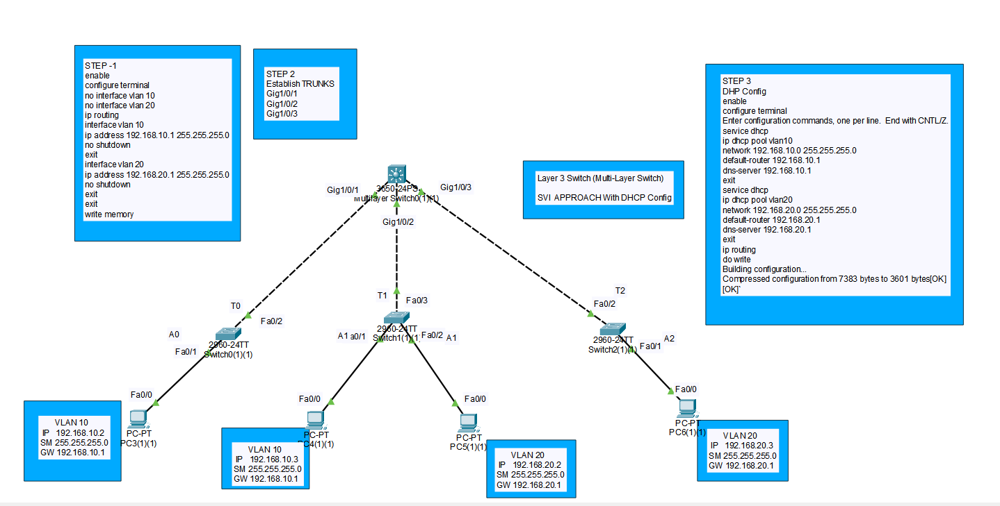
</p>

---

### Configuration Steps:

<p align="center">
  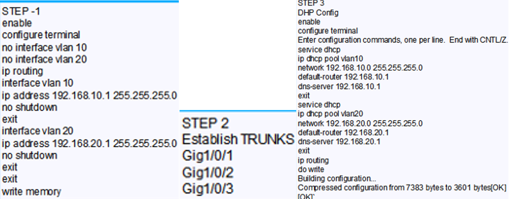
</p>

**Steps:**
1. Enable IP routing on Layer 3 switch
2. Create VLANs
3. Configure SVI for each VLAN
4. Create DHCP pools for each VLAN
5. Configure exclusions (reserved IPs)
6. Set default gateway and DNS

---

### Configuration - Switch 1 (Core - DHCP Server)

<p align="center">
  
</p>

```cisco
! Core Switch - Layer 3 with DHCP
Switch> enable
Switch# configure terminal
Switch(config)# hostname CoreSwitch

! Enable IP Routing
CoreSwitch(config)# ip routing

! Create VLANs
CoreSwitch(config)# vlan 10
CoreSwitch(config-vlan)# name HR
CoreSwitch(config-vlan)# exit

CoreSwitch(config)# vlan 20
CoreSwitch(config-vlan)# name IT
CoreSwitch(config-vlan)# exit

CoreSwitch(config)# vlan 30
CoreSwitch(config-vlan)# name Sales
CoreSwitch(config-vlan)# exit

! Configure SVI (Gateways)
CoreSwitch(config)# interface vlan 10
CoreSwitch(config-if)# ip address 192.168.10.1 255.255.255.0
CoreSwitch(config-if)# no shutdown
CoreSwitch(config-if)# exit

CoreSwitch(config)# interface vlan 20
CoreSwitch(config-if)# ip address 192.168.20.1 255.255.255.0
CoreSwitch(config-if)# no shutdown
CoreSwitch(config-if)# exit

CoreSwitch(config)# interface vlan 30
CoreSwitch(config-if)# ip address 192.168.30.1 255.255.255.0
CoreSwitch(config-if)# no shutdown
CoreSwitch(config-if)# exit

! ============================================
! DHCP Configuration for VLAN 10 (HR)
! ============================================
CoreSwitch(config)# ip dhcp excluded-address 192.168.10.1 192.168.10.10
CoreSwitch(config)# ip dhcp pool VLAN10_POOL
CoreSwitch(dhcp-config)# network 192.168.10.0 255.255.255.0
CoreSwitch(dhcp-config)# default-router 192.168.10.1
CoreSwitch(dhcp-config)# dns-server 8.8.8.8
CoreSwitch(dhcp-config)# exit

! ============================================
! DHCP Configuration for VLAN 20 (IT)
! ============================================
CoreSwitch(config)# ip dhcp excluded-address 192.168.20.1 192.168.20.10
CoreSwitch(config)# ip dhcp pool VLAN20_POOL
CoreSwitch(dhcp-config)# network 192.168.20.0 255.255.255.0
CoreSwitch(dhcp-config)# default-router 192.168.20.1
CoreSwitch(dhcp-config)# dns-server 8.8.8.8
CoreSwitch(dhcp-config)# exit

! ============================================
! DHCP Configuration for VLAN 30 (Sales)
! ============================================
CoreSwitch(config)# ip dhcp excluded-address 192.168.30.1 192.168.30.10
CoreSwitch(config)# ip dhcp pool VLAN30_POOL
CoreSwitch(dhcp-config)# network 192.168.30.0 255.255.255.0
CoreSwitch(dhcp-config)# default-router 192.168.30.1
CoreSwitch(dhcp-config)# dns-server 8.8.8.8
CoreSwitch(dhcp-config)# exit

! Configure trunk ports
CoreSwitch(config)# interface range gigabitEthernet 0/1-2
CoreSwitch(config-if-range)# switchport trunk encapsulation dot1q
CoreSwitch(config-if-range)# switchport mode trunk
CoreSwitch(config-if-range)# exit

! Verification
CoreSwitch# show ip dhcp pool
CoreSwitch# show ip dhcp binding
```

**Command Explanation:**
```
ip dhcp excluded-address 192.168.10.1 192.168.10.10
└─ Reserve IPs (.1 to .10) for static assignment
   (Gateways, servers, printers, etc.)

ip dhcp pool VLAN10_POOL
└─ Create DHCP pool named "VLAN10_POOL"

network 192.168.10.0 255.255.255.0
└─ Network range for this pool

default-router 192.168.10.1
└─ Gateway IP (where to send traffic outside VLAN)

dns-server 8.8.8.8
└─ DNS server for name resolution
```

---

### Configuration - Switch 0 (Access Layer)

<p align="center">
  
</p>

```cisco
! Access Switch 0
Switch(config)# hostname AccessSwitch0

! Create VLANs
AccessSwitch0(config)# vlan 10
AccessSwitch0(config-vlan)# name HR
AccessSwitch0(config-vlan)# exit

! Configure trunk to core
AccessSwitch0(config)# interface gigabitEthernet 0/1
AccessSwitch0(config-if)# switchport mode trunk
AccessSwitch0(config-if)# exit

! Configure access ports
AccessSwitch0(config)# interface range fastEthernet 0/1-10
AccessSwitch0(config-if-range)# switchport mode access
AccessSwitch0(config-if-range)# switchport access vlan 10
AccessSwitch0(config-if-range)# exit
```

---

### Configuration - Switch 2 (Access Layer)

<p align="center">
  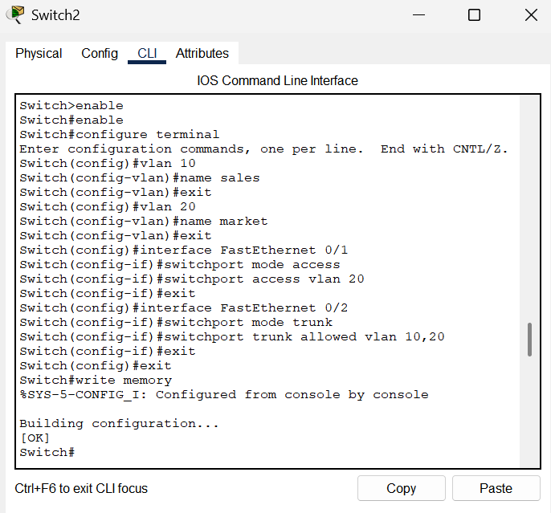
</p>

```cisco
! Access Switch 2
Switch(config)# hostname AccessSwitch2

! Create VLANs
AccessSwitch2(config)# vlan 20
AccessSwitch2(config-vlan)# name IT
AccessSwitch2(config-vlan)# exit

AccessSwitch2(config)# vlan 30
AccessSwitch2(config-vlan)# name Sales
AccessSwitch2(config-vlan)# exit

! Configure trunk to core
AccessSwitch2(config)# interface gigabitEthernet 0/1
AccessSwitch2(config-if)# switchport mode trunk
AccessSwitch2(config-if)# exit

! Configure access ports for VLAN 20
AccessSwitch2(config)# interface range fastEthernet 0/1-10
AccessSwitch2(config-if-range)# switchport mode access
AccessSwitch2(config-if-range)# switchport access vlan 20
AccessSwitch2(config-if-range)# exit

! Configure access ports for VLAN 30
AccessSwitch2(config)# interface range fastEthernet 0/11-20
AccessSwitch2(config-if-range)# switchport mode access
AccessSwitch2(config-if-range)# switchport access vlan 30
AccessSwitch2(config-if-range)# exit
```

---

### Configuration - Core Multi-Layer Switch

<p align="center">
  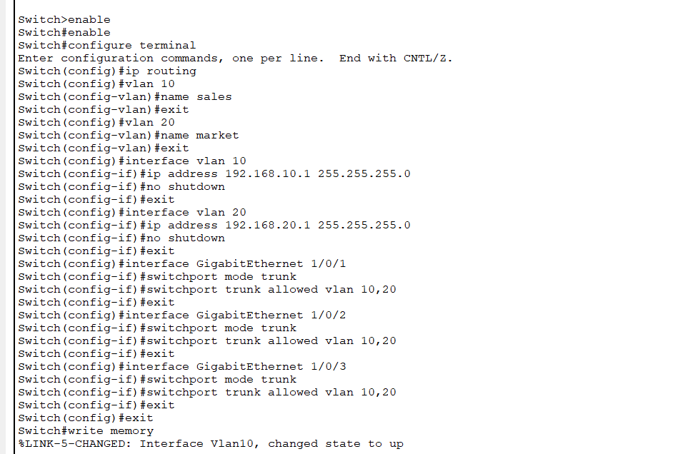
</p>

**Complete Core Configuration:**
```cisco
! ============================================
! COMPLETE CORE SWITCH CONFIGURATION
! ============================================

enable
configure terminal
hostname CoreSwitch

! Enable routing
ip routing

! VLANs
vlan 10
 name HR
vlan 20
 name IT
vlan 30
 name Sales

! SVIs (Gateways)
interface vlan 10
 ip address 192.168.10.1 255.255.255.0
 no shutdown

interface vlan 20
 ip address 192.168.20.1 255.255.255.0
 no shutdown

interface vlan 30
 ip address 192.168.30.1 255.255.255.0
 no shutdown

! DHCP Pools
ip dhcp excluded-address 192.168.10.1 192.168.10.10
ip dhcp pool VLAN10_POOL
 network 192.168.10.0 255.255.255.0
 default-router 192.168.10.1
 dns-server 8.8.8.8

ip dhcp excluded-address 192.168.20.1 192.168.20.10
ip dhcp pool VLAN20_POOL
 network 192.168.20.0 255.255.255.0
 default-router 192.168.20.1
 dns-server 8.8.8.8

ip dhcp excluded-address 192.168.30.1 192.168.30.10
ip dhcp pool VLAN30_POOL
 network 192.168.30.0 255.255.255.0
 default-router 192.168.30.1
 dns-server 8.8.8.8

! Trunk ports
interface range gigabitEthernet 0/1-2
 switchport trunk encapsulation dot1q
 switchport mode trunk

exit
write memory
```

---

### Results - DHCP on Layer 3 Switch

<p align="center">
  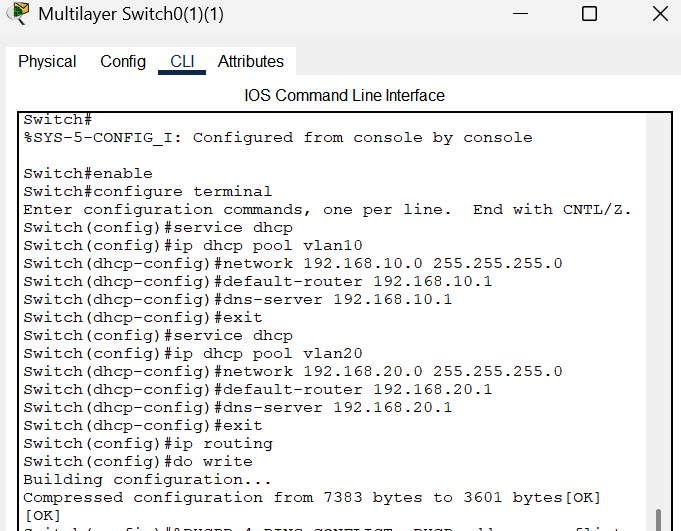
</p>

**Verification:**
```cisco
CoreSwitch# show ip dhcp pool

Pool VLAN10_POOL :
 Utilization mark (high/low)    : 100 / 0
 Subnet size (first/next)       : 0 / 0 
 Total addresses                : 254
 Leased addresses               : 5
 Pending event                  : none
 1 subnet is currently in the pool :
 Current index        IP address range                    Leased addresses
 192.168.10.11        192.168.10.1     - 192.168.10.254   5

CoreSwitch# show ip dhcp binding

Bindings from all pools:
IP address       Client-ID/              Lease expiration        Type
                 Hardware address/
                 User name
192.168.10.11    0100.1234.5678.AB      Jan 25 2026 10:30 AM    Automatic
192.168.20.12    0100.ABCD.EF12.34      Jan 25 2026 10:31 AM    Automatic
192.168.30.13    0100.9876.5432.10      Jan 25 2026 10:32 AM    Automatic
```

---

#### ✅ DHCP Successfully Configured:

<p align="center">
  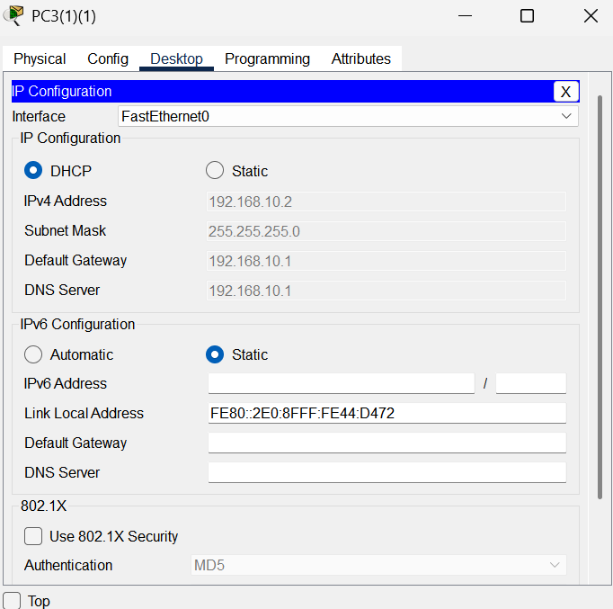
</p>

**Client Configuration:**
```
PC IP Configuration:
✓ DHCP selected (automatic)
✓ IPv4 Address: 192.168.1.2 (assigned by DHCP)
✓ Subnet Mask: 255.255.255.0
✓ Default Gateway: 192.168.1.1
✓ DNS Server: 192.168.1.1
✓ IPv6 Link Local Address: FE80::2E0:8FFF:FE44:D472
```

**Client Testing:**
```
PC in VLAN 10:
- IP: 192.168.10.11 (DHCP assigned) ✓
- Gateway: 192.168.10.1 ✓
- DNS: 8.8.8.8 ✓

PC in VLAN 20:
- IP: 192.168.20.12 (DHCP assigned) ✓
- Gateway: 192.168.20.1 ✓
- DNS: 8.8.8.8 ✓

All PCs can communicate across VLANs! ✓
```

**Result:** ✅ DHCP working perfectly from Layer 3 switch, no separate server needed

---

## 🔄 Hybrid Configuration: Layer 3 Switch + Router on a Stick

### Concept

This advanced topology combines **Layer 3 Switch (SVI)** and **Router on a Stick** in one network, demonstrating how both technologies can work together for complex enterprise scenarios.

### Why Combine Both?

| Scenario | Solution |
|----------|----------|
| **Local VLANs** | Use Layer 3 Switch for fast inter-VLAN routing |
| **Remote Sites** | Use Router for WAN connectivity |
| **Internet Gateway** | Router provides NAT and firewall |
| **Internal Routing** | Layer 3 Switch handles campus traffic |

#### Real-Life Example:
```
Company Campus Network:
├─ Building A, B, C: 20 VLANs
│  └─ Layer 3 Switch (fast internal routing)
│
├─ WAN Connection to Remote Office
│  └─ Router on a Stick (WAN routing)
│
└─ Internet Gateway
   └─ Router (NAT, Firewall, Security)

Best of both worlds! ✓
```

---

### Lab Implementation - Hybrid Configuration

#### 📊 Network Topology:

<p align="center">
  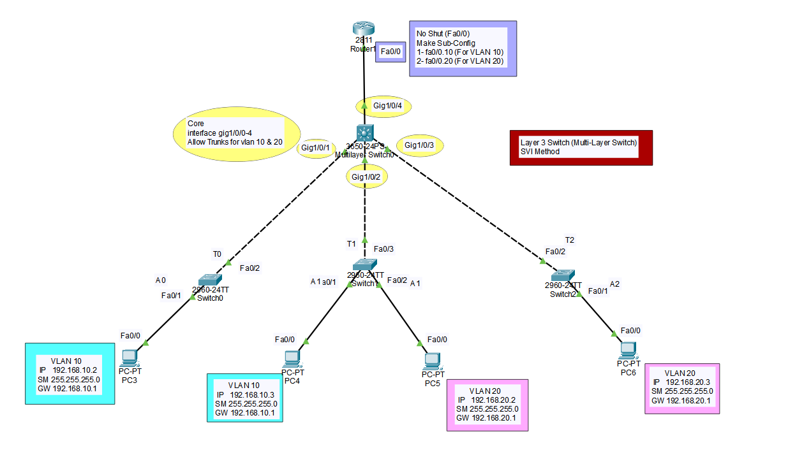
</p>

**Scenario:** Layer 3 Switch handles internal VLANs, Router provides inter-site connectivity

**Architecture:**
```
Access Switches (Layer 2)
         ↓
Core Layer 3 Switch (SVI routing)
         ↓
Router (Subinterfaces + WAN)
         ↓
Remote Sites / Internet
```

---

### Configuration - Switch 0 (Access Layer)

<p align="center">
  
</p>

```cisco
! Switch 0 - Access Layer
Switch> enable
Switch# configure terminal
Switch(config)# hostname AccessSwitch0

! Create VLANs
AccessSwitch0(config)# vlan 10
AccessSwitch0(config-vlan)# name Sales
AccessSwitch0(config-vlan)# exit

AccessSwitch0(config)# vlan 20
AccessSwitch0(config-vlan)# name HR
AccessSwitch0(config-vlan)# exit

! Configure trunk to Core Switch
AccessSwitch0(config)# interface gigabitEthernet 0/1
AccessSwitch0(config-if)# switchport mode trunk
AccessSwitch0(config-if)# switchport trunk allowed vlan 10,20,30,40
AccessSwitch0(config-if)# exit

! Configure access ports
AccessSwitch0(config)# interface range fastEthernet 0/1-10
AccessSwitch0(config-if-range)# switchport mode access
AccessSwitch0(config-if-range)# switchport access vlan 10
AccessSwitch0(config-if-range)# exit

AccessSwitch0(config)# interface range fastEthernet 0/11-20
AccessSwitch0(config-if-range)# switchport mode access
AccessSwitch0(config-if-range)# switchport access vlan 20
AccessSwitch0(config-if-range)# exit
```

---

### Configuration - Switch 1 (Access Layer)

<p align="center">
  
</p>

```cisco
! Switch 1 - Access Layer
Switch(config)# hostname AccessSwitch1

! Create VLANs
AccessSwitch1(config)# vlan 30
AccessSwitch1(config-vlan)# name IT
AccessSwitch1(config-vlan)# exit

AccessSwitch1(config)# vlan 40
AccessSwitch1(config-vlan)# name Guest
AccessSwitch1(config-vlan)# exit

! Configure trunk to Core Switch
AccessSwitch1(config)# interface gigabitEthernet 0/1
AccessSwitch1(config-if)# switchport mode trunk
AccessSwitch1(config-if)# switchport trunk allowed vlan 10,20,30,40
AccessSwitch1(config-if)# exit

! Configure access ports
AccessSwitch1(config)# interface range fastEthernet 0/1-10
AccessSwitch1(config-if-range)# switchport mode access
AccessSwitch1(config-if-range)# switchport access vlan 30
AccessSwitch1(config-if-range)# exit

AccessSwitch1(config)# interface range fastEthernet 0/11-20
AccessSwitch1(config-if-range)# switchport mode access
AccessSwitch1(config-if-range)# switchport access vlan 40
AccessSwitch1(config-if-range)# exit
```

---

### Configuration - Switch 2 (Distribution Layer)

<p align="center">
  
</p>

```cisco
! Switch 2 - Distribution/Core Layer
Switch(config)# hostname CoreSwitch2

! Create VLANs
CoreSwitch2(config)# vlan 10
CoreSwitch2(config-vlan)# name Sales
CoreSwitch2(config-vlan)# exit

CoreSwitch2(config)# vlan 20
CoreSwitch2(config-vlan)# name HR
CoreSwitch2(config-vlan)# exit

CoreSwitch2(config)# vlan 30
CoreSwitch2(config-vlan)# name IT
CoreSwitch2(config-vlan)# exit

CoreSwitch2(config)# vlan 40
CoreSwitch2(config-vlan)# name Guest
CoreSwitch2(config-vlan)# exit

! Configure trunk ports to access switches
CoreSwitch2(config)# interface range gigabitEthernet 0/1-2
CoreSwitch2(config-if-range)# switchport mode trunk
CoreSwitch2(config-if-range)# switchport trunk allowed vlan 10,20,30,40
CoreSwitch2(config-if-range)# exit

! Configure trunk to Router
CoreSwitch2(config)# interface gigabitEthernet 0/3
CoreSwitch2(config-if)# switchport mode trunk
CoreSwitch2(config-if)# switchport trunk allowed vlan 10,20,30,40
CoreSwitch2(config-if)# exit
```

---

### Configuration - Router 1 (Router on a Stick)

<p align="center">
  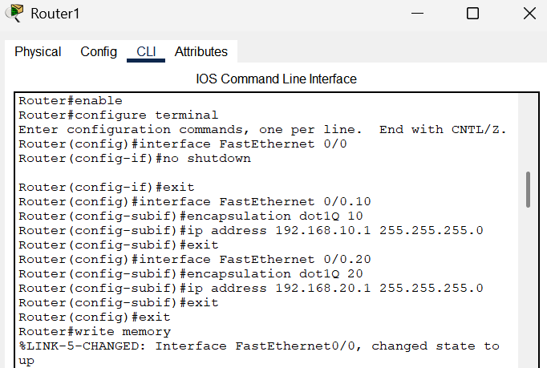
</p>

```cisco
! Router 1 - Router on a Stick + WAN
Router> enable
Router# configure terminal
Router(config)# hostname Router1

! Physical interface to Core Switch
Router1(config)# interface gigabitEthernet 0/0
Router1(config-if)# no shutdown
Router1(config-if)# exit

! Subinterface for VLAN 10
Router1(config)# interface gigabitEthernet 0/0.10
Router1(config-subif)# encapsulation dot1Q 10
Router1(config-subif)# ip address 192.168.10.1 255.255.255.0
Router1(config-subif)# exit

! Subinterface for VLAN 20
Router1(config)# interface gigabitEthernet 0/0.20
Router1(config-subif)# encapsulation dot1Q 20
Router1(config-subif)# ip address 192.168.20.1 255.255.255.0
Router1(config-subif)# exit

! Subinterface for VLAN 30
Router1(config)# interface gigabitEthernet 0/0.30
Router1(config-subif)# encapsulation dot1Q 30
Router1(config-subif)# ip address 192.168.30.1 255.255.255.0
Router1(config-subif)# exit

! Subinterface for VLAN 40
Router1(config)# interface gigabitEthernet 0/0.40
Router1(config-subif)# encapsulation dot1Q 40
Router1(config-subif)# ip address 192.168.40.1 255.255.255.0
Router1(config-subif)# exit

! WAN Interface (to remote sites/internet)
Router1(config)# interface gigabitEthernet 0/1
Router1(config-if)# ip address 10.0.0.1 255.255.255.252
Router1(config-if)# no shutdown
Router1(config-if)# exit

! Default route to internet
Router1(config)# ip route 0.0.0.0 0.0.0.0 10.0.0.2
```

---

### Configuration - Multi-Layer Switch (Core)

<p align="center">
  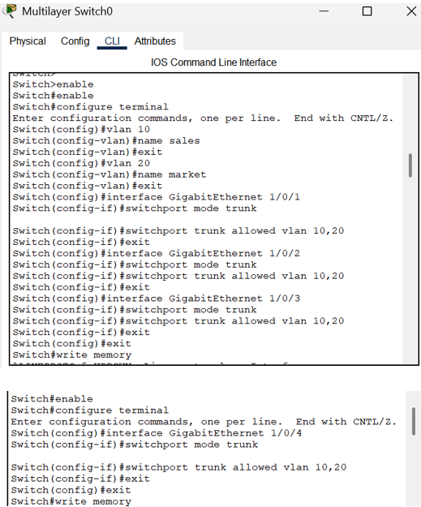
</p>

```cisco
! Multi-Layer Switch - Core with SVI
Switch> enable
Switch# configure terminal
Switch(config)# hostname CoreMultilayerSwitch

! Enable IP Routing
CoreMultilayerSwitch(config)# ip routing

! Create VLANs
CoreMultilayerSwitch(config)# vlan 10
CoreMultilayerSwitch(config-vlan)# name Sales
CoreMultilayerSwitch(config-vlan)# exit

CoreMultilayerSwitch(config)# vlan 20
CoreMultilayerSwitch(config-vlan)# name HR
CoreMultilayerSwitch(config-vlan)# exit

CoreMultilayerSwitch(config)# vlan 30
CoreMultilayerSwitch(config-vlan)# name IT
CoreMultilayerSwitch(config-vlan)# exit

CoreMultilayerSwitch(config)# vlan 40
CoreMultilayerSwitch(config-vlan)# name Guest
CoreMultilayerSwitch(config-vlan)# exit

! Configure SVI for each VLAN (Internal routing)
CoreMultilayerSwitch(config)# interface vlan 10
CoreMultilayerSwitch(config-if)# ip address 192.168.10.254 255.255.255.0
CoreMultilayerSwitch(config-if)# no shutdown
CoreMultilayerSwitch(config-if)# exit

CoreMultilayerSwitch(config)# interface vlan 20
CoreMultilayerSwitch(config-if)# ip address 192.168.20.254 255.255.255.0
CoreMultilayerSwitch(config-if)# no shutdown
CoreMultilayerSwitch(config-if)# exit

CoreMultilayerSwitch(config)# interface vlan 30
CoreMultilayerSwitch(config-if)# ip address 192.168.30.254 255.255.255.0
CoreMultilayerSwitch(config-if)# no shutdown
CoreMultilayerSwitch(config-if)# exit

CoreMultilayerSwitch(config)# interface vlan 40
CoreMultilayerSwitch(config-if)# ip address 192.168.40.254 255.255.255.0
CoreMultilayerSwitch(config-if)# no shutdown
CoreMultilayerSwitch(config-if)# exit

! Configure trunk ports
CoreMultilayerSwitch(config)# interface range gigabitEthernet 0/1-2
CoreMultilayerSwitch(config-if-range)# switchport trunk encapsulation dot1q
CoreMultilayerSwitch(config-if-range)# switchport mode trunk
CoreMultilayerSwitch(config-if-range)# exit

! Routed port to Router (Layer 3 connection)
CoreMultilayerSwitch(config)# interface gigabitEthernet 0/3
CoreMultilayerSwitch(config-if)# no switchport
CoreMultilayerSwitch(config-if)# ip address 10.1.1.2 255.255.255.252
CoreMultilayerSwitch(config-if)# exit

! Static route to Router (for external connectivity)
CoreMultilayerSwitch(config)# ip route 0.0.0.0 0.0.0.0 10.1.1.1
```

---

### Results - Hybrid Configuration

**Traffic Flow:**

```
Internal VLAN-to-VLAN Traffic:
PC (VLAN 10) → Core L3 Switch (SVI routing) → PC (VLAN 20)
✓ Fast, wire-speed routing within campus

External Traffic:
PC (VLAN 10) → Core L3 Switch → Router → WAN/Internet
✓ Router handles WAN and internet routing

Remote Site Traffic:
Site A → Router (subinterface) → Core L3 Switch → VLAN X
✓ Router provides site-to-site connectivity
```

**Verification:**
```cisco
CoreMultilayerSwitch# show ip route

C    192.168.10.0/24 is directly connected, Vlan10
C    192.168.20.0/24 is directly connected, Vlan20
C    192.168.30.0/24 is directly connected, Vlan30
C    192.168.40.0/24 is directly connected, Vlan40
S*   0.0.0.0/0 [1/0] via 10.1.1.1

Router1# show ip route

C    192.168.10.0/24 is directly connected, GigabitEthernet0/0.10
C    192.168.20.0/24 is directly connected, GigabitEthernet0/0.20
C    192.168.30.0/24 is directly connected, GigabitEthernet0/0.30
C    192.168.40.0/24 is directly connected, GigabitEthernet0/0.40
C    10.0.0.0/30 is directly connected, GigabitEthernet0/1
S*   0.0.0.0/0 [1/0] via 10.0.0.2
```

**Result:** ✅ Hybrid configuration provides both fast internal routing and flexible external connectivity

---

## 🆚 Comparison: Different Inter-VLAN Routing Methods

### Quick Comparison

<div align="center">

| Feature | Router on a Stick | Layer 3 Switch (SVI) | Hybrid |
|---------|-------------------|----------------------|--------|
| **Speed** | Moderate | Fast (wire-speed) | Fast internal + Flexible external |
| **Scalability** | Limited | Excellent | Excellent |
| **Cost** | Lower | Higher | Highest |
| **Complexity** | Moderate | Moderate | Higher |
| **Best For** | Small networks | Medium-large networks | Enterprise campus |
| **WAN Support** | ✓ Built-in | ❌ Needs router | ✓ Built-in |
| **Internal Routing** | Moderate speed | Very fast | Very fast |

</div>

---

### When to Use Each Method:

**Router on a Stick:**
```
✓ Small office (< 50 devices)
✓ Limited VLANs (2-5)
✓ Existing router available
✓ Budget constraints
✓ Simple topology
```

**Layer 3 Switch (SVI):**
```
✓ Medium to large campus (100-1000+ devices)
✓ Many VLANs (10+)
✓ High inter-VLAN traffic
✓ Performance critical
✓ No WAN connectivity needed
```

**Hybrid Configuration:**
```
✓ Enterprise campus network
✓ Multiple buildings
✓ Heavy internal traffic + WAN needs
✓ Remote site connectivity
✓ Internet gateway required
✓ Best performance + maximum flexibility
```

---

## 📝 Quick Reference

### Common VLAN Commands

**Creating VLANs:**
```cisco
vlan 10
 name HR
vlan 20
 name IT
```

**Access Port:**
```cisco
interface fastEthernet 0/1
 switchport mode access
 switchport access vlan 10
```

**Trunk Port:**
```cisco
interface gigabitEthernet 0/1
 switchport mode trunk
 switchport trunk allowed vlan 10,20,30
```

---

### Router on a Stick Commands

```cisco
! Physical interface
interface gigabitEthernet 0/0
 no shutdown

! Subinterfaces
interface gigabitEthernet 0/0.10
 encapsulation dot1Q 10
 ip address 192.168.10.1 255.255.255.0

interface gigabitEthernet 0/0.20
 encapsulation dot1Q 20
 ip address 192.168.20.1 255.255.255.0
```

---

### Layer 3 Switch Commands

**Enable Routing:**
```cisco
ip routing
```

**Create SVI:**
```cisco
interface vlan 10
 ip address 192.168.10.1 255.255.255.0
 no shutdown
```

**Routed Port:**
```cisco
interface gigabitEthernet 0/1
 no switchport
 ip address 10.0.0.1 255.255.255.252
```

---

### DHCP on Layer 3 Switch

```cisco
! Exclude static IPs
ip dhcp excluded-address 192.168.10.1 192.168.10.10

! Create DHCP pool
ip dhcp pool VLAN10_POOL
 network 192.168.10.0 255.255.255.0
 default-router 192.168.10.1
 dns-server 8.8.8.8
 lease 7
```

---

### Verification Commands

```cisco
! VLAN verification
show vlan brief
show vlan id 10

! Trunk verification
show interfaces trunk
show interfaces gigabitEthernet 0/1 switchport

! SVI verification
show ip interface brief
show interface vlan 10

! Routing verification
show ip route
show ip route connected

! DHCP verification
show ip dhcp pool
show ip dhcp binding
show ip dhcp conflict
```

---

### Troubleshooting Tips

**VLAN Not Working:**
```
✓ Check VLAN exists on all switches
✓ Verify trunk port configuration
✓ Check allowed VLANs on trunk
✓ Ensure native VLAN matches
```

**Inter-VLAN Routing Not Working:**
```
✓ Check "ip routing" is enabled (L3 switch)
✓ Verify SVI is up/up (no shutdown)
✓ Check PC gateway is correct
✓ Verify routing table has VLAN networks
```

**DHCP Not Working:**
```
✓ Check DHCP service is running
✓ Verify excluded addresses don't overlap pool
✓ Ensure SVI (gateway) is up
✓ Check PC is set to DHCP mode
```

---

## 📁 Repository Structure

```
VLAN-Configuration/
│
├── README.md                              # Complete documentation
│
└── images/                                # All screenshots
    ├── vlan-banner.png                    # Hero image
    │
    ├── VLAN-Basics/
    │   ├── vlan-trunk-topology.png        # PDF pg 1
    │   └── vlan-trunk-config.png          # Configuration & verification
    │
    ├── Router-on-a-Stick/
    │   ├── router-on-stick-topology.png   # Topology diagram
    │   ├── router-on-stick-router-config.png  # PDF pg 2
    │   ├── router-on-stick-switch6-config.png # PDF pg 3
    │   ├── router-on-stick-switch4-config.png # PDF pg 3
    │   └── router-on-stick-switch5-config.png # PDF pg 4
    │
    ├── Layer3-SVI/
    │   ├── layer3-svi-topology.png        # Network diagram
    │   ├── layer3-svi-commands.png        # PDF pg 5
    │   ├── layer3-svi-switch1-config.png  # PDF pg 5
    │   ├── layer3-svi-switch0-config.png  # PDF pg 6
    │   └── layer3-svi-switch2-config.png  # PDF pg 6
    │
    ├── DHCP-Layer3/
    │   ├── dhcp-layer3-topology.png       # Topology
    │   ├── dhcp-layer3-steps.png          # PDF pg 7
    │   ├── dhcp-layer3-switch1-config.png # PDF pg 8
    │   ├── dhcp-layer3-switch0-config.png # PDF pg 8
    │   ├── dhcp-layer3-switch2-config.png # PDF pg 8
    │   ├── dhcp-layer3-core-config.png    # PDF pg 9
    │   ├── dhcp-layer3-server-config.png  # PDF pg 9
    │   └── dhcp-layer3-result.png         # DHCP successful result
    │
    └── Hybrid-L3-Router/
        ├── hybrid-topology.png            # Network topology (pg 10)
        ├── hybrid-sample-config.png       # PDF pg 10
        ├── hybrid-switch0-config.png      # PDF pg 11
        ├── hybrid-switch1-config.png      # PDF pg 11
        ├── hybrid-switch2-config.png      # PDF pg 12
        ├── hybrid-router1-config.png      # PDF pg 12
        └── hybrid-multilayer-config.png   # PDF pg 13
```

---

## 🎓 What I Learned

### VLAN Fundamentals:
✅ VLAN concept and purpose  
✅ Network segmentation benefits  
✅ Access vs Trunk ports  
✅ 802.1Q tagging  
✅ VLAN configuration and verification  

### Router on a Stick:
✅ Inter-VLAN routing basics  
✅ Subinterface configuration  
✅ 802.1Q encapsulation on router  
✅ One physical link for multiple VLANs  
✅ Limitations and bottlenecks  

### Layer 3 Switch with SVI:
✅ SVI (Switch Virtual Interface) concept  
✅ Wire-speed routing advantage  
✅ IP routing enablement  
✅ Per-VLAN gateway configuration  
✅ Performance benefits over router  

### Multi-Layer Switching:
✅ Routed port configuration  
✅ Combining Layer 2 and Layer 3  
✅ Enterprise network design  
✅ Scalability and performance  

### DHCP on Layer 3 Switch:
✅ DHCP pool configuration  
✅ Per-VLAN DHCP scopes  
✅ IP exclusion for static devices  
✅ Gateway and DNS assignment  
✅ Simplified architecture without dedicated server  

### Hybrid Configuration:
✅ Combining Layer 3 Switch and Router on a Stick  
✅ Internal routing via SVI for performance  
✅ External routing via router for WAN connectivity  
✅ Enterprise campus design patterns  
✅ Routed port configuration for inter-device routing  
✅ Optimal traffic flow design  

---

## 🚀 How to Use This Repository

1. **Clone the repository:**
   ```bash
   git clone https://github.com/your-username/VLAN-Configuration.git
   ```

2. **Study each topology:**
   - Start with VLAN basics
   - Understand trunk vs access
   - Progress to inter-VLAN routing
   - Compare different methods

3. **Practice in lab:**
   - Replicate topologies in Packet Tracer
   - Configure step-by-step
   - Test connectivity
   - Troubleshoot issues

4. **Build real-world scenarios:**
   - Design multi-VLAN networks
   - Choose appropriate routing method
   - Implement DHCP for automation
   - Document your configurations

---

## 📞 Connect With Me

<div align="center">

[](mailto:a.wahid7860668@gmail.com)
[](https://www.linkedin.com/in/abdul-wahid022)
[](https://github.com/abdul-wahid022)

**💬 Questions? Need Packet Tracer files? Feel free to reach out!**

</div>

---

## 📄 License

This project is created for **educational purposes** and is open-source.

---

<div align="center">

### ⭐ If you found this helpful, please give it a star!

**Made with 💙 by ABDUL WAHID**

*Last Updated: January 2026*

</div>

