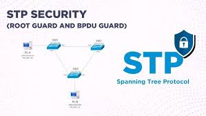

# 🌳 STP Security Features - Complete Guide

<div align="center">



**Spanning Tree Protocol with PortFast, BPDU Guard, and Root Guard**

[](.)
[](.)
[](.)

[📖 Overview](#-overview) • [🌲 STP Basics](#-stp-basics) • [⚡ PortFast](#-portfast) • [🛡️ BPDU Guard](#️-bpdu-guard) • [🔒 Root Guard](#-root-guard)

</div>

---

## 📖 Overview

**STP (Spanning Tree Protocol)** prevents network loops while maintaining redundancy. This guide covers STP fundamentals and three critical security features.

### What You'll Learn:

| Feature | Purpose | Use Case |
|---------|---------|----------|
| **STP** | Loop prevention | Network stability |
| **PortFast** | Fast convergence | End devices (PC, printer) |
| **BPDU Guard** | Unauthorized switch detection | Security on user ports |
| **Root Guard** | Root Bridge protection | Distribution/uplink ports |

### Key Benefits:

✅ **Loop Prevention** - No broadcast storms  
✅ **Fast Convergence** - End devices connect instantly  
✅ **Security** - Unauthorized switches blocked  
✅ **Redundancy** - Backup paths activate automatically  
✅ **Topology Control** - Root Bridge protection  

---

## 📚 Table of Contents

- [🌲 STP Basics](#-stp-basics)
  - [The Problem](#the-problem)
  - [STP Solution](#stp-solution)
  - [Bridge ID](#bridge-id)
  - [Root Bridge](#root-bridge)
  - [BPDU](#bpdu-bridge-protocol-data-unit)
  - [Port States](#port-states)
  - [Timers](#stp-timers)
- [⚡ PortFast](#-portfast)
  - [Concept](#concept)
  - [Configuration](#configuration)
  - [Use Cases](#use-cases)
- [🛡️ BPDU Guard](#️-bpdu-guard)
  - [Concept](#concept-1)
  - [Configuration](#configuration-1)
  - [How It Works](#how-it-works)
- [🔒 Root Guard](#-root-guard)
  - [Concept](#concept-2)
  - [Configuration](#configuration-2)
  - [How It Works](#how-it-works-1)
- [📝 Quick Reference](#-quick-reference)

---

## 🌲 STP Basics

### The Problem

**What happens when you have redundant links?**

```
Problem: Broadcast Storm!

Switch A -------- Switch B
    |                |
    |                |
    +---- Switch C --+
    
Without STP:
Packet enters network → 
Keeps looping forever → 
Network crashes! ❌
```

**Real-Life Example:**
```
Imagine a circular road with no traffic rules:
- Cars keep going in circles
- More cars join
- Complete traffic jam!
- System crashes

This is exactly what happens in a network loop!
```

---

### STP Solution

**How STP fixes this:**

```
STP blocks some links to prevent loops:

Switch A -------- Switch B
    |                |
    |                | (BLOCKED)
    +---- Switch C --+
    
With STP:
Only ONE path active ✅
If main path fails → Blocked path activates ✅
```

**STP Process:**
```
1. All switches exchange information
2. Elect one Root Bridge (boss switch)
3. Calculate best paths to Root Bridge
4. Block redundant links
5. Monitor network continuously
6. If link fails → Unblock backup path
```

---

### Bridge ID

**What is Bridge ID?**

Every switch needs a unique ID for STP to work.

**Bridge ID Structure:**
```
┌──────────────────┬─────────────────────────┐
│   Priority       │      MAC Address        │
│   (16 bits)      │       (48 bits)         │
│  Default: 32768  │   Hardware Address      │
└──────────────────┴─────────────────────────┘
        Total: 64 bits

Bridge ID = Priority + MAC Address
```

**Example:**

**Switch A:**
```
Priority: 32768
MAC: 0000.1111.AAAA
Bridge ID: 32768.0000.1111.AAAA
```

**Switch B:**
```
Priority: 32768
MAC: 0000.2222.BBBB
Bridge ID: 32768.0000.2222.BBBB
```

**Comparison:**
```
Step 1: Compare Priority
32768 = 32768 (Same!)

Step 2: Compare MAC Address
0000.1111.AAAA < 0000.2222.BBBB

Result: Switch A wins! (Lower is better)
```

---

### Root Bridge

**What is Root Bridge?**

```
Root Bridge = Boss switch in STP network
All traffic decisions based on Root Bridge
```

**Analogy:**
```
Think of a company hierarchy:

        [CEO - Root Bridge]
              |
      +-------+-------+
      |               |
 [Manager 1]     [Manager 2]
      |               |
 [Employee]      [Employee]

CEO = Root Bridge (most important)
All traffic flows with reference to CEO
CEO decides best paths
```

**Root Bridge Election:**
```
1. All switches claim to be Root
2. Exchange Bridge IDs via BPDU
3. Lowest Bridge ID wins
4. Winner becomes Root Bridge
5. All other switches calculate paths to Root
```

**Example:**
```
Switch A: Bridge ID = 32768.0000.1111.AAAA
Switch B: Bridge ID = 32768.0000.2222.BBBB
Switch C: Bridge ID = 32768.0000.3333.CCCC

Lowest Bridge ID = Switch A
Root Bridge = Switch A ✅
```

---

### BPDU (Bridge Protocol Data Unit)

**What is BPDU?**

```
BPDU = Messages that switches send to each other
Purpose: Share STP information
```

**BPDU Contents:**
```
1. Root Bridge ID - Who is the boss?
2. Sender Bridge ID - Who am I?
3. Port Cost - How far am I from Root?
4. Port Priority - Which port should be used?
5. Timers - Hello time, Max age, Forward delay
```

**BPDU Types:**

**1. Configuration BPDU:**
```
Purpose: Share topology information
Sent by: Root Bridge (every 2 seconds)
Forwarded by: All other switches
Contains: Root Bridge ID, path cost, etc.
```

**2. TCN BPDU (Topology Change Notification):**
```
Purpose: Notify topology changes
Sent when: Link goes down/up
Direction: Non-root switches → Root Bridge
Result: Network reconverges
```

**How BPDUs Work:**
```
Root Bridge sends every 2 seconds:
"Hello! I'm the Root Bridge"
"My Bridge ID is 32768.0000.1111.AAAA"

Other switches forward this:
"Yes, he's the Root"
"I'm connected to Root via this path"
```

---

### Port States

**STP Port States:**

<div align="center">

| State | Duration | Description | Forwards Data? | Learns MAC? |
|-------|----------|-------------|----------------|-------------|
| **Disabled** | - | Administratively down | ❌ | ❌ |
| **Blocking** | 20 sec | Receives BPDUs only | ❌ | ❌ |
| **Listening** | 15 sec | Processes BPDUs | ❌ | ❌ |
| **Learning** | 15 sec | Builds MAC table | ❌ | ✅ |
| **Forwarding** | - | Normal operation | ✅ | ✅ |

</div>

**Port Roles:**

**1. Root Port (RP):**
```
Purpose: Best path to Root Bridge
Per switch: Only ONE Root Port
Status: Forwarding state
Example: Switch B's port toward Root Bridge
```

**2. Designated Port (DP):**
```
Purpose: Forwarding port on a segment
Per segment: Only ONE Designated Port
Status: Forwarding state
Example: Root Bridge's all ports
```

**3. Blocked Port:**
```
Purpose: Prevent loops
Status: Blocking state (not forwarding)
Activates: When main path fails
Example: Redundant link
```

**Example Topology:**
```
         [Switch A - ROOT]
              |    |
          RP(B)|    |RP(C)
              |    |
         [Switch B] [Switch C]
              |    |
           DP |    | BLOCKED
              +----+
              
Switch A: All ports = Designated
Switch B: One port = Root, one = Designated
Switch C: One port = Root, one = Blocked
```

---

### STP Timers

**Three Critical Timers:**

**1. Hello Time:**
```
Duration: 2 seconds
Purpose: How often Root Bridge sends BPDUs
Action: "I'm still the Root Bridge!"
```

**2. Forward Delay:**
```
Duration: 15 seconds
Purpose: Time spent in Listening and Learning
Total: 15 + 15 = 30 seconds
Action: Port transitions through states
```

**3. Max Age:**
```
Duration: 20 seconds
Purpose: How long to wait for BPDU before declaring link dead
Action: If no BPDU for 20 sec → Topology change
```

**Total Convergence Time:**
```
Blocking (20s) + Listening (15s) + Learning (15s) = 50 seconds

This is why PortFast is important for end devices!
```

---

### Real-World Example

**Step-by-Step STP Operation:**

**Scenario:** 3 switches connected

```
Switch A: MAC = 0000.0000.1111
Switch B: MAC = 0000.0000.2222
Switch C: MAC = 0000.0000.3333
```

**Step 1: Initial State**
```
All switches think they're Root Bridge
All send BPDUs claiming to be Root
```

**Step 2: BPDU Exchange**
```
Switch A: "I'm Root! My ID is 32768.0000.0000.1111"
Switch B: "I'm Root! My ID is 32768.0000.0000.2222"
Switch C: "I'm Root! My ID is 32768.0000.0000.3333"
```

**Step 3: Comparison**
```
Switch A has lowest Bridge ID → Root Bridge! ✅
```

**Step 4: Port Roles Assigned**
```
         [Switch A - ROOT]
              |    |
          RP(B)|    |RP(C)
              |    |
         [Switch B] [Switch C]
              |    |
           DP |    | BLOCKED
              +----+
```

**Step 5: Continuous Monitoring**
```
Every 2 seconds:
Root Bridge sends BPDU: "I'm still the Root!"
All switches verify: "Yes, you're still Root"
```

---

### Verification Commands

```cisco
! Check STP status
show spanning-tree

! Check which switch is Root Bridge
show spanning-tree root

! Check port states and roles
show spanning-tree interface fastEthernet 0/1

! Check BPDU details on interface
show spanning-tree interface fastEthernet 0/1 detail

! Check STP VLAN-wise
show spanning-tree vlan 1
```

---

## ⚡ PortFast

### Concept

**What is PortFast?**

```
PortFast = Skip STP states and go directly to Forwarding
Purpose: Fast connectivity for end devices
Time saved: 30-50 seconds!
```

**The Problem:**
```
Normal STP convergence:
1. Port connected
2. Blocking (20s)
3. Listening (15s)
4. Learning (15s)
5. Forwarding

Total: 50 seconds wait! ⏳
```

**With PortFast:**
```
PortFast enabled:
1. Port connected
2. Forwarding (immediately!)

Total: 0 seconds wait! ⚡
```

**Real-Life Example:**
```
Without PortFast:
User plugs in laptop → Wait 50 seconds → Network access
User frustrated! 😠

With PortFast:
User plugs in laptop → Instant network access ✅
User happy! 😊
```

---

### When to Use PortFast?

**✅ Safe to use:**
```
End devices:
- Desktop computers
- Laptops
- Printers
- IP phones
- Servers
- Access points
```

**❌ NEVER use on:**
```
Network devices:
- Switches
- Routers
- Bridges
- Hubs

Why? Creates loops immediately!
```

**Warning:**
```
⚠️ CRITICAL: PortFast on switch-to-switch links = DISASTER!

Result:
1. Loop created instantly
2. Broadcast storm
3. Network crash
4. Your job at risk! 😱
```

---

### Configuration

**Enable PortFast on Interface:**

```cisco
! Enter interface configuration
Switch(config)# interface fastEthernet 0/1
Switch(config-if)# spanning-tree portfast
Switch(config-if)# exit

! Verify
Switch# show spanning-tree interface fastEthernet 0/1 portfast
```

**Enable PortFast Globally (All Access Ports):**

```cisco
! Enable on all non-trunk ports
Switch(config)# spanning-tree portfast default

! This applies to ALL access ports automatically
! Trunk ports are excluded
```

**Disable PortFast:**

```cisco
Switch(config)# interface fastEthernet 0/1
Switch(config-if)# no spanning-tree portfast
Switch(config-if)# exit
```

---

### Use Cases

**Scenario 1: Office Desktop**
```
Situation: Employee PC connected to switch
Problem: 50-second wait for network
Solution: Enable PortFast
Result: Instant network access ✅
```

**Scenario 2: Printer**
```
Situation: Network printer reboots
Problem: 50 seconds offline after restart
Solution: PortFast enabled
Result: Printer back online instantly ✅
```

**Scenario 3: IP Phone**
```
Situation: VoIP phone powering up
Problem: Long boot time + 50s STP delay
Solution: PortFast + voice VLAN
Result: Phone operational quickly ✅
```

---

### PortFast Best Practices

```
✓ Enable only on access ports (end devices)
✓ Use with BPDU Guard for security
✓ Never enable on trunk ports
✓ Never enable on inter-switch links
✓ Document which ports have PortFast
✓ Use "portfast default" carefully
```

---

## 🛡️ BPDU Guard

### Concept

**What is BPDU Guard?**

```
BPDU Guard = Shut down port if BPDU received
Purpose: Prevent unauthorized switches
Protection: Network security
```

**The Problem:**
```
Scenario: Employee brings home switch

Without BPDU Guard:
1. Employee connects switch
2. Switch sends BPDUs
3. Topology changes
4. Network disrupted/loops
5. Production down! ❌
```

**With BPDU Guard:**
```
With BPDU Guard:
1. Employee connects switch
2. Switch sends BPDU
3. BPDU Guard detects it
4. Port immediately err-disabled
5. Problem isolated! ✅
```

**Real-Life Analogy:**
```
Think of airport security:

No BPDU Guard:
Anyone can enter → Security risk

With BPDU Guard:
Unauthorized person tries to enter →
Alarm sounds →
Security shuts down entrance →
Threat contained!
```

---

### How It Works

**Detection Process:**
```
Step 1: PortFast enabled on port
Step 2: BPDU Guard enabled on port
Step 3: Port expects only end device

If BPDU received:
├─ BPDU = Switch/Bridge detected
├─ BPDU Guard triggers
├─ Port → err-disabled state
└─ Log message generated

Recovery:
Manual intervention required:
shutdown → no shutdown
```

**Port States:**
```
Normal Operation:
Port: Up/Up
Status: Forwarding
Traffic: Normal

BPDU Received:
Port: err-disabled
Status: Shutdown
Traffic: Blocked
LED: Amber (error)
```

---

### Configuration

**Enable BPDU Guard on Interface:**

```cisco
! Enter interface configuration
Switch(config)# interface fastEthernet 0/1
Switch(config-if)# spanning-tree portfast
Switch(config-if)# spanning-tree bpduguard enable
Switch(config-if)# exit
```

**Important Note:**
```
✓ ALWAYS use BPDU Guard with PortFast
✓ They work together for security
✓ PortFast alone = risky
✓ BPDU Guard without PortFast = pointless
```

**Enable BPDU Guard Globally:**

```cisco
! Enable on all PortFast ports
Switch(config)# spanning-tree portfast bpduguard default

! This applies to all ports where PortFast is enabled
```

**Disable BPDU Guard:**

```cisco
Switch(config)# interface fastEthernet 0/1
Switch(config-if)# no spanning-tree bpduguard enable
Switch(config-if)# exit
```

---

### Recovery from err-disabled

**When BPDU Guard Triggers:**

**Step 1: Check Port Status**
```cisco
Switch# show interface fastEthernet 0/1 status

Port      Name       Status       Vlan
Fa0/1                err-disabled  1
```

**Step 2: Check Why It's Disabled**
```cisco
Switch# show interfaces status err-disabled

Port      Name       Status       Reason
Fa0/1                err-disabled  bpduguard
```

**Step 3: Fix the Problem**
```
1. Disconnect the unauthorized switch
2. Verify only end device connected
3. Re-enable the port
```

**Step 4: Re-enable Port**
```cisco
Switch(config)# interface fastEthernet 0/1
Switch(config-if)# shutdown
Switch(config-if)# no shutdown
Switch(config-if)# exit
```

**Step 5: Verify**
```cisco
Switch# show interface fastEthernet 0/1 status

Port      Name       Status       Vlan
Fa0/1                connected    1
```

---

### Use Cases

**Scenario 1: Cubicle Port**
```
Location: Employee workstation
Device: Desktop PC
Config: PortFast + BPDU Guard
Reason: Prevent employee from connecting switch
```

**Scenario 2: Conference Room**
```
Location: Meeting room
Device: Presentation laptop
Config: PortFast + BPDU Guard
Reason: Visitors can't connect unauthorized devices
```

**Scenario 3: Public Area**
```
Location: Lobby/reception
Device: Guest laptop port
Config: PortFast + BPDU Guard
Reason: Security - block unauthorized network devices
```

---

### BPDU Guard Best Practices

```
✓ Enable on ALL access ports with PortFast
✓ Monitor err-disabled ports regularly
✓ Document BPDU Guard violations
✓ Train staff on port recovery
✓ Use with 802.1X for better security
✓ Consider auto-recovery (advanced)
```

---

## 🔒 Root Guard

### Concept

**What is Root Guard?**

```
Root Guard = Prevent unauthorized Root Bridge
Purpose: Protect current Root Bridge
Action: Block superior BPDUs
```

**The Problem:**
```
Scenario: New switch with better priority connects

Without Root Guard:
1. New switch has Priority 0
2. Current Root has Priority 32768
3. 0 < 32768 → New switch becomes Root
4. Entire topology changes!
5. Network reconverges
6. Downtime/disruption ❌
```

**With Root Guard:**
```
With Root Guard:
1. New switch has Priority 0
2. Root Guard detects superior BPDU
3. Port → root-inconsistent state
4. Superior BPDU blocked
5. Current Root stays Root
6. Network stable! ✅
```

**Real-Life Analogy:**
```
Think of a company CEO:

Without Root Guard:
Anyone with better credentials can become CEO →
Company chaos!

With Root Guard:
Current CEO protected →
No unauthorized takeover →
Company stable!
```

---

### How It Works

**Detection Process:**
```
Step 1: Root Guard enabled on port
Step 2: Port expects inferior/equal BPDUs only
Step 3: Monitor incoming BPDUs

If superior BPDU received:
├─ Superior BPDU = Better priority detected
├─ Root Guard triggers
├─ Port → root-inconsistent state
└─ Port blocks (doesn't forward)

When problem resolved:
├─ Superior BPDU stops coming
├─ Port automatically recovers
└─ Returns to normal forwarding
```

**Important Difference:**

```
BPDU Guard vs Root Guard:

BPDU Guard:
- ANY BPDU → err-disabled
- Manual recovery needed
- Permanent shutdown

Root Guard:
- SUPERIOR BPDU → root-inconsistent
- Automatic recovery
- Temporary block
```

---

### When Root Guard Triggers

**Example 1: Triggers**
```
Current Root: Priority 0
New Switch: Priority -1 (hypothetically better)

Result:
-1 < 0 → Superior BPDU
Root Guard triggers ✅
Port blocked
```

**Example 2: Does NOT Trigger**
```
Current Root: Priority 0
New Switch: Priority 32768

Result:
32768 > 0 → Inferior BPDU
Root Guard does NOT trigger ❌
Port stays forwarding
```

**Key Point:**
```
Root Guard only blocks BETTER priorities
Not all BPDUs!
```

---

### Configuration

**Enable Root Guard on Interface:**

```cisco
! Enter interface configuration
Switch(config)# interface fastEthernet 0/1
Switch(config-if)# spanning-tree guard root
Switch(config-if)# exit
```

**Important Notes:**
```
✓ Enable on access/distribution layer uplinks
✓ Do NOT enable on ports toward current Root
✓ Usually used on ports where Root should NOT come from
✓ Automatically recovers when threat removed
```

**Disable Root Guard:**

```cisco
Switch(config)# interface fastEthernet 0/1
Switch(config-if)# no spanning-tree guard root
Switch(config-if)# exit
```

---

### Verification

**Check Root Guard Status:**

```cisco
! Check interface details
Switch# show spanning-tree interface fastEthernet 0/1 detail

Port 1 (FastEthernet0/1) of VLAN0001 is designated forwarding
  Root guard is enabled on the port ✅
```

**Check for root-inconsistent State:**

```cisco
! If Root Guard triggered
Switch# show spanning-tree inconsistentports

Name                 Interface              Inconsistency
-------------------- ---------------------- ------------------
VLAN0001             FastEthernet0/1        Root Inconsistent

Number of inconsistent ports (segments) in the system: 1
```

**Check Port Status:**

```cisco
Switch# show spanning-tree interface fastEthernet 0/1

Port 1 (FastEthernet0/1) of VLAN0001 is root-inconsistent blocking
  Root guard is enabled on the port
  Port is in root-inconsistent state (superior BPDU received)
```

---

### Use Cases

**Scenario 1: Distribution to Access Switch**
```
Topology:
[Core/Root] → [Distribution] → [Access]

Enable Root Guard:
On Distribution switch, ports toward Access switches

Reason:
Access switches should NEVER become Root
```

**Scenario 2: Multi-Building Campus**
```
Topology:
[Main Building - Root] → [Remote Buildings]

Enable Root Guard:
On Main Building, ports toward Remote Buildings

Reason:
Root should stay in Main Building (data center)
```

**Scenario 3: Branch Office Connection**
```
Topology:
[HQ - Root] → [WAN] → [Branch]

Enable Root Guard:
On HQ, WAN links toward Branch

Reason:
Branch switches should never become Root
```

---

### Root Guard Best Practices

```
✓ Enable on all ports where Root should NOT come from
✓ Use on access and distribution layer uplinks
✓ Do NOT enable toward current Root Bridge
✓ Monitor root-inconsistent events
✓ Document Root Guard deployment
✓ Combine with other STP security features
```

---

## 📝 Quick Reference

### Feature Comparison Table

<div align="center">

| Feature | Purpose | Action | Use Case | Recovery |
|---------|---------|--------|----------|----------|
| **PortFast** | Fast convergence | Skip STP states | End devices (PC, printer) | N/A |
| **BPDU Guard** | Block switches | Port err-disabled | End user ports | Manual |
| **Root Guard** | Protect Root | Port root-inconsistent | Uplink/distribution | Automatic |

</div>

---

### Configuration Commands Summary

**PortFast:**
```cisco
! Interface level
interface fastEthernet 0/1
 spanning-tree portfast

! Global level (all access ports)
spanning-tree portfast default
```

**BPDU Guard:**
```cisco
! Interface level
interface fastEthernet 0/1
 spanning-tree portfast
 spanning-tree bpduguard enable

! Global level (all PortFast ports)
spanning-tree portfast bpduguard default
```

**Root Guard:**
```cisco
! Interface level (only way)
interface fastEthernet 0/1
 spanning-tree guard root
```

---

### Verification Commands

```cisco
! General STP status
show spanning-tree
show spanning-tree vlan 1
show spanning-tree summary

! Root Bridge information
show spanning-tree root

! Interface-specific
show spanning-tree interface fastEthernet 0/1
show spanning-tree interface fastEthernet 0/1 detail
show spanning-tree interface fastEthernet 0/1 portfast

! Check PortFast
show running-config interface fastEthernet 0/1

! Check BPDU Guard status
show spanning-tree interface fastEthernet 0/1 detail

! Check err-disabled ports
show interfaces status err-disabled

! Check Root Guard
show spanning-tree inconsistentports
show spanning-tree interface fastEthernet 0/1 detail
```

---

### Recovery Procedures

**BPDU Guard Recovery:**
```cisco
! Step 1: Identify problem
show interfaces status err-disabled

! Step 2: Remove unauthorized device
! (Physical action)

! Step 3: Re-enable port
interface fastEthernet 0/1
 shutdown
 no shutdown
```

**Root Guard Recovery:**
```
! Automatic recovery
! Just remove superior BPDU source
! Port will automatically return to forwarding
! No manual intervention needed
```

---

### Troubleshooting Guide

**Issue 1: Port stuck in err-disabled**
```
Cause: BPDU Guard triggered
Check: show interfaces status err-disabled
Fix:
1. Disconnect unauthorized switch
2. shutdown → no shutdown
```

**Issue 2: Port in root-inconsistent state**
```
Cause: Root Guard triggered
Check: show spanning-tree inconsistentports
Fix:
1. Check connected device priority
2. Remove superior BPDU source
3. Port auto-recovers
```

**Issue 3: Slow network connectivity**
```
Cause: PortFast not enabled on access ports
Check: show spanning-tree interface Fa0/1 portfast
Fix: spanning-tree portfast
```

**Issue 4: Topology keeps changing**
```
Cause: Unauthorized switches connecting
Check: show spanning-tree
Fix:
1. Enable BPDU Guard on access ports
2. Enable Root Guard on uplinks
```

---

### Best Practices Summary

**PortFast:**
```
✓ Enable on ALL access ports (end devices)
✓ Use "portfast default" for automatic deployment
✓ NEVER enable on trunk or inter-switch links
✓ Always combine with BPDU Guard
```

**BPDU Guard:**
```
✓ Enable on ALL PortFast ports
✓ Use "bpduguard default" globally
✓ Monitor err-disabled ports daily
✓ Train staff on recovery procedures
✓ Document all violations
```

**Root Guard:**
```
✓ Enable on ports where Root should NOT appear
✓ Use on access/distribution uplinks
✓ Do NOT use on ports toward current Root
✓ Monitor root-inconsistent events
✓ Plan Root Bridge placement carefully
```

---

### Common Mistakes to Avoid

```
❌ PortFast on switch-to-switch links
   → Creates instant loops!

❌ BPDU Guard without PortFast
   → Ineffective protection

❌ Root Guard toward current Root Bridge
   → Port will block immediately

❌ Forgetting to document changes
   → Troubleshooting nightmare

❌ Not monitoring err-disabled ports
   → Missing security events

❌ Auto-recovery without fixing root cause
   → Problems repeat
```

---

### Design Recommendations

**Small Office (< 10 switches):**
```
Core Switch:
- Priority 0 (Root Bridge)
- No PortFast/BPDU Guard/Root Guard needed

Access Switches:
- All user ports: PortFast + BPDU Guard
- Uplinks: Root Guard
```

**Medium Enterprise (10-50 switches):**
```
Core Layer:
- Dual Root Bridges (primary + secondary)
- Priority 0 and 4096

Distribution Layer:
- Uplinks: No Root Guard (toward Core)
- Downlinks: Root Guard (toward Access)

Access Layer:
- User ports: PortFast + BPDU Guard
- Uplinks: Root Guard
```

**Large Campus (50+ switches):**
```
Core Layer:
- Multiple Root Bridges per VLAN
- Priority tuning per VLAN

Distribution Layer:
- Root Guard on all downlinks
- BPDU filtering on selected links

Access Layer:
- PortFast default enabled
- BPDU Guard default enabled
- Root Guard on all uplinks
- Per-VLAN STP instances
```

---

## 📁 Repository Structure

```
STP-Security-Features/
│
├── README.md                          # Complete documentation
│
└── images/
    └── stp-security-banner.png        # Hero banner image
```

**Note:** All configurations, examples, and commands are included in this README file for easy reference.

---

## 🎓 What I Learned

### STP (Spanning Tree Protocol):
✅ Loop prevention in redundant topologies  
✅ Bridge ID structure and Root Bridge election  
✅ BPDU messages and their types  
✅ Port states and roles (Root, Designated, Blocked)  
✅ STP timers (Hello, Forward Delay, Max Age)  
✅ Convergence process (30-50 seconds)  

### PortFast:
✅ Fast convergence for end devices  
✅ Bypasses STP states (immediate forwarding)  
✅ Configuration on interface and globally  
✅ Use cases and restrictions  
✅ Must NEVER be used on switch links  

### BPDU Guard:
✅ Security feature to detect unauthorized switches  
✅ Puts port in err-disabled state on BPDU receipt  
✅ Always used with PortFast  
✅ Manual recovery required  
✅ Protection against topology attacks  

### Root Guard:
✅ Protects current Root Bridge  
✅ Blocks superior BPDUs  
✅ Port goes to root-inconsistent state  
✅ Automatic recovery when threat removed  
✅ Used on distribution/access uplinks  

### Key Concepts:
✅ Network loop prevention strategies  
✅ Redundancy vs. stability balance  
✅ Security layering in network design  
✅ Proper port configuration for different device types  
✅ Troubleshooting and recovery procedures  

---

## 🚀 How to Use This Repository

1. **Clone the repository:**
   ```bash
   git clone https://github.com/your-username/STP-Security-Features.git
   ```

2. **Study the concepts:**
   - Understand STP fundamentals
   - Learn Bridge ID and Root Bridge election
   - Master BPDU structure and operation
   - Review port states and roles

3. **Practice configurations:**
   - Configure PortFast on access ports
   - Enable BPDU Guard for security
   - Implement Root Guard on uplinks
   - Test err-disabled recovery

4. **Build lab topology:**
   - Create redundant network
   - Force Root Bridge election
   - Trigger BPDU Guard violations
   - Test Root Guard protection

5. **Verify and troubleshoot:**
   - Use show commands extensively
   - Monitor port states
   - Practice recovery procedures
   - Document your findings

---

## 📞 Connect With Me

<div align="center">

[](mailto:a.wahid7860668@gmail.com)

[](https://www.linkedin.com/in/abdul-wahid022)

[](https://github.com/abdul-wahid022)

**💬 Questions? Need Packet Tracer files? Feel free to reach out!**

</div>

---

## 📄 License

This project is created for **educational purposes** and is open-source.

---

<div align="center">

### ⭐ If you found this helpful, please give it a star!

**Made with ❤️ by ABDUL WAHID**

*Last Updated: January 2026*

</div>
