# 🔗 EtherChannel Configuration

<div align="center">

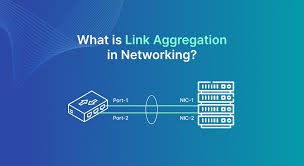

**Link Aggregation using PAGP, LACP, and Manual Mode**

[](.)
[](.)
[](.)

[📖 Overview](#-overview) • [📦 PAGP](#-pagp-port-aggregation-protocol) • [🔗 LACP](#-lacp-link-aggregation-control-protocol) • [🔀 Comparison](#-lacp-x-pagp-comparison) • [⚙️ ON Mode](#️-on-mode-manual-mode)

</div>

---

## 📖 Overview

**EtherChannel** allows you to bundle multiple physical links into one logical link, increasing bandwidth and providing redundancy.

### What You'll Learn:

| Protocol | Vendor | Standard | Best Use Case |
|----------|--------|----------|---------------|
| **PAGP** | Cisco proprietary | Cisco only | All Cisco environment |
| **LACP** | IEEE 802.3ad | Universal standard | Mixed vendor or modern networks |
| **ON Mode** | Manual configuration | N/A | Static, controlled environments |

### Key Benefits:

✅ **Increased Bandwidth** - Multiple links = More speed  
✅ **No Bandwidth Wastage** - All links actively used  
✅ **Redundancy** - If one link fails, others continue working  
✅ **No Loops** - Acts as single logical link  
✅ **Load Balancing** - Traffic distributed across links  

---

## 📚 Table of Contents

- [📦 PAGP (Port Aggregation Protocol)](#-pagp-port-aggregation-protocol)
  - [Concept](#concept)
  - [Modes](#pagp-modes)
  - [Lab Implementation](#lab-implementation---pagp)
  - [Configuration](#configuration---pagp)
  - [Verification](#verification---pagp)
- [🔗 LACP (Link Aggregation Control Protocol)](#-lacp-link-aggregation-control-protocol)
  - [Concept](#concept-1)
  - [Modes](#lacp-modes)
  - [Lab Implementation](#lab-implementation---lacp)
  - [Configuration](#configuration---lacp)
  - [Verification](#verification---lacp)
- [🔀 LACP x PAGP Comparison](#-lacp-x-pagp-comparison)
- [⚙️ ON Mode (Manual Mode)](#️-on-mode-manual-mode)
  - [Concept](#concept-2)
  - [Configuration](#configuration---on-mode)
  - [Verification](#verification---on-mode)
- [📝 Quick Reference](#-quick-reference)

---

## 📦 PAGP (Port Aggregation Protocol)

### Concept

<div align="center">

| Feature | Details |
|---------|---------|
| **Full Name** | Port Aggregation Protocol |
| **Vendor** | Cisco Proprietary |
| **Compatibility** | Cisco devices only |
| **Purpose** | Bundle multiple cables into ONE logical connection |
| **Standard** | Cisco only (like Apple products - only works with Apple) |

</div>

### 🔑 Key Points:

**PAGP** bundles multiple physical cables into ONE super-fast logical connection.

#### Real-Life Example:
```
Without PAGP:
Switch A ────────→ Switch B (1 cable = 1 Gbps)

With PAGP:
Switch A ────────→ Switch B
         ────────→           (3 cables)
         ────────→
         
Result: 3 Gbps total bandwidth! ✓
All 3 cables act as ONE logical link
```

#### Highway Analogy:
```
Without EtherChannel:
├─ 1 cable = 1 lane (1 Gbps)
└─ Traffic jam on single lane

With PAGP/EtherChannel:
├─ 4 cables = 4 lanes (4 Gbps total!)
└─ If one lane closes? Traffic uses other lanes! ✓
```

---

### PAGP Modes

**Available Modes:**

#### a) Desirable Mode
```
Meaning: "I actively want to form EtherChannel!"

How it works: 
Continuously sends messages to the other side:
"Let's make an EtherChannel together!"

Real-Life Example:
Like actively calling someone: "Let's go for coffee!"

Works with: Desirable or Auto mode
```

#### b) Auto Mode
```
Meaning: "I'm ready to form EtherChannel, IF you request"

How it works:
Passive mode - only responds if other side requests

Real-Life Example:
Like saying: "If you want to go for coffee, I'll join"

Works with: Only Desirable mode
⚠️ Auto + Auto = NO EtherChannel!
```

#### c) ON Mode
```
Meaning: "Forcefully forming EtherChannel, no negotiation"

How it works:
Interface directly becomes EtherChannel WITHOUT checking other side

Real-Life Example:
Like grabbing someone's hand and dancing WITHOUT asking

Risk: If other side config doesn't match = PROBLEMS!
```

#### d) Off Mode
```
Meaning: "No EtherChannel at all"

How it works:
Interface works as normal port

Example: Default setting when nothing is configured
```

---

### PAGP Modes Combinations

<div align="center">

| Side A | Side B | Result |
|--------|--------|--------|
| **Desirable** | **Desirable** | ✅ Works |
| **Desirable** | **Auto** | ✅ Works |
| **Auto** | **Auto** | ❌ NO EtherChannel |
| **ON** | **ON** | ✅ Works (risky) |
| **ON** | **Desirable** | ❌ NO EtherChannel |

</div>

---

### Easy Trick to Remember:

```
Desirable = Extrovert (actively talks)
Auto = Introvert (waits for others to talk first)
ON = Doesn't care about talking, just does it
Off = Not interested at all

Best Practice: Use Desirable on both sides
```

---

### Lab Implementation - PAGP

#### 📊 Network Topology:

<p align="center">
  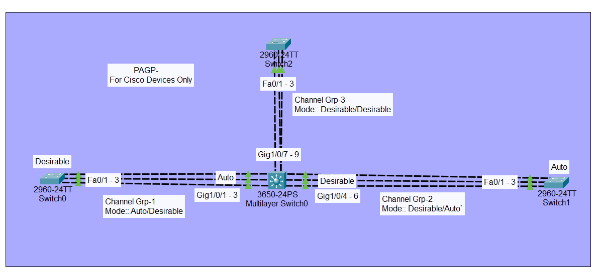
</p>

**Configuration Overview:**
```
Switch-0: Desirable mode
Switch-1: Auto mode
Switch-2: Desirable mode
Multi-Layer Switch: Desirable mode
```

---

### Configuration - PAGP

#### Switch-0 (Desirable Mode):

<p align="center">
  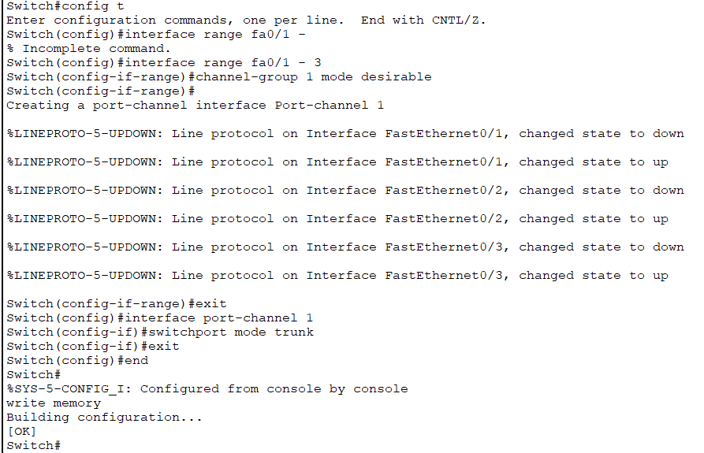
</p>

```cisco
! Switch-0 Configuration (Desirable Mode)
Switch> enable
Switch# configure terminal
Switch(config)# hostname Switch-0

! Configure EtherChannel with PAGP Desirable
Switch-0(config)# interface range gigabitEthernet 0/1-2
Switch-0(config-if-range)# channel-group 1 mode desirable
Switch-0(config-if-range)# exit
```

---

#### Switch-1 (Auto Mode):

<p align="center">
  
</p>

```cisco
! Switch-1 Configuration (Auto Mode)
Switch> enable
Switch# configure terminal
Switch(config)# hostname Switch-1

! Configure EtherChannel with PAGP Auto
Switch-1(config)# interface range gigabitEthernet 0/1-2
Switch-1(config-if-range)# channel-group 1 mode auto
Switch-1(config-if-range)# exit
```

**Note:** Auto mode waits for Desirable mode to initiate EtherChannel formation.

---

#### Switch-2 (Desirable Mode):

<p align="center">
  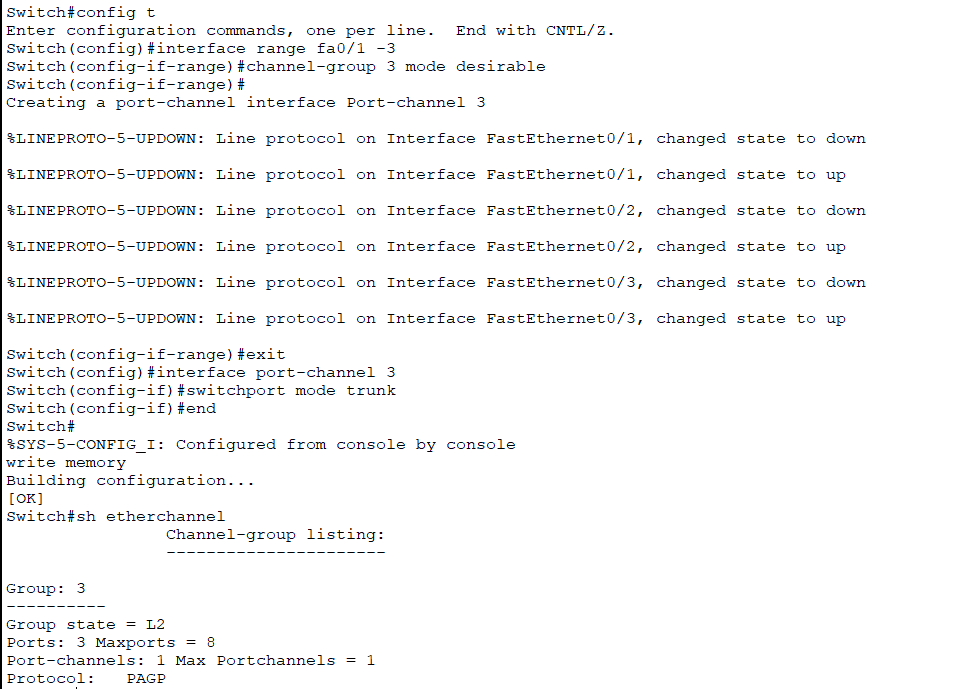
</p>

```cisco
! Switch-2 Configuration (Desirable Mode)
Switch> enable
Switch# configure terminal
Switch(config)# hostname Switch-2

! Configure EtherChannel with PAGP Desirable
Switch-2(config)# interface range gigabitEthernet 0/1-2
Switch-2(config-if-range)# channel-group 1 mode desirable
Switch-2(config-if-range)# exit
```

---

#### Multi-Layer Switch (Desirable Mode):

<p align="center">
  
</p>

```cisco
! Multi-Layer Switch Configuration (Desirable Mode)
Switch> enable
Switch# configure terminal
Switch(config)# hostname Multi-Layer-Switch

! Configure EtherChannel with PAGP Desirable
Multi-Layer-Switch(config)# interface range gigabitEthernet 0/1-2
Multi-Layer-Switch(config-if-range)# channel-group 1 mode desirable
Multi-Layer-Switch(config-if-range)# exit
```

---

### Verification - PAGP

#### ✅ PAGP Output:

<p align="center">
  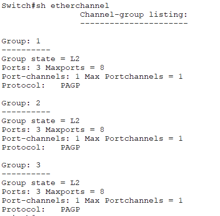
</p>

**Verification Commands:**
```cisco
! Check EtherChannel status
Switch# show etherchannel summary

! Check Port-channel interface
Switch# show interface port-channel 1

! Check PAGP neighbor information
Switch# show pagp neighbor
```

**Expected Result:**
```
✅ EtherChannel formed successfully using PAGP protocol
✅ Port-channel interface is UP
✅ All member ports bundled correctly
```

---

## 🔗 LACP (Link Aggregation Control Protocol)

### Concept

<div align="center">

| Feature | Details |
|---------|---------|
| **Full Name** | Link Aggregation Control Protocol |
| **Standard** | IEEE 802.3ad (Universal) |
| **Compatibility** | ANY brand (Cisco, HP, Juniper, etc.) |
| **Purpose** | Bundle multiple links (works across vendors) |
| **Modern Choice** | Industry standard, recommended |

</div>

### 🔑 Key Points:

**LACP** is the universal standard - works with ANY network equipment brand!

#### Real-Life Example:
```
PAGP (Cisco Only):
Switch A (Cisco) ←──────→ Switch B (Cisco) ✓
Switch A (Cisco) ←──────→ Switch B (HP) ❌ Won't work!

LACP (Universal):
Switch A (Cisco) ←──────→ Switch B (HP) ✓ Works!
Switch A (Cisco) ←──────→ Switch B (Juniper) ✓ Works!
Switch A (HP) ←──────→ Switch B (Dell) ✓ Works!

LACP = Like USB, works with everything! 
```

---

### LACP Modes

**Available Modes:**

#### 1) Active Mode
```
Meaning: "I actively want to form EtherChannel and will negotiate"

How it works:
Continuously sends LACP packets to other side:
"Let's form EtherChannel!"

Real-Life Example:
Like actively calling someone: "Let's make EtherChannel!"

Works with: Active mode OR Passive mode
```

#### 2) Passive Mode
```
Meaning: "I'm ready, but YOU request first"

How it works:
Waits to receive LACP packets, doesn't send first

Real-Life Example:
Like saying: "If you want, I'll form EtherChannel"

Works with: Only Active mode
⚠️ Passive + Passive = NO EtherChannel!
```

#### 3) On Mode (Optional)
```
Meaning: "Forcefully form EtherChannel without negotiation"

How it works:
Doesn't use LACP protocol, directly bundles

Risk: Config mismatch = problems!

Note: Technically NOT LACP, but option available
```

---

### LACP Modes Combinations

<div align="center">

| Side A | Side B | Result |
|--------|--------|--------|
| **Active** | **Active** | ✅ Works (Best!) |
| **Active** | **Passive** | ✅ Works |
| **Passive** | **Passive** | ❌ NO EtherChannel |
| **On** | **On** | ✅ Works (no LACP protocol) |
| **Active** | **On** | ❌ NO EtherChannel |

</div>

**Best Practice:** Use Active/Active

---

### Which One to Use?

```
Scenario 1: All Cisco Devices
├─ PAGP: Works ✓
├─ LACP: Also works ✓
└─ Recommendation: LACP (modern, universal standard)

Scenario 2: Mixed Brands (Cisco + HP + Juniper)
├─ PAGP: Won't work ❌
├─ LACP: Works perfectly ✓
└─ Must use: LACP only

Bottom Line: LACP is the modern, universal choice!
```

---

### Lab Implementation - LACP

#### 📊 Network Topology:

<p align="center">
  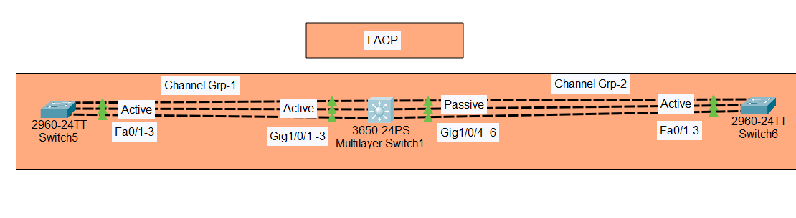
</p>

**Configuration Overview:**
```
Switch-1: Active/Passive mode
Switch-2: Active/Passive mode
Multi-Layer Switch: Active mode
```

---

### Configuration - LACP

#### Switch-1 Configuration:

<p align="center">
  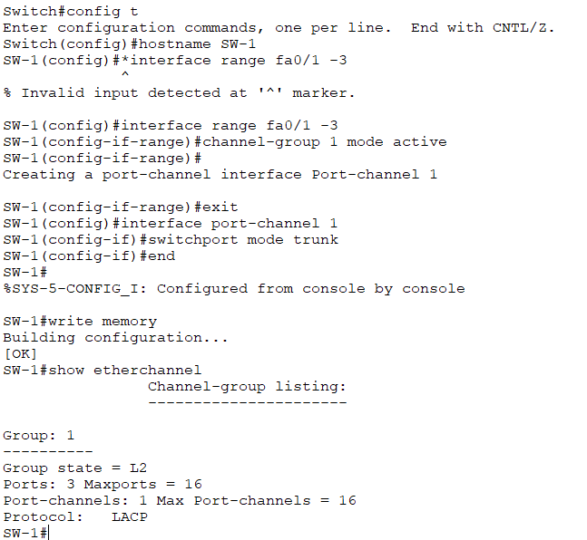
</p>

```cisco
! Switch-1 Configuration (LACP Active)
Switch> enable
Switch# configure terminal
Switch(config)# hostname Switch-1

! Configure EtherChannel with LACP Active
Switch-1(config)# interface range gigabitEthernet 0/1-2
Switch-1(config-if-range)# channel-group 1 mode active
Switch-1(config-if-range)# exit
```

**Note:** You can use `mode active` or `mode passive` depending on requirements.

---

#### Switch-2 Configuration:

<p align="center">
  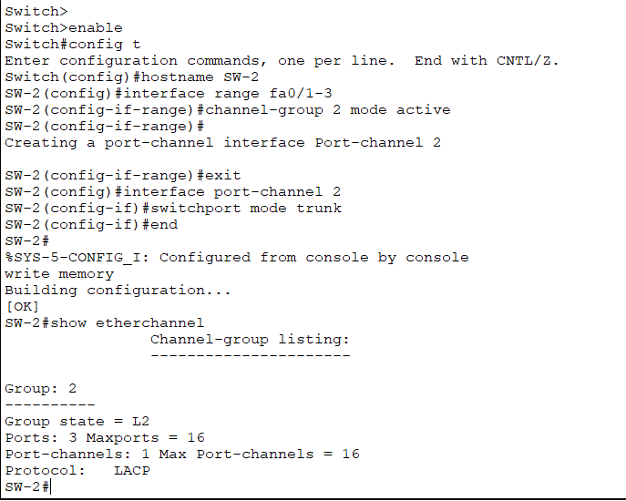
</p>

```cisco
! Switch-2 Configuration (LACP Active or Passive)
Switch> enable
Switch# configure terminal
Switch(config)# hostname Switch-2

! Configure EtherChannel with LACP
Switch-2(config)# interface range gigabitEthernet 0/1-2
Switch-2(config-if-range)# channel-group 1 mode active
Switch-2(config-if-range)# exit
```

---

#### Multi-Layer Switch Configuration:

<p align="center">
  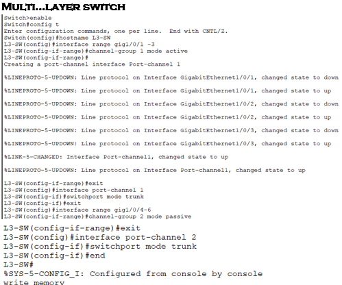
</p>

```cisco
! Multi-Layer Switch Configuration (LACP Active)
Switch> enable
Switch# configure terminal
Switch(config)# hostname Multi-Layer-Switch

! Configure EtherChannel with LACP Active
Multi-Layer-Switch(config)# interface range gigabitEthernet 0/1-2
Multi-Layer-Switch(config-if-range)# channel-group 1 mode active
Multi-Layer-Switch(config-if-range)# exit
```

---

### Verification - LACP

#### ✅ LACP Output:

<p align="center">
  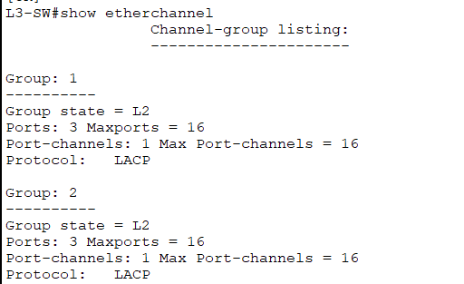
</p>

**Verification Commands:**
```cisco
! Check EtherChannel summary
Switch# show etherchannel summary

! Check Port-channel status
Switch# show interface port-channel 1

! Check LACP neighbor information
Switch# show lacp neighbor
```

**Expected Result:**
```
✅ EtherChannel formed successfully using LACP protocol
✅ Port-channel interface is UP
✅ LACP neighbors detected
✅ All member ports actively bundled
```

---

## 🔀 LACP x PAGP Comparison

### Side-by-Side Comparison

<p align="center">
  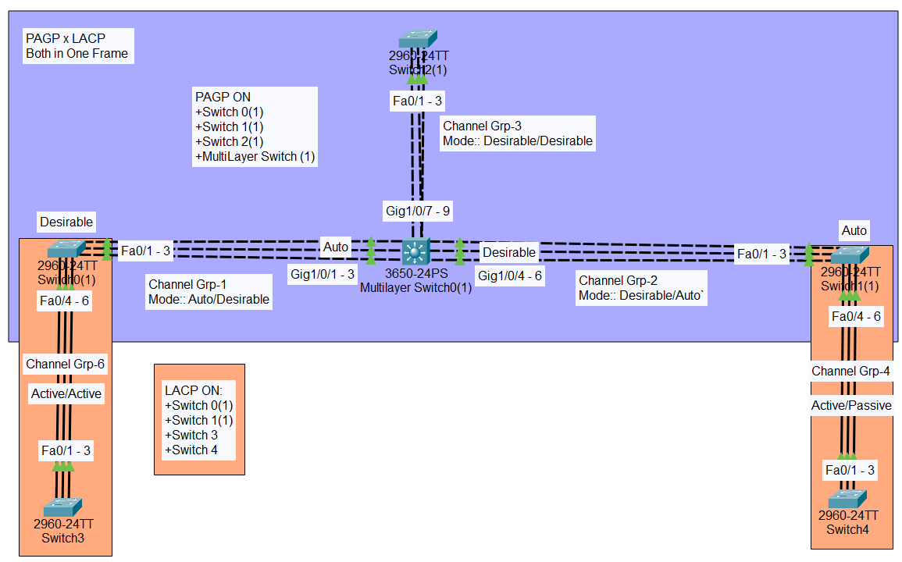
</p>

<div align="center">

| Feature | PAGP | LACP |
|---------|------|------|
| **Vendor** | Cisco proprietary | IEEE standard (universal) |
| **Compatibility** | Cisco devices only | All brands |
| **Modes** | Desirable, Auto, On, Off | Active, Passive, On |
| **Active Mode** | Desirable | Active |
| **Passive Mode** | Auto | Passive |
| **Best Practice** | Desirable + Desirable | Active + Active |
| **Modern Use** | Legacy environments | Recommended for all |
| **Cross-Vendor** | ❌ No | ✅ Yes |

</div>

---

### When to Use Which?

```
Use PAGP when:
✓ 100% Cisco environment
✓ Legacy devices that don't support LACP
✓ Specific Cisco features required

Use LACP when:
✓ Mixed vendor environment (MUST use)
✓ Modern network (recommended)
✓ Industry standard compliance needed
✓ All Cisco (still better choice)

Rule of Thumb: When in doubt, use LACP!
```

---

## ⚙️ ON Mode (Manual Mode)

### Concept

<div align="center">

| Feature | Details |
|---------|---------|
| **Type** | Manual/Static configuration |
| **Protocol Used** | None (no LACP or PAGP) |
| **Negotiation** | No negotiation at all |
| **Setup** | Immediate bundling |
| **Risk** | Configuration mismatch = problems |

</div>

### 🔑 Key Points:

**ON Mode** = Forcefully create EtherChannel WITHOUT any negotiation

#### How It Works:

**Normal LACP/PAGP:**
```
Switch A          Switch B
   |                 |
   |---> "Hello, EtherChannel?" --->|
   |<--- "Yes, let's do it!" <---|
   |                 |
   
EtherChannel formed (negotiation happened)
```

**ON Mode:**
```
Switch A          Switch B
   |                 |
   | (No messages sent) |
   |                 |
   
EtherChannel formed (directly created)
Both switches assume EtherChannel is formed, no confirmation!
```

---

### What Happens in ON Mode?

```
1. No Protocol Used
   └─ LACP or PAGP packets are NOT sent

2. No Negotiation
   └─ Both sides don't check if settings match

3. Immediate Bundling
   └─ Ports bundle instantly

4. Static Configuration
   └─ Manual config, not dynamic

5. Risk
   └─ If configs don't match = Problems!
```

---

### Lab Implementation - ON Mode

#### 📊 Network Topology:

<p align="center">
  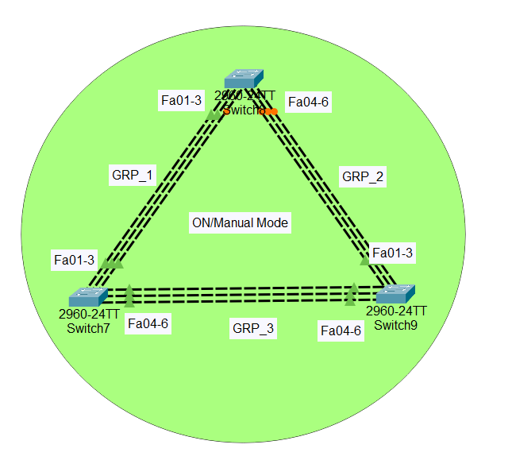
</p>

**Network Design:**
```
3 Switches connected with EtherChannel in ON mode
All switches using manual/static configuration
```

---

### Configuration - ON Mode

#### Switch Configuration (Same for All Switches):

<p align="center">
  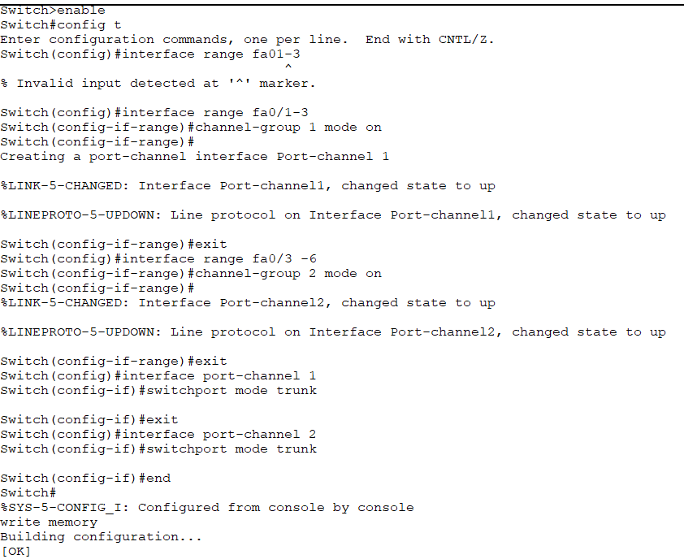
</p>

```cisco
! ON Mode Configuration (Apply on ALL switches)
Switch> enable
Switch# configure terminal
Switch(config)# hostname Switch

! Configure EtherChannel with ON mode
Switch(config)# interface range gigabitEthernet 0/1-2
Switch(config-if-range)# channel-group 1 mode on
Switch(config-if-range)# exit
```

**Explanation:**
```
mode on = Manual/Static mode
No protocol used (no LACP/PAGP)
Immediate bundling without negotiation
```

**Important Note:** 
```
✅ All 3 switches have the SAME configuration
✅ Just repeat the above commands on each switch
✅ No protocol negotiation happens
✅ EtherChannel forms immediately
```

---

### Verification - ON Mode

#### ✅ ON Mode Output (No Protocol):

<p align="center">
  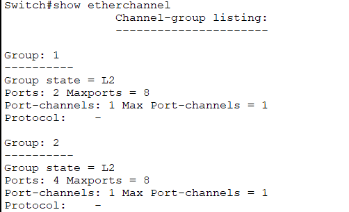
</p>

**Verification Commands:**
```cisco
! Check EtherChannel summary
Switch# show etherchannel summary

! Verify port-channel
Switch# show interface port-channel 1
```

**Expected Result:**
```
✅ EtherChannel formed without any protocol (manual/static mode)
✅ No LACP or PAGP negotiation
✅ Ports bundled directly
```

---

### ON Mode Risks:

```
⚠️ WARNING: Use with caution!

Problem Scenarios:

1. Speed Mismatch:
   Switch A: 1 Gbps links
   Switch B: 100 Mbps links
   Result: EtherChannel unstable ❌

2. VLAN Mismatch:
   Switch A: Ports in VLAN 10
   Switch B: Ports in VLAN 20
   Result: Traffic problems ❌

3. Duplex Mismatch:
   Switch A: Full duplex
   Switch B: Half duplex
   Result: Errors and packet loss ❌

Best Practice:
✓ Ensure exact same config on both sides
✓ Use only in controlled environments
✓ Prefer LACP/PAGP for automatic validation
```

---

## 📝 Quick Reference

### Command Summary

#### PAGP Configuration:
```cisco
! Desirable mode (actively negotiate)
interface range gigabitEthernet 0/1-2
 channel-group 1 mode desirable

! Auto mode (passive, wait for request)
interface range gigabitEthernet 0/1-2
 channel-group 1 mode auto
```

---

#### LACP Configuration:
```cisco
! Active mode (actively negotiate)
interface range gigabitEthernet 0/1-2
 channel-group 1 mode active

! Passive mode (wait for request)
interface range gigabitEthernet 0/1-2
 channel-group 1 mode passive
```

---

#### ON Mode Configuration:
```cisco
! Manual mode (no protocol)
interface range gigabitEthernet 0/1-2
 channel-group 1 mode on
```

---

### Verification Commands

```cisco
! Check EtherChannel summary (shows all port-channels)
show etherchannel summary

! Check specific port-channel interface
show interface port-channel 1

! Check PAGP neighbors and status
show pagp neighbor

! Check LACP neighbors and status
show lacp neighbor

! Detailed EtherChannel information
show etherchannel 1 detail
```

---

### Mode Compatibility Tables

#### PAGP Modes:
| Local Mode | Remote Mode | EtherChannel? |
|------------|-------------|---------------|
| Desirable | Desirable | ✅ Yes |
| Desirable | Auto | ✅ Yes |
| Auto | Auto | ❌ No |
| On | On | ✅ Yes (no PAGP) |
| On | Desirable | ❌ No |
| On | Auto | ❌ No |

#### LACP Modes:
| Local Mode | Remote Mode | EtherChannel? |
|------------|-------------|---------------|
| Active | Active | ✅ Yes |
| Active | Passive | ✅ Yes |
| Passive | Passive | ❌ No |
| On | On | ✅ Yes (no LACP) |
| On | Active | ❌ No |
| On | Passive | ❌ No |

---

### Best Practices

```
Protocol Selection:
├─ Mixed vendors → LACP (MUST)
├─ All Cisco → LACP (recommended)
└─ Legacy only → PAGP (if needed)

Mode Selection:
├─ PAGP → Desirable on both sides
├─ LACP → Active on both sides
└─ ON Mode → Only if you're absolutely sure

Configuration Checklist:
✓ Same speed on all links
✓ Same duplex on all links
✓ Same VLAN configuration
✓ Same spanning-tree settings
✓ Use same protocol on both switches
✓ Don't mix protocols (LACP ≠ PAGP)
✓ Don't mix modes (Active ≠ On)
```

---

### Troubleshooting Tips

**EtherChannel Not Forming:**
```
✓ Check both sides using same protocol
✓ Verify mode compatibility (not Auto + Auto or Passive + Passive)
✓ Ensure same VLAN on all ports
✓ Check speed/duplex match
✓ Verify channel-group number (can be different on each switch)
✓ Check for spanning-tree conflicts
```

**EtherChannel Unstable:**
```
✓ Check for speed mismatch
✓ Verify duplex settings
✓ Look for spanning-tree issues
✓ Check physical cable quality
✓ Verify all ports in same VLAN
✓ Check error counters on interfaces
```

**Protocol Mismatch:**
```
✓ Don't use PAGP on one side, LACP on other
✓ Don't use Active with Desirable
✓ Don't use On with Active/Desirable
✓ Both sides must use SAME protocol
```
---

## 🎓 What I Learned

### PAGP (Port Aggregation Protocol):
✅ Cisco proprietary link aggregation protocol  
✅ Desirable and Auto mode configuration  
✅ Mode combinations and compatibility  
✅ Configuration on all 4 switches (Switch-0, Switch-1, Switch-2, Multi-Layer)  
✅ When to use PAGP vs LACP  

### LACP (Link Aggregation Control Protocol):
✅ IEEE 802.3ad universal standard  
✅ Active and Passive mode configuration  
✅ Cross-vendor compatibility  
✅ Modern industry-standard choice  
✅ Complete verification and output analysis  

### ON Mode (Manual Mode):
✅ Static EtherChannel without protocol  
✅ No negotiation process  
✅ Same configuration on all 3 switches  
✅ Risks and best practices  
✅ When manual mode is appropriate  

### Key Concepts:
✅ Bandwidth aggregation benefits  
✅ Redundancy and failover  
✅ Load balancing across links  
✅ Protocol compatibility requirements  
✅ Mode selection best practices  
✅ Complete verification procedures  

---

## 🚀 How to Use This Repository

1. **Clone the repository:**
   ```bash
   git clone https://github.com/your-username/EtherChannel-Configuration.git
   ```

2. **Understand the protocols:**
   - Review PAGP vs LACP differences
   - Study mode combinations
   - Learn when to use each protocol

3. **Practice configurations:**
   - Start with PAGP (all 4 devices)
   - Progress to LACP (all switches)
   - Test ON mode (3 switches with same config)

4. **Build lab topology:**
   - Configure multiple switches
   - Test different mode combinations
   - Verify EtherChannel formation
   - Analyze verification outputs

---
## 📞 Connect With Me

<div align="center">

[](mailto:a.wahid7860668@gmail.com)
[](https://www.linkedin.com/in/abdul-wahid022)
[](https://github.com/abdul-wahid022)

**💬 Questions? Need Packet Tracer files? Feel free to reach out!**

</div>

---

## 📄 License

This project is created for **educational purposes** and is open-source.

---

<div align="center">

### ⭐ If you found this helpful, please give it a star!

**Made with 💙 by ABDUL WAHID**

*Last Updated: January 2026*

</div>
