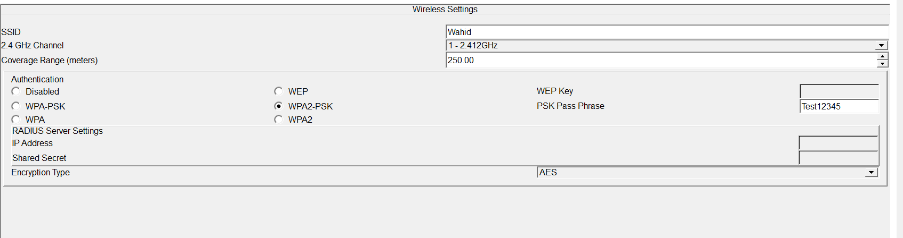
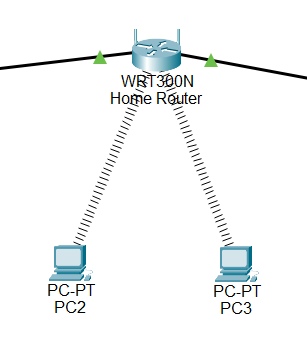
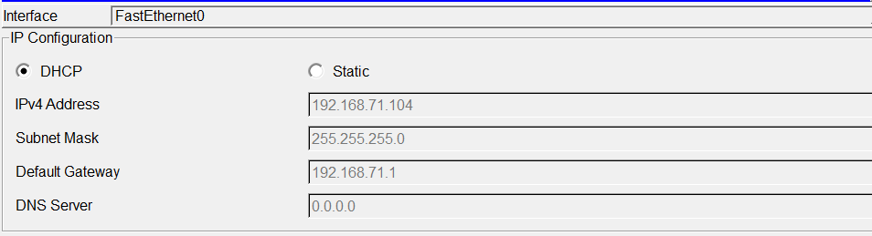
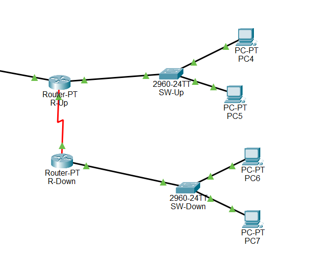
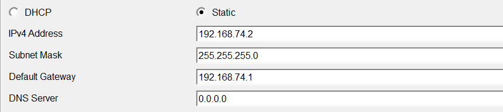
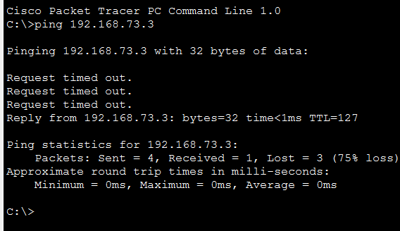

# 📡 Wireless Home Router Implementation

<div align="center">


**Complete Home Network Setup with Wireless & Wired Connectivity**

[](.)
[](.)
[](.)

[📖 Overview](#-overview) • [🏠 Phase 1](#-phase-1---wireless-setup) • [🔌 Phase 2](#-phase-2---wired-left-side) • [🖥️ Phase 3](#️-phase-3---wired-right-side) • [✅ Testing](#-testing)

</div>

---

## 📖 Overview

This lab demonstrates a complete **Home Router** implementation combining wireless and wired networking with both DHCP and static IP addressing.

### Network Architecture:

| Component | Details |
|-----------|---------|
| **Wireless Devices** | 3 PCs (wireless adapters) |
| **Wired Devices** | 4 PCs (static IPs) + 2 PCs (DHCP) |
| **Central Device** | Home Router (wireless + DHCP + routing) |
| **Switch** | 1 switch for wired connectivity |
| **IP Assignment** | Mixed (DHCP + Static) |

### What You'll Learn:

✅ **Home Router Configuration** - Wireless SSID and authentication  
✅ **Wireless Connectivity** - Connecting PCs wirelessly  
✅ **DHCP Server** - Automatic IP assignment  
✅ **Static IP Configuration** - Manual IP addressing  
✅ **Mixed Network** - Wireless + wired in same network  
✅ **End-to-End Testing** - Connectivity verification  

---

## 📚 Table of Contents

- [🌐 Network Topology](#-network-topology)
- [🏠 Phase 1 - Wireless Setup](#-phase-1---wireless-setup)
  - [Home Router Configuration](#home-router-configuration)
  - [Wireless PC Configuration](#wireless-pc-configuration)
  - [Verification](#verification---phase-1)
- [🔌 Phase 2 - Wired Left Side](#-phase-2---wired-left-side)
  - [Switch Connection](#switch-connection)
  - [DHCP Configuration](#dhcp-configuration)
  - [Verification](#verification---phase-2)
- [🖥️ Phase 3 - Wired Right Side](#️-phase-3---wired-right-side)
  - [Static IP Configuration](#static-ip-configuration)
  - [Verification](#verification---phase-3)
- [✅ Testing](#-testing)
- [📝 Quick Reference](#-quick-reference)

---

## 🌐 Network Topology

### Complete Network Design:

<p align="center">
  
</p>

**Network Structure:**
```
                    [Home Router]
                   (SSID: MyWiFi)
                         |
        +----------------+----------------+
        |                |                |
   [Wireless]       [Switch]        [Wired Static]
        |                |                |
   PC0, PC1, PC2    PC3, PC8         PC4-PC7
   (DHCP)           (DHCP)           (Static IPs)
```

**IP Addressing Scheme:**

| Device | IP Address | Assignment Type |
|--------|------------|-----------------|
| **Home Router** | 192.168.0.1 | Default gateway |
| **PC0 (Wireless)** | DHCP | Automatic |
| **PC1 (Wireless)** | DHCP | Automatic |
| **PC2 (Wireless)** | DHCP | Automatic |
| **PC3 (Switch)** | DHCP | Automatic |
| **PC8 (Switch)** | DHCP | Automatic |
| **PC4** | 192.168.0.4/24 | Static |
| **PC5** | 192.168.0.5/24 | Static |
| **PC6** | 192.168.0.6/24 | Static |
| **PC7** | 192.168.0.7/24 | Static |

---

## 🏠 Phase 1 - Wireless Setup

### Objective:
```
Configure home router with wireless SSID and authentication
Connect 3 PCs wirelessly to the home router
```

---

### Home Router Configuration

#### Configure Wireless SSID and Authentication

<p align="center">
  
</p>

**In Packet Tracer:**
```
1. Click on Home Router
2. Go to Config tab
3. Select Wireless section
```

**Configuration:**
```
SSID Name: MyWiFi
Authentication Type: WPA2-PSK
Passphrase: YourPassword123
Encryption: AES
```

**Settings Applied:**
```
SSID: MyWiFi
SSID Broadcast: Enabled
Security: WPA2-PSK
Password: YourPassword123
Channel: Auto (or choose 1, 6, 11)
```

**Why WPA2-PSK?**
```
✅ Strong encryption (AES)
✅ Easy to configure
✅ Secure for home use
✅ Compatible with all modern devices
```

---

### Wireless PC Configuration

#### Connect PCs Wirelessly to Home Router

<p align="center">
  
</p>

**For each wireless PC (PC0, PC1, PC2):**

**Step 1: Add Wireless Adapter**
```
1. Click on PC
2. Physical tab
3. Turn OFF PC (power button)
4. Remove Ethernet module (drag out)
5. Add WPC300N wireless module (drag in)
6. Turn ON PC
```

**Step 2: Connect to WiFi**
```
1. Go to Desktop tab
2. Click PC Wireless
3. Click on "Connect" tab
4. Refresh to see available networks
5. Select "MyWiFi" from list
6. Enter passphrase: YourPassword123
7. Click Connect
```

**Step 3: DHCP IP Assignment**
```
1. Go to Desktop → IP Configuration
2. Select DHCP
3. Wait for automatic IP assignment
4. Verify IP received from router
```

**Expected Result:**
```
✅ All 3 PCs connected to "MyWiFi"
✅ Signal strength indicator visible
✅ IP addresses assigned by DHCP
IP Address: 192.168.0.x (automatic)
Subnet Mask: 255.255.255.0
Default Gateway: 192.168.0.1
```

---

## 🔌 Phase 2 - Wired Left Side

### Objective:
```
Connect 2 PCs via switch to home router
Configure DHCP for automatic IP assignment
```

---

### Switch Connection and Topology

<p align="center">
  
</p>

**Physical Connections:**
```
Home Router (Ethernet Port)
        |
        | (Straight-through cable)
        |
     Switch
        |
    +---+---+
    |       |
   PC3     PC8
```

---

### DHCP Configuration

#### PCs Receiving DHCP from Home Router

<p align="center">
  
</p>

**Configure PC3 and PC8:**
```
1. Click PC3 (or PC8)
2. Desktop → IP Configuration
3. Select DHCP
4. Wait for IP assignment

Received from Router:
IP Address: 192.168.0.x (automatic)
Subnet Mask: 255.255.255.0
Default Gateway: 192.168.0.1
DNS Server: 192.168.0.1
```

**Verification:**
```
✅ PC3 received IP via DHCP
✅ PC8 received IP via DHCP
✅ Both PCs can ping home router (192.168.0.1)
✅ Both PCs can ping each other
✅ Both PCs can ping wireless devices
```

---

## 🖥️ Phase 3 - Wired Right Side

### Objective:
```
Connect 4 PCs directly to home router
Configure static IP addresses manually
```

---

### Right Side Topology

<p align="center">
  
</p>

**Physical Connections:**
```
         [Home Router]
              |
    +---------+---------+---------+
    |         |         |         |
   PC4       PC5       PC6       PC7
```

---

### Static IP Configuration

#### Assigning Static IPs to PC4-PC7

<p align="center">
  
</p>

**Manual IP Assignment for Each PC:**

**PC4 Configuration:**
```
1. Click PC4
2. Desktop → IP Configuration
3. Select Static
4. Enter:
   IP Address: 192.168.0.4
   Subnet Mask: 255.255.255.0
   Default Gateway: 192.168.0.1
```

**PC5 Configuration:**
```
IP Address: 192.168.0.5
Subnet Mask: 255.255.255.0
Default Gateway: 192.168.0.1
```

**PC6 Configuration:**
```
IP Address: 192.168.0.6
Subnet Mask: 255.255.255.0
Default Gateway: 192.168.0.1
```

**PC7 Configuration:**
```
IP Address: 192.168.0.7
Subnet Mask: 255.255.255.0
Default Gateway: 192.168.0.1
```

**Verification:**
```
✅ PC4: 192.168.0.4 configured
✅ PC5: 192.168.0.5 configured
✅ PC6: 192.168.0.6 configured
✅ PC7: 192.168.0.7 configured
✅ All can ping home router (192.168.0.1)
✅ All can ping each other
```

---

## ✅ Testing

### End-to-End Connectivity Test

#### Ping from PC1 (Wireless) to PC4 (Wired Static)

<p align="center">
  
</p>

**Test Scenario:**
```
Source: PC1 (Wireless, DHCP, Left side)
Destination: PC4 (Wired, Static IP, Right side)
```

**Test Procedure:**
```
1. Click PC1 (wireless device)
2. Desktop → Command Prompt
3. Type: ping 192.168.0.4
4. Press Enter
```

**Expected Result:**
```
Pinging 192.168.0.4 with 32 bytes of data:

Reply from 192.168.0.4: bytes=32 time<1ms TTL=128
Reply from 192.168.0.4: bytes=32 time<1ms TTL=128
Reply from 192.168.0.4: bytes=32 time<1ms TTL=128
Reply from 192.168.0.4: bytes=32 time<1ms TTL=128

Ping statistics for 192.168.0.4:
    Packets: Sent = 4, Received = 4, Lost = 0 (0% loss)
    
✅ SUCCESS! Wireless to Wired communication working!
```

---

### Comprehensive Testing Matrix

**Test all connectivity paths:**

<div align="center">

| From | To | Result |
|------|-----|--------|
| **PC1 (Wireless)** | PC4 (Static) | ✅ Success |
| **PC1 (Wireless)** | PC3 (DHCP) | ✅ Success |
| **PC3 (DHCP)** | PC4 (Static) | ✅ Success |
| **PC4 (Static)** | PC5 (Static) | ✅ Success |
| **Any PC** | 192.168.0.1 (Router) | ✅ Success |

</div>

**Why This Works:**
```
1. All devices on same network (192.168.0.0/24)
2. Home router acts as central gateway
3. Wireless and wired segments bridged by router
4. DHCP and static IPs coexist peacefully
5. Router handles all routing decisions
```

---

## 📝 Quick Reference

### Configuration Summary

**Home Router:**
```
Wireless SSID: MyWiFi
Authentication: WPA2-PSK
Passphrase: YourPassword123
DHCP Server: Enabled
DHCP Range: 192.168.0.100-150 (automatic)
Gateway: 192.168.0.1
```

**Wireless Devices (DHCP):**
```
PC0: 192.168.0.x (DHCP)
PC1: 192.168.0.x (DHCP)
PC2: 192.168.0.x (DHCP)
```

**Wired Devices via Switch (DHCP):**
```
PC3: 192.168.0.x (DHCP)
PC8: 192.168.0.x (DHCP)
```

**Wired Devices Direct (Static):**
```
PC4: 192.168.0.4
PC5: 192.168.0.5
PC6: 192.168.0.6
PC7: 192.168.0.7
Gateway: 192.168.0.1
```

---

### Command Reference

**DHCP Configuration:**
```
1. Desktop → IP Configuration
2. Select: DHCP
3. Wait for automatic assignment
```

**Static IP Configuration:**
```
1. Desktop → IP Configuration
2. Select: Static
3. Enter:
   - IP Address
   - Subnet Mask
   - Default Gateway
```

**Testing Commands:**
```
Command Prompt:

ping [IP] - Test connectivity
ipconfig - Show IP configuration
arp -a - Show ARP table
```

---

### Troubleshooting Guide

**Issue 1: Wireless PC can't connect**
```
Problem: Can't see WiFi network
Fix:
✓ Check SSID broadcast enabled
✓ Verify wireless adapter installed
✓ Check PC is powered on
✓ Refresh available networks
```

**Issue 2: Wrong password error**
```
Problem: Authentication failed
Fix:
✓ Verify passphrase matches router config
✓ Check for typos (case-sensitive)
✓ Ensure WPA2-PSK is configured
```

**Issue 3: No IP address via DHCP**
```
Problem: DHCP not working
Fix:
✓ Check DHCP server enabled on router
✓ Verify cable connections
✓ Try releasing/renewing IP
✓ Check DHCP pool not exhausted
```

**Issue 4: Can't ping other devices**
```
Problem: Connectivity issues
Fix:
✓ Verify all devices on same network (192.168.0.x)
✓ Check subnet mask is 255.255.255.0
✓ Verify default gateway is 192.168.0.1
✓ Check firewall settings
```

**Issue 5: Static IP conflict**
```
Problem: IP address already in use
Fix:
✓ Use IPs outside DHCP range
✓ Check for duplicate IPs
✓ Document static IP assignments
✓ Recommended: Use .4-.50 for static
```

---

### Best Practices

**Wireless Security:**
```
✓ Always use WPA2-PSK or better
✓ Strong passphrase (12+ characters)
✓ Change default SSID
✓ Disable SSID broadcast for hidden networks (optional)
✓ Use MAC filtering for additional security (optional)
```

**IP Address Management:**
```
✓ Reserve low IPs (.2-.50) for static devices
✓ Let DHCP use higher range (.100+)
✓ Document all static IP assignments
✓ Keep consistent subnet mask (255.255.255.0)
✓ Always configure default gateway
```

**Physical Setup:**
```
✓ Place router centrally for WiFi coverage
✓ Use straight-through cables for PC-Switch-Router
✓ Label cables for easy troubleshooting
✓ Keep wireless devices within range
✓ Minimize interference (walls, metal objects)
```

**Testing:**
```
✓ Test connectivity after each phase
✓ Verify wireless before adding wired
✓ Ping router first, then other devices
✓ Test from multiple sources
✓ Document working configuration
```

---

### Network Design Tips

**For Home Networks:**
```
Wireless:
- SSID: Friendly name (avoid personal info)
- Security: WPA2-PSK minimum
- Channel: 1, 6, or 11 (2.4GHz) or Auto

IP Scheme:
- Router: 192.168.0.1 or 192.168.1.1
- DHCP: 192.168.0.100-254
- Static: 192.168.0.2-99
```

**For Small Office:**
```
Separate VLANs (if supported):
- Guest WiFi: Separate SSID
- Employee devices: DHCP
- Servers/Printers: Static IPs
- IoT devices: Separate network
```

---

**Total Images: 9**

---

---

## 🎓 What I Learned

### Wireless Networking:
✅ **Home Router Configuration** - SSID and authentication setup  
✅ **WPA2-PSK Security** - Secure wireless authentication  
✅ **Wireless Adapter** - Installing and configuring wireless modules  
✅ **WiFi Connectivity** - Connecting devices to wireless network  
✅ **Signal Strength** - Understanding wireless range  

### DHCP Configuration:
✅ **DHCP Server** - Automatic IP assignment from router  
✅ **Dynamic IPs** - How DHCP allocates IP addresses  
✅ **DHCP Pools** - IP address ranges for automatic assignment  
✅ **Gateway Configuration** - Router as default gateway  

### Static IP Configuration:
✅ **Manual IP Assignment** - Configuring static IPs  
✅ **IP Address Planning** - Separating static from DHCP range  
✅ **Subnet Mask** - Understanding /24 networks  
✅ **Default Gateway** - Routing to other networks  

### Mixed Network Design:
✅ **Hybrid Network** - Combining wireless and wired  
✅ **Multiple IP Methods** - DHCP and static coexisting  
✅ **Network Segmentation** - Logical separation of devices  
✅ **Inter-segment Communication** - Routing between segments  

### Testing & Verification:
✅ **End-to-End Testing** - Verifying complete connectivity  
✅ **Ping Command** - Testing network reachability  
✅ **Troubleshooting** - Identifying and fixing issues  
✅ **Documentation** - Recording network configuration  

---

## 🚀 How to Use This Repository

1. **Clone the repository:**
   ```bash
   git clone https://github.com/your-username/Wireless-Home-Router-Lab.git
   ```

2. **Study the phases:**
   - Phase 1: Wireless setup and authentication
   - Phase 2: Wired devices with DHCP
   - Phase 3: Static IP configuration

3. **Practice in Packet Tracer:**
   - Build topology from scratch
   - Configure wireless settings
   - Test DHCP functionality
   - Assign static IPs

4. **Test connectivity:**
   - Ping between wireless devices
   - Ping between wired devices
   - Cross-segment testing
   - Document results

5. **Troubleshoot:**
   - Practice common issues
   - Learn recovery procedures
   - Build troubleshooting skills

---


## 📞 Connect With Me

<div align="center">

[](mailto:a.wahid7860668@gmail.com)

[](https://www.linkedin.com/in/abdul-wahid022)

[](https://github.com/abdul-wahid022)

**💬 Questions? Need Packet Tracer files? Feel free to reach out!**

</div>

---

## 📄 License

This project is created for **educational purposes** and is open-source.

---

<div align="center">

### ⭐ If you found this helpful, please give it a star!

**Made with ❤️ by ABDUL WAHID**

*Last Updated: January 2026*

</div>
