# 🔒 Port Security & Unused Ports - Complete Guide

<div align="center">


**MAC Address Filtering and Unused Port Protection**

[](.)
[](.)
[](.)

[📖 Overview](#-overview) • [🔐 Port Security](#-port-security) • [🚫 Unused Ports](#-securing-unused-ports) • [🔧 Lab Implementation](#-lab-implementation)

</div>

---

## 📖 Overview

**Port Security** restricts which devices can connect to switch ports based on MAC addresses, while **Unused Port Security** prevents unauthorized access through inactive ports.

### What You'll Learn:

| Feature | Purpose | Protection Method | Use Case |
|---------|---------|-------------------|----------|
| **Port Security** | Control device access | MAC address filtering | Active ports |
| **Sticky MAC** | Auto-learn MACs | Dynamic + persistent | End user ports |
| **Manual MAC** | Specific device only | Static configuration | Critical devices |
| **Unused Ports** | Block inactive ports | VLAN isolation + shutdown | Empty ports |

### Key Security Benefits:

✅ **Prevent Unauthorized Access** - Only allowed devices can connect  
✅ **Stop MAC Flooding** - Protect against switch table overflow  
✅ **Prevent Device Theft** - Stolen device cannot reconnect  
✅ **Secure Unused Ports** - No entry point for attackers  
✅ **Violation Detection** - Alert on security breaches  

---

## 📚 Table of Contents

- [🔐 Port Security](#-port-security)
  - [What is Port Security](#what-is-port-security)
  - [Why Needed](#why-is-port-security-needed)
  - [Components](#port-security-components)
  - [Violation Modes](#violation-modes)
  - [MAC Address Types](#mac-address-types)
  - [Configuration](#port-security-configuration)
  - [Lab Implementation](#lab-implementation---port-security)
- [🚫 Securing Unused Ports](#-securing-unused-ports)
  - [The Problem](#the-problem)
  - [Solution](#solution---vlan-999-isolation)
  - [Configuration](#unused-ports-configuration)
  - [Lab Implementation](#lab-implementation---unused-ports)
- [📝 Quick Reference](#-quick-reference)

---

## 🔐 Port Security

### What is Port Security?

**Port Security** allows only authorized devices to connect to a switch port based on MAC addresses.

### Real-Life Analogy - Office Door Lock:

```
Think of port security like an office door with badge access:

Regular Door (No Security):
└─ Anyone can enter ❌

Badge-Protected Door (Port Security):
└─ Only employees with valid badge can enter ✓

MAC Address = Employee Badge
Port = Door
Authorized MAC = Valid Badge
```

---

### Why is Port Security Needed?

**1. Prevent Unauthorized Access**
```
Problem: Employee brings personal laptop and plugs into network
Without Port Security: Laptop gets access ❌
With Port Security: Port blocks unauthorized device ✓
```

**2. Prevent MAC Flooding Attack**
```
Attack: Attacker floods switch with fake MAC addresses
Result: Switch table full, becomes a hub (broadcasts everything)

Port Security: Limits MAC addresses per port ✓
```

**3. Prevent Device Theft**
```
Scenario: Laptop stolen from desk
Without Port Security: Thief plugs in stolen laptop elsewhere ❌
With Port Security: Laptop cannot reconnect (wrong port) ✓
```

---

### Port Security Components

Port Security defines **3 key elements:**

#### 1. Maximum MAC Addresses

**How many devices can connect to this port?**

```
Example:
Maximum 1 = Only one device allowed
Maximum 2 = Two devices can connect (useful for IP phones)
Maximum 3 = Three devices allowed
```

**Configuration:**
```cisco
switchport port-security maximum 2
```

---

#### 2. Secure MAC Addresses

**Which MAC addresses are allowed?**

Three types available (explained in next section):
- Static (Manual)
- Dynamic (Auto-learn, temporary)
- Sticky (Auto-learn, permanent)

---

#### 3. Violation Action

**What happens if unauthorized device connects?**

Three modes available (explained in Violation Modes section):
- Shutdown (Default - most secure)
- Restrict (Drop packets + alert)
- Protect (Drop packets silently)

---

## Violation Modes

### Understanding the Three Modes:

<div align="center">

| Mode | Port State | Packets | Alert/Log | SNMP Trap | Counter | Severity |
|------|-----------|---------|-----------|-----------|---------|----------|
| **Shutdown** | Err-disabled | Dropped | Yes | Yes | Yes | Highest ⚠️ |
| **Restrict** | Up | Dropped | Yes | Yes | Yes | Medium ⚠️ |
| **Protect** | Up | Dropped | No | No | No | Low ⚠️ |

</div>

---

### 1. Shutdown Mode (Default - Most Secure)

**What happens:**
```
Unauthorized MAC connects
     ↓
Port immediately shuts down (err-disabled)
     ↓
Port LED turns amber/orange
     ↓
SNMP trap sent
     ↓
Syslog message logged
     ↓
Administrator must manually recover port
```

**Recovery:**
```cisco
! Manual recovery
Switch(config)# interface fastEthernet 0/5
Switch(config-if)# shutdown
Switch(config-if)# no shutdown
Switch(config-if)# exit
```

**When to use:**
```
✓ Critical ports (server connections)
✓ High-security environments
✓ Where unauthorized access must be prevented
✓ When immediate alert needed
```

---

### 2. Restrict Mode

**What happens:**
```
Unauthorized MAC connects
     ↓
Port stays UP
     ↓
Unauthorized packets DROPPED
     ↓
Authorized device continues working
     ↓
SNMP trap + Syslog message sent
     ↓
Violation counter increases
```

**When to use:**
```
✓ Shared ports (IP phone + PC)
✓ Where port shutdown is too disruptive
✓ Need to monitor violations without downtime
✓ Business-critical ports
```

---

### 3. Protect Mode

**What happens:**
```
Unauthorized MAC connects
     ↓
Port stays UP
     ↓
Unauthorized packets DROPPED (silently)
     ↓
NO alerts, NO logs, NO SNMP
     ↓
Authorized device continues working
     ↓
Attacker doesn't know they're blocked
```

**When to use:**
```
✓ Don't want to alert attacker
✓ Silent security monitoring
✓ High-traffic environments (avoid log spam)
✓ Least disruptive option
```

---

### Comparison Example:

**Scenario: 3 PCs try to connect to a port with maximum 1 MAC allowed**

```
Shutdown Mode:
PC1 connects → Allowed ✓
PC2 connects → Port shuts down ❌ (err-disabled)
Result: Nobody can use port until admin fixes it

Restrict Mode:
PC1 connects → Allowed ✓
PC2 connects → PC2 blocked, PC1 still works ✓
Result: Alert sent, but PC1 continues working

Protect Mode:
PC1 connects → Allowed ✓
PC2 connects → PC2 blocked silently, PC1 works ✓
Result: No alert, attacker doesn't know
```

---

## MAC Address Types

### 1. Static MAC (Manual Configuration)

**What it is:**
```
Administrator manually configures specific MAC address
MAC is saved in running-config
Survives reboot (if saved)
```

**Configuration:**
```cisco
Switch(config-if)# switchport port-security mac-address aaaa.bbbb.cccc
```

**When to use:**
```
✓ Critical servers
✓ Specific workstations
✓ Network printers
✓ When you know exact device MAC
```

**Example:**
```
CEO's computer:
MAC: 0011.2233.4455
Port: Fa0/10

Configuration:
interface fastEthernet 0/10
 switchport port-security mac-address 0011.2233.4455
 
Only CEO's computer can connect to Fa0/10 ✓
```

---

### 2. Dynamic MAC (Auto-learn, Temporary)

**What it is:**
```
Switch automatically learns first connected device's MAC
MAC stored in memory (NOT in running-config)
Lost after reboot ❌
```

**Configuration:**
```cisco
! Just enable port security (default behavior)
Switch(config-if)# switchport port-security
```

**When to use:**
```
✓ Testing environments
✓ Temporary setups
✓ When device MAC changes frequently
✗ NOT for production (lost on reboot)
```

**Behavior:**
```
Port Fa0/5 (no MAC configured):
First device (MAC: AA:BB:CC) connects
     ↓
Switch learns: AA:BB:CC is allowed
     ↓
Second device (MAC: 11:22:33) tries
     ↓
Violation! Only AA:BB:CC allowed
     ↓
Switch reboots
     ↓
All dynamic MACs forgotten ❌
```

---

### 3. Sticky MAC (Auto-learn, Permanent) ⭐ **BEST OPTION**

**What it is:**
```
Switch automatically learns MAC (like dynamic)
BUT saves it to running-config (like static)
Survives reboot ✓
```

**Configuration:**
```cisco
Switch(config-if)# switchport port-security mac-address sticky
```

**Why Sticky is Best:**
```
✓ No manual MAC entry needed (automatic)
✓ Saved in config (survives reboot)
✓ Best of both worlds!
✓ Recommended for production
```

**Behavior:**
```
Port Fa0/5 with sticky MAC:
First device (MAC: AA:BB:CC) connects
     ↓
Switch learns: AA:BB:CC
     ↓
Automatically adds to running-config:
"switchport port-security mac-address sticky AA:BB:CC"
     ↓
Switch reboots
     ↓
MAC still remembered ✓
```

---

### Comparison Table:

<div align="center">

| Feature | Static | Dynamic | Sticky |
|---------|--------|---------|--------|
| **Configuration** | Manual | Automatic | Automatic |
| **Saved in config** | Yes | No | Yes |
| **Survives reboot** | Yes | No | Yes |
| **Flexibility** | Low | High | Medium |
| **Production use** | Yes | No | **Yes ⭐** |
| **Best for** | Known devices | Testing | General use |

</div>

---

## Port Security Configuration

### Basic Port Security Setup

```cisco
! Step 1: Enter interface
Switch(config)# interface fastEthernet 0/5

! Step 2: Set port to access mode
Switch(config-if)# switchport mode access

! Step 3: Enable port security
Switch(config-if)# switchport port-security

! Step 4: Set maximum MAC addresses (default = 1)
Switch(config-if)# switchport port-security maximum 2

! Step 5: Set violation mode (default = shutdown)
Switch(config-if)# switchport port-security violation shutdown

! Step 6: Exit
Switch(config-if)# exit
```

---

### Sticky MAC Configuration (Recommended)

```cisco
Switch(config)# interface fastEthernet 0/5
Switch(config-if)# switchport mode access
Switch(config-if)# switchport port-security
Switch(config-if)# switchport port-security mac-address sticky
Switch(config-if)# switchport port-security maximum 1
Switch(config-if)# switchport port-security violation shutdown
Switch(config-if)# exit
```

**What happens:**
```
First device connects
     ↓
MAC automatically learned and saved
     ↓
running-config shows:
"switchport port-security mac-address sticky AA:BB:CC:DD:EE:FF"
```

---

### Static MAC Configuration

```cisco
Switch(config)# interface fastEthernet 0/5
Switch(config-if)# switchport mode access
Switch(config-if)# switchport port-security
Switch(config-if)# switchport port-security mac-address 0011.2233.4455
Switch(config-if)# switchport port-security maximum 1
Switch(config-if)# switchport port-security violation restrict
Switch(config-if)# exit
```

---

### Multiple Ports Configuration

```cisco
! Apply to multiple ports at once
Switch(config)# interface range fastEthernet 0/5-24
Switch(config-if-range)# switchport mode access
Switch(config-if-range)# switchport port-security
Switch(config-if-range)# switchport port-security maximum 1
Switch(config-if-range)# switchport port-security violation restrict
Switch(config-if-range)# switchport port-security mac-address sticky
Switch(config-if-range)# exit
```

---

## Lab Implementation - Port Security

### Network Topology

<p align="center">
  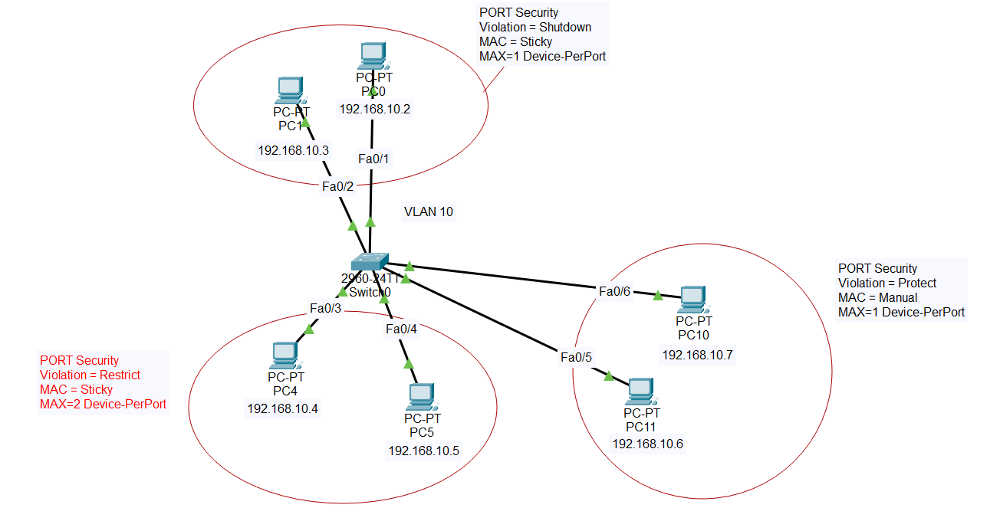
</p>

**Network Setup:**
```
Switch with 6 configured ports:
├─ Fa0/1-2: Dynamic MAC (auto-learn)
├─ Fa0/3-4: Sticky MAC (recommended)
├─ Fa0/5-6: Static MAC (manual)
└─ Multiple PCs for testing
```

---

### Configuration - Ports Fa0/1-2 (Dynamic MAC)

<p align="center">
  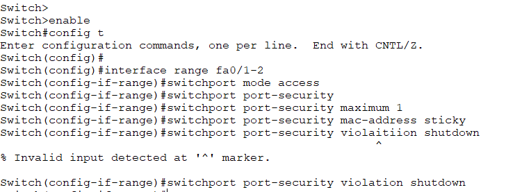
</p>

**Dynamic MAC Configuration:**

```cisco
! Configure Fa0/1
Switch(config)# interface fastEthernet 0/1
Switch(config-if)# switchport mode access
Switch(config-if)# switchport port-security
Switch(config-if)# switchport port-security maximum 1
Switch(config-if)# switchport port-security violation shutdown
Switch(config-if)# exit

! Configure Fa0/2 (same as Fa0/1)
Switch(config)# interface fastEthernet 0/2
Switch(config-if)# switchport mode access
Switch(config-if)# switchport port-security
Switch(config-if)# switchport port-security maximum 1
Switch(config-if)# switchport port-security violation shutdown
Switch(config-if)# exit
```

**Behavior:**
```
First device connects → MAC learned (temporary)
Reboot → MAC forgotten ❌
Use case: Testing or lab environment
```

---

### Configuration - Ports Fa0/3-4 (Sticky MAC)

<p align="center">
  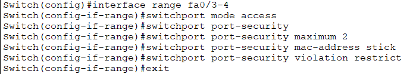
</p>

**Sticky MAC Configuration:**

```cisco
! Configure Fa0/3
Switch(config)# interface fastEthernet 0/3
Switch(config-if)# switchport mode access
Switch(config-if)# switchport port-security
Switch(config-if)# switchport port-security mac-address sticky
Switch(config-if)# switchport port-security maximum 1
Switch(config-if)# switchport port-security violation restrict
Switch(config-if)# exit

! Configure Fa0/4 (same as Fa0/3)
Switch(config)# interface fastEthernet 0/4
Switch(config-if)# switchport mode access
Switch(config-if)# switchport port-security
Switch(config-if)# switchport port-security mac-address sticky
Switch(config-if)# switchport port-security maximum 1
Switch(config-if)# switchport port-security violation restrict
Switch(config-if)# exit
```

**Behavior:**
```
Device connects → MAC learned automatically
MAC saved to running-config ✓
Reboot → MAC still present ✓
Use case: Production environment (recommended!)
```

---

### Check PC MAC Address for Manual Setup

<p align="center">
  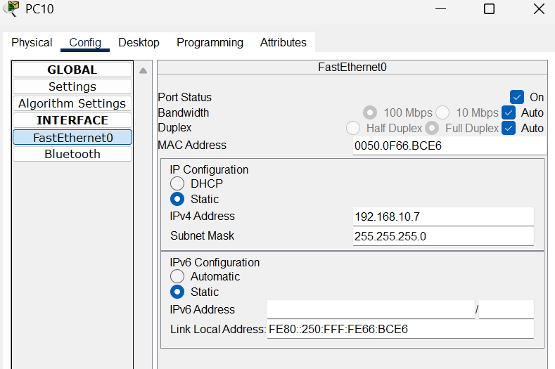
</p>

**Find MAC Address on PC:**

```
Method 1: Using PC GUI
1. Click on PC10
2. Go to Desktop
3. Click "Command Prompt"
4. Type: ipconfig /all
5. Note the "Physical Address" (MAC address)

Example Output:
Physical Address: 0060.5C12.3456
```

**Why check MAC?**
```
For static MAC configuration on Fa0/5-6
We need exact MAC address of PC10
```

---

### Configuration - Ports Fa0/5-6 (Static MAC)

<p align="center">
  
</p>

**Static MAC Configuration:**

```cisco
! Configure Fa0/5 (using PC10's MAC)
Switch(config)# interface fastEthernet 0/5
Switch(config-if)# switchport mode access
Switch(config-if)# switchport port-security
Switch(config-if)# switchport port-security mac-address 0060.5C12.3456
Switch(config-if)# switchport port-security maximum 1
Switch(config-if)# switchport port-security violation protect
Switch(config-if)# exit

! Configure Fa0/6 (using another PC's MAC)
Switch(config)# interface fastEthernet 0/6
Switch(config-if)# switchport mode access
Switch(config-if)# switchport port-security
Switch(config-if)# switchport port-security mac-address 0060.7A45.6789
Switch(config-if)# switchport port-security maximum 1
Switch(config-if)# switchport port-security violation protect
Switch(config-if)# exit
```

**Behavior:**
```
Only PC10 (MAC: 0060.5C12.3456) can use Fa0/5 ✓
Any other device → Violation (protect mode = silent drop)
Use case: Critical devices, servers, specific workstations
```

---

### Verification - Port Security Status

<p align="center">
  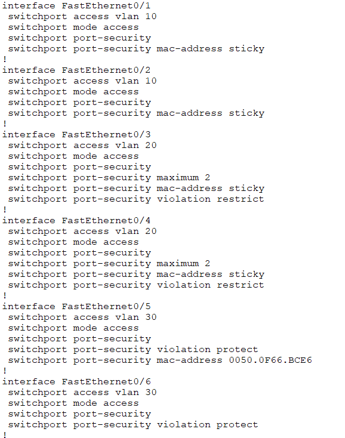
</p>

**Verification Commands:**

```cisco
! Check port security status on all ports
Switch# show port-security

! Check specific interface
Switch# show port-security interface fastEthernet 0/5

! View all secure MAC addresses
Switch# show port-security address
```

---

### Verification Output - Port Security Status

<p align="center">
  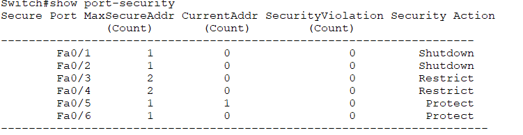
</p>

**Expected Output:**
```
Port Security              : Enabled
Port Status                : Secure-up
Violation Mode             : Shutdown/Restrict/Protect
Maximum MAC Addresses      : 1
Total MAC Addresses        : 1
Configured MAC Addresses   : 0 (dynamic) or 1 (static/sticky)
Sticky MAC Addresses       : 1 (if sticky configured)
Security Violation Count   : 0
```

**Status Meanings:**

```
Secure-up
└─ Port is up and secure ✓

Secure-down
└─ Port is down (cable disconnected)

Secure-shutdown (err-disabled)
└─ Port shut down due to violation ❌
```

---

### Testing - Imposter Connection

**Scenario: Unauthorized device tries to connect**

```
Port Fa0/5 configured:
├─ Static MAC: 0060.5C12.3456 (PC10 only)
├─ Maximum: 1
└─ Violation: Protect

Imposter PC (MAC: 1234.5678.9ABC) connects to Fa0/5:
     ↓
Switch checks: Is MAC 1234.5678.9ABC allowed?
     ↓
NO! Only 0060.5C12.3456 is authorized
     ↓
Violation mode = Protect
     ↓
Imposter packets silently dropped ✗
     ↓
No network access for imposter
     ↓
No alert (protect mode is silent)
```

**Result:** ✅ Imposter cannot send packets, network protected!

---

## 🚫 Securing Unused Ports

### The Problem

<p align="center">
  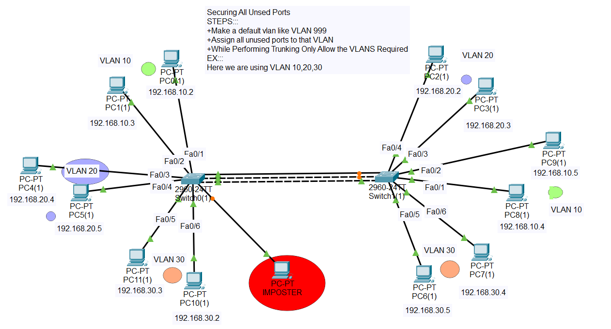
</p>

**Security Risk:**

```
Network Status:
├─ 24 total switch ports
├─ Only 6 ports in use (Fa0/1-6)
└─ 18 ports unused (Fa0/7-24)

Problem:
Unused port = Entry point for attacker! 🚨

Attack Scenario:
1. Attacker enters building
2. Finds unused network port (Fa0/15)
3. Plugs in laptop
4. Gets network access ❌
5. Can attack internal systems
```

---

### Current Switch Status

<p align="center">
  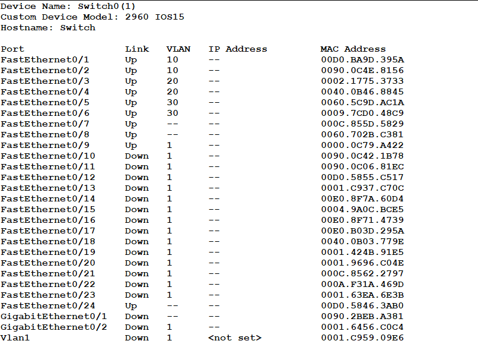
</p>

**Switch Information:**
```
Show VLAN Brief:

VLAN 1 (default):
├─ Fa0/1 - Active
├─ Fa0/2 - Active
├─ Fa0/3 - Active
├─ ...
├─ Fa0/7 - Down (unused) ⚠️
├─ Fa0/8 - Down (unused) ⚠️
├─ ...
└─ Fa0/24 - Down (unused) ⚠️

All ports in VLAN 1 = Security risk!
```

---

### Solution - VLAN 999 Isolation

**Best Practice: Move unused ports to isolated VLAN**

#### Why VLAN 999?

```
VLAN 999 = "Parking VLAN" or "Blackhole VLAN"

Benefits:
✓ Isolated from production VLANs
✓ No routing to other VLANs
✓ Not allowed on trunk ports
✓ Industry standard practice
✓ Easy to identify unused ports
```

---

### Unused Ports Configuration

<p align="center">
  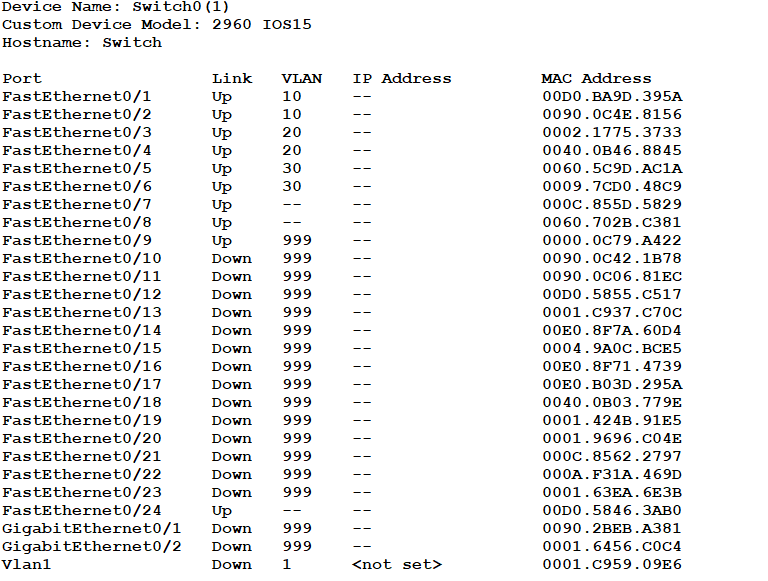
</p>

**Step-by-Step Configuration:**

```cisco
! Step 1: Create VLAN 999 (parking VLAN)
Switch(config)# vlan 999
Switch(config-vlan)# name UNUSED-PORTS
Switch(config-vlan)# exit

! Step 2: Assign unused ports to VLAN 999
Switch(config)# interface range fastEthernet 0/7-24
Switch(config-if-range)# description Unused Ports - Secured
Switch(config-if-range)# switchport mode access
Switch(config-if-range)# switchport access vlan 999
Switch(config-if-range)# shutdown
Switch(config-if-range)# exit

! Step 3: Save configuration
Switch(config)# exit
Switch# write memory
```

**What each command does:**

```
vlan 999
└─ Create parking VLAN

switchport access vlan 999
└─ Move ports to isolated VLAN

shutdown
└─ Administratively disable ports (double protection!)
```

---

### Trunk Configuration - Block VLAN 999

<p align="center">
  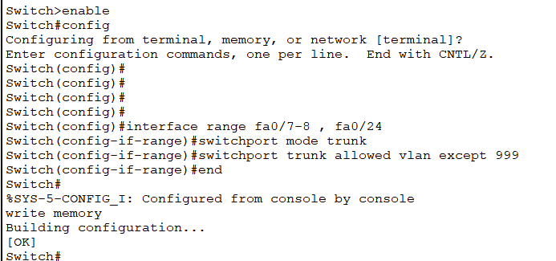
</p>

**Configure Trunk Ports:**

```cisco
! Configure trunk to NOT allow VLAN 999
Switch(config)# interface gigabitEthernet 0/1
Switch(config-if)# description Trunk to Core Switch
Switch(config-if)# switchport mode trunk
Switch(config-if)# switchport trunk allowed vlan 10,20,30
Switch(config-if)# exit
```

**Why exclude VLAN 999?**

```
Production VLANs: 10, 20, 30 (allowed on trunk)
VLAN 999: Unused ports (NOT allowed)

Result:
Even if attacker activates port in VLAN 999,
traffic won't pass through trunk! ✓
```

---

### Verification - Switch Info After Protection

<p align="center">
  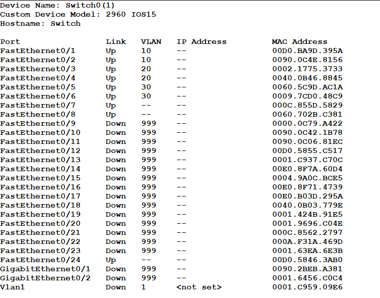
</p>

**Verification Commands:**

```cisco
! Check VLAN assignment
Switch# show vlan brief

! Check interface status
Switch# show interface status

! Verify trunk allowed VLANs
Switch# show interfaces trunk
```

**Expected Output:**

```
VLAN 10:
├─ Fa0/1 - Active
└─ Fa0/2 - Active

VLAN 20:
├─ Fa0/3 - Active
└─ Fa0/4 - Active

VLAN 30:
├─ Fa0/5 - Active
└─ Fa0/6 - Active

VLAN 999 (UNUSED-PORTS):
├─ Fa0/7 - Down (disabled) ✓
├─ Fa0/8 - Down (disabled) ✓
├─ ...
└─ Fa0/24 - Down (disabled) ✓

Trunk Gig0/1:
Allowed VLANs: 10, 20, 30 (NOT 999) ✓
```

---

## Lab Implementation - Unused Ports

### Final Protected Topology

<p align="center">
  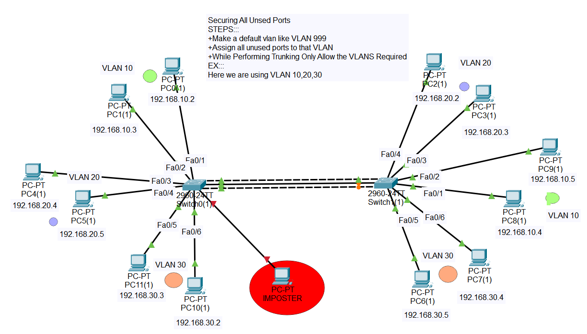
</p>

**Secured Network:**

```
Production Ports (Active):
├─ Fa0/1-2 (VLAN 10) - Port Security Enabled ✓
├─ Fa0/3-4 (VLAN 20) - Port Security Enabled ✓
└─ Fa0/5-6 (VLAN 30) - Port Security Enabled ✓

Unused Ports (Secured):
├─ Fa0/7-24 (VLAN 999) - Shutdown ✓
└─ Not allowed on trunk ✓

Trunk Port:
└─ Gig0/1: Allows VLAN 10,20,30 only (excludes 999) ✓

Security Layers:
1. Port Security on active ports ✓
2. Unused ports in VLAN 999 ✓
3. Unused ports shutdown ✓
4. VLAN 999 blocked on trunk ✓

Result: Complete protection! 🛡️
```

---

### Attack Scenario - Prevented!

**Before Protection:**
```
Attacker finds Fa0/15 (unused)
     ↓
Plugs in laptop
     ↓
Gets IP from DHCP (VLAN 1)
     ↓
Network access granted ❌
```

**After Protection:**
```
Attacker finds Fa0/15 (now secured)
     ↓
Port is shutdown (no link light)
     ↓
Attacker manually enables port (from PC - impossible!)
     ↓
Even if enabled somehow:
  - Port in VLAN 999
  - Isolated from production
  - Not allowed on trunk
     ↓
No network access ✓
```

---

## 📝 Quick Reference

### Port Security Commands

**Basic Setup:**
```cisco
interface fastEthernet 0/5
 switchport mode access
 switchport port-security
 switchport port-security maximum 1
 switchport port-security violation shutdown
```

**Sticky MAC (Recommended):**
```cisco
interface fastEthernet 0/5
 switchport port-security mac-address sticky
```

**Static MAC:**
```cisco
interface fastEthernet 0/5
 switchport port-security mac-address 0011.2233.4455
```

**Multiple Ports:**
```cisco
interface range fastEthernet 0/5-24
 switchport mode access
 switchport port-security
 switchport port-security mac-address sticky
 switchport port-security maximum 1
 switchport port-security violation restrict
```

---

### Unused Ports Commands

**Secure Unused Ports:**
```cisco
! Create VLAN 999
vlan 999
 name UNUSED-PORTS

! Assign and shutdown unused ports
interface range fastEthernet 0/7-24
 description Unused - Secured
 switchport mode access
 switchport access vlan 999
 shutdown
```

**Trunk Configuration:**
```cisco
interface gigabitEthernet 0/1
 switchport mode trunk
 switchport trunk allowed vlan 10,20,30
```

---

### Verification Commands

**Port Security:**
```cisco
show port-security
show port-security interface fastEthernet 0/5
show port-security address
show port-security interface fastEthernet 0/5 | include Violation
```

**VLAN Status:**
```cisco
show vlan brief
show interface status
show interfaces trunk
```

**Recover Err-Disabled Port:**
```cisco
interface fastEthernet 0/5
 shutdown
 no shutdown
```

**Auto-Recovery:**
```cisco
errdisable recovery cause psecure-violation
errdisable recovery interval 300
```

---

### Configuration Templates

**Complete Port Security Template:**

```cisco
! ========================================
! Port Security Configuration Template
! ========================================

! Production ports (Sticky MAC - Recommended)
interface range fastEthernet 0/1-6
 description User Access Ports
 switchport mode access
 switchport port-security
 switchport port-security maximum 1
 switchport port-security mac-address sticky
 switchport port-security violation restrict
 exit

! Critical devices (Static MAC)
interface fastEthernet 0/10
 description CEO Workstation
 switchport mode access
 switchport port-security
 switchport port-security mac-address 0011.2233.4455
 switchport port-security violation shutdown
 exit

! Unused ports (VLAN 999)
vlan 999
 name UNUSED-PORTS
 exit

interface range fastEthernet 0/7-24
 description Unused Ports - Secured
 switchport mode access
 switchport access vlan 999
 shutdown
 exit

! Trunk configuration
interface gigabitEthernet 0/1
 description Trunk to Core
 switchport mode trunk
 switchport trunk allowed vlan 10,20,30
 exit

! Save
write memory
```

---

### Best Practices Summary

<div align="center">

| Practice | Purpose | Command |
|----------|---------|---------|
| **Use Sticky MAC** | Auto-learn + save | `mac-address sticky` |
| **Restrict Mode** | Business continuity | `violation restrict` |
| **VLAN 999** | Isolate unused ports | `switchport access vlan 999` |
| **Shutdown Unused** | Double protection | `shutdown` |
| **Block VLAN 999 on Trunk** | Prevent propagation | `trunk allowed vlan 10,20,30` |
| **Auto-Recovery** | Reduce admin overhead | `errdisable recovery` |

</div>

---

### Security Checklist

**Port Security:**
```
✓ Enable on all access ports
✓ Use sticky MAC (recommended)
✓ Set appropriate maximum (usually 1)
✓ Choose violation mode based on needs
✓ Test with unauthorized device
✓ Verify port-security status
✓ Configure auto-recovery (optional)
```

**Unused Ports:**
```
✓ Create VLAN 999 (parking VLAN)
✓ Move all unused ports to VLAN 999
✓ Shutdown all unused ports
✓ Exclude VLAN 999 from trunks
✓ Regularly audit port status
✓ Document which ports are secured
```

---

---

## 🎓 What I Learned

### Port Security:
✅ **MAC address filtering** - Allow only authorized devices  
✅ **Three violation modes** - Shutdown, Restrict, Protect  
✅ **MAC address types** - Static, Dynamic, Sticky  
✅ **Sticky MAC benefits** - Auto-learn + persistent  
✅ **Attack prevention** - MAC flooding, unauthorized access  
✅ **Error recovery** - Manual and automatic methods  

### Unused Ports Security:
✅ **VLAN 999 isolation** - Parking VLAN concept  
✅ **Double protection** - VLAN assignment + shutdown  
✅ **Trunk security** - Blocking unused VLANs  
✅ **Attack surface reduction** - Minimize entry points  
✅ **Industry best practices** - Standard security approach  

### Security Principles:
✅ **Defense in depth** - Multiple security layers  
✅ **Least privilege** - Minimal necessary access  
✅ **Fail-secure** - Default deny approach  
✅ **Audit and monitor** - Regular security checks  

---

## 🚀 How to Use This Repository

1. **Clone the repository:**
   ```bash
   git clone https://github.com/abdul-wahid022/Port-Security.git
   ```

2. **Understand concepts:**
   - Learn port security components
   - Study violation modes
   - Review MAC address types
   - Understand unused ports risk

3. **Practice configurations:**
   - Set up port security with sticky MAC
   - Test violation modes
   - Configure VLAN 999
   - Test unauthorized access attempts

4. **Deploy in production:**
   - Apply to all access ports
   - Secure all unused ports
   - Configure trunks properly
   - Regular security audits

---

## 📞 Connect With Me

<div align="center">

[](mailto:a.wahid7860668@gmail.com)
[](https://www.linkedin.com/in/abdul-wahid022)
[](https://github.com/abdul-wahid022)

**💬 Questions? Need Packet Tracer files? Feel free to reach out!**

</div>

---

## 📄 License

This project is created for **educational purposes** and is open-source.

---

<div align="center">

### ⭐ If you found this helpful, please give it a star!

**Made with ❤️ by ABDUL WAHID**

*Last Updated: January 2026*

</div>
