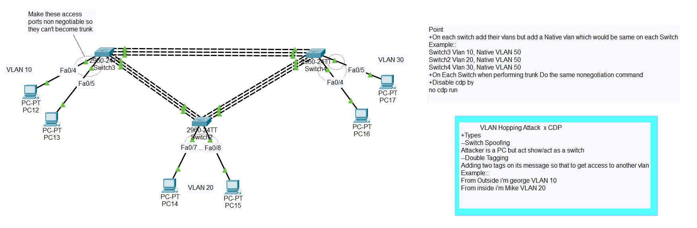
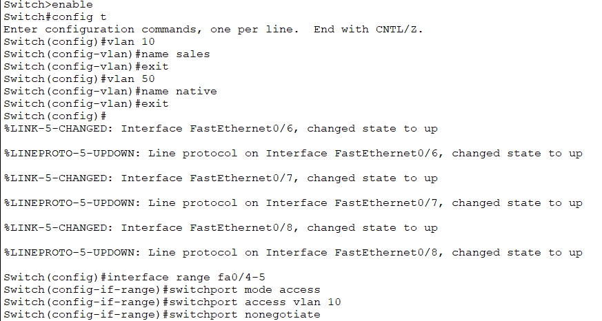
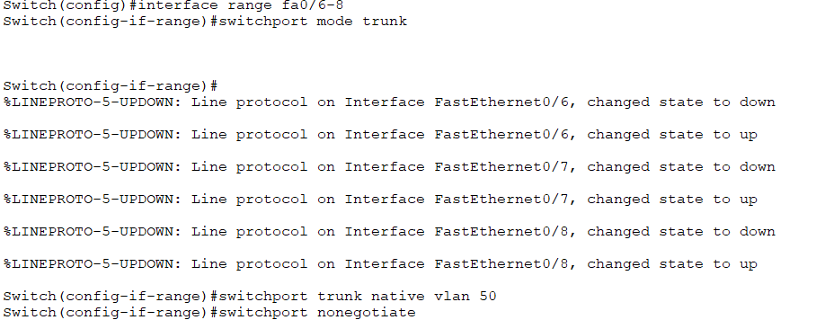
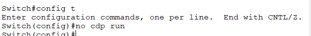
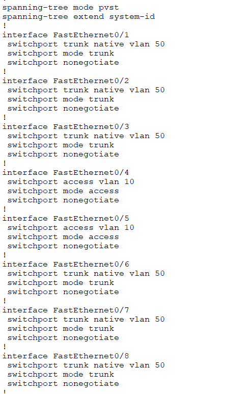

# 🔐 VLAN Security - Attack Prevention Guide

<div align="center">


**VLAN Hopping Attacks and CDP Security**

[](.)
[](.)
[](.)

[📖 Overview](#-overview) • [🎭 Switch Spoofing](#-switch-spoofing-attack) • [🏷️ Double Tagging](#️-double-tagging-attack) • [📡 CDP Security](#-cdp-cisco-discovery-protocol) • [🔧 Lab Implementation](#-lab-implementation)

</div>

---

## 📖 Overview

**VLAN Hopping** is a serious security attack where an attacker breaks VLAN boundaries and accesses data from other VLANs that should be isolated.

### What You'll Learn:

| Attack Type | Method | Impact | Protection |
|-------------|--------|--------|------------|
| **Switch Spoofing** | Fake switch via DTP | Access all VLANs | Disable DTP |
| **Double Tagging** | Two VLAN tags | Inject traffic to other VLAN | Change native VLAN |
| **CDP Attack** | Information gathering | Network reconnaissance | Disable CDP |

### Key Security Benefits:

✅ **VLAN Isolation** - Prevent unauthorized inter-VLAN access  
✅ **DTP Protection** - Stop fake switch attacks  
✅ **Native VLAN Security** - Prevent double tagging  
✅ **CDP Hardening** - Hide network topology  
✅ **Defense in Depth** - Multiple security layers  

---

## 📚 Table of Contents

- [🎯 VLAN Hopping Concept](#-vlan-hopping-concept)
- [🎭 Switch Spoofing Attack](#-switch-spoofing-attack)
  - [How It Works](#how-it-works)
  - [Protection](#protection---switch-spoofing)
- [🏷️ Double Tagging Attack](#️-double-tagging-attack)
  - [How It Works](#how-it-works-1)
  - [Protection](#protection---double-tagging)
- [📡 CDP (Cisco Discovery Protocol)](#-cdp-cisco-discovery-protocol)
  - [What is CDP](#what-is-cdp)
  - [Security Risk](#security-problem)
  - [Protection](#protection---cdp)
- [🔧 Lab Implementation](#-lab-implementation)
- [📝 Quick Reference](#-quick-reference)

---

## 🎯 VLAN Hopping Concept

### What is VLAN Hopping?

**VLAN Hopping** = Attacker breaks VLAN boundary and steals data from other VLANs

### Real-Life Analogy - Hotel Example:

```
Think of a hotel with multiple floors:

Floor 1 = VLAN 10 (Normal guests)
Floor 2 = VLAN 20 (VIP guests)
Floor 3 = VLAN 30 (Staff only)

Normal guest (Floor 1) does NOT have permission to Floor 2 or 3

VLAN Hopping = Guest from Floor 1 sneaks into Floor 2! 🚨
```

### Why is This Dangerous?

**Company Network Example:**

```
Switch
├── VLAN 10 (Employees) - Attacker is here
├── VLAN 20 (Finance - Salary Data) - Target 🎯
└── VLAN 30 (Servers - Customer Data) - Target 🎯

Without Attack:
✅ Employee can only see employee data

With VLAN Hopping:
❌ Employee can see salary data
❌ Employee can steal customer data
❌ Network security compromised!
```

---

## 🎭 Switch Spoofing Attack

### Concept

**Switch Spoofing** = Attacker makes their computer pretend to be a switch (fake switch)

### How It Works

#### Normal Setup:
```
[Real Switch] ----trunk---- [Another Switch]
      |
   access port
      |
   [User PC] ← VLAN 10 only
```

#### Attack Scenario:
```
[Real Switch]
      |
   access port (DTP enabled)
      |
   [Attacker] ← "I'm also a switch!" (lying)
```

---

### Attack Steps:

```
Step 1: Attacker sends DTP (Dynamic Trunking Protocol) packets
        ↓
Step 2: Switch thinks: "Oh, this is also a switch"
        ↓
Step 3: Switch converts that port to TRUNK port
        ↓
Step 4: Trunk port carries ALL VLAN traffic
        ↓
Step 5: Attacker can now see data from VLAN 10, 20, 30 - ALL VLANs! 🚨
```

---

### Visual Diagram:

**Before Attack:**
```
[Switch] --access(VLAN 10)--> [Attacker]
                                   ↓
                            Only VLAN 10 ✓
```

**After Attack:**
```
[Switch] --trunk(ALL VLANs)--> [Attacker]
                                   ↓
                            All VLANs! ❌
```

---

### Protection - Switch Spoofing

**Solution: Disable DTP (Don't let trunk form automatically)**

#### Command Explanation:

```cisco
! Method 1: Force port to ACCESS mode (Recommended for end devices)
Switch(config)# interface fastEthernet 0/1
Switch(config-if)# switchport mode access
Switch(config-if)# switchport nonegotiate
Switch(config-if)# exit
```

**What Each Command Does:**

```
switchport mode access
└─ Force port to be ACCESS (not trunk)

switchport nonegotiate
└─ Disable DTP negotiation (no automatic trunk)

Result: Port cannot become trunk automatically ✓
```

---

#### Alternative Method (If Trunk is Required):

```cisco
! Method 2: If port MUST be trunk, disable negotiation
Switch(config)# interface fastEthernet 0/24
Switch(config-if)# switchport mode trunk
Switch(config-if)# switchport nonegotiate
Switch(config-if)# exit
```

**Important:** Use this only for switch-to-switch connections!

---

## 🏷️ Double Tagging Attack

### Concept

**Double Tagging** = Attacker adds TWO VLAN tags to one packet

### VLAN Tag Basics

**Normal Packet:**
```
[Ethernet Header][VLAN Tag: 10][Data]
                      ↑
                "I belong to VLAN 10"
```

**Double Tagged Packet (Attack):**
```
[Ethernet][Tag1: 10][Tag2: 20][Data]
              ↑         ↑
           Outer     Inner
```

---

### How It Works

#### Step-by-Step Attack:

```
Step 1: Attacker is in VLAN 10

Step 2: Attacker creates packet with 2 tags:
        ├─ Outer Tag: VLAN 10 (their own VLAN)
        └─ Inner Tag: VLAN 20 (target VLAN)

Step 3: First Switch receives packet:
        ├─ Sees outer tag (VLAN 10)
        ├─ Forwards packet
        └─ Removes outer tag
        
        Now packet has only inner tag (VLAN 20)

Step 4: Next Switch receives packet:
        ├─ Sees tag: VLAN 20
        └─ "Oh, this is VLAN 20 packet"
        
        Forwards to VLAN 20! ❌

Step 5: Attacker successfully entered VLAN 20!
```

---

### Visual Flow:

```
[Attacker in VLAN 10]
        |
[Tag: 10, Tag: 20][Data] ← Double tagged packet
        ↓
[Switch 1] Removes outer tag
        ↓
[Tag: 20][Data] ← Only inner tag remains
        ↓
[Switch 2] Sees VLAN 20 tag
        ↓
[Victim in VLAN 20] ← Packet delivered! ❌
```

---

### Protection - Double Tagging

**Solution: Change Native VLAN (Don't use default VLAN 1)**

```cisco
! Change native VLAN to unused VLAN
Switch(config)# interface fastEthernet 0/24
Switch(config-if)# switchport trunk native vlan 999
Switch(config-if)# exit
```

**Why This Works:**
```
Native VLAN = VLAN 1 (default)
Problem: Attacker can use VLAN 1 as outer tag

Solution: Change to VLAN 999 (unused)
Result: Attack won't work ✓
```

---

### Additional Protection:

```cisco
! Disable unused ports
Switch(config)# interface range fastEthernet 0/10-20
Switch(config-if-range)# shutdown
Switch(config-if-range)# exit
```

**Why:** Unused ports are entry points for attackers!

---

## 📡 CDP (Cisco Discovery Protocol)

### What is CDP?

**CDP (Cisco Discovery Protocol)** = Cisco devices automatically discover each other

#### How It Works:

```
[Switch A] ----cable---- [Router B]

Switch A broadcasts: "I am Switch-A, IP: 192.168.1.1"
Router B broadcasts: "I am Router-B, IP: 192.168.1.2"

Result: Both know about each other automatically! ✓
```

---

### CDP Characteristics:

```
• Sends messages every 60 seconds
• Only to directly connected neighbors
• Cisco proprietary (only Cisco devices)
• Enabled by default on all Cisco devices
```

---

### Information Shared by CDP:

**CDP reveals:**
- ✅ Device name (hostname)
- ✅ IP address
- ✅ Device model (Cisco 2960, 3850, etc.)
- ✅ Connected port
- ✅ IOS version
- ✅ Platform information

---

### CDP Commands:

```cisco
! View CDP neighbors
Switch# show cdp neighbors

! View detailed information
Switch# show cdp neighbors detail

! Enable CDP globally
Switch(config)# cdp run

! Disable CDP globally
Switch(config)# no cdp run

! Enable CDP on specific interface
Switch(config)# interface gigabitEthernet 0/1
Switch(config-if)# cdp enable

! Disable CDP on specific interface
Switch(config)# interface gigabitEthernet 0/1
Switch(config-if)# no cdp enable
```

---

### Security Problem

**⚠️ CDP is a Security Risk!**

```
CDP Information Leak:
├─ Hacker gets complete network map
├─ Device models revealed (known vulnerabilities)
├─ IOS versions revealed (exploit planning)
└─ Attack planning becomes easy

Example:
Hacker connects laptop to network
     ↓
Runs: show cdp neighbors detail
     ↓
Gets entire network topology
     ↓
Plans targeted attack ❌
```

---

### Protection - CDP

**Solution: Disable CDP on external/untrusted ports**

```cisco
! Method 1: Globally disable (Production best practice)
Switch(config)# no cdp run

! Method 2: Enable only on trusted interfaces
Switch(config)# interface range gigabitEthernet 0/1-10
Switch(config-if-range)# cdp enable
Switch(config-if-range)# exit

! Method 3: Disable on external/untrusted ports
Switch(config)# interface gigabitEthernet 0/24
Switch(config-if)# no cdp enable
Switch(config-if)# exit
```

---

### Important Points:

```
✓ Default: CDP enabled globally
✓ Production: Globally disable, enable only where needed
✓ External ports: Always disable CDP
✓ Alternative: Use LLDP (industry standard, not Cisco only)
```

---

### Real-Life Scenario

**Problem:**
```
Admin: "What device is connected to port Fa0/5?"

Without CDP:
1. Physically trace cable 🚶
2. Check documentation (might be outdated) 📄
3. Time waste ⏰

With CDP:
Switch# show cdp neighbors interface Fa0/5

Device ID: IP-Phone-123
Platform: Cisco IP Phone 7965

Answer in 2 seconds! ✓
```

**Trade-off:** Convenience vs Security

---

## 🔧 Lab Implementation

### Network Topology:

<p align="center">
  
</p>

**Setup:**
```
Multiple switches with VLANs 10, 20, 30
Demonstrating attacks and protection
Securing all switches against VLAN hopping
```

---

### Configuration - Access Mode (Switch 1)

<p align="center">
  
</p>

**Configure Access Ports with No Negotiate:**

```cisco
! Switch 1 - Access Port Configuration
Switch> enable
Switch# configure terminal
Switch(config)# hostname Switch1

! Configure access ports (prevent switch spoofing)
Switch1(config)# interface range fastEthernet 0/1-10
Switch1(config-if-range)# switchport mode access
Switch1(config-if-range)# switchport access vlan 10
Switch1(config-if-range)# switchport nonegotiate
Switch1(config-if-range)# exit
```

**Explanation:**
```
switchport mode access
└─ Force port to ACCESS mode only

switchport access vlan 10
└─ Assign to VLAN 10

switchport nonegotiate
└─ Disable DTP (prevent trunk negotiation)
```

---

**⚠️ Important Note:**

```
The same configuration applies to other switches:
├─ Switch 2: Configure for VLAN 20
├─ Switch 3: Configure for VLAN 30
└─ Only VLAN number changes, commands remain same

Example for Switch 2:
interface range fastEthernet 0/1-10
 switchport mode access
 switchport access vlan 20
 switchport nonegotiate
```

---

### Configuration - Trunk Mode (Switch 1)

<p align="center">
  
</p>

**Configure Trunk Ports with No Negotiate:**

```cisco
! Switch 1 - Trunk Port Configuration
Switch1(config)# interface gigabitEthernet 0/1
Switch1(config-if)# switchport mode trunk
Switch1(config-if)# switchport trunk allowed vlan 10,20,30
Switch1(config-if)# switchport trunk native vlan 999
Switch1(config-if)# switchport nonegotiate
Switch1(config-if)# exit
```

**Explanation:**
```
switchport mode trunk
└─ Set port to trunk mode

switchport trunk allowed vlan 10,20,30
└─ Only allow VLANs 10, 20, 30

switchport trunk native vlan 999
└─ Change native VLAN to 999 (prevent double tagging)

switchport nonegotiate
└─ Disable DTP on trunk (security)
```

---

**⚠️ Important Note:**

```
The same trunk configuration applies to ALL switches:
├─ Switch 2: Same trunk settings
├─ Switch 3: Same trunk settings
└─ Apply on all inter-switch connections

All trunk ports should have:
✓ Native VLAN 999
✓ Allowed VLANs: 10,20,30
✓ No negotiate enabled
```

---

### CDP Configuration - Disable on All Devices

<p align="center">
  
</p>

**Globally Disable CDP (Best Practice):**

```cisco
! Disable CDP on all switches
Switch1(config)# no cdp run

! Apply to all switches in the network
Switch2(config)# no cdp run
Switch3(config)# no cdp run
```

**Why Globally Disable?**
```
✓ Prevents information leakage
✓ Hides network topology
✓ Reduces attack surface
✓ Production security best practice
```

---

### Verification - No Negotiate State

<p align="center">
  
</p>

**Verify DTP is Disabled:**

```cisco
! Check interface switchport status
Switch1# show interfaces fastEthernet 0/1 switchport

Expected Output:
Administrative Mode: static access
Operational Mode: static access
Negotiation of Trunking: Off ✓
```

**Key Points to Verify:**
```
✓ Negotiation of Trunking: Off
✓ Administrative Mode: static access (or static trunk)
✓ No dynamic negotiation
```

---

### Verification - CDP Disabled

<p align="center">
  
</p>

**Verify CDP is Disabled:**

```cisco
! Check CDP status
Switch1# show cdp

Expected Output:
CDP is not enabled ✓

! Verify no CDP neighbors
Switch1# show cdp neighbors

Expected Output:
CDP is not enabled ✓
```

**Result:** ✅ CDP completely disabled, no information leakage!

---

## 📝 Quick Reference

### Attack Summary

<div align="center">

| Attack Type | Method | Result | Protection |
|-------------|--------|--------|------------|
| **Switch Spoofing** | Fake switch via DTP | Access all VLANs | `switchport nonegotiate` |
| **Double Tagging** | Two VLAN tags | Inject to other VLAN | `switchport trunk native vlan 999` |
| **CDP Reconnaissance** | Information gathering | Network mapping | `no cdp run` |

</div>

---

### Protection Commands - Quick Copy

**Switch Spoofing Protection:**
```cisco
! Access ports
interface range fastEthernet 0/1-10
 switchport mode access
 switchport nonegotiate
```

**Double Tagging Protection:**
```cisco
! Trunk ports
interface gigabitEthernet 0/1
 switchport trunk native vlan 999
 switchport nonegotiate
```

**CDP Protection:**
```cisco
! Global disable
no cdp run
```

**Unused Ports Protection:**
```cisco
! Shutdown unused ports
interface range fastEthernet 0/15-24
 shutdown
```

---

### Complete Security Checklist

```
Access Port Security:
✓ Set to access mode (switchport mode access)
✓ Disable DTP (switchport nonegotiate)
✓ Assign to specific VLAN

Trunk Port Security:
✓ Change native VLAN to unused (999)
✓ Disable DTP (switchport nonegotiate)
✓ Limit allowed VLANs
✓ Use only where necessary

CDP Security:
✓ Globally disable CDP (no cdp run)
✓ Or disable on untrusted ports
✓ Enable only on management interfaces

General Security:
✓ Shutdown all unused ports
✓ Enable port security where possible
✓ Regular security audits
✓ Monitor for unauthorized trunk ports
```

---

### Best Practices Summary

<div align="center">

| Practice | Purpose | Command |
|----------|---------|---------|
| **Disable DTP** | Prevent switch spoofing | `switchport nonegotiate` |
| **Change Native VLAN** | Prevent double tagging | `switchport trunk native vlan 999` |
| **Shutdown Unused Ports** | Reduce attack surface | `shutdown` |
| **Disable CDP** | Prevent reconnaissance | `no cdp run` |
| **Trunk Only When Needed** | Minimize attack surface | `switchport mode access` |
| **Port Security** | Limit MAC addresses | `switchport port-security` |

</div>

---

### Configuration Template

**Complete Switch Security Configuration:**

```cisco
! ========================================
! VLAN Hopping & CDP Protection Template
! ========================================

! Hostname
Switch(config)# hostname SecureSwitch

! ===== Access Ports =====
! For end user devices
interface range fastEthernet 0/1-20
 description User Access Ports
 switchport mode access
 switchport access vlan 10
 switchport nonegotiate
 spanning-tree portfast
 spanning-tree bpduguard enable
 exit

! ===== Trunk Ports =====
! For inter-switch connections
interface gigabitEthernet 0/1
 description Trunk to CoreSwitch
 switchport mode trunk
 switchport trunk allowed vlan 10,20,30
 switchport trunk native vlan 999
 switchport nonegotiate
 exit

! ===== Unused Ports =====
! Shutdown unused interfaces
interface range fastEthernet 0/21-24
 description Unused Ports
 shutdown
 exit

! ===== CDP Security =====
! Disable CDP globally
no cdp run

! ===== Save Configuration =====
exit
write memory
```

---


---

## 🎓 What I Learned

### VLAN Hopping Attacks:
✅ **Switch Spoofing** - Fake switch via DTP negotiation  
✅ **Double Tagging** - Two VLAN tags to bypass security  
✅ **Real-world impact** - How attackers break VLAN isolation  
✅ **Attack scenarios** - Understanding attacker methodology  

### Protection Mechanisms:
✅ **Disabling DTP** - Prevent automatic trunk formation  
✅ **Changing native VLAN** - Stop double tagging attacks  
✅ **Securing unused ports** - Reduce attack surface  
✅ **Proper trunk configuration** - Secure inter-switch links  

### CDP Security:
✅ **CDP functionality** - How neighbor discovery works  
✅ **Information disclosure risks** - What attackers can learn  
✅ **When to disable CDP** - Production vs lab environments  
✅ **Best practices** - Balancing convenience and security  

### Network Security Best Practices:
✅ **Defense in depth** - Multiple security layers  
✅ **Principle of least privilege** - Minimal necessary access  
✅ **Configuration hardening** - Secure by default  
✅ **Regular security audits** - Ongoing vigilance  

---

## 🚀 How to Use This Repository

1. **Clone the repository:**
   ```bash
   git clone https://github.com/abdul-wahid022/VLAN-Security.git
   ```

2. **Understand the attacks:**
   - Study switch spoofing mechanism
   - Learn double tagging process
   - Review CDP security risks
   - Practice in safe lab environment

3. **Implement protection:**
   - Apply configurations to all switches
   - Test protections thoroughly
   - Verify security settings
   - Document your network

4. **Maintain security:**
   - Regular configuration audits
   - Review CDP settings
   - Monitor for suspicious activity
   - Update security policies

---

## 📞 Connect With Me

<div align="center">

[](mailto:a.wahid7860668@gmail.com)
[](https://www.linkedin.com/in/abdul-wahid022)
[](https://github.com/abdul-wahid022)

**💬 Questions? Need Packet Tracer files? Feel free to reach out!**

</div>

---

## 📄 License

This project is created for **educational purposes** and is open-source.

---

<div align="center">

### ⭐ If you found this helpful, please give it a star!

**Made with ❤️ by ABDUL WAHID**

*Last Updated: January 2026*

</div>
