# 🛡️ DHCP Security - Complete Protection Guide

<div align="center">

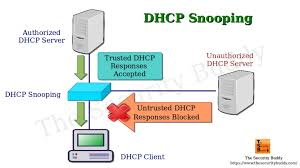

**DHCP Snooping, Dynamic ARP Inspection & IP Source Guard**

[](.)
[](.)
[](.)

[📖 Overview](#-overview) • [🔒 DHCP Snooping](#-dhcp-snooping) • [🔍 DAI](#-dynamic-arp-inspection-dai) • [🛡️ IP Source Guard](#️-ip-source-guard-ipsg) • [🔧 Lab Implementation](#-lab-implementation)

</div>

---

## 📖 Overview

**DHCP Security** protects your network against fake DHCP servers, ARP poisoning, and IP spoofing attacks through three integrated security features.

### What You'll Learn:

| Feature | Purpose | Protects Against | Dependency |
|---------|---------|------------------|------------|
| **DHCP Snooping** | Block fake DHCP servers | Rogue DHCP attacks | None (Base) |
| **DAI** | Validate ARP messages | ARP spoofing/poisoning | DHCP Snooping |
| **IP Source Guard** | Validate source IPs | IP spoofing | DHCP Snooping |

### Key Security Benefits:

✅ **Prevent Rogue DHCP** - Stop fake DHCP server attacks  
✅ **Stop ARP Poisoning** - Block Man-in-the-Middle attacks  
✅ **Prevent IP Spoofing** - Ensure legitimate IP usage  
✅ **Binding Table** - Track MAC-IP-Port mappings  
✅ **Layered Security** - Defense in depth approach  

---

## 📚 Table of Contents

- [🔒 DHCP Snooping](#-dhcp-snooping)
  - [What is DHCP Snooping](#what-is-dhcp-snooping)
  - [How It Works](#how-it-works)
  - [Configuration](#dhcp-snooping-configuration)
  - [Lab Implementation](#lab-implementation---dhcp-snooping)
- [🔍 Dynamic ARP Inspection (DAI)](#-dynamic-arp-inspection-dai)
  - [What is ARP](#what-is-arp)
  - [ARP Spoofing Attack](#arp-spoofing-attack)
  - [How DAI Works](#how-dai-works)
  - [Configuration](#dai-configuration)
- [🛡️ IP Source Guard (IPSG)](#️-ip-source-guard-ipsg)
  - [What is IP Spoofing](#what-is-ip-spoofing)
  - [How IPSG Works](#how-ipsg-works)
  - [Configuration](#ipsg-configuration)
- [🔗 Relationship Between Three Features](#-relationship-between-three-features)
- [📝 Quick Reference](#-quick-reference)

---

## 🔒 DHCP Snooping

### What is DHCP Snooping?

**DHCP Snooping** is a security feature that blocks fake DHCP servers from operating on your network.

### The Problem - Fake DHCP Server Attack:

**Without DHCP Snooping:**
```
Attacker sets up fake DHCP server:
├─ Gives wrong gateway (traffic hijacking)
├─ Gives fake DNS (phishing attacks)
├─ Gives wrong IPs (network disruption)
└─ Man-in-the-Middle attack possible! ❌
```

---

### How It Works

**Port Types:**

Switch divides ports into 2 categories:

#### 1. Trusted Ports ✅
```
Can send DHCP server messages (OFFER, ACK)

Used for:
├─ Legitimate DHCP server port
├─ Uplink ports to other switches
└─ Router connections
```

#### 2. Untrusted Ports ⚠️
```
Can ONLY send DHCP client messages (DISCOVER, REQUEST)

Used for:
├─ End user devices (PCs, laptops)
├─ Access layer ports
└─ Any port where DHCP server shouldn't be
```

---

### Simple Rule:

```
Client (untrusted) → "I need IP" → Allowed ✓
Fake Server (untrusted) → "Here's IP" → BLOCKED ✗
Real Server (trusted) → "Here's IP" → Allowed ✓
```

---

### Binding Table

**DHCP Snooping maintains a binding table:**

| MAC Address | IP Address | Port | VLAN | Lease Time |
|-------------|------------|------|------|------------|
| AA:BB:CC:DD:EE:FF | 192.168.1.100 | Fa0/5 | 10 | 86400 |
| 11:22:33:44:55:66 | 192.168.1.101 | Fa0/6 | 10 | 86400 |

**Purpose:** Other security features (DAI, IPSG) use this table!

---

### DHCP Snooping Configuration

**Step-by-Step Configuration:**

```cisco
! Step 1: Enable DHCP Snooping globally
Switch(config)# ip dhcp snooping

! Step 2: Enable on specific VLANs
Switch(config)# ip dhcp snooping vlan 10
Switch(config)# ip dhcp snooping vlan 10,20,30

! Step 3: Disable Option 82 (usually recommended)
Switch(config)# no ip dhcp snooping information option

! Step 4: Configure trusted port (where real DHCP server is)
Switch(config)# interface gigabitEthernet 0/1
Switch(config-if)# ip dhcp snooping trust
Switch(config-if)# exit

! Step 5: Configure rate limit on untrusted ports
Switch(config)# interface range gigabitEthernet 0/2-24
Switch(config-if-range)# ip dhcp snooping limit rate 10
Switch(config-if-range)# exit

! Step 6: Save configuration
Switch(config)# exit
Switch# write memory
```

---

### Command Explanation:

```
ip dhcp snooping
└─ Enable DHCP Snooping feature

ip dhcp snooping vlan 10
└─ Apply to VLAN 10

no ip dhcp snooping information option
└─ Disable Option 82 (recommended)

ip dhcp snooping trust
└─ Mark port as trusted (DHCP server allowed)

ip dhcp snooping limit rate 10
└─ Maximum 10 DHCP packets/second (prevent attacks)
```

---

### Verification Commands:

```cisco
! Check DHCP Snooping status
Switch# show ip dhcp snooping

! View binding table
Switch# show ip dhcp snooping binding

! Check specific interface
Switch# show ip dhcp snooping binding interface gig0/5
```

---

## Lab Implementation - DHCP Snooping

### Step 1: Initial Topology Setup

<p align="center">
  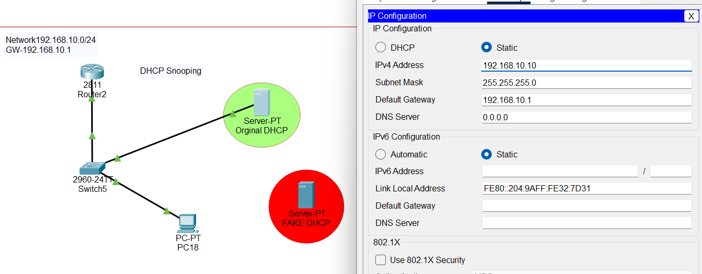
</p>

**Network Setup:**
```
Components:
├─ Switch (Layer 2)
├─ DHCP Server (192.168.1.10)
├─ PC1 (DHCP Client)
└─ Server connected to Fa0/1
```

**Server IP Configuration:**
```
IP Address: 192.168.1.10
Subnet Mask: 255.255.255.0
Default Gateway: 192.168.1.1
```

---

### Step 2: DHCP Pool Configuration

<p align="center">
  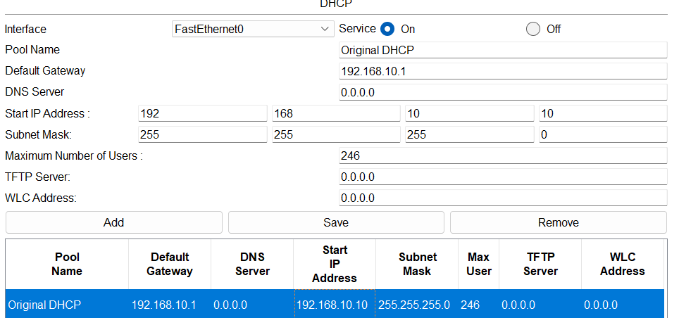
</p>

**Server DHCP Pool Setup:**
```
Pool Name: LAN-Pool
Default Gateway: 192.168.1.1
DNS Server: 192.168.1.1
Start IP Address: 192.168.1.100
Subnet Mask: 255.255.255.0
Maximum Users: 50
```

---

### Step 3: DHCP Request Success

<p align="center">
  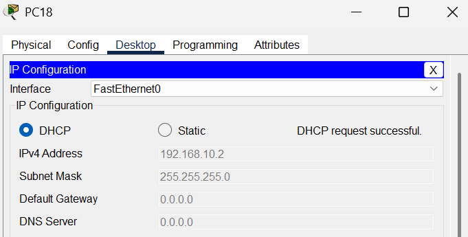
</p>

**PC1 DHCP Request:**
```
PC1 sends: DHCP Discover
Server responds: DHCP Offer (192.168.1.100)
PC1 sends: DHCP Request
Server responds: DHCP ACK

Result: ✅ PC1 got IP: 192.168.1.100
```

---

### Step 4: Fake DHCP Server Setup

<p align="center">
  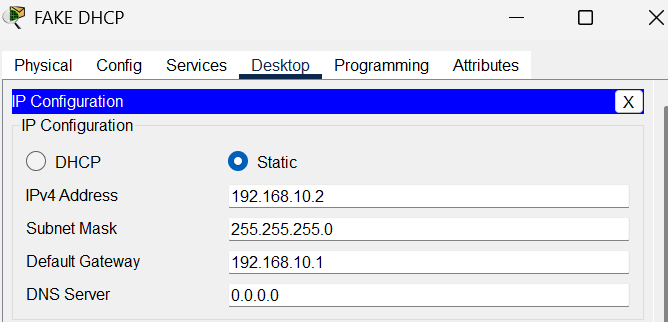
</p>

**Attacker's Fake Server:**
```
IP Address: 192.168.1.50
Subnet Mask: 255.255.255.0
Default Gateway: 192.168.1.1

Purpose: Malicious DHCP server
```

---

### Step 5: Fake Pool Creation

<p align="center">
  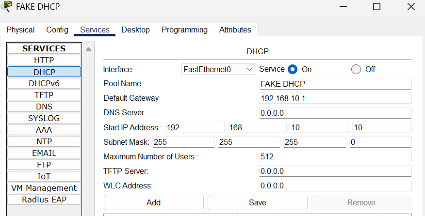
</p>

**Malicious DHCP Pool:**
```
Pool Name: Fake-Pool
Default Gateway: 192.168.1.50 (Attacker!)
DNS Server: 192.168.1.50 (Fake DNS!)
Start IP: 192.168.1.200
Subnet Mask: 255.255.255.0

⚠️ Wrong gateway = Traffic hijacking!
```

---

### Step 6: New Topology - Fake Server Connected

<p align="center">
  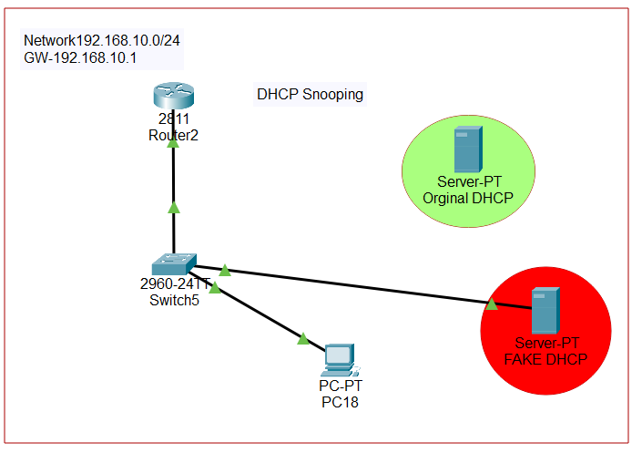
</p>

**Attacker Connected:**
```
[Switch]
   ├─ Fa0/1 → Real DHCP Server (disconnected)
   └─ Fa0/2 → Fake DHCP Server (connected)
   └─ Fa0/5 → PC1
```

---

### Step 7: PC Gets IP from Fake Server

<p align="center">
  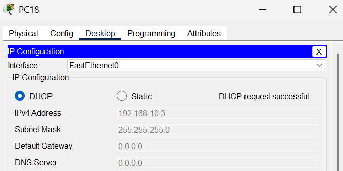
</p>

**Attack Successful:**
```
PC1 DHCP Request
     ↓
Fake Server responds FIRST
     ↓
PC1 accepts: 192.168.1.200
Gateway: 192.168.1.50 (Attacker!)

Result: ❌ Traffic now goes through attacker!
```

---

### Step 8: Reconnect Real Server

<p align="center">
  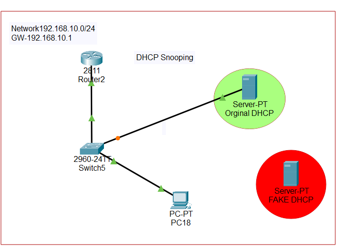
</p>

**Topology Change:**
```
Action:
├─ Disconnect fake server (Fa0/2)
└─ Reconnect real server (Fa0/1)

Preparing for DHCP Snooping configuration...
```

---

### Step 9: DHCP Snooping Commands

<p align="center">
  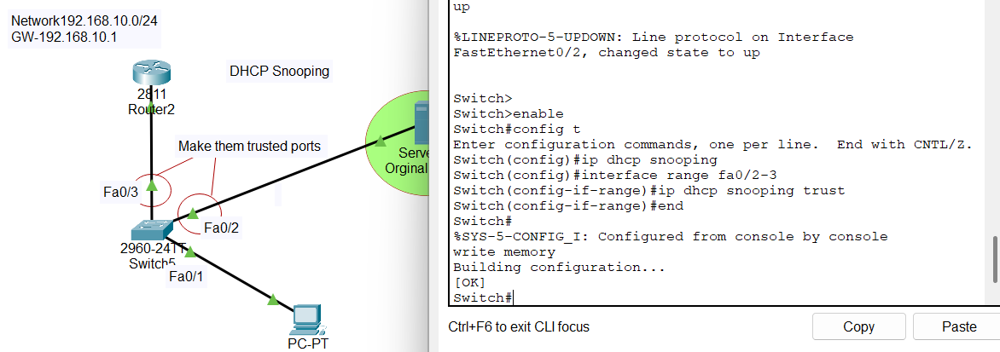
</p>

**Configuration Applied:**
```cisco
Switch(config)# ip dhcp snooping
Switch(config)# ip dhcp snooping vlan 1
Switch(config)# no ip dhcp snooping information option
```

---

### Step 10: Switch VLAN Information

<p align="center">
  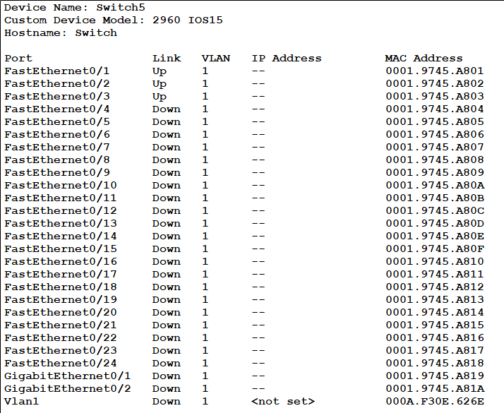
</p>

**VLAN Configuration:**
```
All ports assigned to VLAN 1:
├─ Fa0/1 → VLAN 1
├─ Fa0/2 → VLAN 1
├─ Fa0/5 → VLAN 1
└─ All other ports → VLAN 1

Ready for DHCP Snooping on VLAN 1
```

---

### Step 11: Enable DHCP Snooping on VLAN 1

<p align="center">
  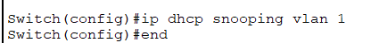
</p>

**Enable and Configure:**
```cisco
! Configure trusted port
Switch(config)# interface fastEthernet 0/1
Switch(config-if)# ip dhcp snooping trust
Switch(config-if)# exit

! Verification
Switch# show ip dhcp snooping
DHCP snooping is enabled on VLAN 1 ✓
```

---

### Step 12: Connect Both Servers

<p align="center">
  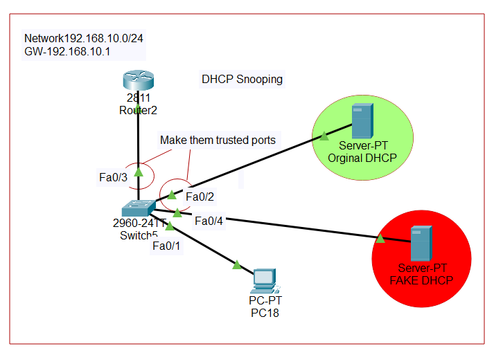
</p>

**Testing Protection:**
```
[Switch]
   ├─ Fa0/1 → Real DHCP Server (trusted)
   ├─ Fa0/2 → Fake DHCP Server (untrusted)
   └─ Fa0/5 → PC1

Let's see if DHCP Snooping blocks fake server...
```

---

### Step 13: Fake Server Blocked!

<p align="center">
  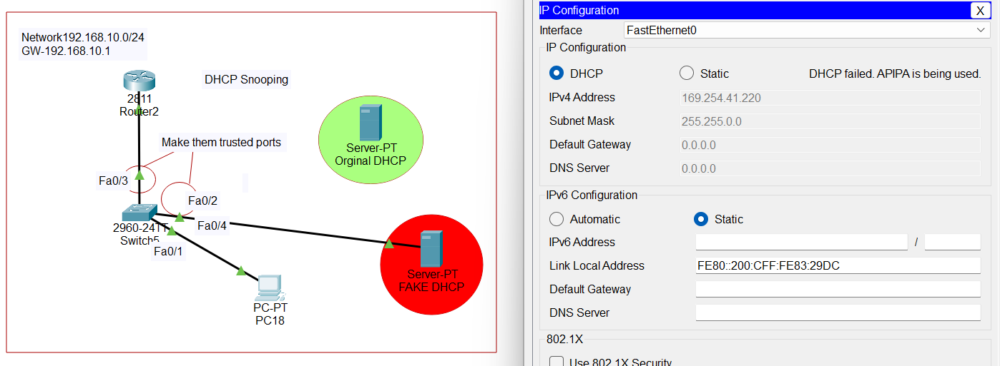
</p>

**Protection Working:**
```
PC1 sends: DHCP Discover
     ↓
Fake Server (Fa0/2 - untrusted) sends: DHCP Offer
     ↓
Switch BLOCKS fake server packets! ✓
     ↓
Only Real Server (Fa0/1 - trusted) can respond
     ↓
PC1 gets IP: 192.168.1.100 (from real server)

Result: ✅ DHCP Snooping successfully blocked fake server!
```

---

## 🔍 Dynamic ARP Inspection (DAI)

### What is ARP?

**ARP (Address Resolution Protocol)** converts IP addresses to MAC addresses.

### Why ARP is Needed:

```
Layer 3 (Network): Uses IP addresses (192.168.1.10)
Layer 2 (Data Link): Uses MAC addresses (AA:BB:CC:DD:EE:FF)

Problem: How to send data locally?
├─ You know destination IP: 192.168.1.10
└─ But need MAC address for delivery!

Solution: ARP!
```

---

### ARP Process:

```
PC1 wants to send data to 192.168.1.10:

Step 1: PC1 broadcasts ARP Request (to everyone)
        "Who has IP 192.168.1.10? Tell me your MAC!"

Step 2: PC with IP 192.168.1.10 replies (ARP Reply)
        "I have 192.168.1.10, my MAC is AA:BB:CC:DD:EE:FF"

Step 3: PC1 saves in ARP cache
        IP: 192.168.1.10 → MAC: AA:BB:CC:DD:EE:FF

Step 4: Now PC1 can send data! ✓
```

---

### ARP Types:

#### 1. ARP Request
```
Type: Broadcast (sent to everyone)
Purpose: "Who has this IP?"
```

#### 2. ARP Reply
```
Type: Unicast (sent to one device)
Purpose: "I have that IP, here's my MAC"
```

#### 3. Gratuitous ARP
```
Type: Self-announcement
Purpose: "I am 192.168.1.50, my MAC is XX:XX:XX"

When used:
├─ Device joins network
├─ IP address changes
└─ Duplicate IP detection
```

---

### ARP Spoofing Attack

**What is ARP Spoofing?**

Attacker sends fake ARP messages claiming to be someone else!

**Attack Scenario:**

```
Normal Communication:
PC1 → [Gateway] → Internet

Attacker sends fake ARP:
"I am the gateway! My MAC is ATTACKER-MAC"
     ↓
PC1 believes attacker
     ↓
PC1 → [Attacker] → [Real Gateway] → Internet
         ↑
    Man-in-the-Middle! ❌
    Attacker can see/modify all traffic
```

---

### Visual Attack Flow:

```
Before Attack:
PC1 ────────→ Gateway ────→ Internet
    (Direct)

After ARP Spoofing:
PC1 ──→ Attacker ──→ Gateway ──→ Internet
        (Intercepts)
        Can see passwords, emails, etc.
```

---

### How DAI Works

**DAI (Dynamic ARP Inspection)** validates ARP messages using DHCP Snooping binding table!

**Process:**

```
ARP Message arrives: "IP 192.168.1.100 has MAC AA:BB:CC:DD:EE:FF"
     ↓
DAI checks DHCP Snooping table:
     ↓
DHCP Table says: IP 192.168.1.100 → MAC AA:BB:CC:DD:EE:FF ✓
     ↓
Match! → Allow packet ✓

If mismatch:
DHCP Table says: IP 192.168.1.100 → MAC 11:22:33:44:55:66
ARP says: IP 192.168.1.100 → MAC AA:BB:CC:DD:EE:FF
     ↓
NO Match! → BLOCK packet ✗
```

---

### Important Rule:

```
If a device didn't get IP from DHCP, 
it cannot send ARP messages claiming that IP!

Example:
Device gets IP 192.168.1.50 from DHCP
└─ Can send ARP: "192.168.1.50 is mine" ✓

Device tries to claim IP 192.168.1.100 (not assigned to it)
└─ DAI blocks: "You don't own this IP!" ✗
```

---

### DAI Configuration

```cisco
! Step 1: Enable DHCP Snooping first (required!)
Switch(config)# ip dhcp snooping
Switch(config)# ip dhcp snooping vlan 10

! Step 2: Enable DAI on VLAN
Switch(config)# ip arp inspection vlan 10

! Step 3: Configure trusted ports
Switch(config)# interface gigabitEthernet 0/1
Switch(config-if)# ip arp inspection trust
Switch(config-if)# exit

! Step 4: Enable validation (optional but recommended)
Switch(config)# ip arp inspection validate src-mac dst-mac ip

! Step 5: Set rate limit on untrusted ports
Switch(config)# interface range gigabitEthernet 0/2-24
Switch(config-if-range)# ip arp inspection limit rate 15
Switch(config-if-range)# exit
```

---

### DAI Validation Options:

```cisco
ip arp inspection validate src-mac dst-mac ip
```

**What it checks:**

```
src-mac
└─ Source MAC in Ethernet header matches ARP sender MAC

dst-mac
└─ Destination MAC matches ARP target MAC

ip
└─ IP addresses are valid (not 0.0.0.0 or 255.255.255.255)
```

---

## 🛡️ IP Source Guard (IPSG)

### What is IP Spoofing?

**IP Spoofing** = Device uses a fake source IP address

### The Attack:

```
Legitimate Device: IP 192.168.1.100
Attacker: Actual IP 192.168.1.200

Attacker sends packet:
Source IP: 192.168.1.100 (fake!)
     ↓
Looks like legitimate device sent it
     ↓
Can:
├─ Hide attack origin
├─ Bypass access controls
├─ Frame another device
└─ DDoS attacks (hide real source)
```

---

### Real-Life Example:

```
Bank Account Scenario:

Legitimate: Account 12345 transfers $100
Attacker: Account 67890 sends transfer request
          BUT claims to be from Account 12345!

Without IP Source Guard:
└─ Transfer succeeds (wrong account charged)

With IP Source Guard:
└─ "Account 67890 cannot claim to be 12345!" ✗
```

---

### How IPSG Works

**IP Source Guard** validates source IP using DHCP Snooping binding table!

**Process:**

```
Device on Port Fa0/5 sends packet:
Source IP: 192.168.1.100
     ↓
IPSG checks DHCP table:
     ↓
DHCP Table: Port Fa0/5 → IP 192.168.1.100 ✓
     ↓
Match! → Allow ✓

If mismatch:
Device on Port Fa0/5 sends packet:
Source IP: 192.168.1.200
     ↓
DHCP Table: Port Fa0/5 → IP 192.168.1.100
     ↓
Mismatch! → BLOCK ✗
```

---

### IPSG Configuration

```cisco
! Step 1: Enable DHCP Snooping (required!)
Switch(config)# ip dhcp snooping
Switch(config)# ip dhcp snooping vlan 10

! Step 2: Configure trusted ports (no IPSG needed)
Switch(config)# interface gigabitEthernet 0/1
Switch(config-if)# ip dhcp snooping trust
Switch(config-if)# exit

! Step 3: Enable IP Source Guard on untrusted ports
Switch(config)# interface range gigabitEthernet 0/2-24
Switch(config-if-range)# ip verify source
Switch(config-if-range)# exit

! Step 4: Optional - Verify source MAC + IP
Switch(config)# interface range gigabitEthernet 0/2-24
Switch(config-if-range)# ip verify source port-security
Switch(config-if-range)# exit
```

---

### IPSG Modes:

```
ip verify source
└─ Check IP address only

ip verify source port-security
└─ Check IP + MAC address (more secure!)
```

---

## 🔗 Relationship Between Three Features

### Dependency Diagram:

```
        DHCP SNOOPING (Base/Foundation)
                 ↓
        Creates Binding Table
        (MAC, IP, Port, VLAN)
                 ↓
         ┌───────┴───────┐
         ↓               ↓
        DAI            IPSG
         ↓               ↓
   Checks ARP      Checks IP
    messages        packets
```

---

### How They Work Together:

**Example Flow:**

```
Step 1: DHCP Snooping
PC on Port Fa0/5 gets IP 192.168.1.100 from DHCP
     ↓
Binding table entry created:
MAC: AA:BB:CC | IP: 192.168.1.100 | Port: Fa0/5 | VLAN: 10

Step 2: IP Source Guard
PC sends packet with Source IP: 192.168.1.100
     ↓
IPSG checks: Port Fa0/5 allowed to use 192.168.1.100? ✓
     ↓
Packet forwarded

Step 3: Dynamic ARP Inspection
PC sends ARP: "192.168.1.100 has MAC AA:BB:CC"
     ↓
DAI checks: IP 192.168.1.100 assigned to MAC AA:BB:CC? ✓
     ↓
ARP message forwarded

Result: Complete security! ✅
```

---

### Complete Configuration Example

```cisco
! ========================================
! Complete DHCP Security Configuration
! ========================================

! ===== DHCP SNOOPING =====
Switch(config)# ip dhcp snooping
Switch(config)# ip dhcp snooping vlan 10
Switch(config)# no ip dhcp snooping information option

! Trusted port (DHCP server)
Switch(config)# interface gigabitEthernet 0/1
Switch(config-if)# description DHCP Server Port
Switch(config-if)# ip dhcp snooping trust
Switch(config-if)# ip arp inspection trust
Switch(config-if)# exit

! ===== DAI =====
Switch(config)# ip arp inspection vlan 10
Switch(config)# ip arp inspection validate src-mac dst-mac ip

! ===== UNTRUSTED PORTS =====
Switch(config)# interface range gigabitEthernet 0/2-24
Switch(config-if-range)# description User Ports
Switch(config-if-range)# ip dhcp snooping limit rate 10
Switch(config-if-range)# ip arp inspection limit rate 15
Switch(config-if-range)# ip verify source
Switch(config-if-range)# exit

! ===== SAVE =====
Switch(config)# exit
Switch# write memory
```

---

## 📝 Quick Reference

### Feature Summary

<div align="center">

| Feature | Purpose | What it Checks | Depends On |
|---------|---------|----------------|------------|
| **DHCP Snooping** | Block fake DHCP | DHCP server messages | None |
| **DAI** | Prevent ARP poisoning | ARP packets | DHCP Snooping |
| **IPSG** | Prevent IP spoofing | Source IP in packets | DHCP Snooping |

</div>

---

### Command Quick Reference

**DHCP Snooping:**
```cisco
ip dhcp snooping
ip dhcp snooping vlan 10
ip dhcp snooping trust
ip dhcp snooping limit rate 10
```

**DAI:**
```cisco
ip arp inspection vlan 10
ip arp inspection trust
ip arp inspection validate src-mac dst-mac ip
ip arp inspection limit rate 15
```

**IPSG:**
```cisco
ip verify source
ip verify source port-security
```

---

### Verification Commands

```cisco
! DHCP Snooping
show ip dhcp snooping
show ip dhcp snooping binding

! DAI
show ip arp inspection
show ip arp inspection vlan 10
show ip arp inspection statistics

! IPSG
show ip verify source
show ip source binding
```

---

### Important Points

```
✓ DHCP Snooping MUST be enabled first (it's the base)
✓ DAI and IPSG depend on DHCP Snooping binding table
✓ Trusted ports: DHCP server, uplinks, routers
✓ Untrusted ports: End user devices
✓ Rate limits prevent DoS attacks
✓ Use all three together for best security
✓ Static IP devices need manual bindings
```

---

### Static IP Device Configuration

**If device has static IP (not DHCP):**

```cisco
! Manual binding for static IP device
Switch(config)# ip source binding 0011.2233.4455 vlan 10 192.168.1.50 interface gigabitEthernet 0/10

! Verify
Switch# show ip source binding
```

**Format:** `ip source binding [MAC] vlan [VLAN] [IP] interface [INTERFACE]`

---


---

## 🎓 What I Learned

### DHCP Snooping:
✅ **Fake DHCP server attacks** - How attackers hijack traffic  
✅ **Trusted vs untrusted ports** - Port classification  
✅ **Binding table creation** - MAC-IP-Port mapping  
✅ **Rate limiting** - DoS attack prevention  
✅ **Real-world attack scenarios** - Practical security  

### Dynamic ARP Inspection:
✅ **ARP protocol fundamentals** - IP to MAC resolution  
✅ **ARP spoofing/poisoning** - Man-in-the-Middle attacks  
✅ **DAI validation** - Using DHCP binding table  
✅ **Gratuitous ARP** - Self-announcement mechanism  
✅ **Layer 2 security** - Protecting local network  

### IP Source Guard:
✅ **IP spoofing attacks** - Fake source IP usage  
✅ **Source validation** - Ensuring legitimate IPs  
✅ **Port-level security** - Per-interface protection  
✅ **Static IP handling** - Manual binding configuration  

### Integration:
✅ **Layered security** - How three features work together  
✅ **Dependency chain** - DHCP Snooping as foundation  
✅ **Defense in depth** - Multiple security layers  
✅ **Production deployment** - Best practices  

---

## 🚀 How to Use This Repository

1. **Clone the repository:**
   ```bash
   git clone https://github.com/abdul-wahid022/DHCP-Security.git
   ```

2. **Understand each feature:**
   - Start with DHCP Snooping (base)
   - Learn DAI (ARP protection)
   - Study IPSG (IP validation)
   - Understand their relationship

3. **Practice in lab:**
   - Set up fake DHCP server attack
   - Configure DHCP Snooping
   - Test DAI and IPSG
   - Verify binding table

4. **Deploy in production:**
   - Enable on all VLANs
   - Configure trusted ports correctly
   - Set appropriate rate limits
   - Monitor security logs

---

## 📞 Connect With Me

<div align="center">

[](mailto:a.wahid7860668@gmail.com)
[](https://www.linkedin.com/in/abdul-wahid022)
[](https://github.com/abdul-wahid022)

**💬 Questions? Need Packet Tracer files? Feel free to reach out!**

</div>

---

## 📄 License

This project is created for **educational purposes** and is open-source.

---

<div align="center">

### ⭐ If you found this helpful, please give it a star!

**Made with ❤️ by ABDUL WAHID**

*Last Updated: January 2026*

</div>
