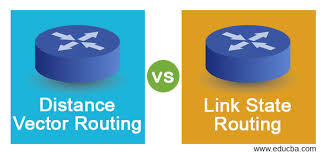

# 🌐 Routing Protocols - Link State vs Distance Vector

<div align="center">



**Complete Guide to Dynamic Routing Approaches**

[](.)
[](.)

[📖 Overview](#-overview) • [📡 Distance Vector](#-distance-vector-protocol) • [🗺️ Link State](#️-link-state-protocol) • [📊 Comparison](#-comparison)

</div>

---

## 📖 Overview

**Routing Protocols** automatically share network information between routers to find the best paths.

### Two Main Types:

| Type | Examples | Algorithm | Knowledge |
|------|----------|-----------|-----------|
| **Distance Vector** | RIP, EIGRP | Bellman-Ford | Neighbors only |
| **Link State** | OSPF, IS-IS | Dijkstra | Complete network map |

---

## 📚 Table of Contents

- [📡 Distance Vector Protocol](#-distance-vector-protocol)
  - [Core Concept](#core-concept)
  - [How It Works](#how-it-works)
  - [Example](#example)
  - [Key Points](#key-points)
- [🗺️ Link State Protocol](#️-link-state-protocol)
  - [Core Concept](#core-concept-1)
  - [How It Works](#how-it-works-1)
  - [Example](#example-1)
  - [Key Points](#key-points-1)
- [📊 Comparison](#-comparison)
- [📝 Quick Reference](#-quick-reference)

---

## 📡 Distance Vector Protocol

### Simple Definition

Each router only talks to its **neighbors** and learns about **distances** (hops) from them.

---

### Core Concept

**"My neighbor told me, I'll pass it forward"**

**Key Principle:**
```
Router:
├─ Knows its directly connected networks
├─ Gets distance information from neighbors
└─ Forwards this information ahead
```

---

### How It Works

**Step-by-Step Process:**

```
Step 1: Each router identifies its directly connected networks

Step 2: Exchange routing tables with neighbors

Step 3: Each neighbor tells:
        "I can reach network X in Y hops"

Step 4: Router calculates:
        "If my neighbor is Y hops away, I'll reach in Y+1 hops"

Step 5: Selects best route (minimum hops)

Step 6: Periodically (every 30 seconds) sends updates
```

---

### Example

**Network:**
```
A ---[1]--- B ---[1]--- C ---[1]--- D
```

**Router A's Thinking:**

```
Step 1: Direct connection
- B directly connected (1 hop) ✓

Step 2: Router B tells A
- "I can reach C in 1 hop"

Step 3: Router A calculates
- To reach C = 1 (A→B) + 1 (B→C) = 2 hops

Step 4: Router B also tells
- "D is 2 hops away"

Step 5: Router A calculates
- To reach D = 1 (A→B) + 2 (B→D) = 3 hops
```

**Router A's Routing Table:**
```
Destination    Hops    Next Hop
B              1       B (direct)
C              2       B
D              3       B
```

---

### Real-Life Analogy

**Distance Vector = Asking for Directions:**

```
You: "How do I get to the railway station?"

Local: "Go straight 2 km, then ask someone else"
       (They haven't seen it themselves, heard from someone)

Distance Vector Router works the same:
- No complete map
- Gets info from neighbors
- Forwards it ahead
```

---

### Key Points

**1. No Complete Map:**
```
✓ Only direct info about neighbors
✓ Everything else is indirect (like a rumor)
✗ No complete network topology knowledge
```

**2. Share Routing Tables:**
```
✓ Periodic updates (every 30 sec)
✓ Send entire routing table
✗ Bandwidth wastage
```

**3. Bellman-Ford Algorithm:**
```
✓ For distance calculation
✓ Can handle negative weights
✓ Slow convergence
```

**4. Count to Infinity Problem:**
```
⚠️ Confusion when network goes down
⚠️ Routers keep giving each other wrong info
⚠️ Solution: Split Horizon, Route Poisoning
```

---

### Example Protocol - RIP

**RIP (Routing Information Protocol):**

```
Version: RIP v1, RIP v2
Metric: Hop count (max 15)
Updates: Every 30 seconds
Algorithm: Bellman-Ford
Convergence: Slow
```

**RIP Configuration Example:**
```cisco
Router(config)# router rip
Router(config-router)# version 2
Router(config-router)# network 192.168.1.0
Router(config-router)# network 10.0.0.0
```

---

## 🗺️ Link State Protocol

### Core Concept

Each router has a **complete map of the entire network**, allowing it to **calculate the best path itself**!

---

### How It Works

**Step-by-Step Process:**

```
Step 1: Each router collects info about its directly connected neighbors

Step 2: Packs this information into an LSA (Link State Advertisement)
        LSA contains:
        - Router ID
        - Connected networks
        - Link costs
        - Link status (up/down)

Step 3: Floods LSA throughout the ENTIRE NETWORK (broadcast)

Step 4: Every router receives everyone's LSAs

Step 5: Result: Each router has complete network topology database

Step 6: Calculates shortest path using Dijkstra algorithm

Step 7: Only sends updates when changes occur (not periodic)
```

---

### Real-Life Analogy

**Link State = Google Maps:**

```
You have Google Maps:

✓ Shows complete city map
✓ Real-time traffic conditions
✓ You calculate shortest route yourself
✓ No need to ask anyone

Link State Router works the same:
✓ Has complete network topology
✓ Changes update immediately
✓ Calculates best path itself
```

---

### Example

**Network:**
```
     [5]
A -------- B
|          |
|[2]    [3]|
|          |
C ---[1]-- D
```

**Link State Process:**

```
Step 1: Router A creates its LSA
LSA-A:
- Neighbor B, cost 5
- Neighbor C, cost 2

Step 2: Router A sends this LSA to everyone

Step 3: Similarly, B, C, D send their LSAs

Step 4: All routers have complete info
A knows:
- A-B: 5
- A-C: 2
- B-D: 3
- C-D: 1

Step 5: Calculate using Dijkstra algorithm
A to D shortest path:
Option 1: A→B→D = 5+3 = 8
Option 2: A→C→D = 2+1 = 3 ✅ (Best!)

Result: A chooses A→C→D path
```

---

### LSA (Link State Advertisement)

**What's Inside LSA?**

```
LSA Format:
├─ Router ID (identification)
├─ Sequence Number (freshness tracking)
├─ Age (expiry time)
├─ Link Information:
│  ├─ Connected network
│  ├─ Link cost (metric)
│  └─ Link state (up/down)
└─ Checksum (data integrity)
```

**LSA Flooding:**
```
Router A generates LSA
     ↓
Sends to all neighbors
     ↓
Neighbors forward to THEIR neighbors
     ↓
Continue until all routers receive
     ↓
Complete network topology built!
```

---

### Key Points

**1. Complete Network Map:**
```
✓ Each router knows entire topology
✓ LSA flooding gives everyone all info
✓ Maintains Link State Database (LSDB)
```

**2. Event-Based Updates:**
```
✓ Only updates when change occurs (not periodic)
✓ Link down → immediate LSA
✓ Bandwidth efficient
```

**3. Dijkstra Algorithm:**
```
✓ Shortest path calculation
✓ Fast and accurate
✓ Positive weights only
```

**4. Fast Convergence:**
```
✓ Changes propagate quickly
✓ All routers recalculate simultaneously
✓ Network stabilizes fast
```

**5. Higher Resource Usage:**
```
⚠️ More memory (LSDB storage)
⚠️ More CPU (Dijkstra calculations)
✓ But worth it for reliability!
```

---

### Example Protocol - OSPF

**OSPF (Open Shortest Path First):**

```
Type: Link State
Metric: Cost (based on bandwidth)
Updates: Event-triggered
Algorithm: Dijkstra
Areas: Hierarchical design
Convergence: Fast
```

**OSPF Configuration Example:**
```cisco
Router(config)# router ospf 1
Router(config-router)# network 192.168.1.0 0.0.0.255 area 0
Router(config-router)# network 10.0.0.0 0.255.255.255 area 0
```

---

## 📊 Comparison

### Distance Vector vs Link State

<div align="center">

| Feature | Distance Vector | Link State |
|---------|-----------------|------------|
| **Knowledge** | Only neighbors | Complete network |
| **Updates** | Periodic (every 30 sec) | Event-based (when change occurs) |
| **Update Type** | Complete routing table | Only changes (LSA) |
| **Convergence** | Slow ⏱️ | Fast ⚡ |
| **Bandwidth Usage** | High (periodic full updates) | Low (only changes) |
| **Memory** | Less 💾 | More 💾💾 |
| **CPU** | Less 🔧 | More 🔧🔧 |
| **Loops** | Can occur ⚠️ | Don't occur ✅ |
| **Scalability** | Small networks | Large networks |
| **Algorithm** | Bellman-Ford | Dijkstra |
| **Metric** | Hop count | Cost, bandwidth |
| **Examples** | RIP, IGRP | OSPF, IS-IS |

</div>

---

### Visual Comparison

**Distance Vector Approach:**

```
Router A's View:

├─ Direct: B (1 hop)
├─ Via B: C (2 hops) ← B told me
└─ Via B: D (3 hops) ← B told me

Problem: If B gives wrong info, A doesn't know!
```

**Link State Approach:**

```
Router A's Complete Map:

A ── B
│    │
C ── D

A knows:
├─ All routers: A, B, C, D
├─ All links: A-B, A-C, B-D, C-D
└─ All costs: 5, 2, 3, 1

A calculates its own path! ✅
```

---

### When to Use What?

**Use Distance Vector When:**
```
✓ Small network (few routers)
✓ Simple topology
✓ Limited resources (memory, CPU)
✓ Easy configuration needed
✓ Example: Home office, small branch
```

**Use Link State When:**
```
✓ Large network (many routers)
✓ Complex topology
✓ Fast convergence required
✓ Reliability critical
✓ Resources available (memory, CPU)
✓ Example: Enterprise, ISP, data center
```

---

### Convergence Time Example

**Scenario:** Link between B-D goes down

**Distance Vector (RIP):**
```
Time 0s: Link B-D fails
Time 30s: B detects, sends update
Time 60s: A receives update
Time 90s: A updates routing table
Total: 90+ seconds ⏱️
```

**Link State (OSPF):**
```
Time 0s: Link B-D fails
Time 0.5s: B detects, sends LSA
Time 1s: All routers receive LSA
Time 2s: All routers recalculate
Total: ~2 seconds ⚡
```

---

## 📝 Quick Reference

### Protocol Characteristics

#### Distance Vector Protocols:

**RIP (Routing Information Protocol):**
```
Max Hops: 15
Update Timer: 30 seconds
Metric: Hop count
Best For: Small networks
Version: RIPv1 (classful), RIPv2 (classless)
```

**EIGRP (Enhanced Interior Gateway Routing Protocol):**
```
Type: Advanced Distance Vector (Hybrid)
Metric: Bandwidth, delay, load, reliability
Updates: Partial (only changes)
Convergence: Fast (DUAL algorithm)
Vendor: Cisco proprietary
```

---

#### Link State Protocols:

**OSPF (Open Shortest Path First):**
```
Standard: Open (RFC 2328)
Metric: Cost (100,000,000 / bandwidth)
Areas: Hierarchical design
Updates: LSA flooding
Scalability: Very high
```

**IS-IS (Intermediate System to Intermediate System):**
```
Type: Link State
Used By: Large ISPs
Metric: Cost
Levels: L1 (intra-area), L2 (inter-area)
Scalability: Extremely high
```

---

### Key Concepts Summary

**Distance Vector:**
```
✓ "Trust your neighbors"
✓ Rumor-based routing
✓ Simple but slow
✓ Periodic updates
✓ Limited visibility
```

**Link State:**
```
✓ "See everything yourself"
✓ Map-based routing
✓ Complex but fast
✓ Event-driven updates
✓ Complete visibility
```

---

### Common Problems and Solutions

#### Distance Vector Problems:

**1. Count to Infinity:**
```
Problem: Infinite loop when network goes down
Solution:
├─ Split Horizon (don't advertise back)
├─ Route Poisoning (advertise as unreachable)
└─ Hold-down timers (wait before accepting)
```

**2. Slow Convergence:**
```
Problem: Changes propagate slowly
Solution:
├─ Triggered updates (immediate on change)
└─ Reduce update timers (but increases traffic)
```

---

#### Link State Problems:

**1. Initial Flooding:**
```
Problem: All LSAs flood at once
Solution:
├─ Paced LSA generation
└─ Areas (OSPF) - limit flooding scope
```

**2. Resource Intensive:**
```
Problem: High memory and CPU usage
Solution:
├─ Hierarchical design (OSPF areas)
├─ Route summarization
└─ Stub areas (reduce LSAs)
```

---

---

## 🎓 What I Learned

✅ **Distance Vector Protocol** - Neighbor-based routing  
✅ **Link State Protocol** - Complete topology knowledge  
✅ **Bellman-Ford Algorithm** - Used in distance vector  
✅ **Dijkstra Algorithm** - Used in link state  
✅ **LSA Flooding** - How link state builds topology  
✅ **Convergence Time** - Distance vector slow, link state fast  
✅ **Protocol Selection** - When to use which type  
✅ **Real Protocols** - RIP, EIGRP, OSPF, IS-IS  

---

## 🚀 How to Use This Repository

1. **Clone the repository:**
   ```bash
   git clone https://github.com/abdul-wahid022/Routing-Protocols.git
   ```

2. **Study the concepts:**
   - Understand distance vector first (simpler)
   - Then learn link state (complex but powerful)
   - Compare their approaches

3. **Learn protocols:**
   - Practice RIP configuration
   - Master OSPF configuration
   - Understand when to use which

4. **Apply knowledge:**
   - Design networks appropriately
   - Choose right protocol for scenario
   - Troubleshoot routing issues

---

## 📞 Connect With Me

<div align="center">

[](mailto:a.wahid7860668@gmail.com)
[](https://www.linkedin.com/in/abdul-wahid022)
[](https://github.com/abdul-wahid022)

**💬 Questions? Need clarification? Feel free to reach out!**

</div>

---

## 📄 License

This project is created for **educational purposes** and is open-source.

---

<div align="center">

### ⭐ If you found this helpful, please give it a star!

**Made with 💙 by ABDUL WAHID**

*Last Updated: January 2026*

</div>
