# 🌐 NAT & PAT (Network Address Translation)

<div align="center">

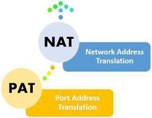

**Complete Guide to IP Address Translation and Internet Connectivity**

[](.)
[](.)
[](.)

[📖 Overview](#-overview) • [🎯 Concept](#-concept) • [🔧 Static NAT](#-static-nat) • [⚡ Dynamic NAT](#-dynamic-nat) • [🚀 PAT](#-pat-port-address-translation)

</div>

---

## 📖 Overview

**NAT (Network Address Translation)** is a networking technique that translates IP addresses, enabling private networks to communicate with the internet.

### Key Features:

| Feature | Details |
|---------|---------|
| **Purpose** | Translate private IPs to public IPs |
| **Types** | Static NAT, Dynamic NAT, PAT (Overload) |
| **Main Benefit** | Conserve public IP addresses |
| **Security** | Hides internal network structure |
| **Common Use** | Home routers, office networks |

---

## 📚 Table of Contents

- [🎯 Concept](#-concept)
- [🔧 Static NAT](#-static-nat)
- [⚡ Dynamic NAT](#-dynamic-nat)
- [🚀 PAT (Port Address Translation)](#-pat-port-address-translation)
- [📊 Comparison](#-nat-types-comparison)
- [📝 Quick Reference](#-quick-reference)

---

## 🎯 Concept

### Basic Understanding

**The Problem:**

```
Your home devices:
├─ Phone: 192.168.1.5
├─ Laptop: 192.168.1.6
├─ Tablet: 192.168.1.7
└─ Smart TV: 192.168.1.8

These are PRIVATE IPs - Internet doesn't recognize them! ❌
```

**The Solution - NAT:**

```
NAT Router translates:
Private IP → Public IP → Internet ✓

Device (192.168.1.5) → Router (203.0.113.5) → Internet
```

---

### Why NAT is Essential

#### 1. IPv4 Address Shortage

```
Problem: Only ~4 billion IPv4 addresses exist
Reality: Billions of devices need internet access

Solution: NAT allows multiple devices to share one public IP!
```

#### 2. Security

```
Private Network:
├─ Internal IPs hidden from internet
├─ Direct access from outside blocked
└─ NAT acts like a firewall

Without NAT: Devices directly exposed ❌
With NAT: Internal structure hidden ✓
```

#### 3. Cost Efficiency

```
Without NAT: 100 devices = 100 public IPs needed
With NAT: 100 devices = 1 public IP needed!

Savings: Huge! (Public IPs are expensive)
```

---

### How NAT Works

**Step-by-Step Process:**

```
1. Device sends request:
   Source: 192.168.1.5:50001
   Destination: 8.8.8.8:80 (Google DNS)

2. NAT Router translates:
   Changes source to: 203.0.113.5:50001
   Keeps destination: 8.8.8.8:80

3. Internet sees:
   Request from: 203.0.113.5 (public IP)
   
4. Response comes back:
   To: 203.0.113.5:50001

5. NAT Router translates back:
   Sends to: 192.168.1.5:50001
   
6. Device receives response ✓
```

---

### NAT Terminology

<div align="center">

| Term | Meaning | Example |
|------|---------|---------|
| **Inside Local** | Private IP (internal network) | 192.168.1.5 |
| **Inside Global** | Public IP (on internet) | 203.0.113.5 |
| **Outside Local** | Destination as router sees | 8.8.8.8 |
| **Outside Global** | Real destination IP | 8.8.8.8 |

</div>

**Simple Explanation:**
```
Inside = Your network
Outside = Internet
Local = Private address
Global = Public address
```

---

## 🔧 Static NAT

### Concept

<div align="center">

| Feature | Details |
|---------|---------|
| **Type** | One-to-One mapping |
| **Mapping** | Permanent (fixed) |
| **Public IPs Needed** | Equal to private IPs |
| **Use Case** | Servers requiring permanent access |
| **Example** | Web server, Email server |

</div>

### How It Works

**Static NAT = Fixed Mapping:**

```
Private IP      ←→      Public IP
192.168.1.10    ←→    203.0.113.10 (Permanent)
192.168.1.11    ←→    203.0.113.11 (Permanent)
192.168.1.12    ←→    203.0.113.12 (Permanent)

Always same mapping, never changes!
```

**Real-Life Example:**
```
Company web server:
- Internal IP: 192.168.1.10
- Public IP: 203.0.113.10
- Domain: www.company.com → 203.0.113.10

Server always needs same public IP!
```

**Disadvantage:**
```
10 devices = 10 public IPs needed
100 devices = 100 public IPs needed

Wasteful and expensive! ❌
```

---

### Lab Implementation - Static NAT

#### 📊 Network Topology:

<p align="center">
  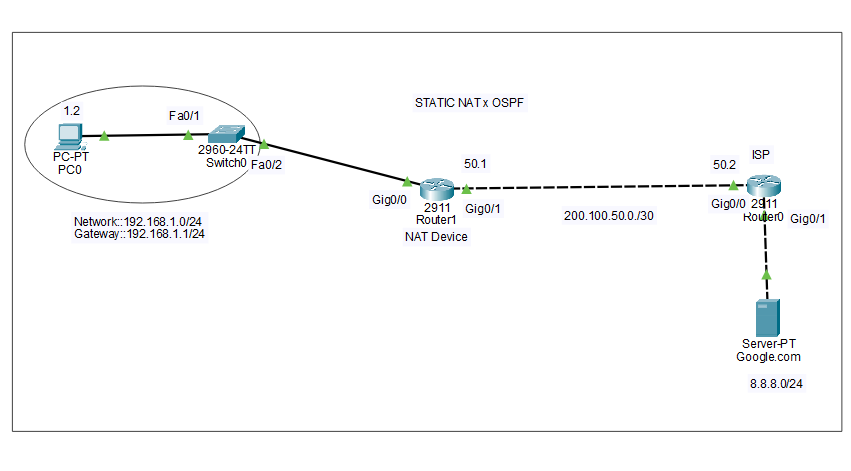
</p>

**Network Design:**
```
Private Network (192.168.10.0/24)
        ↓
   [NAT Router]
        ↓
Public Network (200.0.0.0/24)
        ↓
    [Internet]
```

---

### Configuration - NAT Device

<p align="center">
  
</p>

**IP Assignment:**

| Interface | IP Address | Type |
|-----------|------------|------|
| **Fa0/0** | 192.168.10.1 | Inside (Private) |
| **Fa0/1** | 200.0.0.1 | Outside (Public) |

```cisco
! NAT Device - Interface Configuration
Router(config)# interface fastEthernet 0/0
Router(config-if)# ip address 192.168.10.1 255.255.255.0
Router(config-if)# ip nat inside
Router(config-if)# no shutdown
Router(config-if)# exit

Router(config)# interface fastEthernet 0/1
Router(config-if)# ip address 200.0.0.1 255.255.255.0
Router(config-if)# ip nat outside
Router(config-if)# no shutdown
Router(config-if)# exit
```

---

#### OSPF Configuration (NAT Router):

<p align="center">
  
</p>

```cisco
! OSPF Configuration
Router(config)# router ospf 1
Router(config-router)# network 192.168.10.0 0.0.0.255 area 0
Router(config-router)# network 200.0.0.0 0.0.0.255 area 0
Router(config-router)# exit
```

---

### Configuration - Router 0

<p align="center">
  
</p>

```cisco
! Router 0 Configuration
Router(config)# interface fastEthernet 0/0
Router(config-if)# ip address 200.0.0.2 255.255.255.0
Router(config-if)# no shutdown
Router(config-if)# exit

Router(config)# interface fastEthernet 0/1
Router(config-if)# ip address 210.0.0.1 255.255.255.0
Router(config-if)# no shutdown
Router(config-if)# exit
```

---

#### OSPF Configuration (Router 0):

<p align="center">
  
</p>

```cisco
! OSPF for Router 0
Router(config)# router ospf 1
Router(config-router)# network 200.0.0.0 0.0.0.255 area 0
Router(config-router)# network 210.0.0.0 0.0.0.255 area 0
Router(config-router)# exit
```

---

#### Verification:

<p align="center">
  
</p>

```cisco
Router# show ip route
Router# show ip ospf neighbor
```

---

### Static NAT Configuration

<p align="center">
  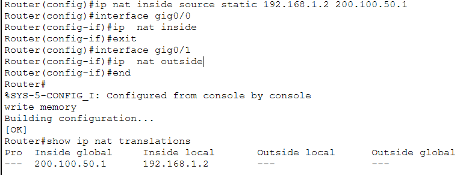
</p>

```cisco
! Static NAT Configuration on NAT Router
Router(config)# ip nat inside source static 192.168.10.10 200.0.0.10
Router(config)# ip nat inside source static 192.168.10.11 200.0.0.11
Router(config)# ip nat inside source static 192.168.10.12 200.0.0.12
```

**Command Breakdown:**
```
ip nat inside source static [inside-local] [inside-global]
                              ↓               ↓
                         Private IP      Public IP

Example:
ip nat inside source static 192.168.10.10 200.0.0.10
                              ↑                ↑
                        PC's real IP    IP seen on internet
```

---

### Results - Static NAT

<p align="center">
  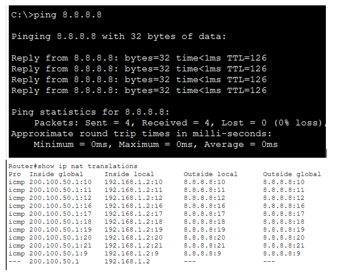
</p>

**Verification Commands:**
```cisco
Router# show ip nat translations
Router# show ip nat statistics
```

**Translation Table:**
```
Pro Inside global      Inside local       Outside local      Outside global
--- 200.0.0.10         192.168.10.10      ---                ---
--- 200.0.0.11         192.168.10.11      ---                ---
--- 200.0.0.12         192.168.10.12      ---                ---
```

**Result:** ✅ Static NAT configured successfully, permanent mappings created

---

## ⚡ Dynamic NAT

### Concept

<div align="center">

| Feature | Details |
|---------|---------|
| **Type** | Many-to-Many (Pool-based) |
| **Mapping** | Temporary (dynamic) |
| **Public IPs Needed** | Pool of public IPs |
| **Use Case** | Multiple users, limited public IPs |
| **Limitation** | If pool exhausted, no new connections |

</div>

### How It Works

**Dynamic NAT = Temporary Assignment from Pool:**

```
Public IP Pool: 203.0.113.10 to 203.0.113.20 (11 IPs)

When device needs internet:
├─ Gets an IP from pool
├─ Uses it for the session
└─ Returns to pool when done

First come, first served!
```

**Example:**
```
Time 10:00 AM:
PC1 (192.168.1.5) → Gets 203.0.113.10
PC2 (192.168.1.6) → Gets 203.0.113.11

Time 10:30 AM (PC1 disconnects):
203.0.113.10 → Back to pool (available)

Time 10:45 AM:
PC3 (192.168.1.7) → Gets 203.0.113.10 (reused)
```

**Problem:**
```
Pool has 11 IPs
12th user tries to connect → BLOCKED! ❌

Pool exhausted = No internet for new users
```

---

### Lab Implementation - Dynamic NAT

#### 📊 Network Topology:

<p align="center">
  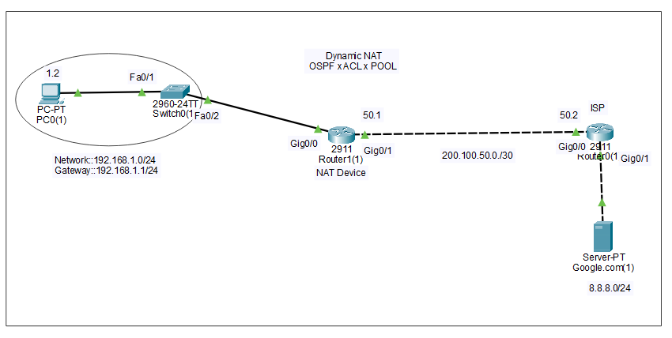
</p>

---

### Configuration - NAT Device

<p align="center">
  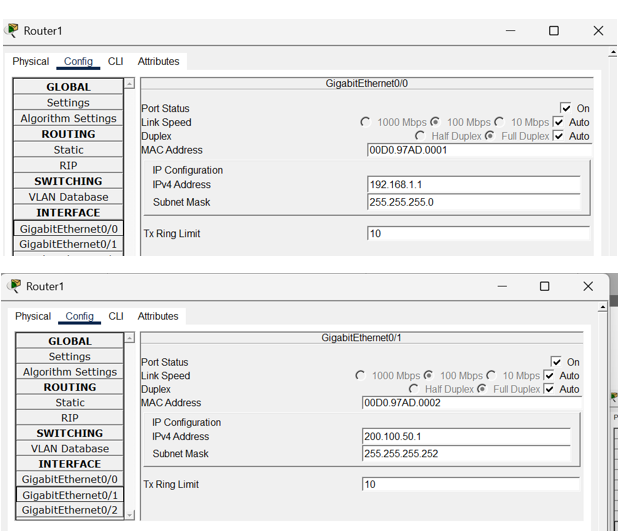
</p>

```cisco
! NAT Device - Interface Configuration
Router(config)# interface fastEthernet 0/0
Router(config-if)# ip address 192.168.10.1 255.255.255.0
Router(config-if)# ip nat inside
Router(config-if)# no shutdown
Router(config-if)# exit

Router(config)# interface fastEthernet 0/1
Router(config-if)# ip address 200.0.0.1 255.255.255.0
Router(config-if)# ip nat outside
Router(config-if)# no shutdown
Router(config-if)# exit
```

---

#### OSPF Configuration (NAT Router):

<p align="center">
  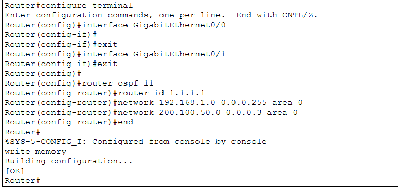
</p>

```cisco
! OSPF for NAT Router
Router(config)# router ospf 1
Router(config-router)# network 192.168.10.0 0.0.0.255 area 0
Router(config-router)# network 200.0.0.0 0.0.0.255 area 0
Router(config-router)# exit
```

---

### Configuration - Router 0

<p align="center">
  
</p>

```cisco
! Router 0 Configuration
Router(config)# interface fastEthernet 0/0
Router(config-if)# ip address 200.0.0.2 255.255.255.0
Router(config-if)# no shutdown
Router(config-if)# exit

Router(config)# interface fastEthernet 0/1
Router(config-if)# ip address 210.0.0.1 255.255.255.0
Router(config-if)# no shutdown
Router(config-if)# exit
```

---

#### OSPF Configuration (Router 0):

<p align="center">
  
</p>

```cisco
! OSPF for Router 0
Router(config)# router ospf 1
Router(config-router)# network 200.0.0.0 0.0.0.255 area 0
Router(config-router)# network 210.0.0.0 0.0.0.255 area 0
Router(config-router)# exit
```

---

#### Verification:

<p align="center">
  
</p>

---

### Dynamic NAT Configuration

<p align="center">
  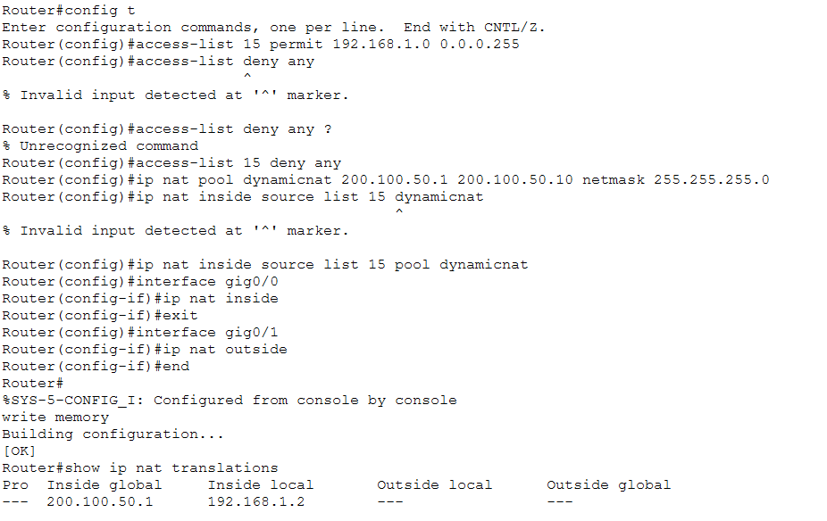
</p>

**Step 1: Create Access List (Define which IPs can use NAT):**
```cisco
Router(config)# access-list 1 permit 192.168.10.0 0.0.0.255
```

**Step 2: Create Public IP Pool:**
```cisco
Router(config)# ip nat pool PUBLIC_POOL 200.0.0.10 200.0.0.20 netmask 255.255.255.0
```

**Step 3: Link ACL with Pool:**
```cisco
Router(config)# ip nat inside source list 1 pool PUBLIC_POOL
```

**Step 4: Define Inside/Outside Interfaces (Already done above):**
```cisco
Router(config)# interface fa0/0
Router(config-if)# ip nat inside

Router(config)# interface fa0/1
Router(config-if)# ip nat outside
```

---

### Command Explanation

**1. Access List:**
```cisco
access-list 1 permit 192.168.10.0 0.0.0.255
```
```
Purpose: Define which private IPs can use NAT
0.0.0.255 = Wildcard mask (allows 192.168.10.0 - 192.168.10.255)
```

**2. NAT Pool:**
```cisco
ip nat pool PUBLIC_POOL 200.0.0.10 200.0.0.20 netmask 255.255.255.0
```
```
PUBLIC_POOL = Pool name (any name)
200.0.0.10 to 200.0.0.20 = 11 public IPs available
netmask = Subnet mask for public IPs
```

**3. Link ACL to Pool:**
```cisco
ip nat inside source list 1 pool PUBLIC_POOL
```
```
list 1 = Access list number
pool PUBLIC_POOL = Pool name created above
```

---

### Results - Dynamic NAT

<p align="center">
  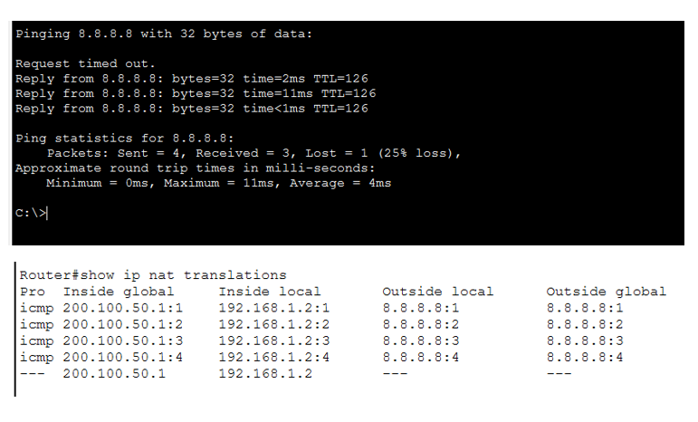
</p>

**Verification:**
```cisco
Router# show ip nat translations
Router# show ip nat statistics
Router# show access-lists
```

**Result:** ✅ Dynamic NAT working, IPs assigned from pool dynamically

---

## 🚀 PAT (Port Address Translation)

### Concept

<div align="center">

| Feature | Details |
|---------|---------|
| **Type** | Many-to-One (Overload) |
| **Mapping** | Port-based differentiation |
| **Public IPs Needed** | Just 1 (or very few) |
| **Connections** | 65,000+ per public IP |
| **Use Case** | Home routers, offices (MOST COMMON) |

</div>

### How It Works

**PAT = One IP, Different Ports:**

```
Many Private IPs → 1 Public IP (using different ports)

192.168.1.2:50001  →  203.0.113.5:50001
192.168.1.3:50002  →  203.0.113.5:50002
192.168.1.4:50003  →  203.0.113.5:50003
192.168.1.5:50004  →  203.0.113.5:50004
...up to 65,000+ connections!

All using same public IP: 203.0.113.5
Differentiated by port numbers! ✓
```

**Real-Life Example:**
```
Your home WiFi:
- Phone: 192.168.1.5:51000 → 203.0.113.5:51000
- Laptop: 192.168.1.6:51001 → 203.0.113.5:51001
- Tablet: 192.168.1.7:51002 → 203.0.113.5:51002
- Smart TV: 192.168.1.8:51003 → 203.0.113.5:51003

All devices share 1 public IP!
Router tracks connections by port numbers.
```

**Why PAT is Best:**
```
✅ Most efficient (1 IP for thousands of devices)
✅ Cost-effective (no need for multiple public IPs)
✅ Scalable (65,000+ simultaneous connections)
✅ Default in home/office routers
```

---

### Lab Implementation - PAT

#### 📊 Network Topology:

<p align="center">
  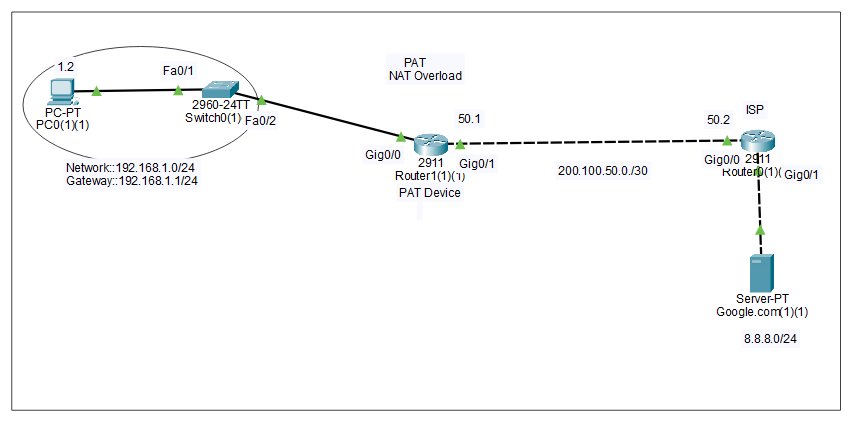
</p>

---

### Configuration - PAT Device

<p align="center">
  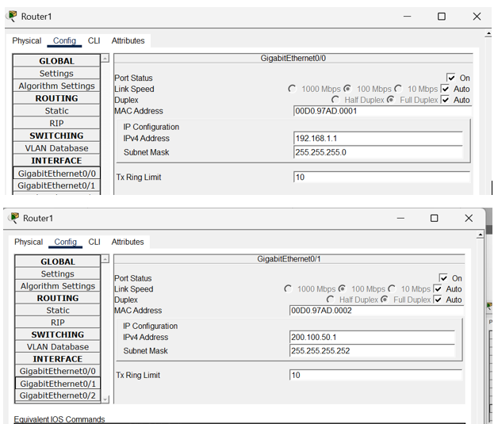
</p>

```cisco
! PAT Device - Interface Configuration
Router(config)# interface fastEthernet 0/0
Router(config-if)# ip address 192.168.10.1 255.255.255.0
Router(config-if)# ip nat inside
Router(config-if)# no shutdown
Router(config-if)# exit

Router(config)# interface fastEthernet 0/1
Router(config-if)# ip address 200.0.0.1 255.255.255.0
Router(config-if)# ip nat outside
Router(config-if)# no shutdown
Router(config-if)# exit
```

---

#### OSPF Configuration (PAT Router):

<p align="center">
  
</p>

```cisco
! OSPF for PAT Router
Router(config)# router ospf 1
Router(config-router)# network 192.168.10.0 0.0.0.255 area 0
Router(config-router)# network 200.0.0.0 0.0.0.255 area 0
Router(config-router)# exit
```

---

### Configuration - Router 0

<p align="center">
  
</p>

```cisco
! Router 0 Configuration
Router(config)# interface fastEthernet 0/0
Router(config-if)# ip address 200.0.0.2 255.255.255.0
Router(config-if)# no shutdown
Router(config-if)# exit

Router(config)# interface fastEthernet 0/1
Router(config-if)# ip address 210.0.0.1 255.255.255.0
Router(config-if)# no shutdown
Router(config-if)# exit
```

---

#### OSPF Configuration (Router 0):

<p align="center">
  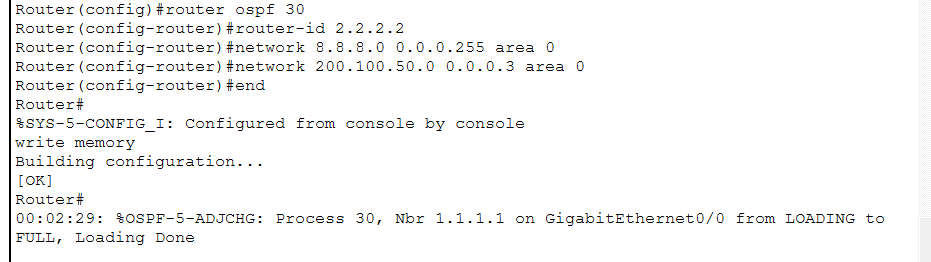
</p>

```cisco
! OSPF for Router 0
Router(config)# router ospf 1
Router(config-router)# network 200.0.0.0 0.0.0.255 area 0
Router(config-router)# network 210.0.0.0 0.0.0.255 area 0
Router(config-router)# exit
```

---

#### Verification:

<p align="center">
  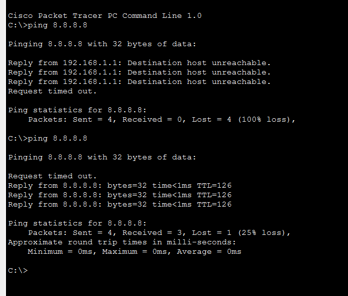
</p>

---

### PAT Configuration

<p align="center">
  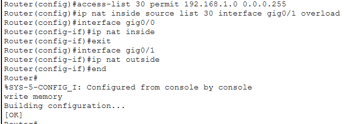
</p>

**Method 1: PAT with Pool (Less Common):**

```cisco
! Step 1: Create ACL
Router(config)# access-list 1 permit 192.168.10.0 0.0.0.255

! Step 2: Create Pool (even 1 IP)
Router(config)# ip nat pool PAT_POOL 200.0.0.10 200.0.0.10 netmask 255.255.255.0

! Step 3: Link with OVERLOAD keyword
Router(config)# ip nat inside source list 1 pool PAT_POOL overload
```

**Method 2: PAT with Interface (Most Common):**

```cisco
! Step 1: Create ACL
Router(config)# access-list 1 permit 192.168.10.0 0.0.0.255

! Step 2: Use interface IP with OVERLOAD
Router(config)# ip nat inside source list 1 interface fastEthernet 0/1 overload
```

---

### Command Explanation

**Key Difference: OVERLOAD Keyword**

```
Without overload:
ip nat inside source list 1 pool POOL_NAME
→ This is Dynamic NAT (pool-based, limited)

With overload:
ip nat inside source list 1 pool POOL_NAME overload
→ This is PAT (port-based, unlimited*)

OVERLOAD = PAT Magic! ⚡
```

**Interface-based PAT (Most Common):**
```cisco
ip nat inside source list 1 interface fa0/1 overload
```
```
list 1 = ACL defining private IPs
interface fa0/1 = Use this interface's public IP
overload = Enable PAT (port translation)

Result: All devices share fa0/1's IP with different ports
```

---

### Results - PAT

<p align="center">
  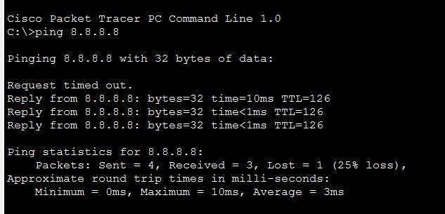
</p>

**Testing from PC to Server:**
```
PC (192.168.10.10) → Server (210.0.0.10)

NAT Translation:
192.168.10.10:50001 → 200.0.0.1:50001 → 210.0.0.10
```

---

<p align="center">
  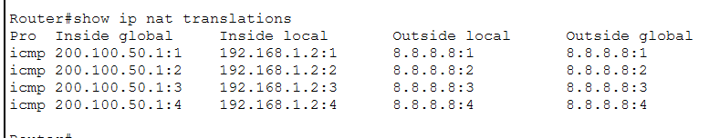
</p>

**Verification:**
```cisco
Router# show ip nat translations

Pro Inside global      Inside local       Outside local      Outside global
icmp 200.0.0.1:1      192.168.10.10:1    210.0.0.10:1      210.0.0.10:1
icmp 200.0.0.1:2      192.168.10.11:2    210.0.0.10:2      210.0.0.10:2
icmp 200.0.0.1:3      192.168.10.12:3    210.0.0.10:3      210.0.0.10:3
```

**Notice:** Same public IP (200.0.0.1), different ports (1, 2, 3)

**Result:** ✅ PAT successfully configured, all devices sharing one public IP

---

## 📊 NAT Types Comparison

### Quick Comparison

<div align="center">

| Feature | Static NAT | Dynamic NAT | PAT (Overload) |
|---------|------------|-------------|----------------|
| **Mapping** | One-to-One | Many-to-Many | Many-to-One |
| **Type** | Permanent | Temporary | Temporary |
| **Public IPs** | Equal to devices | Pool (multiple) | Just 1 (or few) |
| **Use Case** | Servers | Limited users | Home/Office |
| **Scalability** | ❌ Poor | ⚠️ Limited | ✅ Excellent |
| **Cost** | ❌ Expensive | ⚠️ Moderate | ✅ Cheap |
| **Connections** | 1:1 | Limited by pool | 65,000+ |
| **Command** | `static` | `pool` | `overload` |

</div>

---

### Visual Comparison

**Static NAT:**
```
10 Devices = 10 Public IPs needed
├─ PC1 (192.168.1.10) → 203.0.113.10 (permanent)
├─ PC2 (192.168.1.11) → 203.0.113.11 (permanent)
├─ PC3 (192.168.1.12) → 203.0.113.12 (permanent)
└─ ... (7 more)

Total: 10 public IPs ❌ Wasteful!
```

**Dynamic NAT:**
```
10 Devices, Pool of 5 Public IPs
├─ First 5 devices get IPs from pool ✓
└─ 6th device → BLOCKED! ❌

Pool exhausted = No new connections
```

**PAT (Best Solution):**
```
1000 Devices = 1 Public IP!
├─ PC1: 203.0.113.5:50001
├─ PC2: 203.0.113.5:50002
├─ PC3: 203.0.113.5:50003
└─ ... (up to 65,000 connections)

Total: 1 public IP ✅ Efficient!
```

---

### When to Use What?

**Use Static NAT:**
```
✓ Web servers (need permanent public IP)
✓ Email servers
✓ FTP servers
✓ Any service requiring DNS mapping
✓ External users need consistent access
```

**Use Dynamic NAT:**
```
⚠️ Rarely used nowadays
✓ Legacy systems
✓ Specific compliance requirements
✓ Limited public IPs but not concerned about efficiency
```

**Use PAT (Most Common):**
```
✅ Home networks
✅ Office networks
✅ Any scenario with limited public IPs
✅ Large number of internal devices
✅ Cost-effective solution needed
```

---

## 📝 Quick Reference

### Configuration Templates

#### Static NAT:
```cisco
! Define inside/outside
interface fa0/0
 ip nat inside
interface fa0/1
 ip nat outside

! Create static mappings
ip nat inside source static 192.168.1.10 203.0.113.10
ip nat inside source static 192.168.1.11 203.0.113.11
```

#### Dynamic NAT:
```cisco
! Define inside/outside
interface fa0/0
 ip nat inside
interface fa0/1
 ip nat outside

! Create ACL
access-list 1 permit 192.168.1.0 0.0.0.255

! Create pool
ip nat pool POOL_NAME 203.0.113.10 203.0.113.20 netmask 255.255.255.0

! Link ACL to pool
ip nat inside source list 1 pool POOL_NAME
```

#### PAT (Method 1 - Pool):
```cisco
! ACL
access-list 1 permit 192.168.1.0 0.0.0.255

! Pool (can be single IP)
ip nat pool PAT_POOL 203.0.113.5 203.0.113.5 netmask 255.255.255.0

! Link with overload
ip nat inside source list 1 pool PAT_POOL overload
```

#### PAT (Method 2 - Interface, Most Common):
```cisco
! ACL
access-list 1 permit 192.168.1.0 0.0.0.255

! Use interface IP
ip nat inside source list 1 interface fa0/1 overload
```

---

### Verification Commands

```cisco
! View all translations
show ip nat translations

! View NAT statistics
show ip nat statistics

! Clear translations
clear ip nat translation *

! Debug NAT (use carefully)
debug ip nat
debug ip nat detailed
```

---

### Troubleshooting Guide

| Issue | Possible Cause | Solution |
|-------|---------------|----------|
| **NAT not working** | Inside/Outside not set | Check `ip nat inside/outside` on interfaces |
| | ACL blocking traffic | Verify ACL permits correct network |
| | Routing issue | Check routing table |
| **Pool exhausted** | Too many users | Increase pool size or use PAT |
| | Timeout too long | Reduce NAT timeout values |
| **PAT not working** | Missing `overload` | Add `overload` keyword |
| | ACL misconfigured | Verify wildcard mask |

---

### Important Points

**1. Inside vs Outside:**
```
ip nat inside = Private network interface
ip nat outside = Public/Internet interface

MUST configure both!
```

**2. Access List Wildcard Mask:**
```
Subnet Mask: 255.255.255.0
Wildcard Mask: 0.0.0.255

Formula: Wildcard = 255.255.255.255 - Subnet Mask
```

**3. Overload Keyword:**
```
Critical for PAT!
Without overload = Dynamic NAT (limited)
With overload = PAT (unlimited)
```

**4. Port Range:**
```
PAT uses ports: 1024-65535
Each connection gets unique port
Maximum ~65,000 simultaneous connections per IP
```

---

### Best Practices

1. **Use PAT for most scenarios**
   ```
   Most efficient and cost-effective
   ```

2. **Static NAT for servers only**
   ```
   Only when permanent public IP needed
   ```

3. **Always configure inside/outside**
   ```
   NAT won't work without these
   ```

4. **Document your NAT mappings**
   ```
   Track which IPs are used for what
   ```

5. **Use meaningful pool names**
   ```
   POOL_NAME instead of POOL1
   ```

---
---

## 🎓 What I Learned

✅ **NAT Fundamentals** - IP address translation concepts  
✅ **Static NAT** - One-to-one permanent mapping for servers  
✅ **Dynamic NAT** - Pool-based temporary translation  
✅ **PAT (Overload)** - Port-based translation, most efficient  
✅ **Inside/Outside** - Proper interface designation  
✅ **Access Lists** - Controlling which IPs can use NAT  
✅ **Configuration** - Complete NAT/PAT implementation  
✅ **Integration** - NAT with OSPF routing protocol  
✅ **Troubleshooting** - Common issues and solutions  

---

## 🚀 How to Use This Repository

1. **Clone the repository:**
   ```bash
   git clone https://github.com/your-username/NAT-PAT-Implementation.git
   ```

2. **Study each type:**
   - Understand Static NAT concepts
   - Learn Dynamic NAT pool-based translation
   - Master PAT (most important)

3. **Practice in lab:**
   - Build topologies in Packet Tracer
   - Apply configurations
   - Test connectivity

4. **Real-world application:**
   - Understand home router operation
   - Learn enterprise NAT strategies
   - Practice troubleshooting

---

## 📞 Connect With Me

<div align="center">

[](mailto:a.wahid7860668@gmail.com)
[](https://www.linkedin.com/in/abdul-wahid022)
[](https://github.com/abdul-wahid022)

**💬 Questions? Need Packet Tracer files? Feel free to reach out!**

</div>

---

## 📄 License

This project is created for **educational purposes** and is open-source.

---

<div align="center">

### ⭐ If you found this helpful, please give it a star!

**Made with 💙 by ABDUL WAHID**

*Last Updated: January 2026*

</div>
