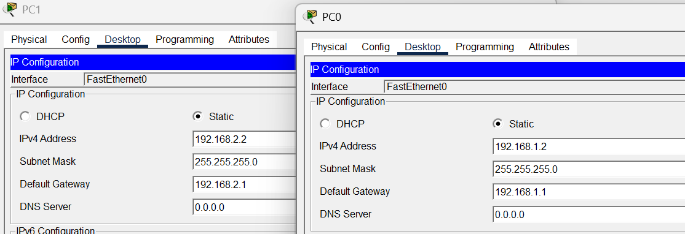
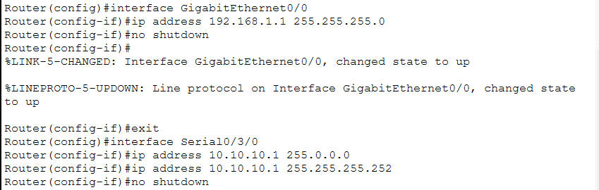
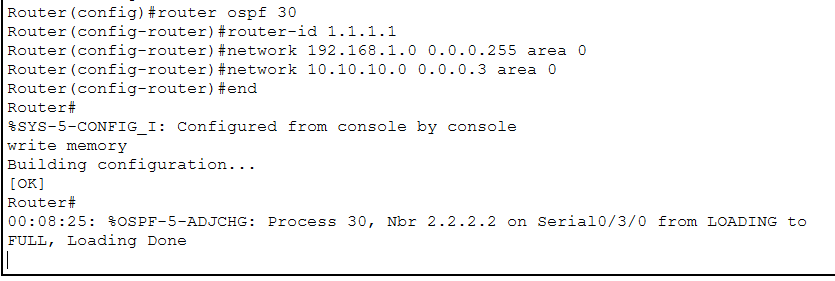
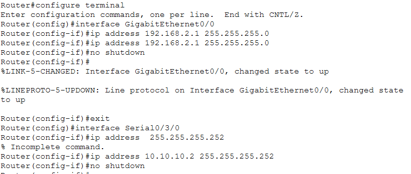
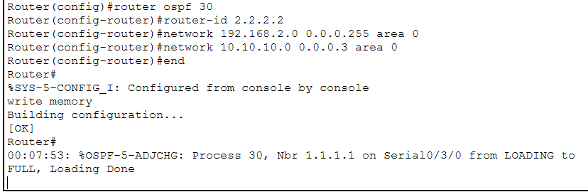
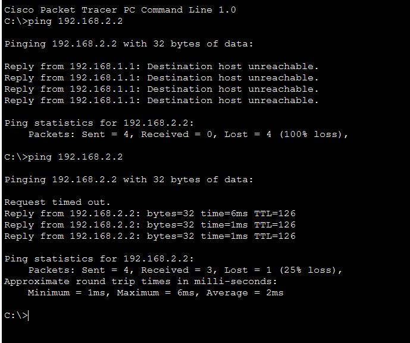
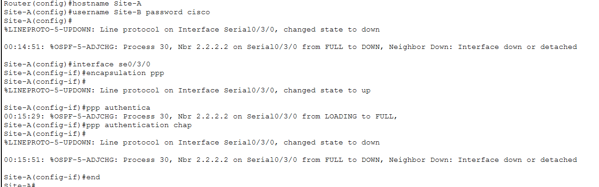
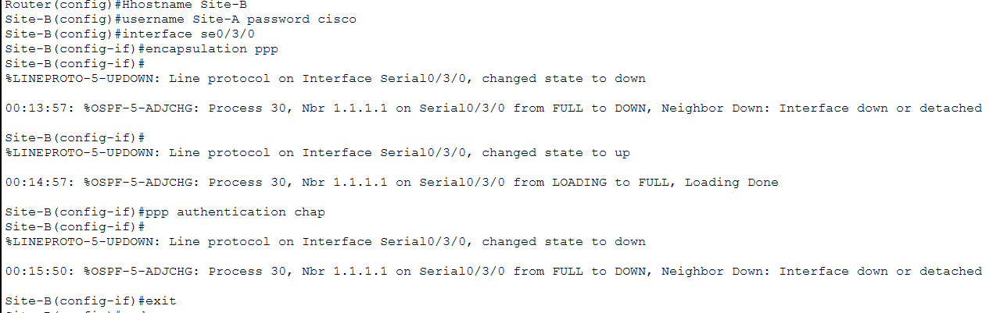
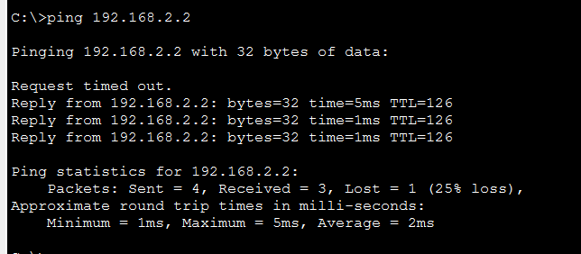

# 🔗 PPP (Point-to-Point Protocol)

<div align="center">


**WAN Protocol for Serial Connections**

[](.)
[](.)
[](.)

[📖 Overview](#-overview) • [🎯 Concept](#-concept) • [⚙️ Configuration](#-configuration) • [🔧 Implementation](#-implementation)

</div>

---

## 📖 Overview

**PPP (Point-to-Point Protocol)** is a WAN protocol used to directly connect two routers over serial links.

### Key Features:

| Feature | Details |
|---------|---------|
| **Type** | WAN Protocol |
| **Use Case** | Serial connections, leased lines, DSL |
| **Authentication** | PAP & CHAP |
| **Interface** | Serial (requires HWIC-2T module) |
| **Multiprotocol** | IP, IPv6, IPX support |

---

## 📚 Table of Contents

- [🎯 Concept](#-concept)
  - [DCE vs DTE](#dce-vs-dte)
  - [Clock Rate](#clock-rate)
  - [Authentication Types](#authentication-types)
- [⚙️ Configuration](#-configuration)
  - [Basic PPP](#basic-ppp-configuration)
  - [PPP with CHAP](#ppp-with-chap-authentication)
- [🔧 Implementation](#-implementation)
- [📝 Quick Reference](#-quick-reference)

---

## 🎯 Concept

### What is PPP?

**PPP** connects two routers directly over serial links (leased lines, T1, E1).

**Real-Life Example:**
```
Think of it like a dedicated phone line:
- Direct connection between two points
- No intermediaries
- Private communication channel
```

---

### PPP Features

<div align="center">

| Feature | Description |
|---------|-------------|
| **Authentication** | PAP & CHAP support |
| **Error Detection** | Quality monitoring |
| **Multiprotocol** | IP, IPv6, IPX |
| **Compression** | Data compression support |
| **Load Balancing** | Multilink PPP |

</div>

---

### DCE vs DTE

#### What are DCE and DTE?

**Serial connections have two device types:**

**DTE (Data Terminal Equipment):**
```
- Computer/Router that sends/receives data
- Does NOT provide clock signal
- Example: Router, Computer, Server
```

**DCE (Data Communications Equipment):**
```
- Modem/CSU/DSU that facilitates communication
- PROVIDES clock signal (timing)
- Example: Modem, CSU/DSU, Multiplexer
```

---

#### Real-World Example:

```
[Your Router] -------cable------- [ISP Modem] -------Internet
     DTE                              DCE
  (receives timing)              (provides timing)
```

**Simple Analogy:**
```
DTE = Student (studies)
DCE = Teacher (provides schedule and timing)
```

---

#### Lab/Packet Tracer:

```
[Router1] ========= Serial Cable ========= [Router2]
   DCE                                        DTE
(Clock Rate                              (No Clock Rate
 Provider)                                    Needed)
```

---

#### How to Identify DCE/DTE?

**Command:**
```cisco
Router# show controllers serial 0/0/0
```

**DCE Output:**
```
Interface Serial0/0/0
Hardware is PowerQUICC MPC860
DCE V.35, clock rate 64000 ← DCE device
```

**DTE Output:**
```
Interface Serial0/0/0
Hardware is PowerQUICC MPC860
DTE V.35 ← DTE device
```

---

### Clock Rate

**What is Clock Rate?**
```
Clock Rate = Data transmission speed (bits per second)
```

**Common Clock Rates:**

| Speed | Use Case |
|-------|----------|
| **64000** | 64 Kbps (Most Common) |
| **128000** | 128 Kbps |
| **1544000** | T1 line (1.544 Mbps) |
| **2048000** | E1 line (2.048 Mbps) |

**Command:**
```cisco
Router(config-if)# clock rate 64000
```

---

#### Important Rules:

<div align="center">

| Rule | Explanation |
|------|-------------|
| **DCE Side** | Clock rate REQUIRED ✅ |
| **DTE Side** | Clock rate NOT needed ❌ |
| **If missing** | Link will NOT come UP! |

</div>

**Example:**
```cisco
! DCE Router
Router(config)# interface serial 0/0/0
Router(config-if)# clock rate 64000 ← Required!

! DTE Router  
Router(config)# interface serial 0/0/0
Router(config-if)# [no clock rate command] ← Not needed
```

---

### Authentication Types

#### PAP (Password Authentication Protocol)

<div align="center">

| Feature | Details |
|---------|---------|
| **Security** | ❌ Low (plain text password) |
| **Handshake** | 2-way |
| **Recommended** | ❌ No |

</div>

**How it works:**
```
Router1: "My username is Router2, password is cisco123"
Router2: "OK, I'll check... Access granted"
```

**Problem:** Password sent in plain text (anyone can see it!)

---

#### CHAP (Challenge Handshake Authentication Protocol)

<div align="center">

| Feature | Details |
|---------|---------|
| **Security** | ✅ High (encrypted password) |
| **Handshake** | 3-way |
| **Recommended** | ✅ Yes |

</div>

**How it works:**
```
Router1: "Who are you?"
Router2: "I'm Router2" + [encrypted challenge response]
Router1: "Correct! Access granted"
```

**Benefit:** Password encrypted, periodic re-authentication ✅

---

## ⚙️ Configuration

### Basic PPP Configuration

**No Authentication:**

```cisco
! Router1 Configuration
Router1(config)# interface serial 0/0/0
Router1(config-if)# encapsulation ppp
Router1(config-if)# ip address 10.1.1.1 255.255.255.252
Router1(config-if)# clock rate 64000
Router1(config-if)# no shutdown
Router1(config-if)# exit

! Router2 Configuration
Router2(config)# interface serial 0/0/0
Router2(config-if)# encapsulation ppp
Router2(config-if)# ip address 10.1.1.2 255.255.255.252
Router2(config-if)# no shutdown
Router2(config-if)# exit
```

---

### PPP with CHAP Authentication

**CHAP Configuration (Recommended):**

**Router1 (Site-A):**
```cisco
! Create username for opposite router
Router1(config)# username Router2 password cisco123

! Configure interface
Router1(config)# interface serial 0/0/0
Router1(config-if)# encapsulation ppp
Router1(config-if)# ppp authentication chap
Router1(config-if)# ip address 10.1.1.1 255.255.255.252
Router1(config-if)# clock rate 64000
Router1(config-if)# no shutdown
Router1(config-if)# exit
```

**Router2 (Site-B):**
```cisco
! Create username for opposite router
Router2(config)# username Router1 password cisco123

! Configure interface
Router2(config)# interface serial 0/0/0
Router2(config-if)# encapsulation ppp
Router2(config-if)# ppp authentication chap
Router2(config-if)# ip address 10.1.1.2 255.255.255.252
Router2(config-if)# no shutdown
Router2(config-if)# exit
```

---

#### CHAP Rules:

```
✅ Username = Opposite router's hostname
✅ Password = SAME on both routers
✅ Password = Case-sensitive
```

**Example:**
```
Router1: username Router2 password cisco123
Router2: username Router1 password cisco123
                    ↑
            Same password!
```

---

## 🔧 Implementation

### Lab Topology

<p align="center">
  
</p>

**Network Design:**
```
[Site-A] ========= PPP Serial Link ========= [Site-B]
  DCE         (10.1.1.0/30)                    DTE
```

---

### Hardware Requirements

**Important:** Use **HWIC-2T** module for serial connections!

```
Router → Physical → HWIC-2T
       → Turn OFF router
       → Insert module
       → Turn ON router
```

---

### Site-A Configuration

#### Step 1: Assign IP to PCs

<p align="center">
  
</p>

**PC Configuration:**
```
PC1:
IP: 192.168.10.10
Subnet: 255.255.255.0
Gateway: 192.168.10.1
```

---

#### Step 2: Router Configuration

<p align="center">
  
</p>

```cisco
! Site-A Router Configuration
Router(config)# hostname Site-A

! LAN Interface
Router(config)# interface gigabitEthernet 0/0
Router(config-if)# ip address 192.168.10.1 255.255.255.0
Router(config-if)# no shutdown
Router(config-if)# exit

! Serial Interface (DCE side)
Router(config)# interface serial 0/0/0
Router(config-if)# ip address 10.1.1.1 255.255.255.252
Router(config-if)# clock rate 64000
Router(config-if)# no shutdown
Router(config-if)# exit
```

---

#### Step 3: OSPF Configuration

<p align="center">
  
</p>

```cisco
! OSPF Configuration
Site-A(config)# router ospf 1
Site-A(config-router)# network 192.168.10.0 0.0.0.255 area 0
Site-A(config-router)# network 10.1.1.0 0.0.0.3 area 0
Site-A(config-router)# exit
```

---

### Site-B Configuration

#### Step 1: Router Configuration

<p align="center">
  
</p>

```cisco
! Site-B Router Configuration
Router(config)# hostname Site-B

! LAN Interface
Router(config)# interface gigabitEthernet 0/0
Router(config-if)# ip address 192.168.20.1 255.255.255.0
Router(config-if)# no shutdown
Router(config-if)# exit

! Serial Interface (DTE side)
Router(config)# interface serial 0/0/0
Router(config-if)# ip address 10.1.1.2 255.255.255.252
Router(config-if)# no shutdown
Router(config-if)# exit
```

---

#### Step 2: OSPF Configuration

<p align="center">
  
</p>

```cisco
! OSPF Configuration
Site-B(config)# router ospf 1
Site-B(config-router)# network 192.168.20.0 0.0.0.255 area 0
Site-B(config-router)# network 10.1.1.0 0.0.0.3 area 0
Site-B(config-router)# exit
```

---

### Verification - Before PPP

<p align="center">
  
</p>

**Status:**
```
Serial0/0/0 is up, line protocol is up
Encapsulation: HDLC (default)
```

---

### Configuring PPP Encapsulation

#### Site-A PPP Configuration:

<p align="center">
  
</p>

```cisco
! Enable PPP on Serial Interface
Site-A(config)# username Site-B password cisco123
Site-A(config)# interface serial 0/0/0
Site-A(config-if)# encapsulation ppp
Site-A(config-if)# ppp authentication chap
Site-A(config-if)# exit
```

---

#### Site-B PPP Configuration:

<p align="center">
  
</p>

```cisco
! Enable PPP on Serial Interface
Site-B(config)# username Site-A password cisco123
Site-B(config)# interface serial 0/0/0
Site-B(config-if)# encapsulation ppp
Site-B(config-if)# ppp authentication chap
Site-B(config-if)# exit
```

---

### Verification - After PPP

<p align="center">
  
</p>

**Commands:**
```cisco
Site-A# show interfaces serial 0/0/0
Site-A# show ip interface brief
Site-A# show ip ospf neighbor
```

**Status:**
```
Serial0/0/0 is up, line protocol is up
Encapsulation: PPP ✅
OSPF neighbor: Site-B ✅
```

**Result:** ✅ PPP configured successfully, CHAP authentication working

---

## 📝 Quick Reference

### Configuration Template

```cisco
! ============================================
! PPP with CHAP Authentication
! ============================================

! Router 1 (DCE Side)
Router1(config)# username Router2 password cisco123
Router1(config)# interface serial 0/0/0
Router1(config-if)# encapsulation ppp
Router1(config-if)# ppp authentication chap
Router1(config-if)# ip address 10.1.1.1 255.255.255.252
Router1(config-if)# clock rate 64000
Router1(config-if)# no shutdown

! Router 2 (DTE Side)
Router2(config)# username Router1 password cisco123
Router2(config)# interface serial 0/0/0
Router2(config-if)# encapsulation ppp
Router2(config-if)# ppp authentication chap
Router2(config-if)# ip address 10.1.1.2 255.255.255.252
Router2(config-if)# no shutdown
```

---

### Verification Commands

```cisco
! Check interface status
show interfaces serial 0/0/0

! Check IP configuration
show ip interface brief

! Check DCE/DTE
show controllers serial 0/0/0

! Check OSPF neighbors (if configured)
show ip ospf neighbor

! Check routing table
show ip route
```

---

### Troubleshooting

| Issue | Cause | Fix |
|-------|-------|-----|
| **Link down** | No clock rate on DCE | Add `clock rate 64000` |
| | Wrong encapsulation | Check `encapsulation ppp` both sides |
| | Physical cable issue | Check cable connection |
| **Authentication failed** | Username mismatch | Username = opposite router hostname |
| | Password mismatch | Use same password both sides |
| | Password case-sensitive | Check exact spelling |
| **OSPF not working** | Wrong network command | Verify OSPF network statements |
| | Area mismatch | Use same area on both routers |

---

### Important Points

**1. Encapsulation:**
```
Both routers MUST have: encapsulation ppp
Without this, PPP won't work!
```

**2. Clock Rate:**
```
DCE side: clock rate 64000 ✅ Required
DTE side: No clock rate ✅ Not needed
```

**3. CHAP Authentication:**
```
Router1: username Router2 password cisco123
Router2: username Router1 password cisco123

Username = Opposite router name
Password = Same on both sides
```

**4. Module:**
```
Use HWIC-2T module for serial connections
Insert when router is OFF
```

---

### Configuration Checklist

**Before Starting:**
- [ ] HWIC-2T modules installed
- [ ] Check DCE/DTE with `show controllers`
- [ ] Physical cable connected

**Configuration Steps:**
- [ ] Configure IP addresses on serial interfaces
- [ ] Set clock rate on DCE side
- [ ] Enable PPP encapsulation both sides
- [ ] Create usernames (opposite router names)
- [ ] Enable CHAP authentication
- [ ] Configure OSPF (if needed)
- [ ] Verify with `show interfaces`

**Verification:**
- [ ] Serial interface UP/UP
- [ ] Encapsulation shows PPP
- [ ] Ping opposite router
- [ ] OSPF neighbors formed (if configured)

---


---

## 🎓 What I Learned

✅ **PPP Protocol** - Point-to-Point WAN connections  
✅ **DCE vs DTE** - Clock provider vs data terminal  
✅ **Clock Rate** - DCE side configuration requirement  
✅ **CHAP Authentication** - Secure PPP authentication  
✅ **Serial Configuration** - HWIC-2T module usage  
✅ **Encapsulation** - PPP vs HDLC  
✅ **Integration** - PPP with OSPF routing  
✅ **Troubleshooting** - Common issues and solutions  

---

## 🚀 How to Use This Repository

1. **Clone the repository:**
   ```bash
   git clone https://github.com/your-username/PPP-Implementation.git
   ```

2. **Study the concept:**
   - Understand DCE vs DTE
   - Learn clock rate importance
   - Know CHAP authentication

3. **Practice in lab:**
   - Install HWIC-2T modules
   - Configure PPP encapsulation
   - Test CHAP authentication

4. **Verify:**
   - Check serial interface status
   - Test connectivity
   - Verify OSPF neighbors

---

## 📞 Connect With Me

<div align="center">

[](mailto:a.wahid7860668@gmail.com)
[](https://www.linkedin.com/in/abdul-wahid022)
[](https://github.com/abdul-wahid022)

**💬 Questions? Need Packet Tracer files? Feel free to reach out!**

</div>

---

## 📄 License

This project is created for **educational purposes** and is open-source.

---

<div align="center">

### ⭐ If you found this helpful, please give it a star!

**Made with 💙 by ABDUL WAHID**

*Last Updated: January 2026*

</div>


