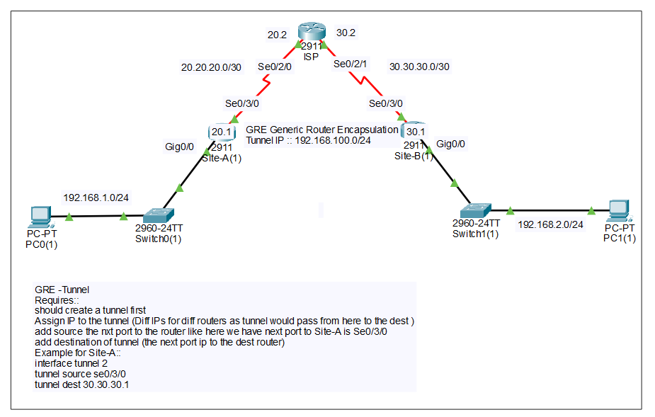
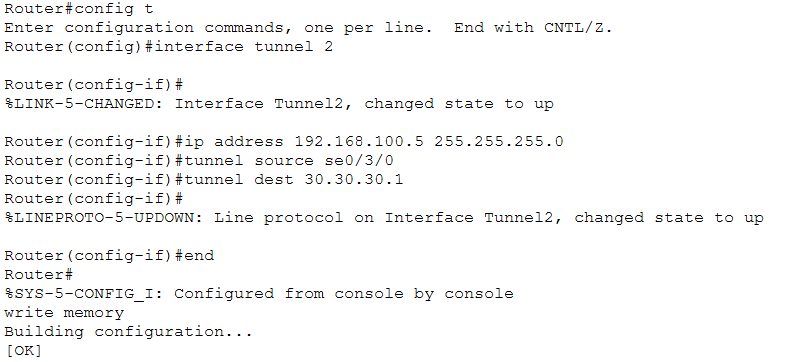
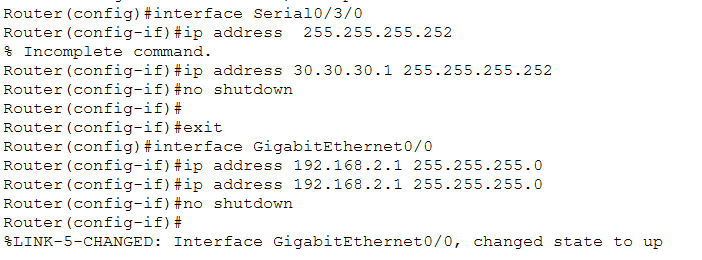
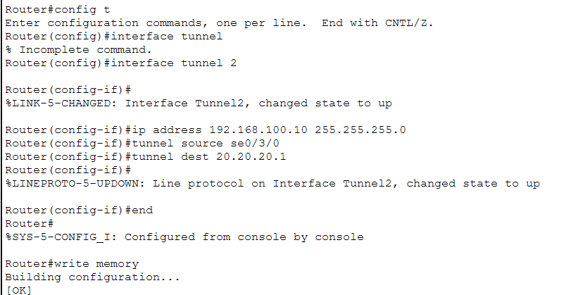
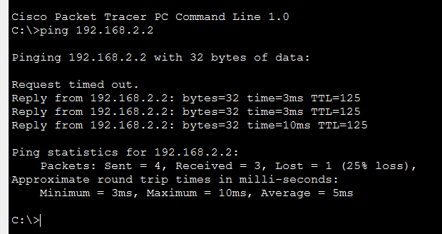

# 🔒 GRE Tunnel (Generic Routing Encapsulation)

<div align="center">


**Virtual Tunnel Over Public Internet**

[](.)
[](.)
[](.)

[📖 Overview](#-overview) • [🎯 Concept](#-concept) • [⚙️ Configuration](#-configuration) • [🔧 Implementation](#-implementation)

</div>

---

## 📖 Overview

**GRE (Generic Routing Encapsulation)** creates a virtual tunnel between two routers over the public internet, allowing private data to travel safely.

### Key Features:

| Feature | Details |
|---------|---------|
| **Purpose** | Virtual tunnel over public internet |
| **Encapsulation** | Packet inside packet |
| **Multiprotocol** | IP, IPv6, IPX, routing protocols |
| **Security** | ❌ No encryption (use with IPsec for security) |
| **Use Case** | Site-to-site connectivity |

---

## 📚 Table of Contents

- [🎯 Concept](#-concept)
  - [How GRE Works](#how-gre-works)
  - [Packet Structure](#packet-structure)
  - [Use Cases](#use-cases)
- [⚙️ Configuration](#-configuration)
- [🔧 Implementation](#-implementation)
- [📝 Quick Reference](#-quick-reference)

---

## 🎯 Concept

### What is GRE?

**GRE** creates a virtual tunnel that acts like a dedicated cable over the public internet.

**Real-Life Analogy:**
```
Postal Service:

Original Letter (Private Data)
     ↓
Put in Envelope (GRE Header)
     ↓
Mail through Post Office (Public Internet)
     ↓
Receiver opens envelope
     ↓
Gets original letter

GRE works exactly like this!
```

---

### Without GRE vs With GRE

**Without GRE:**
```
Branch Office ─────Public Internet─────→ Head Office

❌ Data visible to anyone
❌ No direct routing for private IPs
❌ Each site needs separate connectivity
```

**With GRE Tunnel:**
```
Branch Office ═══GRE Tunnel═══→ Head Office
                (Virtual cable)

✅ Data protected (encapsulated)
✅ Private IPs work over Internet
✅ Like a virtual dedicated line
✅ Can run routing protocols
```

---

### How GRE Works

**Step-by-Step Process:**

```
1. Branch office PC sends packet:
   Source: 192.168.1.10
   Destination: 192.168.2.20

2. Router encapsulates in GRE:
   Adds new header with public IPs

3. Travels over public internet:
   Internet sees only public IPs

4. Head office router de-encapsulates:
   Removes GRE header, reveals original packet

5. Delivers to destination PC
```

---

### Packet Structure

**Normal Packet:**
```
┌──────────────┬──────────────┐
│ IP Header    │ Data         │
└──────────────┴──────────────┘
```

**GRE Packet (Encapsulation):**
```
┌─────────────┬────────────┬──────────────┬──────────────┐
│ New IP Hdr  │ GRE Header │ Original IP  │ Data         │
│ (Public IP) │            │ (Private IP) │              │
└─────────────┴────────────┴──────────────┴──────────────┘
  └─── Outer Packet ───────┘ └──── Inner Packet ─────────┘
```

**Simple Explanation:**
```
Outer packet = Public Internet pe travel karta hai
Inner packet = Original private data (hidden inside)
```

---

### Use Cases

#### 1. Branch Office Connectivity

```
Head Office (Karachi)          Branch Office (Lahore)
192.168.1.0/24                 192.168.2.0/24
Public IP: 203.0.113.1         Public IP: 198.51.100.1
       │                              │
       └──────GRE Tunnel──────────────┘
              (Over Internet)
```

**Without GRE:**
- Private IPs can't route over internet
- Each site needs separate public IPs

**With GRE:**
- Private IPs tunnel through
- Direct communication like LAN
- Cost-effective solution

---

#### 2. Multiprotocol Support

```
GRE Tunnel supports:
├─ IPv4 ✓
├─ IPv6 ✓
├─ IPX ✓
├─ AppleTalk ✓
└─ Routing Protocols (OSPF, EIGRP) ✓

PPP/HDLC: Only IP traffic
GRE: Any protocol!
```

---

#### 3. Connect Non-Contiguous Networks

```
Site A: 10.1.0.0/16
     │
     └──GRE─→ Internet ──GRE─→
                               │
                        Site B: 10.2.0.0/16
```

---

## ⚙️ Configuration

### Basic GRE Tunnel Configuration

**Topology:**
```
Branch Router (R1)              Head Office Router (R2)
LAN: 192.168.1.0/24             LAN: 192.168.2.0/24
WAN: 203.0.113.1/30             WAN: 198.51.100.1/30
       │                               │
       └────────Internet───────────────┘
       
       ═══════GRE Tunnel═══════
Tunnel0: 10.10.10.1/30 ↔ 10.10.10.2/30
```

---

### R1 (Branch Router) Configuration

```cisco
! Physical Interface (WAN - Internet connection)
R1(config)# interface gigabitEthernet 0/0
R1(config-if)# ip address 203.0.113.1 255.255.255.252
R1(config-if)# no shutdown
R1(config-if)# exit

! LAN Interface
R1(config)# interface gigabitEthernet 0/1
R1(config-if)# ip address 192.168.1.1 255.255.255.0
R1(config-if)# no shutdown
R1(config-if)# exit

! GRE Tunnel Configuration
R1(config)# interface tunnel 0
R1(config-if)# ip address 10.10.10.1 255.255.255.252
R1(config-if)# tunnel source gigabitEthernet 0/0
R1(config-if)# tunnel destination 198.51.100.1
R1(config-if)# tunnel mode gre ip
R1(config-if)# no shutdown
R1(config-if)# exit

! Static Route to reach remote LAN via tunnel
R1(config)# ip route 192.168.2.0 255.255.255.0 tunnel 0
```

---

### R2 (Head Office Router) Configuration

```cisco
! Physical Interface (WAN - Internet connection)
R2(config)# interface gigabitEthernet 0/0
R2(config-if)# ip address 198.51.100.1 255.255.255.252
R2(config-if)# no shutdown
R2(config-if)# exit

! LAN Interface
R2(config)# interface gigabitEthernet 0/1
R2(config-if)# ip address 192.168.2.1 255.255.255.0
R2(config-if)# no shutdown
R2(config-if)# exit

! GRE Tunnel Configuration
R2(config)# interface tunnel 0
R2(config-if)# ip address 10.10.10.2 255.255.255.252
R2(config-if)# tunnel source gigabitEthernet 0/0
R2(config-if)# tunnel destination 203.0.113.1
R2(config-if)# tunnel mode gre ip
R2(config-if)# no shutdown
R2(config-if)# exit

! Static Route to reach remote LAN via tunnel
R2(config)# ip route 192.168.1.0 255.255.255.0 tunnel 0
```

---

### Configuration Breakdown

**Key Parameters:**

**1. Tunnel Source:**
```cisco
tunnel source gigabitEthernet 0/0
```
```
Purpose: Which interface tunnel starts from
Usually: Public IP interface
```

**2. Tunnel Destination:**
```cisco
tunnel destination 198.51.100.1
```
```
Purpose: Remote router's public IP
Points to: Other end of tunnel
```

**3. Tunnel IP Address:**
```cisco
ip address 10.10.10.1 255.255.255.252
```
```
Purpose: Virtual tunnel IP
Subnet: /30 (point-to-point)
```

**4. Tunnel Mode:**
```cisco
tunnel mode gre ip
```
```
Purpose: GRE over IP
Default mode for GRE tunnels
```

---

## 🔧 Implementation

### Lab Topology

<p align="center">
  
</p>

**Network Design:**
```
Site-A ←→ ISP ←→ Site-B
       (Internet)
       
Site-A ═══GRE Tunnel═══→ Site-B
     (Virtual connection)
```

---

### Site-A Configuration

<p align="center">
  
</p>

```cisco
! Site-A Router Configuration
Router(config)# hostname Site-A

! LAN Interface
Router(config)# interface gigabitEthernet 0/0
Router(config-if)# ip address 192.168.10.1 255.255.255.0
Router(config-if)# no shutdown
Router(config-if)# exit

! WAN Interface (to ISP)
Router(config)# interface gigabitEthernet 0/1
Router(config-if)# ip address 200.0.0.1 255.255.255.0
Router(config-if)# no shutdown
Router(config-if)# exit
```

---

#### OSPF Configuration (Site-A):

<p align="center">
  
</p>

```cisco
! OSPF Configuration
Site-A(config)# router ospf 1
Site-A(config-router)# network 192.168.10.0 0.0.0.255 area 0
Site-A(config-router)# network 200.0.0.0 0.0.0.255 area 0
Site-A(config-router)# exit
```

---

#### GRE Tunnel Configuration (Site-A):

<p align="center">
  
</p>

```cisco
! Create GRE Tunnel
Site-A(config)# interface tunnel 0
Site-A(config-if)# ip address 10.10.10.1 255.255.255.252
Site-A(config-if)# tunnel source gigabitEthernet 0/1
Site-A(config-if)# tunnel destination 200.0.0.3
Site-A(config-if)# tunnel mode gre ip
Site-A(config-if)# no shutdown
Site-A(config-if)# exit

! Add tunnel network to OSPF
Site-A(config)# router ospf 1
Site-A(config-router)# network 10.10.10.0 0.0.0.3 area 0
Site-A(config-router)# exit
```

---

### Site-B Configuration

<p align="center">
  
</p>

```cisco
! Site-B Router Configuration
Router(config)# hostname Site-B

! LAN Interface
Router(config)# interface gigabitEthernet 0/0
Router(config-if)# ip address 192.168.20.1 255.255.255.0
Router(config-if)# no shutdown
Router(config-if)# exit

! WAN Interface (to ISP)
Router(config)# interface gigabitEthernet 0/1
Router(config-if)# ip address 200.0.0.3 255.255.255.0
Router(config-if)# no shutdown
Router(config-if)# exit
```

---

#### OSPF Configuration (Site-B):

<p align="center">
  
</p>

```cisco
! OSPF Configuration
Site-B(config)# router ospf 1
Site-B(config-router)# network 192.168.20.0 0.0.0.255 area 0
Site-B(config-router)# network 200.0.0.0 0.0.0.255 area 0
Site-B(config-router)# exit
```

---

#### GRE Tunnel Configuration (Site-B):

<p align="center">
  
</p>

```cisco
! Create GRE Tunnel
Site-B(config)# interface tunnel 0
Site-B(config-if)# ip address 10.10.10.2 255.255.255.252
Site-B(config-if)# tunnel source gigabitEthernet 0/1
Site-B(config-if)# tunnel destination 200.0.0.1
Site-B(config-if)# tunnel mode gre ip
Site-B(config-if)# no shutdown
Site-B(config-if)# exit

! Add tunnel network to OSPF
Site-B(config)# router ospf 1
Site-B(config-router)# network 10.10.10.0 0.0.0.3 area 0
Site-B(config-router)# exit
```

---

### ISP Configuration

<p align="center">
  
</p>

```cisco
! ISP Router Configuration
Router(config)# hostname ISP

! Interface to Site-A
Router(config)# interface gigabitEthernet 0/0
Router(config-if)# ip address 200.0.0.2 255.255.255.0
Router(config-if)# no shutdown
Router(config-if)# exit

! Interface to Site-B
Router(config)# interface gigabitEthernet 0/1
Router(config-if)# ip address 200.0.0.4 255.255.255.0
Router(config-if)# no shutdown
Router(config-if)# exit

! OSPF Configuration
ISP(config)# router ospf 1
ISP(config-router)# network 200.0.0.0 0.0.0.255 area 0
ISP(config-router)# exit
```

---

### Verification

<p align="center">
  
</p>

**Commands:**
```cisco
! Check tunnel status
Site-A# show interface tunnel 0

! Check routing table
Site-A# show ip route

! Check OSPF neighbors
Site-A# show ip ospf neighbor

! Test connectivity
Site-A# ping 10.10.10.2
Site-A# ping 192.168.20.1
```

**Expected Output:**
```
Tunnel0 is up, line protocol is up
  Internet address is 10.10.10.1/30
  Tunnel source 200.0.0.1 (GigabitEthernet0/1)
  Tunnel destination 200.0.0.3
  Tunnel protocol/transport GRE/IP

OSPF neighbor: 10.10.10.2 (Site-B) - FULL ✅
```

**Result:** ✅ GRE tunnel established, OSPF neighbors formed through tunnel

---

## 📝 Quick Reference

### Configuration Template

```cisco
! ============================================
! GRE Tunnel Configuration Template
! ============================================

! Router 1
R1(config)# interface tunnel 0
R1(config-if)# ip address 10.10.10.1 255.255.255.252
R1(config-if)# tunnel source [local-interface]
R1(config-if)# tunnel destination [remote-public-ip]
R1(config-if)# tunnel mode gre ip
R1(config-if)# no shutdown

! Router 2
R2(config)# interface tunnel 0
R2(config-if)# ip address 10.10.10.2 255.255.255.252
R2(config-if)# tunnel source [local-interface]
R2(config-if)# tunnel destination [remote-public-ip]
R2(config-if)# tunnel mode gre ip
R2(config-if)# no shutdown
```

---

### Verification Commands

```cisco
! Check tunnel interface
show interface tunnel 0

! Check IP routing
show ip route

! Check OSPF neighbors (if using OSPF)
show ip ospf neighbor

! Test tunnel connectivity
ping [tunnel-destination-ip]

! Traceroute through tunnel
traceroute [remote-lan-ip]
```

---

### Troubleshooting

| Issue | Cause | Fix |
|-------|-------|-----|
| **Tunnel down** | Destination unreachable | Check route to destination IP |
| | Wrong tunnel destination | Verify destination IP address |
| | Firewall blocking | Allow GRE (IP protocol 47) |
| **No connectivity** | Tunnel source wrong | Check source interface |
| | No route to remote LAN | Add static route or routing protocol |
| **OSPF not working** | Tunnel network not in OSPF | Add tunnel network to OSPF |
| | Area mismatch | Use same OSPF area |

---

### Important Points

**1. Tunnel Configuration:**
```
✅ tunnel source = Local public interface
✅ tunnel destination = Remote public IP
✅ tunnel mode gre ip = GRE over IP
✅ Both ends must have matching tunnel IPs
```

**2. Routing:**
```
Option 1: Static routes via tunnel
ip route [remote-network] tunnel 0

Option 2: Dynamic routing over tunnel
Add tunnel network to OSPF/EIGRP
```

**3. Security:**
```
⚠️ GRE has NO encryption
❌ Data is visible (encapsulated, not encrypted)
✅ Use GRE + IPsec for secure tunnel
```

**4. Prerequisites:**
```
✅ Physical interfaces configured (public IPs)
✅ Connectivity to tunnel destination (can ping)
✅ Routing configured to reach destination
```

---

### Configuration Checklist

**Step 1: Physical Setup**
- [ ] Configure WAN interfaces (public IPs)
- [ ] Configure LAN interfaces (private IPs)
- [ ] Test connectivity (ping public IPs)

**Step 2: Create Tunnel**
- [ ] Create tunnel interface (interface tunnel 0)
- [ ] Set tunnel IP address
- [ ] Set tunnel source (local public interface)
- [ ] Set tunnel destination (remote public IP)
- [ ] Set tunnel mode (tunnel mode gre ip)
- [ ] Enable tunnel (no shutdown)

**Step 3: Configure Routing**
- [ ] Add static route via tunnel OR
- [ ] Add tunnel network to routing protocol
- [ ] Verify routing table

**Step 4: Verification**
- [ ] Check tunnel status (up/up)
- [ ] Ping tunnel endpoint
- [ ] Test end-to-end connectivity
- [ ] Verify OSPF neighbors (if configured)

---


---

## 🎓 What I Learned

✅ **GRE Fundamentals** - Virtual tunnel over internet  
✅ **Encapsulation** - Packet inside packet concept  
✅ **Tunnel Configuration** - Source, destination, mode  
✅ **Multiprotocol Support** - IP, IPv6, routing protocols  
✅ **OSPF over GRE** - Dynamic routing through tunnel  
✅ **Use Cases** - Site-to-site connectivity  
✅ **Limitations** - No encryption (security concern)  
✅ **Troubleshooting** - Common tunnel issues  

---

## 🚀 How to Use This Repository

1. **Clone the repository:**
   ```bash
   git clone https://github.com/your-username/GRE-Tunnel-Implementation.git
   ```

2. **Study the concept:**
   - Understand GRE encapsulation
   - Learn tunnel configuration
   - Know security limitations

3. **Practice in lab:**
   - Build topology
   - Configure GRE tunnels
   - Test with OSPF

4. **Verify:**
   - Check tunnel status
   - Test connectivity
   - Verify routing

---
## 📞 Connect With Me

<div align="center">

[](mailto:a.wahid7860668@gmail.com)
[](https://www.linkedin.com/in/abdul-wahid022)
[](https://github.com/abdul-wahid022)

**💬 Questions? Need Packet Tracer files? Feel free to reach out!**

</div>

---

## 📄 License

This project is created for **educational purposes** and is open-source.

---

<div align="center">

### ⭐ If you found this helpful, please give it a star!

**Made with 💙 by ABDUL WAHID**

*Last Updated: January 2026*

</div>

