# 🔐 IPsec VPN (Internet Protocol Security)

<div align="center">

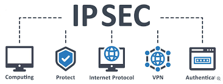

**Secure Site-to-Site VPN Tunnel**

[](.)
[](.)
[](.)

[📖 Overview](#-overview) • [🎯 Concept](#-concept) • [⚙️ Configuration](#-configuration) • [🔧 Implementation](#-implementation)

</div>

---

## 📖 Overview

**IPsec VPN** creates a secure, encrypted tunnel between two sites over the public internet.

### Key Features:

| Feature | Details |
|---------|---------|
| **Security** | ✅ Strong encryption (AES, 3DES) |
| **Authentication** | ✅ Yes (pre-shared key, certificates) |
| **Encryption** | ✅ ESP (Encapsulating Security Payload) |
| **Use Case** | Production site-to-site VPN |
| **Router Model** | ISR-4321 (Security technology package) |

---

## 📚 Table of Contents

- [🎯 Concept](#-concept)
  - [IPsec vs GRE](#ipsec-vs-gre)
  - [IPsec Components](#ipsec-components)
  - [IPsec Phases](#ipsec-phases)
- [⚙️ Configuration](#-configuration)
  - [Complete IPsec Setup](#complete-ipsec-setup)
- [🔧 Implementation](#-implementation)
- [📝 Quick Reference](#-quick-reference)

---

## 🎯 Concept

### What is IPsec VPN?

**IPsec** creates a secure tunnel with encryption and authentication.

**Real-Life Analogy:**
```
Armored Truck:

Valuable Items (Data)
     ↓
Put in Armored Truck (IPsec Encryption)
     ↓
Travel through City (Public Internet)
     ↓
Unlock at Destination (Decryption)
     ↓
Deliver Items safely

IPsec protects data like an armed guard!
```

---

### IPsec vs GRE

<div align="center">

| Feature | GRE | IPsec |
|---------|-----|-------|
| **Encryption** | ❌ No | ✅ Yes |
| **Authentication** | ❌ No | ✅ Yes |
| **Security** | Insecure | Secure |
| **Overhead** | Low | High |
| **Speed** | Faster | Slower |
| **Use Case** | Lab/Testing | Production |
| **Data Visibility** | Visible | Hidden |

</div>

**Simple:**
```
GRE = Open envelope (anyone can read)
IPsec = Locked safe (only authorized can open)
```

---

### IPsec Components

**1. IKE (Internet Key Exchange):**

```
Phase 1: Secure Management Connection
         (Negotiate encryption method)

Phase 2: Secure Data Connection
         (Encrypt actual data)
```

**2. Security Protocols:**

**ESP (Encapsulating Security Payload):**
```
✅ Data authentication
✅ Data encryption
✅ Most commonly used
```

---

### IPsec Phases

**Phase 1 (ISAKMP/IKE):**

```
Purpose: Establish secure management channel
Duration: Long-lived (hours/days)
Function: Protect Phase 2 negotiation

Steps:
1. Routers exchange proposals
2. Agree on encryption (DES/3DES/AES)
3. Agree on authentication (MD5/SHA)
4. Create secure tunnel for Phase 2
```

**Phase 2 (IPsec):**

```
Purpose: Encrypt actual data
Duration: Short-lived (minutes)
Function: Protect user traffic

Steps:
1. Define interesting traffic (ACL)
2. Negotiate transform sets
3. Establish IPsec tunnel
4. Start encrypting data
```

---

## ⚙️ Configuration

## 🔧 Implementation

### Topology

<p align="center">
  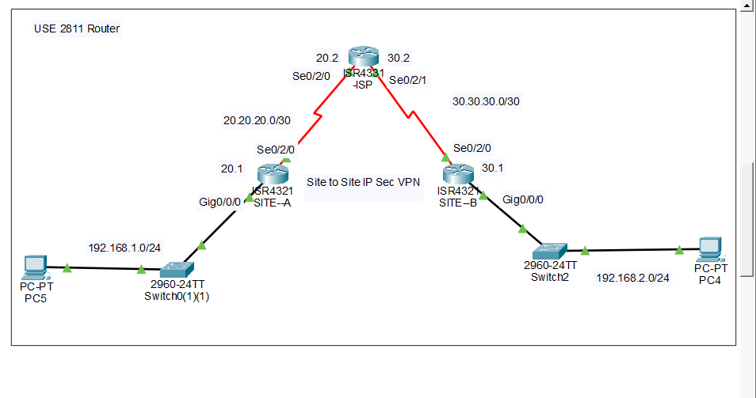
</p>

### Topology

```
Branch Office (Site-A)          Head Office (Site-B)
LAN: 192.168.10.0/24            LAN: 192.168.20.0/24
Public: 200.0.0.1               Public: 200.0.0.3
       │                               │
       └──────IPsec Tunnel─────────────┘
              (Over ISP/Internet)
```

---

### Complete IPsec Setup

### Site-A Configuration

#### Step 1: Basic Router Configuration

<p align="center">
  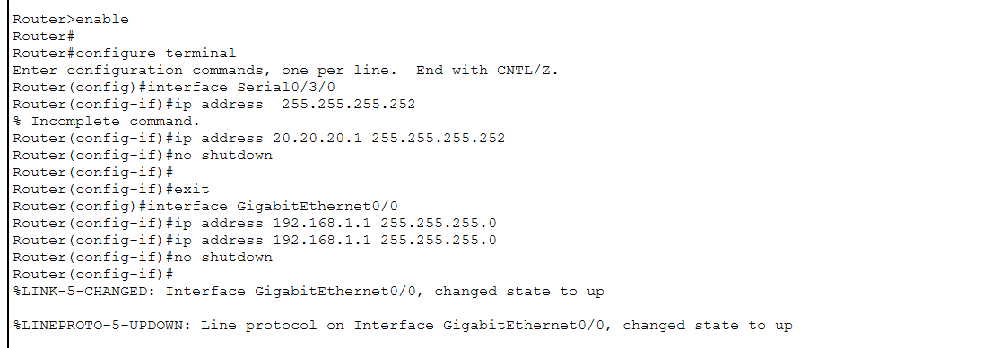
</p>

```cisco
! Site-A Router Configuration
Router(config)# hostname Site-A

! LAN Interface
Router(config)# interface gigabitEthernet 0/0
Router(config-if)# ip address 192.168.10.1 255.255.255.0
Router(config-if)# no shutdown
Router(config-if)# exit

! WAN Interface (to ISP)
Router(config)# interface gigabitEthernet 0/1
Router(config-if)# ip address 200.0.0.1 255.255.255.0
Router(config-if)# no shutdown
Router(config-if)# exit
```

---

#### Step 2: OSPF Configuration

<p align="center">
  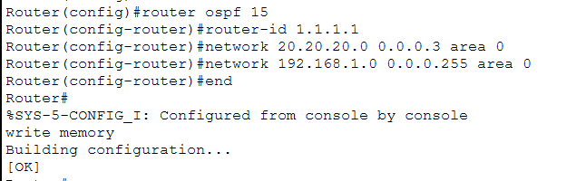
</p>

```cisco
! OSPF Configuration
Site-A(config)# router ospf 1
Site-A(config-router)# network 192.168.10.0 0.0.0.255 area 0
Site-A(config-router)# network 200.0.0.0 0.0.0.255 area 0
Site-A(config-router)# exit
```

---

#### Step 3: Enable Security Technology Package

<p align="center">
  
</p>

**Important:** ISR-4321 router requires security license!

```cisco
! Enable Security Technology Package
Site-A# license boot level securityk9
Site-A# reload
```

**Note:** In Packet Tracer, use ISR-4321 router model for IPsec support.

---

#### Step 4: Configure Extended ACL

<p align="center">
  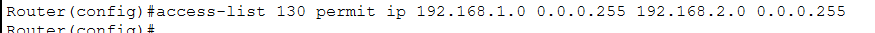
</p>

```cisco
! Define Interesting Traffic
! Traffic from 192.168.10.0 to 192.168.20.0 should be encrypted
Site-A(config)# access-list 100 permit ip 192.168.10.0 0.0.0.255 192.168.20.0 0.0.0.255
```

**Purpose:** Define which traffic gets encrypted.

---

#### Step 5: Configure IKE Phase 1 (ISAKMP)

<p align="center">
  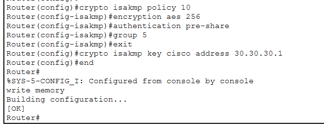
</p>

```cisco
! Configure ISAKMP Policy (Phase 1)
Site-A(config)# crypto isakmp policy 10
Site-A(config-isakmp)# encryption aes 256
Site-A(config-isakmp)# hash sha
Site-A(config-isakmp)# authentication pre-share
Site-A(config-isakmp)# group 5
Site-A(config-isakmp)# lifetime 86400
Site-A(config-isakmp)# exit

! Configure Pre-Shared Key
Site-A(config)# crypto isakmp key MySecureKey123 address 200.0.0.3
```

**Explanation:**
```
encryption aes 256 = AES 256-bit encryption
hash sha = SHA hashing algorithm
authentication pre-share = Use pre-shared key
group 5 = Diffie-Hellman Group 5 (1536-bit)
lifetime 86400 = 24 hours
key = Password (must match other side)
address = Remote router's public IP
```

---

#### Step 6: Configure IKE Phase 2 (IPsec)

<p align="center">
  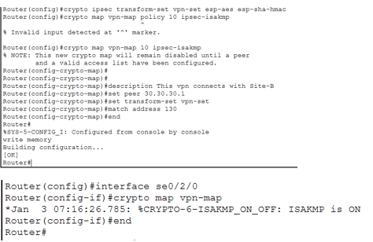
</p>

```cisco
! Define Transform Set (Phase 2)
Site-A(config)# crypto ipsec transform-set MYSET esp-aes 256 esp-sha-hmac
Site-A(cfg-crypto-trans)# mode tunnel
Site-A(cfg-crypto-trans)# exit

! Create Crypto Map
Site-A(config)# crypto map MYMAP 10 ipsec-isakmp
Site-A(config-crypto-map)# set peer 200.0.0.3
Site-A(config-crypto-map)# set transform-set MYSET
Site-A(config-crypto-map)# match address 100
Site-A(config-crypto-map)# exit

! Apply Crypto Map to Interface
Site-A(config)# interface gigabitEthernet 0/1
Site-A(config-if)# crypto map MYMAP
Site-A(config-if)# exit
```

**Explanation:**
```
transform-set = How to encrypt data
esp-aes 256 = Encryption algorithm
esp-sha-hmac = Authentication algorithm
mode tunnel = Tunnel mode (entire packet encrypted)
crypto map = Bind everything together
set peer = Remote router IP
match address = Which traffic (ACL 100)
```

---

### Site-B Configuration

#### Step 1: Basic Router Configuration

<p align="center">
  
</p>

```cisco
! Site-B Router Configuration
Router(config)# hostname Site-B

! LAN Interface
Router(config)# interface gigabitEthernet 0/0
Router(config-if)# ip address 192.168.20.1 255.255.255.0
Router(config-if)# no shutdown
Router(config-if)# exit

! WAN Interface (to ISP)
Router(config)# interface gigabitEthernet 0/1
Router(config-if)# ip address 200.0.0.3 255.255.255.0
Router(config-if)# no shutdown
Router(config-if)# exit
```

---

#### Step 2: OSPF Configuration

<p align="center">
  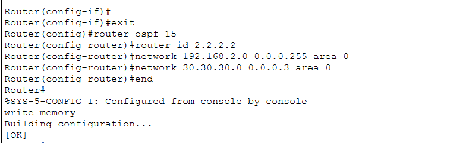
</p>

```cisco
! OSPF Configuration
Site-B(config)# router ospf 1
Site-B(config-router)# network 192.168.20.0 0.0.0.255 area 0
Site-B(config-router)# network 200.0.0.0 0.0.0.255 area 0
Site-B(config-router)# exit
```

---

#### Step 3: Enable Security Technology Package

<p align="center">
  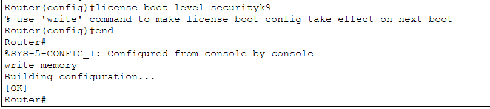
</p>

```cisco
! Enable Security Technology Package
Site-B# license boot level securityk9
Site-B# reload
```

---

#### Step 4: Configure Extended ACL

<p align="center">
  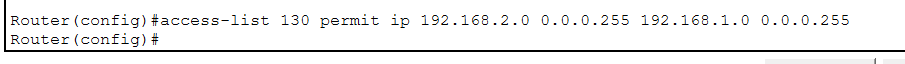
</p>

```cisco
! Define Interesting Traffic (MIRROR of Site-A)
! Source and destination reversed!
Site-B(config)# access-list 100 permit ip 192.168.20.0 0.0.0.255 192.168.10.0 0.0.0.255
```

**Important:** ACL is mirror image of Site-A!
```
Site-A: permit ip 192.168.10.0 → 192.168.20.0
Site-B: permit ip 192.168.20.0 → 192.168.10.0
        (Source and destination swapped)
```

---

#### Step 5: Configure IKE Phase 1 (ISAKMP)

<p align="center">
  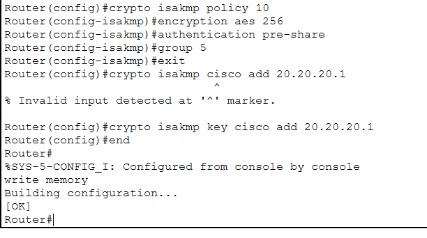
</p>

```cisco
! Configure ISAKMP Policy (Phase 1)
Site-B(config)# crypto isakmp policy 10
Site-B(config-isakmp)# encryption aes 256
Site-B(config-isakmp)# hash sha
Site-B(config-isakmp)# authentication pre-share
Site-B(config-isakmp)# group 5
Site-B(config-isakmp)# lifetime 86400
Site-B(config-isakmp)# exit

! Configure Pre-Shared Key (same password, different address)
Site-B(config)# crypto isakmp key MySecureKey123 address 200.0.0.1
```

**Must Match Site-A:**
```
✅ encryption = aes 256
✅ hash = sha
✅ group = 5
✅ key = MySecureKey123 (same password!)
```

---

#### Step 6: Configure IKE Phase 2 (IPsec)

<p align="center">
  
</p>

```cisco
! Define Transform Set (Phase 2)
Site-B(config)# crypto ipsec transform-set MYSET esp-aes 256 esp-sha-hmac
Site-B(cfg-crypto-trans)# mode tunnel
Site-B(cfg-crypto-trans)# exit

! Create Crypto Map
Site-B(config)# crypto map MYMAP 10 ipsec-isakmp
Site-B(config-crypto-map)# set peer 200.0.0.1
Site-B(config-crypto-map)# set transform-set MYSET
Site-B(config-crypto-map)# match address 100
Site-B(config-crypto-map)# exit

! Apply Crypto Map to Interface
Site-B(config)# interface gigabitEthernet 0/1
Site-B(config-if)# crypto map MYMAP
Site-B(config-if)# exit
```

---

### ISP Configuration

<p align="center">
  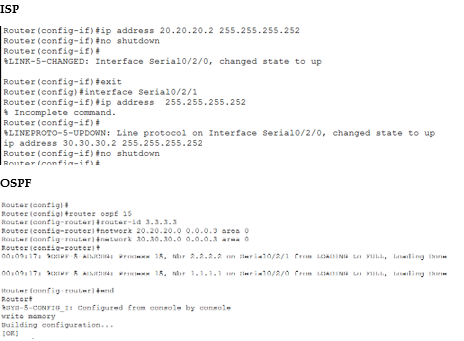
</p>

```cisco
! ISP Router Configuration
Router(config)# hostname ISP

! Interface to Site-A
Router(config)# interface gigabitEthernet 0/0
Router(config-if)# ip address 200.0.0.2 255.255.255.0
Router(config-if)# no shutdown
Router(config-if)# exit

! Interface to Site-B
Router(config)# interface gigabitEthernet 0/1
Router(config-if)# ip address 200.0.0.4 255.255.255.0
Router(config-if)# no shutdown
Router(config-if)# exit

! OSPF Configuration
ISP(config)# router ospf 1
ISP(config-router)# network 200.0.0.0 0.0.0.255 area 0
ISP(config-router)# exit
```

---
---

### Verification Before IPsec

<p align="center">
  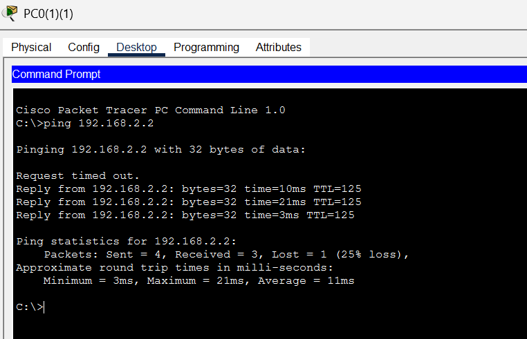
</p>

```cisco
Site-A# show ip ospf neighbor
Site-A# show ip route
```

**Status:** OSPF working, but no secure tunnel yet.

---

### Verification After IPsec

<p align="center">
  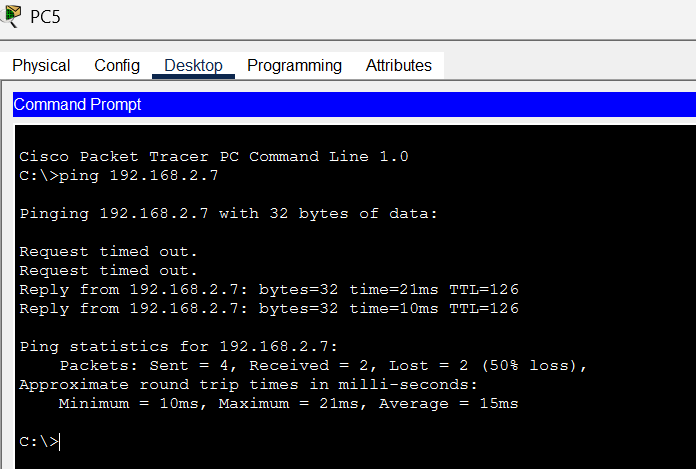
</p>

**Commands:**
```cisco
! Check IKE Phase 1
Site-A# show crypto isakmp sa

! Check IPsec Phase 2
Site-A# show crypto ipsec sa

! Test connectivity
Site-A# ping 192.168.20.1 source 192.168.10.1
```

**Expected Output:**
```
show crypto isakmp sa:
dst             src             state
200.0.0.3       200.0.0.1       QM_IDLE ✅ (Phase 1 successful!)

show crypto ipsec sa:
#pkts encaps: 50 ✅ (Packets encrypted)
#pkts decrypt: 50 ✅ (Packets decrypted)
```

**Result:** ✅ IPsec tunnel established, traffic encrypted successfully

---

## 📝 Quick Reference

### Configuration Template

```cisco
! ============================================
! Complete IPsec VPN Configuration
! ============================================

! Step 1: Enable Security Package
Router# license boot level securityk9
Router# reload

! Step 2: Define Interesting Traffic (ACL)
Router(config)# access-list 100 permit ip [local-lan] [wildcard] [remote-lan] [wildcard]

! Step 3: Configure IKE Phase 1 (ISAKMP)
Router(config)# crypto isakmp policy 10
Router(config-isakmp)# encryption aes 256
Router(config-isakmp)# hash sha
Router(config-isakmp)# authentication pre-share
Router(config-isakmp)# group 5
Router(config-isakmp)# lifetime 86400
Router(config-isakmp)# exit

! Step 4: Configure Pre-Shared Key
Router(config)# crypto isakmp key [password] address [remote-public-ip]

! Step 5: Configure Transform Set (Phase 2)
Router(config)# crypto ipsec transform-set MYSET esp-aes 256 esp-sha-hmac
Router(cfg-crypto-trans)# mode tunnel
Router(cfg-crypto-trans)# exit

! Step 6: Create Crypto Map
Router(config)# crypto map MYMAP 10 ipsec-isakmp
Router(config-crypto-map)# set peer [remote-public-ip]
Router(config-crypto-map)# set transform-set MYSET
Router(config-crypto-map)# match address 100
Router(config-crypto-map)# exit

! Step 7: Apply to Interface
Router(config)# interface [wan-interface]
Router(config-if)# crypto map MYMAP
```

---

### Verification Commands

```cisco
! Check IKE Phase 1 status
show crypto isakmp sa

! Check IPsec Phase 2 status
show crypto ipsec sa

! Check crypto map configuration
show crypto map

! Test connectivity
ping [remote-lan-ip] source [local-lan-ip]
```

---

### Troubleshooting

| Issue | Cause | Fix |
|-------|-------|-----|
| **Phase 1 fails** | ISAKMP policies don't match | Verify encryption, hash, group match |
| | Pre-shared key mismatch | Check key is identical both sides |
| **Phase 2 fails** | ACL not matching traffic | Verify ACL is mirror image |
| | Transform set mismatch | Check encryption/hash match |
| **No traffic** | Crypto map not applied | Apply crypto map to WAN interface |
| | Wrong ACL | Check source/dest in ACL |
| **License error** | Security package not enabled | Enable securityk9 license |

---

### Important Configuration Rules

**1. Pre-Shared Key:**
```
✅ Must be EXACTLY the same on both routers
✅ Case-sensitive
✅ Use strong password (letters + numbers + symbols)
```

**2. Interesting Traffic ACL:**
```
Site-A: permit ip 192.168.10.0 → 192.168.20.0
Site-B: permit ip 192.168.20.0 → 192.168.10.0
        ↑                         ↑
    Swapped source and destination (MIRROR!)
```

**3. ISAKMP Policy:**
```
✅ encryption = Must match both sides
✅ hash = Must match both sides
✅ group = Must match both sides
✅ authentication = Must match both sides
```

**4. Transform Set:**
```
✅ esp-aes 256 = Encryption (must match)
✅ esp-sha-hmac = Authentication (must match)
✅ mode tunnel = Tunnel mode
```

---

### Configuration Checklist

**Prerequisites:**
- [ ] ISR-4321 router model (supports IPsec)
- [ ] Security technology package enabled
- [ ] Physical interfaces configured (public + private IPs)
- [ ] OSPF configured (can ping public IPs)

**IPsec Configuration:**
- [ ] Define interesting traffic (ACL)
- [ ] Configure ISAKMP policy (Phase 1)
- [ ] Set pre-shared key
- [ ] Create transform set (Phase 2)
- [ ] Create crypto map
- [ ] Apply crypto map to WAN interface

**Verification:**
- [ ] `show crypto isakmp sa` (QM_IDLE state)
- [ ] `show crypto ipsec sa` (pkts encaps > 0)
- [ ] Ping test LAN to LAN
- [ ] Check packet counters increasing

---

---

## 🎓 What I Learned

✅ **IPsec Fundamentals** - Secure VPN tunnel creation  
✅ **Two-Phase Process** - IKE Phase 1 and Phase 2  
✅ **Encryption** - AES 256-bit for data protection  
✅ **Authentication** - Pre-shared key configuration  
✅ **Interesting Traffic** - ACL for traffic selection  
✅ **Transform Sets** - Encryption and authentication methods  
✅ **Crypto Maps** - Binding all components together  
✅ **Security Package** - ISR-4321 license requirement  
✅ **Troubleshooting** - Phase 1 and Phase 2 verification  

---

## 🚀 How to Use This Repository

1. **Clone the repository:**
   ```bash
   git clone https://github.com/your-username/IPsec-VPN-Implementation.git
   ```

2. **Study the concept:**
   - Understand IPsec phases
   - Learn encryption vs GRE
   - Know security benefits

3. **Practice in lab:**
   - Use ISR-4321 routers
   - Enable security package
   - Configure complete IPsec

4. **Verify:**
   - Check Phase 1 status
   - Check Phase 2 status
   - Test encrypted traffic

---
## 📞 Connect With Me

<div align="center">

[](mailto:a.wahid7860668@gmail.com)
[](https://www.linkedin.com/in/abdul-wahid022)
[](https://github.com/abdul-wahid022)

**💬 Questions? Need Packet Tracer files? Feel free to reach out!**

</div>

---

## 📄 License

This project is created for **educational purposes** and is open-source.

---

<div align="center">

### ⭐ If you found this helpful, please give it a star!

**Made with 💙 by ABDUL WAHID**

*Last Updated: January 2026*

</div>

