# 📡 Wireless LAN Controller (WLC) & Access Points - Complete Guide

<div align="center">


**Comprehensive Guide to Wireless Network Management**


[📖 Overview](#-overview) • [📶 Basic Access Point](#-basic-access-point-configuration) • [🎛️ WLC Method 1](#️-wlc-method-1-lightweight-access-points) • [🔧 WLC Method 2](#-wlc-method-2-alternative-topology)

</div>

---

## 📖 Overview

**Wireless LAN Controller (WLC)** centralizes the management of multiple access points, making wireless network administration efficient and scalable.

### What You'll Learn:

| Topic | Description | Use Case |
|-------|-------------|----------|
| **Basic Access Point** | Single AP wireless setup | Small office, home |
| **WLC Method 1** | Centralized management with AP Groups | Enterprise with departments |
| **WLC Method 2** | Simplified WLC deployment | Medium-sized networks |

### Key Benefits:

✅ **Centralized Management** - Control all APs from one interface  
✅ **Scalability** - Easily add more APs  
✅ **Security** - WPA2 encryption, department isolation  
✅ **Efficiency** - Manage hundreds of APs easily  
✅ **Flexibility** - Multiple SSIDs per AP

---

## 📚 Table of Contents

1. [📶 Basic Access Point Configuration](#-basic-access-point-configuration)
2. [🎛️ WLC Method 1 (Lightweight Access Points)](#️-wlc-method-1-lightweight-access-points)
3. [🔧 WLC Method 2 (Alternative Topology)](#-wlc-method-2-alternative-topology)
4. [📝 Quick Reference](#-quick-reference)

---

## 📶 Basic Access Point Configuration

### Concept

<div align="center">

| Feature | Details |
|---------|---------|
| **Type** | Standalone Access Point |
| **Model** | WMP300N (Wireless Module) |
| **Management** | Individual AP configuration |
| **Best For** | Small networks (1-3 APs) |
| **Devices Supported** | Laptop, PC, Tablet, Smartphone, Printer |

</div>

#### 🔑 Key Points:

**Basic Access Point** provides wireless connectivity without centralized management.

**Real-Life Example:**
```
Home WiFi Router:
├─ Single WiFi router
├─ All devices connect to one SSID
├─ Simple setup
└─ Good for home/small office

Basic AP = Same concept in Packet Tracer
```

#### What is WMP300N?

**WMP300N** = Wireless module that makes devices wireless-capable

**Devices That Need Module:**
- ✓ Laptop (replace Ethernet with wireless)
- ✓ PC (add wireless capability)
- ✓ Printer (wireless printing)
- ✓ Tablet (built-in wireless)
- ✓ Smartphone (built-in wireless)

---

### Topology - Basic AP

<p align="center">
  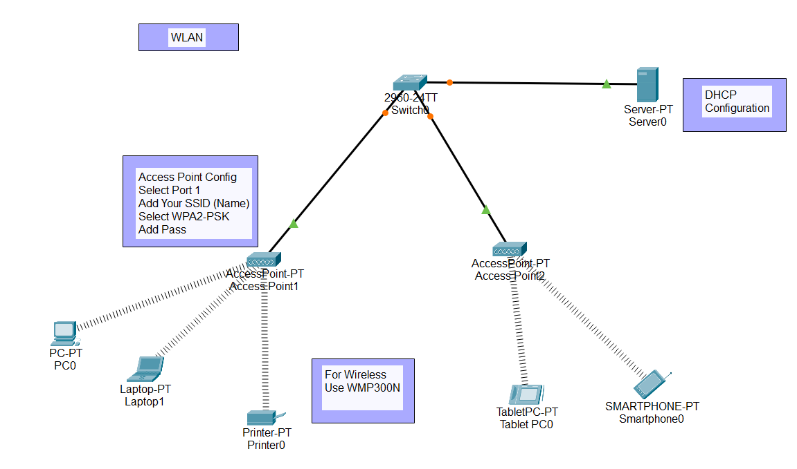
</p>

**Network Components:**
```
┌─────────────────────────────────────┐
│      Access Point (Office-WiFi)     │
│      SSID: Office-WiFi              │
│      Auth: WPA2-PSK                 │
│      Pass: Office123                │
└──────────────┬──────────────────────┘
               │
        ┌──────┴──────┐
        │   Switch    │
        └──────┬──────┘
               │
        ┌──────┴──────┐
        │ DHCP Server │
        │ 192.168.1.1 │
        └─────────────┘

Wireless Devices:
├─ Laptop (WMP300N module)
├─ PC (WMP300N module)
├─ Printer (WMP300N module)
├─ Tablet (built-in wireless)
└─ Smartphone (built-in wireless)
```

---

### Access Point Setup

#### Step 1: Configure Access Point

<p align="center">
  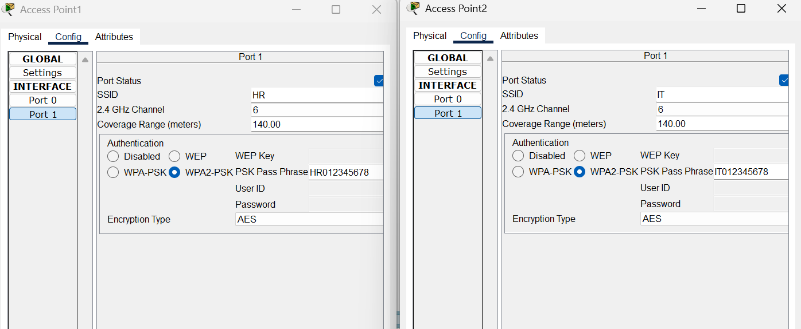
</p>

**Access Point Settings:**
```
SSID: Office-WiFi
Authentication: WPA2-PSK
Password: Office123
```

---

### Device Configuration

#### Step 2: Laptop Module Change

<p align="center">
  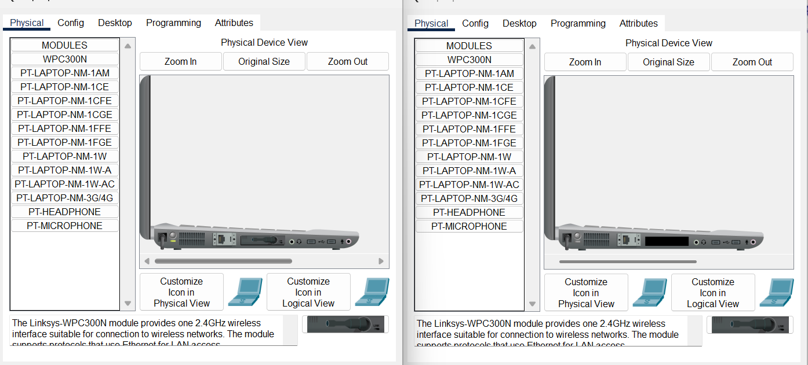
</p>

**Physical Configuration:**
```
Step 1: Click on Laptop
Step 2: Power OFF the laptop
Step 3: Go to "Physical" tab
Step 4: Remove Ethernet module (drag out)
Step 5: Add WMP300N module (drag in)
Step 6: Power ON the laptop
```

---

#### Step 3: Laptop Wireless Configuration

<p align="center">
  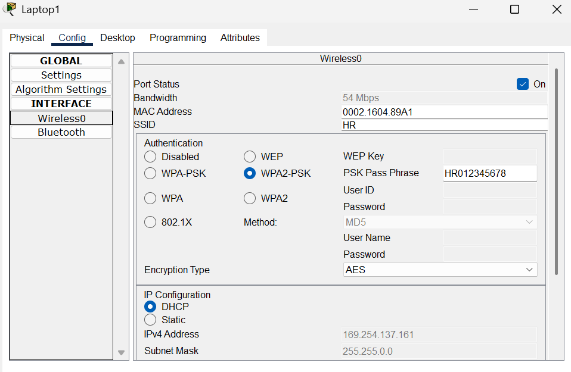
</p>

**Wireless Configuration:**
```
Step 1: Go to Desktop
Step 2: Click "PC Wireless"
Step 3: Select "Connect" tab
Step 4: SSID: Office-WiFi
Step 5: Authentication: WPA2-PSK
Step 6: Passphrase: Office123
Step 7: Click "Connect"
```

---

#### Step 4: Laptop Desktop Wireless

<p align="center">
  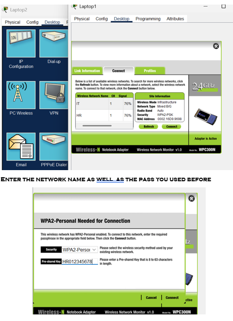
</p>

**Desktop PC Wireless Interface:**
```
Desktop → PC Wireless
Connection successful
Signal strength visible
IP assigned from DHCP
```

---

#### Step 5: Printer Module Change

<p align="center">
  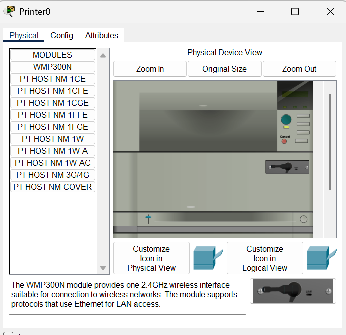
</p>

**Printer Wireless Setup:**
```
1. Power OFF printer
2. Add WMP300N module
3. Power ON printer
```

---

#### Step 6: Printer Wireless Configuration

<p align="center">
  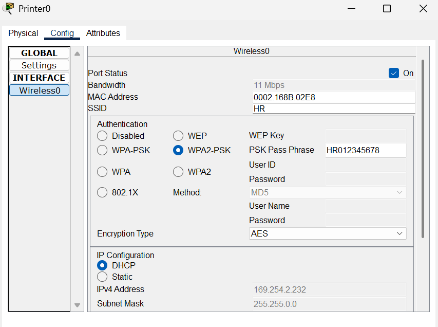
</p>

**Wireless Configuration:**
```
Config → Wireless0
SSID: Office-WiFi
Authentication: WPA2-PSK
PSK Pass: Office123
```

---

#### Step 7: PC Module Change

<p align="center">
  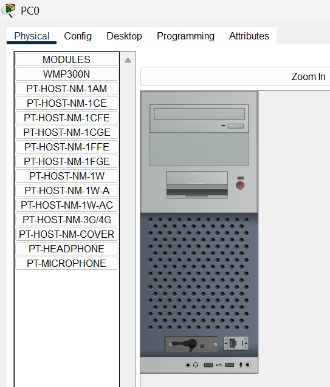
</p>

**Physical Configuration:**
```
Same process as Laptop:
1. Power OFF
2. Remove Ethernet module
3. Add WMP300N module
4. Power ON
```

---

#### Step 8: PC Wireless Configuration

<p align="center">
  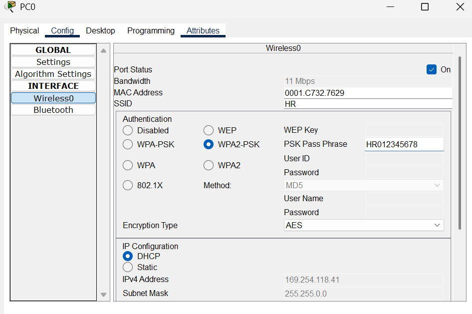
</p>

**Wireless Setup:**
```
Desktop → PC Wireless → Connect
SSID: Office-WiFi
Authentication: WPA2-PSK
Password: Office123
```

---

#### Step 9: Tablet Configuration

<p align="center">
  
</p>

**Tablet Setup:**
```
Note: Tablet has built-in wireless (no module needed)

Config → Wireless0
SSID: Office-WiFi
Authentication: WPA2-PSK
PSK Pass: Office123
```

---

#### Step 10: Smartphone Configuration

<p align="center">
  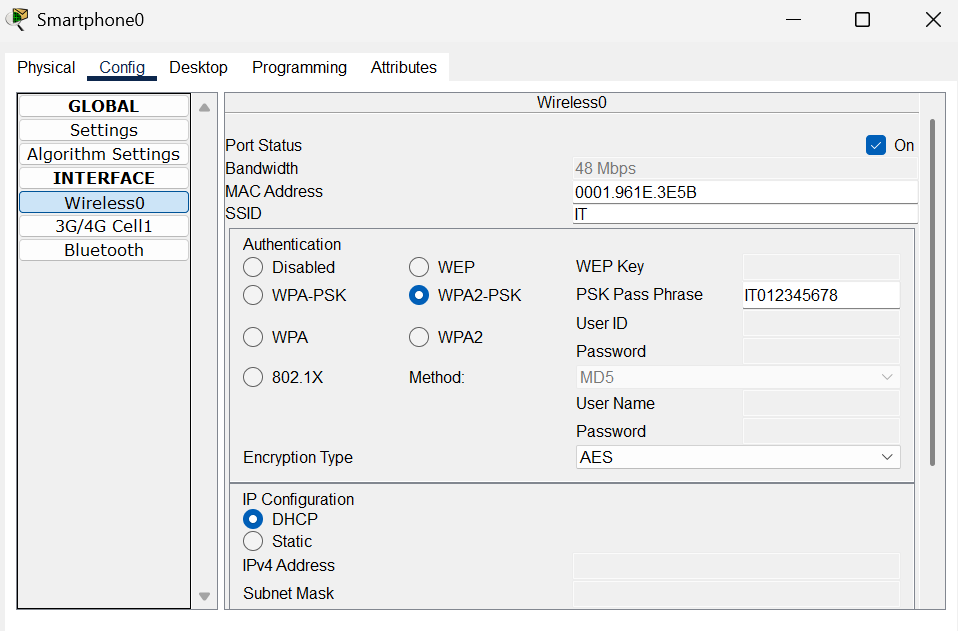
</p>

**Smartphone Setup:**
```
Note: Smartphone has built-in wireless

Config → Wireless0
SSID: Office-WiFi
Authentication: WPA2-PSK
PSK Pass: Office123
```

---

### DHCP Server Setup

#### Step 11: DHCP Server Configuration

<p align="center">
  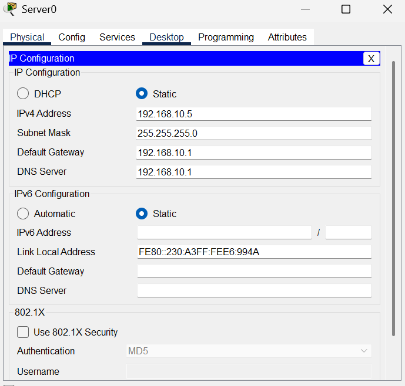
</p>

**Server Configuration:**
```
Server → Config → Services → DHCP
Enable DHCP Service
```

---

#### Step 12: DHCP Pool Configuration

<p align="center">
  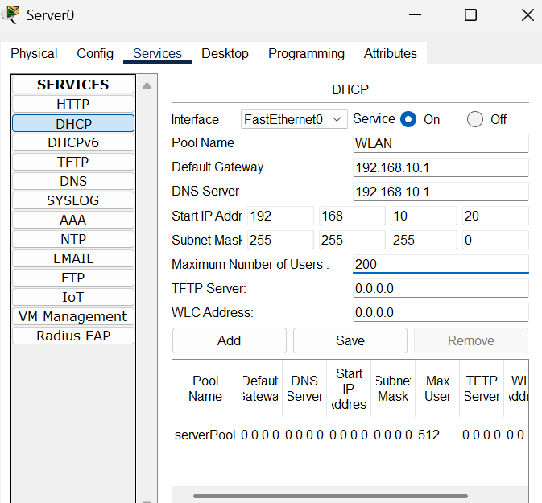
</p>

**Pool Settings:**
```
Pool Name: Wireless-Pool
Default Gateway: 192.168.1.1
DNS Server: 192.168.1.1
Start IP Address: 192.168.1.100
Subnet Mask: 255.255.255.0
Maximum Users: 50
```

**Purpose:**
```
✓ Automatic IP assignment to wireless devices
✓ No manual IP configuration needed
✓ Devices get IP when connecting to WiFi
```

---

#### Step 13: IP Assignment Through DHCP

<p align="center">
  
</p>

**Assigned IPs:**
```
Laptop:     192.168.1.100
PC:         192.168.1.101
Printer:    192.168.1.102
Tablet:     192.168.1.103
Smartphone: 192.168.1.104
```

---

### Verification - Basic AP

<p align="center">
  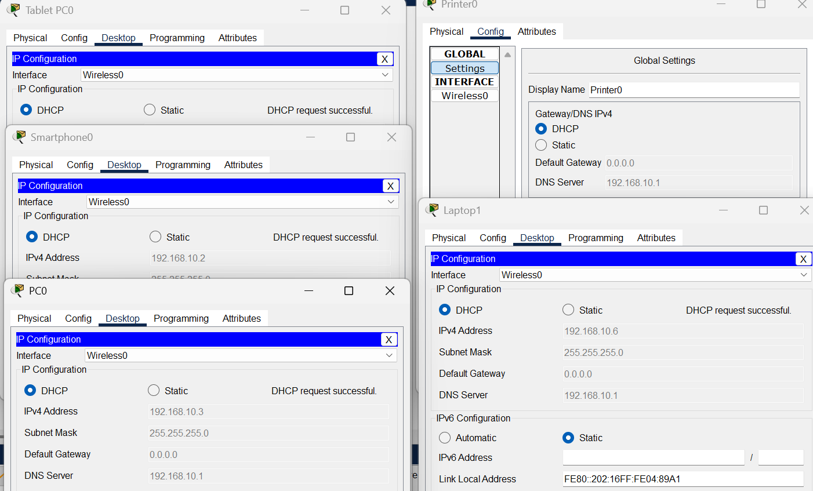
</p>

**Check Wireless Connection:**
```
1. All devices show "Connected" status
2. Each device received IP from DHCP pool
3. Ping test between devices successful
```

**Expected Result:**
```
✅ All devices connected to Office-WiFi
✅ DHCP assigned IPs automatically
✅ Devices can communicate wirelessly
```

---

## 🎛️ WLC Method 1 (Lightweight Access Points)

### Concept

<div align="center">

| Feature | Details |
|---------|---------|
| **Type** | Centralized Management |
| **APs** | Lightweight Access Points (LAPT) |
| **Management** | Single WLC manages all APs |
| **Best For** | Enterprise with departments |
| **Key Feature** | AP Groups for department isolation |

</div>

#### 🔑 Key Points:

**WLC (Wireless LAN Controller)** manages multiple lightweight access points centrally.

**Real-Life Example:**
```
University Campus WiFi:

Without WLC (Problem):
├─ 100 access points
├─ Configure each AP individually
├─ IT dept sees HR dept traffic
└─ Management nightmare! ❌

With WLC (Solution):
├─ 100 access points managed by 1 WLC
├─ Configure once, applies to all
├─ IT dept isolated from HR dept
└─ Easy management! ✅
```

#### What are Lightweight Access Points (LAPT)?

**LAPT** = "Dumb" access points controlled by WLC

**Comparison:**

| Feature | Standalone AP | Lightweight AP (LAPT) |
|---------|---------------|----------------------|
| **Intelligence** | Smart (has config) | Dumb (no config) |
| **Management** | Individual | Centralized via WLC |
| **Configuration** | Each AP separately | WLC configures all |
| **Updates** | Manual per AP | WLC pushes to all |
| **Best For** | 1-5 APs | 10+ APs |

**Analogy:**
```
Standalone AP = Individual shop owners
Each owner manages their own shop

LAPT = Franchise stores
Head office (WLC) manages all stores
```

---

### Topology - WLC Method 1

<p align="center">
  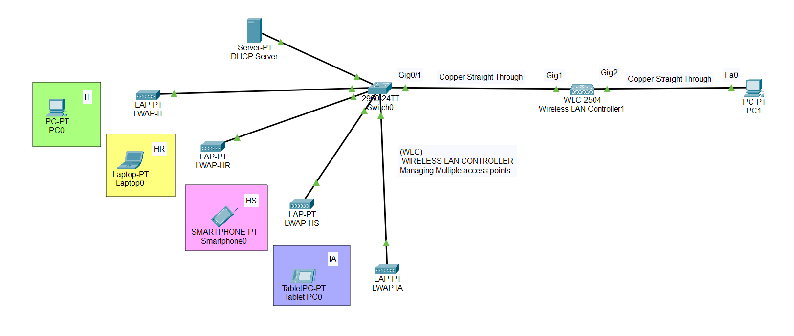
</p>

**Network Components:**
```
┌─────────────────────────────────────┐
│          WLC (Controller)           │
│      IP: 192.168.1.100              │
└──────────────┬──────────────────────┘
               │
        ┌──────┴──────┐
        │   Switch    │
        └──────┬──────┘
               │
    ┏━━━━━━━━━┻━━━━━━━━━┓
    ┃                    ┃
┌───┴────┐          ┌───┴────┐
│ LAPT-1 │          │ LAPT-2 │
│ (IT)   │          │ (HR)   │
└────────┘          └────────┘
┌────────┐          ┌────────┐
│ LAPT-3 │          │ LAPT-4 │
│ (HS)   │          │ (IA)   │
└────────┘          └────────┘
```

**Key Setup:**
```
✓ Use Lightweight Access Points (LAPT)
✓ Connect Switch to WLC using straight copper cable
✓ Turn ON all Access Points
✓ 4 Access Points for 4 departments
```

---

### Initial WLC Setup

#### Step 1: Turn On Access Points

<p align="center">
  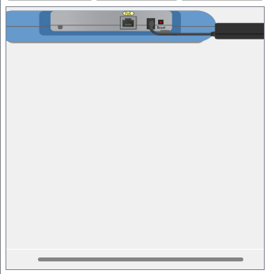
</p>

**Power On APs:**
```
1. Click each Lightweight Access Point
2. Ensure they are powered ON
3. Wait for them to boot up
4. They will automatically connect to WLC
```

---

#### Step 2: WLC IP Configuration

<p align="center">
  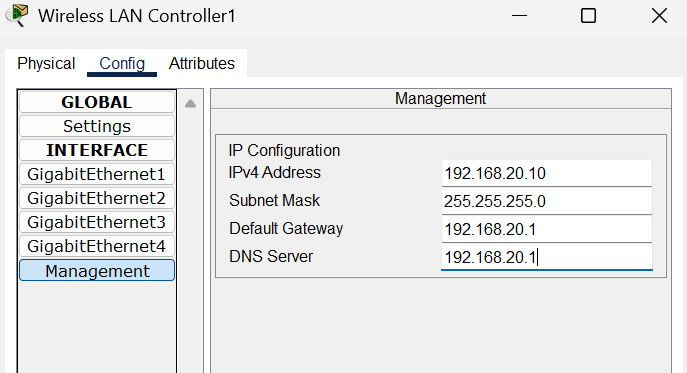
</p>

**WLC Network Settings:**
```
WLC Configuration:
IP Address: 192.168.1.100
Subnet Mask: 255.255.255.0
Default Gateway: 192.168.1.1
```

---

#### Step 3: Configure PC1

<p align="center">
  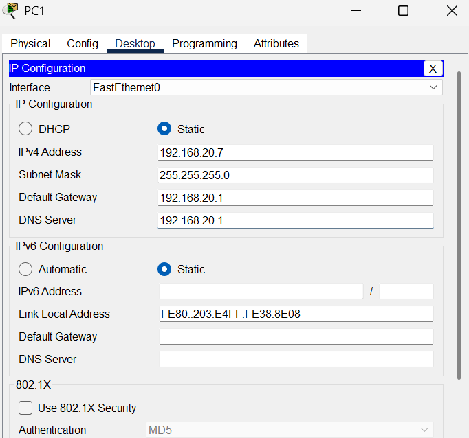
</p>

**PC1 Settings:**
```
IP Address: 192.168.1.10
Subnet Mask: 255.255.255.0
Default Gateway: 192.168.1.1

Purpose: PC1 will access WLC web interface
```

---

#### Step 4: DHCP Server Configuration

<p align="center">
  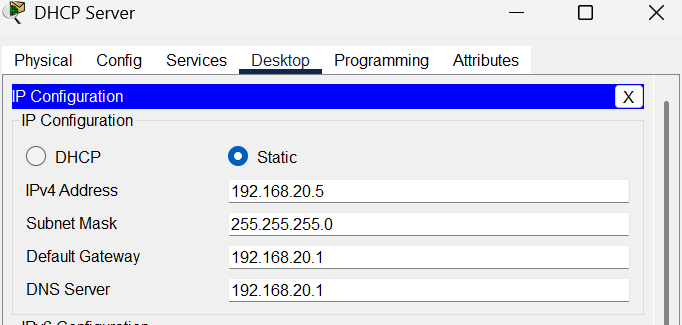
</p>

**⚠️ CRITICAL: Add WLC IP to DHCP!**
```
DHCP Pool Configuration:
Pool Name: Wireless-Pool
Default Gateway: 192.168.1.1
DNS Server: 192.168.1.1
Start IP: 192.168.1.50
Subnet Mask: 255.255.255.0

⚠️ IMPORTANT: Option 43 (WLC Discovery)
WLC IP Address: 192.168.1.100

Why Add WLC IP?
✓ Access Points need to find WLC
✓ DHCP Option 43 tells APs where WLC is
✓ Without this, APs won't connect to WLC
```

---

#### Step 5: Select DHCP on Access Points

<p align="center">
  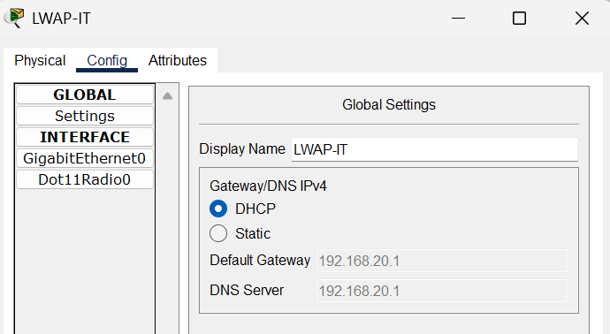
</p>

**AP Configuration:**
```
For each Lightweight Access Point:
1. Click on AP
2. Go to Config tab
3. Port 1 → DHCP (select DHCP)
4. AP will get IP from DHCP server
5. AP will discover WLC using Option 43
```

---

#### Step 6: Check PC1 Connection with WLC

<p align="center">
  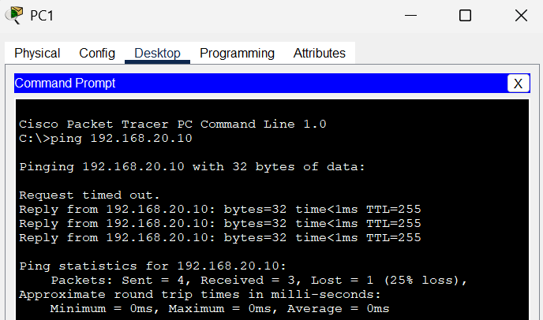
</p>

**Verification:**
```
PC1> ping 192.168.1.100

Expected Result:
✅ Reply from 192.168.1.100
✅ Connection successful
```

---

### WLC Web Interface Access

#### Step 7: Open Browser (HTTP)

<p align="center">
  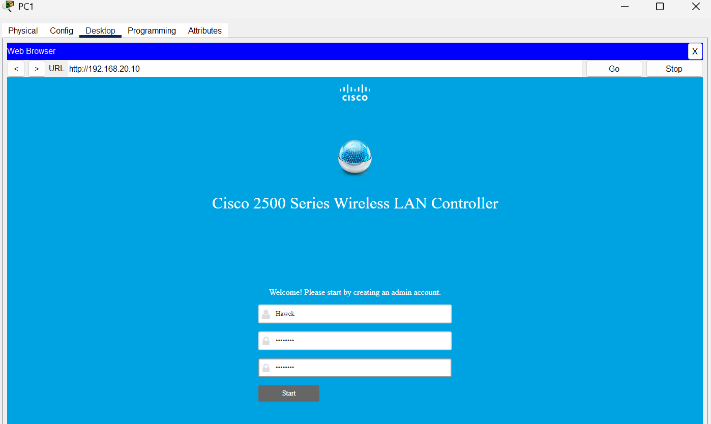
</p>

**Initial Access:**
```
1. Open web browser on PC1
2. Enter: http://192.168.1.100
3. Initial setup wizard will appear
```

---

#### Step 8: Create Admin Credentials

<p align="center">
  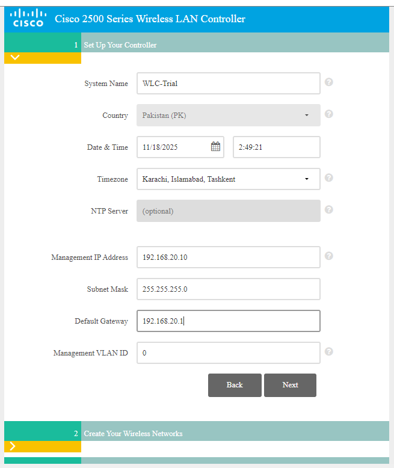
</p>

**System Setup:**
```
System Name: WLC
Admin Username: admin
Admin Password: Wlc123
```

---

#### Step 9: Network Configuration (IT Department)

<p align="center">
  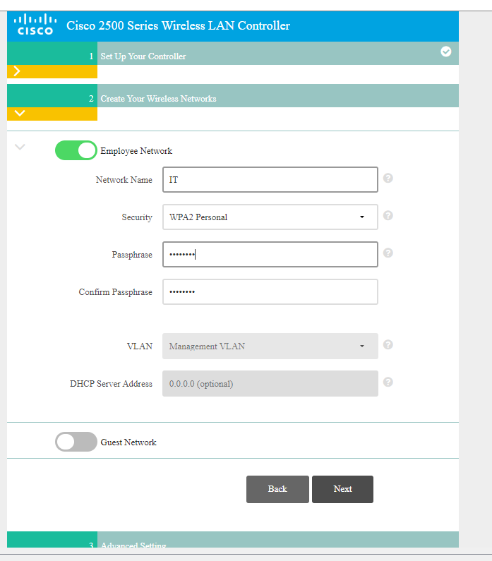
</p>

**First WLAN (IT Department):**
```
Network Name (SSID): IT
WPA2 Passphrase: ITwlc123

Click "Next"
```

---

#### Step 10: Review Details

<p align="center">
  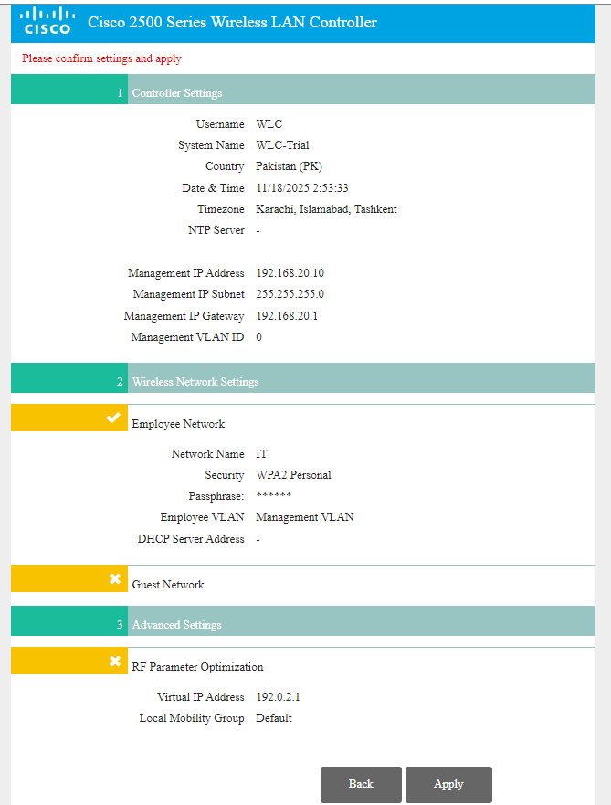
</p>

**Confirmation Screen:**
```
Review all entered details:
✓ System Name: WLC
✓ Network: IT
✓ Security: WPA2

Just click "Next" (Don't change anything)
```

---

#### Step 11: Apply Configuration

<p align="center">
  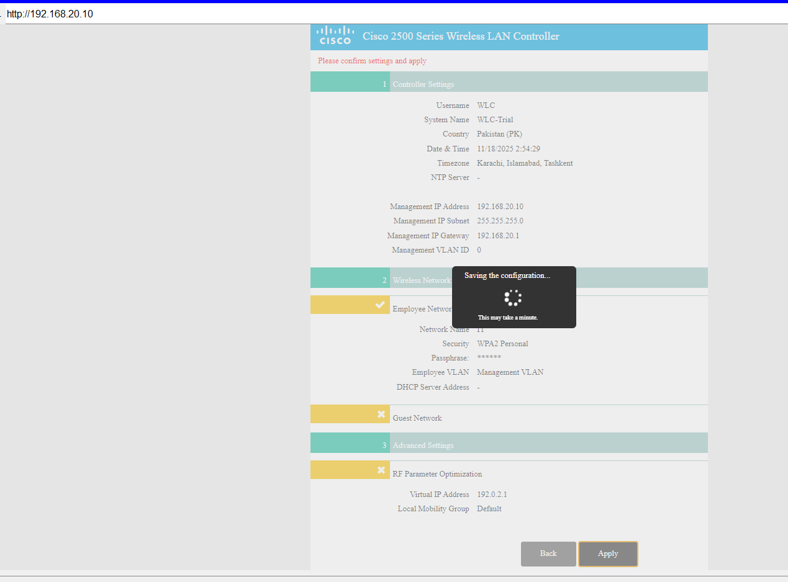
</p>

**Save Configuration:**
```
Click "Apply"
Configuration will be saved
WLC will restart services

Now close the browser and open it again
Previously we had HTTP, now make it HTTPS
```

---

#### Step 12: Access via HTTPS

<p align="center">
  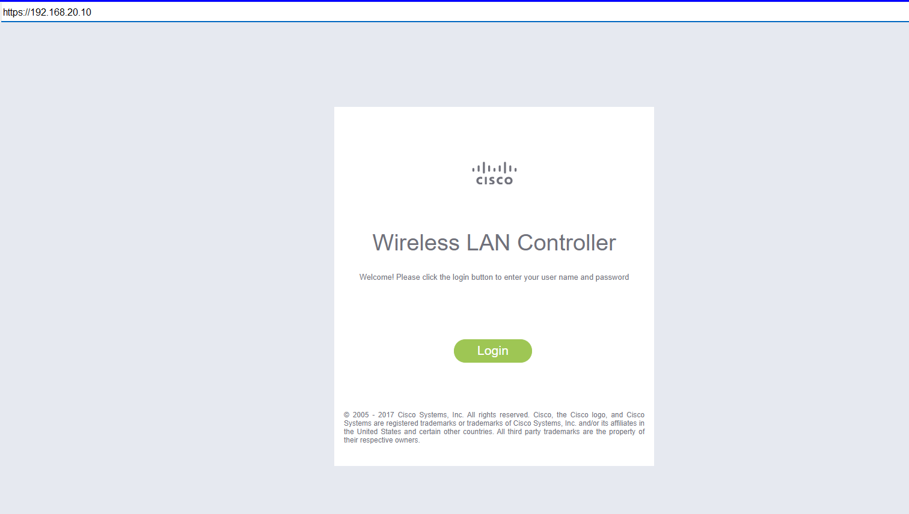
</p>

**Switch to HTTPS:**
```
1. Open browser again
2. Enter: https://192.168.1.100
   (Note the 's' in https)
3. Accept security warning (if any)
```

**Why HTTPS?**
```
✓ Secure encrypted connection
✓ Protected admin access
✓ Industry best practice
```

---

#### Step 13: Login to WLC

<p align="center">
  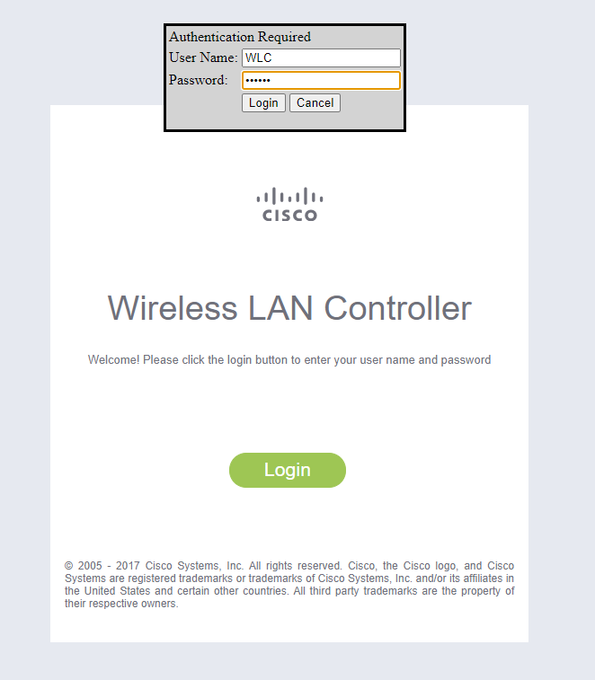
</p>

**Login Credentials:**
```
Username: admin
Password: Wlc123

Click "Login"
```

---

#### Step 14: Successfully Logged In

<p align="center">
  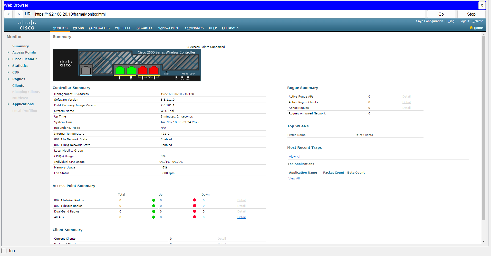
</p>

**Result:**
```
✅ Successfully logged in
✅ WLC management interface ready
✅ Can see dashboard
```

---

### Department Configuration

#### Step 15: View Access Points & WLANs

<p align="center">
  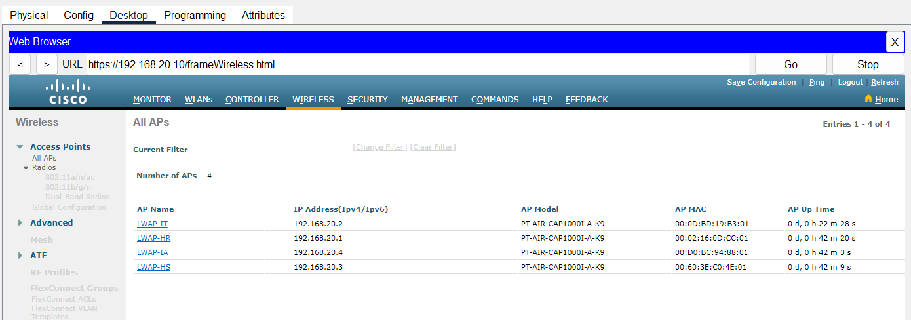
</p>

**Navigate:**
```
1. Click "Wireless" in top menu
2. You can see 4 Access Points listed

AP Status:
✅ LAPT-1 (Registered)
✅ LAPT-2 (Registered)
✅ LAPT-3 (Registered)
✅ LAPT-4 (Registered)

All 4 APs connected to WLC successfully
```

---

#### Step 16: View Existing WLAN

<p align="center">
  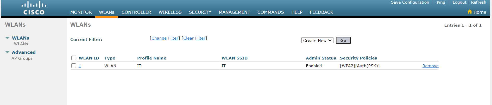
</p>

**Check WLANs:**
```
1. Click "WLAN" in left menu
2. IT department already present (from initial setup)
3. Now we'll add other departments (HR, HS, IA)
```

---

#### Step 17: Add New WLAN (HR Department)

<p align="center">
  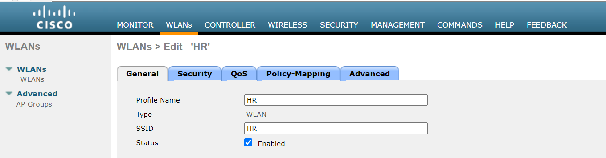
</p>

**Create HR Department:**
```
1. Click "Go" to add new WLAN
2. Profile Name: HR
3. SSID: HR
4. Click "Apply"
```

---

#### Step 18: HR Security Settings

<p align="center">
  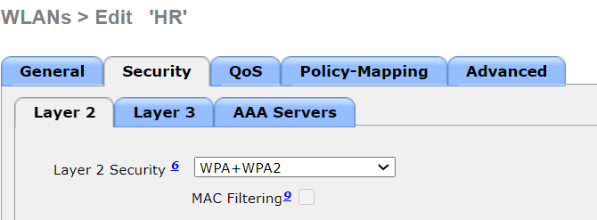
</p>

**Security Configuration:**
```
1. Check "Status: Enabled"
2. Click "Security" tab
3. Layer 2 Security: WPA+WPA2
4. Enable WPA2 Policy
5. WPA2 Encryption: AES
6. Enable PSK
7. PSK Format: ASCII
8. PSK: HRwlc123
9. Click "Apply"
```

---

#### Step 19: All 4 WLANs Enabled

<p align="center">
  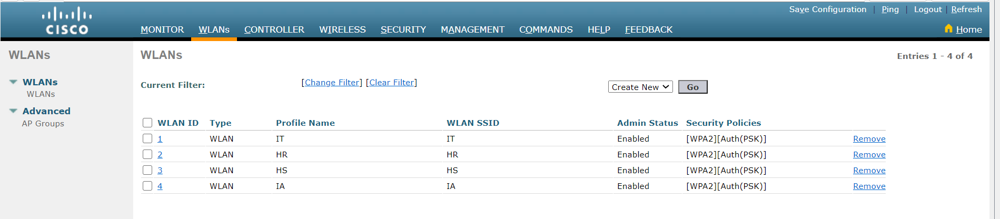
</p>

**Repeat for HS & IA:**
```
HS Department:
├─ Name: HS
├─ SSID: HS
├─ Password: HSwlc123
└─ Security: WPA2-PSK

IA Department:
├─ Name: IA
├─ SSID: IA
├─ Password: IAwlc123
└─ Security: WPA2-PSK

Complete WLAN List:
✅ IT (ITwlc123)
✅ HR (HRwlc123)
✅ HS (HSwlc123)
✅ IA (IAwlc123)

All 4 departments configured and enabled!
```

---

### AP Groups Configuration

#### What are AP Groups?

**AP Groups** = Grouping APs by department for WLAN assignment

**Purpose:**
```
Without AP Groups:
├─ IT AP broadcasts IT, HR, HS, IA (all SSIDs)
├─ HR AP broadcasts IT, HR, HS, IA (all SSIDs)
└─ Confusion! Users see all SSIDs everywhere ❌

With AP Groups:
├─ IT AP → Only IT SSID visible
├─ HR AP → Only HR SSID visible
└─ Clean, organized! ✅
```

---

#### Step 20: Select AP Groups

<p align="center">
  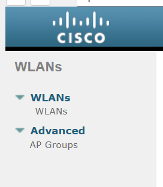
</p>

**Navigate:**
```
1. Click "Wireless" in top menu
2. Select "AP Groups"
3. You'll see "default-group" (all APs initially here)
```

---

#### Step 21: Default Group

<p align="center">
  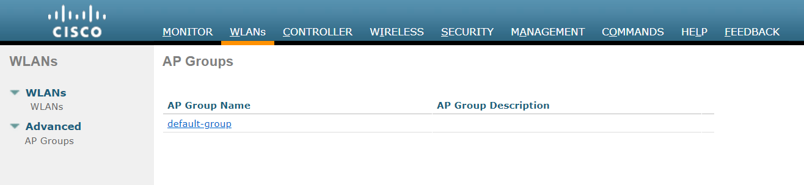
</p>

**Default Group View:**
```
All 4 APs currently in default group
All APs broadcasting all 4 WLANs
We need to separate them!
```

---

#### Step 22: Create New Groups

<p align="center">
  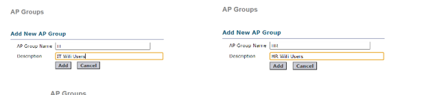
</p>

**Create Department Groups:**
```
1. Go back to AP Groups main page
2. Create new group: "IT-Group"
3. Create new group: "HR-Group"
4. Create new group: "HS-Group"
5. Create new group: "IA-Group"
```

---

#### Step 23: All 4 Groups Made

<p align="center">
  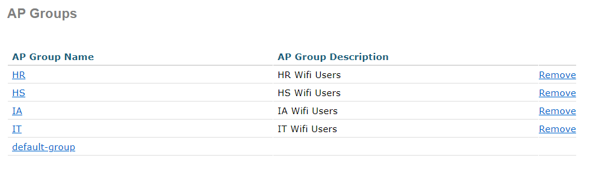
</p>

**AP Groups List:**
```
✅ IT-Group (created)
✅ HR-Group (created)
✅ HS-Group (created)
✅ IA-Group (created)
✅ default-group (existing)

Total: 5 AP Groups
```

---

#### Step 24: Configure IT Group

<p align="center">
  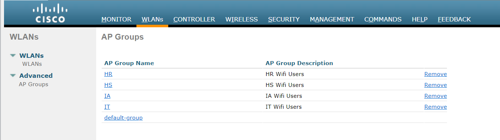
</p>

**Assign WLAN to IT Group:**
```
1. Click "IT-Group"
2. Select "WLANs" tab
3. Select "IT" WLAN from dropdown
4. Click "Add"

Result: IT-Group will only broadcast IT SSID
```

---

#### Step 25: Assign AP to IT Group

<p align="center">
  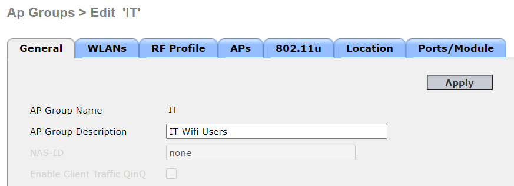
</p>

**Move AP to IT Group:**
```
1. Go to "Wireless" → "Access Points"
2. Select IT department's AP
3. AP Group: Change to "IT-Group"
4. Click "Apply"

Repeat for other 3 departments:
HR AP → HR-Group
HS AP → HS-Group
IA AP → IA-Group
```

---

### Connecting End Devices & Verification

#### Step 26: Connect Device to Department

<p align="center">
  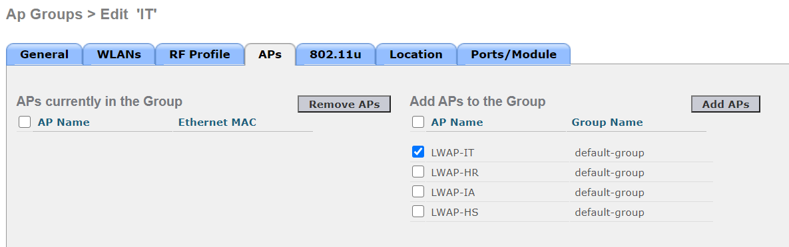
</p>

**End Device Configuration:**
```
1. Click on end device (Laptop/PC/Tablet)
2. Go to Config tab
3. Wireless0 settings:
   - SSID: HR
   - Authentication: WPA2-PSK
   - PSK Pass: HRwlc123
4. Click "Connect"

Result: Device connected to HR network! ✅
```

---

#### Step 27: Method 1 Output - All Departments Working

<p align="center">
  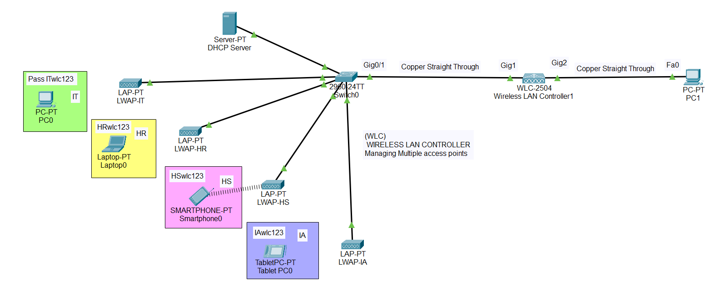
</p>

**Final Verification:**
```
✅ All 4 Access Points registered to WLC
✅ All 4 WLANs (IT, HR, HS, IA) created
✅ All 4 AP Groups configured
✅ Each AP broadcasts only its department's SSID
✅ End devices connected successfully
✅ Department isolation working perfectly
```

---

## 🔧 WLC Method 2 (Alternative Topology)

### Concept

<div align="center">

| Feature | Details |
|---------|---------|
| **Type** | Simplified WLC Setup |
| **Difference** | No AP Groups (simpler) |
| **Management** | All APs broadcast all SSIDs |
| **Best For** | Medium networks without strict separation |

</div>

#### 🔑 Key Points:

**Method 2** = Simpler setup, all APs broadcast all department SSIDs

**Method 1 vs Method 2:**

| Feature | Method 1 | Method 2 |
|---------|----------|----------|
| **AP Groups** | ✅ Yes (department isolation) | ❌ No |
| **SSID per AP** | One SSID per AP | All SSIDs on all APs |
| **Complexity** | More complex | Simpler |
| **Use Case** | Strict department separation | Flexible access |

---

### Topology - WLC Method 2

<p align="center">
  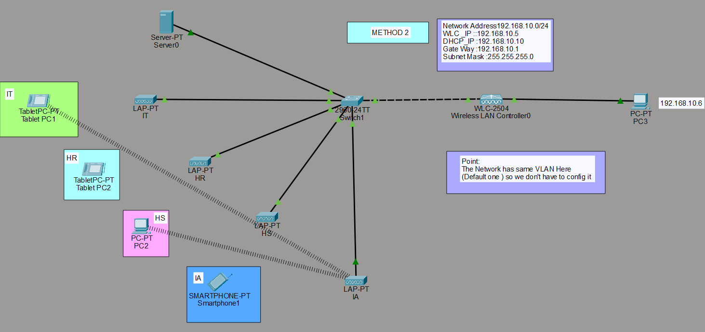
</p>

**Network Components:**
```
Same physical topology as Method 1:
├─ WLC Controller
├─ Switch
├─ 4 Lightweight Access Points (LAPs)
└─ End devices

Difference: All APs broadcast all SSIDs
```

---

### Initial Setup - Method 2

#### Steps 1-6: Same as Method 1

```
✓ Turn LAP ON (same as Method 1)
✓ WLC Configuration (same as Method 1)
✓ DHCP Server setup with WLC IP (same as Method 1)
✓ PC3 Configuration (same as Method 1)
✓ Check connectivity (same as Method 1)
✓ Open browser HTTP (same as Method 1)
```

---

#### Step 7: Initial Setup - Different Network Name

<p align="center">
  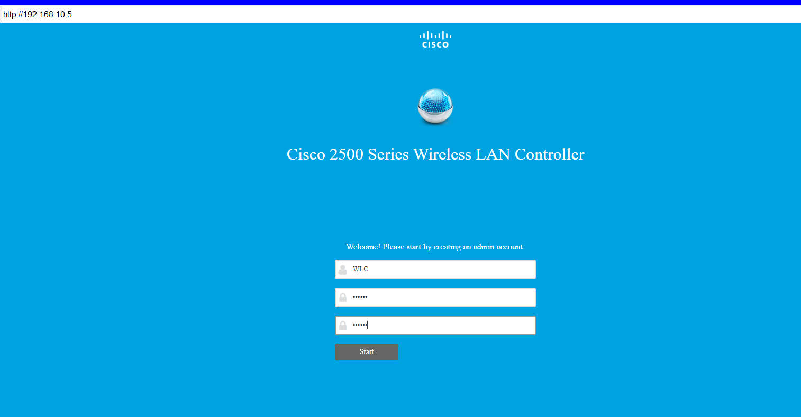
</p>

**Initial Credentials:**
```
System Name: WLC
Admin Username: admin
Password: Wlc123

(Same as Method 1)
```

---

#### Step 8: Management ID

<p align="center">
  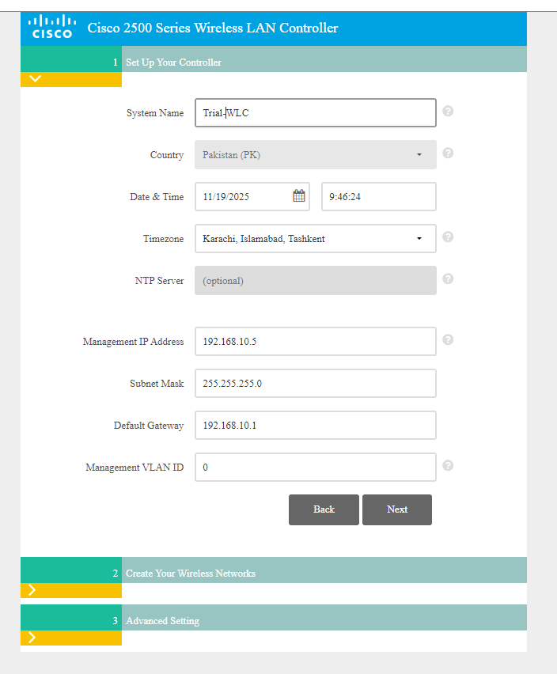
</p>

**Management Configuration:**
```
Management Interface IP: 192.168.1.100
   (This is your WLC IP address)

Subnet Mask: 255.255.255.0
Default Gateway: 192.168.1.1

Important: Management ID = WLC IP address
```

---

#### Step 9: Network Trial (Temporary)

<p align="center">
  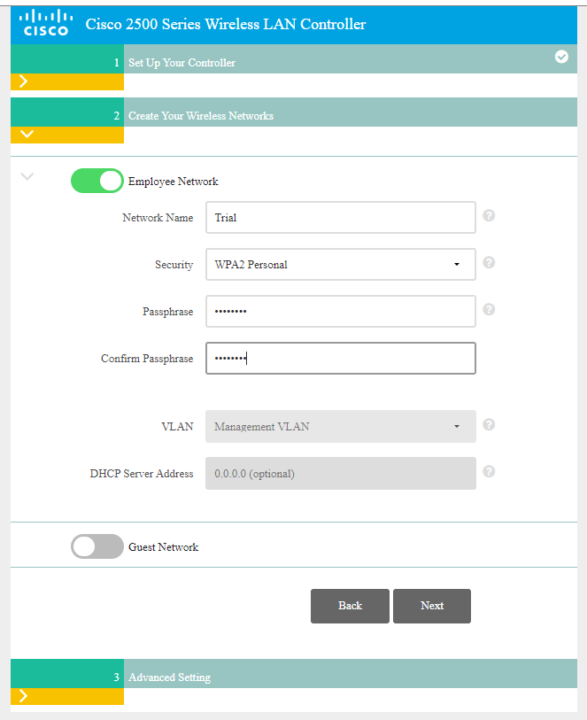
</p>

**First WLAN (Temporary):**
```
Network Name (SSID): Trial
WPA2 Passphrase: Trial123

Note: We'll delete this and create department WLANs later
```

---

#### Step 10: Apply & Switch to HTTPS

```
Same as Method 1:
✓ Click "Apply"
✓ Close browser
✓ Open with HTTPS
✓ Login with admin/Wlc123
```---

### Department Setup - Method 2

#### Step 11: Remove Trial WLAN

<p align="center">
  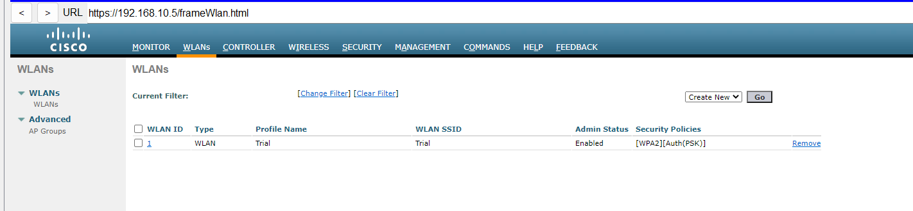
</p>

**Delete Trial Network:**
```
1. Click "WLAN" in left menu
2. Select "Trial" WLAN
3. Click "Remove"
4. Click "Go" to confirm

Reason: We'll create proper department WLANs now
```

---

#### Step 12: Create IT Department

<p align="center">
  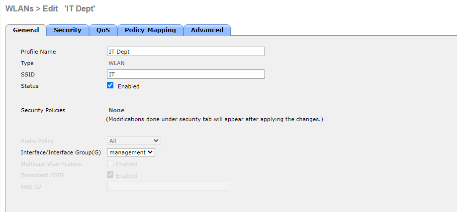
</p>

**Create IT WLAN:**
```
Profile Name: IT-Dept
SSID: IT
Click "Apply"
```

---

#### Step 13: IT Security Configuration

<p align="center">
  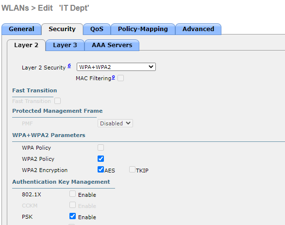
</p>

**Security Settings:**
```
1. Check "Status: Enabled"
2. Click "Security" tab
3. Layer 2 Security: WPA+WPA2
4. Enable WPA2 Policy
5. Enable PSK
6. PSK Format: ASCII
```

---

#### Step 14: Enter IT Password

<p align="center">
  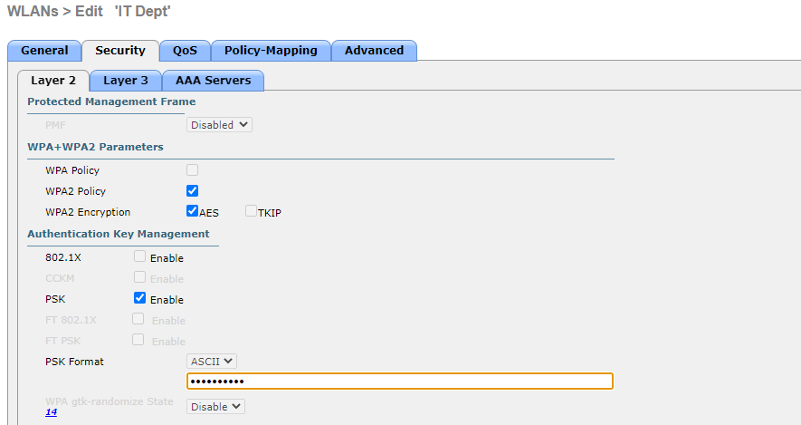
</p>

**Set Password:**
```
Scroll down to PSK field
PSK: IT-dept123
Click "Apply"

IT department fully configured
```

---

#### Step 15: Create Other Departments

<p align="center">
  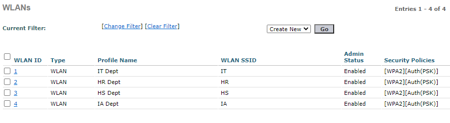
</p>

**Repeat for HR, HS, IA:**
```
HR Department:
├─ Profile Name: HR-Dept
├─ SSID: HR
├─ Password: HR-dept123
└─ Security: WPA2-PSK

HS Department:
├─ Profile Name: HS-Dept
├─ SSID: HS
├─ Password: HS-dept123
└─ Security: WPA2-PSK

IA Department:
├─ Profile Name: IA-Dept
├─ SSID: IA
├─ Password: IA-dept123
└─ Security: WPA2-PSK
```

---

#### Step 16: All 4 Configured

<p align="center">
  
</p>

**Complete WLAN List:**
```
✅ IT (IT-dept123)
✅ HR (HR-dept123)
✅ HS (HS-dept123)
✅ IA (IA-dept123)

All enabled and configured!
```

---

#### Step 17: Save Configuration
**Save Settings:**
```
1. Click "Save Configuration" button
2. Confirm save
3. All settings permanently saved

⚠️ IMPORTANT: Always save after changes!
```

---

### Device Configuration - Method 2

#### Step 18: Configure Devices

<p align="center">
  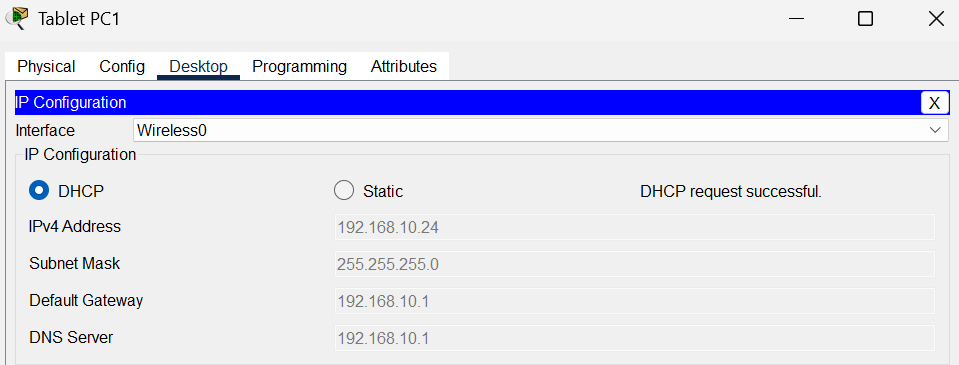
</p>

**Device Setup:**
```
Now we'll connect devices to departments
Each device can see all 4 SSIDs (No AP Groups)

Configure same as Method 1:
├─ Click device
├─ Config → Wireless0
├─ SSID: (Select department)
├─ Authentication: WPA2-PSK
├─ PSK Pass: (Department password)
└─ Connect
```

**Example Connections:**
```
Tablet (IT):  IT / IT-dept123
Device (HR):  HR / HR-dept123
Device (HS):  HS / HS-dept123
Device (IA):  IA / IA-dept123
```

---

## 📝 Quick Reference

### Configuration Summary

#### Basic Access Point:
```
1. Add WMP300N module to devices
2. Configure AP with SSID and WPA2
3. Connect devices to WiFi
4. Setup DHCP server (Pool + IP assignment)
5. Verify connectivity
```

#### WLC Method 1:
```
1. Connect LAPs to switch
2. Configure WLC IP
3. Setup DHCP (add WLC IP!)
4. Access WLC via browser (HTTP → HTTPS)
5. Initial setup (Name: WLC, Pass: Wlc123)
6. Create WLANs (IT, HR, HS, IA)
7. Create AP Groups
8. Assign WLANs to groups
9. Assign APs to groups
10. Connect end devices
```

#### WLC Method 2:
```
1. Turn on LAPs
2. Configure WLC and DHCP
3. Access via browser (HTTP → HTTPS)
4. Initial setup (Name: WLC, Pass: Wlc123)
5. Remove Trial WLAN
6. Create 4 department WLANs
7. Configure WPA2 security
8. Save configuration
9. Connect devices to departments
```

---

### Important Passwords Reference

**WLC Admin:**
```
Username: admin
Password: Wlc123
```

**Method 1 Department Passwords:**
```
IT: ITwlc123
HR: HRwlc123
HS: HSwlc123
IA: IAwlc123
```

**Method 2 Department Passwords:**
```
IT: IT-dept123
HR: HR-dept123
HS: HS-dept123
IA: IA-dept123
```

---

### Critical Configuration Points

**⚠️ MUST REMEMBER:**

**1. DHCP Server Setup:**
```
✅ Always add WLC IP address to DHCP
✅ APs use DHCP Option 43 to discover WLC
✅ Without WLC IP, APs won't connect
```

**2. HTTP to HTTPS:**
```
✅ Initial access: HTTP
✅ After setup: Always use HTTPS
✅ More secure connection
```

**3. Access Points:**
```
✅ Use Lightweight Access Points (LAPT)
✅ Set to DHCP mode
✅ Power ON before WLC configuration
```

**4. AP Groups (Method 1):**
```
✅ Create groups for each department
✅ Assign WLAN to group
✅ Assign AP to group
✅ Result: Clean SSID visibility
```

**5. Save Configuration:**
```
✅ Always click "Apply" after changes
✅ Method 2: Click "Save Configuration"
✅ Prevents loss of settings
```

---

### Troubleshooting

**APs Not Connecting to WLC:**
```
✓ Check WLC IP added to DHCP server
✓ Verify APs are in DHCP mode
✓ Ensure physical connectivity (switch)
✓ Check WLC is reachable (ping test)
```

**Cannot Access WLC Web Interface:**
```
✓ Verify WLC IP address
✓ Check PC and WLC on same subnet
✓ Use HTTPS (not HTTP) after initial setup
✓ Clear browser cache
```

**Devices Not Getting IP:**
```
✓ DHCP server configured correctly
✓ DHCP pool has available IPs
✓ Wireless authentication correct
✓ Check SSID spelling (case-sensitive)
```

**Wrong SSID Appearing:**
```
Method 1: Check AP Groups assignment
Method 2: All SSIDs will appear (normal)
```

---
**📊 Total Image Count:**
- **Basic-AP:** 14 images
- **WLC-Method-1:** 28 images  
- **WLC-Method-2:** 12 images  
- **Total:** 54 images

---

## 🎓 What I Learned

### Basic Access Point:
✅ Adding wireless modules (WMP300N) to devices  
✅ Configuring standalone access point  
✅ Wireless device setup (Laptop, PC, Tablet, Smartphone, Printer)  
✅ DHCP server for automatic IP assignment  
✅ SSID and WPA2-PSK authentication

### WLC Method 1:
✅ Lightweight Access Points (LAPT) concept  
✅ WLC centralized management benefits  
✅ DHCP Option 43 for AP discovery  
✅ HTTP to HTTPS transition  
✅ Multiple WLAN creation (IT, HR, HS, IA)  
✅ AP Groups for department isolation  
✅ Assigning WLANs and APs to groups  
✅ Enterprise wireless network design

### WLC Method 2:
✅ Simplified WLC deployment  
✅ All APs broadcasting all SSIDs approach  
✅ Department WLAN creation without AP Groups  
✅ Save configuration importance  
✅ Multiple device wireless connectivity

### Key Concepts:
✅ Standalone AP vs Centralized WLC  
✅ Lightweight vs Autonomous APs  
✅ WPA2-PSK security implementation  
✅ Network segmentation via SSIDs  
✅ Wireless troubleshooting techniques

---

## 🚀 How to Use This Repository

1. **Clone the repository:**
   ```bash
   git clone https://github.com/yourusername/WLC-Configuration.git
   ```

2. **Start with basics:**
   - Understand basic Access Point first
   - Learn wireless device configuration
   - Practice DHCP setup

3. **Practice WLC Method 1:**
   - Build topology with 4 LAPs
   - Configure WLC web interface
   - Create AP Groups
   - Test department isolation

4. **Try WLC Method 2:**
   - Simplified deployment
   - Compare with Method 1
   - Understand use cases

5. **Troubleshoot:**
   - Test connectivity issues
   - Verify DHCP configuration
   - Check AP registration

---

## 📞 Connect With Me

<div align="center">

[](mailto:a.wahid7860668@gmail.com)
[](https://www.linkedin.com/in/abdul-wahid022)
[](https://github.com/abdul-wahid022)

**💬 Questions? Need clarification? Feel free to reach out!**

</div>

---

## 📄 License

This project is created for **educational purposes** and is open-source.

---

<div align="center">

### ⭐ If you found this helpful, please give it a star!

**Made with 💙 by ABDUL WAHID**

*Last Updated: January 2026*

</div>
</div>
