# 📞 VoIP & Telephony Configuration - Complete Guide

<div align="center">


**Voice over IP and Dial Peering Implementation in Packet Tracer**

[](.)
[](.)
[](.)

[📖 Overview](#-overview) • [🎙️ Voice VLAN](#-voice-and-data-vlans-configuration) • [☎️ Dial Peering](#-voip-dial-peering-configuration) • [📝 Quick Reference](#-quick-reference)

</div>

---

## 📖 Overview

**VoIP (Voice over Internet Protocol)** allows voice communication and multimedia sessions over IP networks, enabling phone calls through data networks instead of traditional phone lines.

### What You'll Learn:

| Topic | Description | Key Technology |
|-------|-------------|----------------|
| **Voice VLAN** | Separate VLAN for IP phones | QoS prioritization |
| **Data VLAN** | Regular network traffic | Standard data transmission |
| **TFTP Server** | Phone configuration files | Option 150 |
| **Telephony Service** | Call Manager configuration | CME (Call Manager Express) |
| **Dial Peering** | Inter-site calling | Voice routing |
| **OSPF for VoIP** | Voice traffic routing | Dynamic routing |

---

## 📚 Table of Contents

- [🎙️ Voice and Data VLANs Configuration](#-voice-and-data-vlans-configuration)
  - [Concept](#concept)
  - [Lab Implementation](#lab-implementation---voice-vlan)
  - [Configuration](#configuration)
  - [Results](#results---voice-vlan)
- [☎️ VoIP Dial Peering Configuration](#-voip-dial-peering-configuration)
  - [Concept](#concept-1)
  - [Lab Implementation](#lab-implementation---dial-peering)
  - [Site-A Configuration](#site-a-configuration)
  - [Site-B Configuration](#site-b-configuration)
  - [ISP Router Configuration](#isp-router-configuration)
  - [Results](#results---dial-peering)
- [📝 Quick Reference](#-quick-reference)

---

## 🎙️ Voice and Data VLANs Configuration

### Concept

<div align="center">

| Feature | Details |
|---------|---------|
| **Voice VLAN** | Dedicated VLAN for IP phones |
| **Data VLAN** | Separate VLAN for computers |
| **Purpose** | Quality of Service (QoS) for voice |
| **Priority** | Voice traffic gets higher priority |
| **TFTP Server** | Stores phone configuration files |

</div>

### 🔑 Key Points:

**Why Separate Voice and Data VLANs?**

#### Without Voice VLAN:
```
All Traffic in One VLAN:
├─ IP Phone traffic
├─ PC download (large file)
├─ Video streaming
└─ Email

Result:
Voice quality poor during heavy data usage
Choppy audio, call drops ❌
```

#### With Voice VLAN:
```
Voice VLAN (Priority):
├─ IP Phone traffic (guaranteed bandwidth)
└─ Low latency, high priority ✓

Data VLAN (Normal):
├─ PC traffic
├─ Downloads
└─ Internet browsing

Result:
Crystal clear voice calls
Data doesn't affect voice quality ✓
```

---

### Voice VLAN vs Data VLAN:

| Feature | Voice VLAN | Data VLAN |
|---------|------------|-----------|
| **Priority** | High (QoS enabled) | Normal |
| **Bandwidth** | Guaranteed | Best effort |
| **Devices** | IP Phones | PCs, Printers |
| **Latency** | Very low | Normal |
| **Typical VLAN ID** | 100-150 | 10-99 |

---

### TFTP Server & Option 150

**IMPORTANT:** 
```
⚠️ Option 150 ka IP = TFTP server address hota hai, NOT gateway!
```

**What is TFTP Server?**
```
TFTP = Trivial File Transfer Protocol
Purpose: Stores IP phone configuration files
Contains: Button layouts, ring tones, phone settings

IP Phone boots up
     ↓
Gets IP via DHCP
     ↓
DHCP Option 150 tells phone: "TFTP server is at this IP"
     ↓
Phone downloads configuration from TFTP server
     ↓
Phone registers with Call Manager
     ↓
Phone ready to make/receive calls! ✓
```

---

### Real-Life Example:
```
Office Network:
├─ Employee making important client call (Voice VLAN)
│  └─ High priority, guaranteed quality
│
└─ Another employee downloading files (Data VLAN)
   └─ Normal priority, doesn't affect call

Both work smoothly without interference! ✓
```

---

### Lab Implementation - Voice VLAN

#### 📊 Network Topology:

<p align="center">
  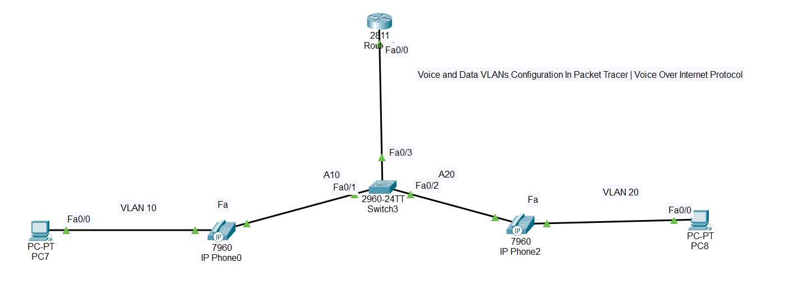
</p>

**Scenario:** Configure separate Voice and Data VLANs with IP phones

---

### Configuration - Switch 3

<p align="center">
  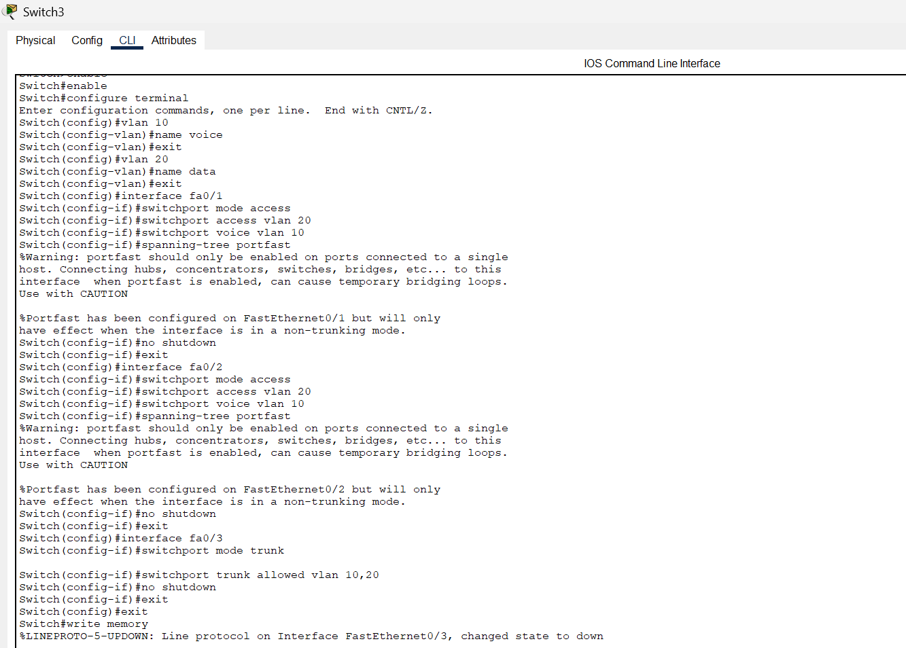
</p>

```cisco
! Switch 3 - Voice VLAN Configuration
Switch> enable
Switch# configure terminal
Switch(config)# hostname Switch3

! Create VLANs
Switch3(config)# vlan 10
Switch3(config-vlan)# name DATA
Switch3(config-vlan)# exit

Switch3(config)# vlan 100
Switch3(config-vlan)# name VOICE
Switch3(config-vlan)# exit

! Configure ports with Voice VLAN
Switch3(config)# interface range fastEthernet 0/1-10
Switch3(config-if-range)# switchport mode access
Switch3(config-if-range)# switchport access vlan 10
Switch3(config-if-range)# switchport voice vlan 100
Switch3(config-if-range)# exit

! Configure trunk to router
Switch3(config)# interface gigabitEthernet 0/1
Switch3(config-if)# switchport mode trunk
Switch3(config-if)# exit

! Verification
Switch3# show vlan brief
Switch3# show interfaces switchport
```

**Command Explanation:**
```
switchport access vlan 10
└─ Data VLAN for PC

switchport voice vlan 100
└─ Voice VLAN for IP Phone

Result: One port handles both PC (VLAN 10) and Phone (VLAN 100)
```

---

### Configuration - Router 4

<p align="center">
  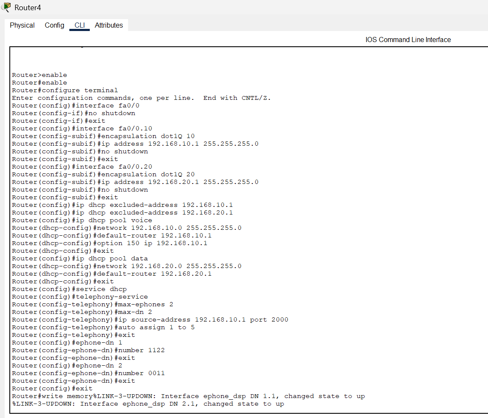
</p>

```cisco
! Router 4 - Voice Gateway & DHCP
Router> enable
Router# configure terminal
Router(config)# hostname Router4

! Configure interface for Data VLAN
Router4(config)# interface gigabitEthernet 0/0.10
Router4(config-subif)# encapsulation dot1Q 10
Router4(config-subif)# ip address 192.168.10.1 255.255.255.0
Router4(config-subif)# exit

! Configure interface for Voice VLAN
Router4(config)# interface gigabitEthernet 0/0.100
Router4(config-subif)# encapsulation dot1Q 100
Router4(config-subif)# ip address 192.168.100.1 255.255.255.0
Router4(config-subif)# exit

! Enable physical interface
Router4(config)# interface gigabitEthernet 0/0
Router4(config-if)# no shutdown
Router4(config-if)# exit

! DHCP for Data VLAN
Router4(config)# ip dhcp pool DATA_POOL
Router4(dhcp-config)# network 192.168.10.0 255.255.255.0
Router4(dhcp-config)# default-router 192.168.10.1
Router4(dhcp-config)# exit

! DHCP for Voice VLAN
Router4(config)# ip dhcp pool VOICE_POOL
Router4(dhcp-config)# network 192.168.100.0 255.255.255.0
Router4(dhcp-config)# default-router 192.168.100.1
Router4(dhcp-config)# option 150 ip 192.168.100.1
Router4(dhcp-config)# exit

! Telephony Service (Call Manager Express)
Router4(config)# telephony-service
Router4(config-telephony)# max-dn 20
Router4(config-telephony)# max-ephones 20
Router4(config-telephony)# ip source-address 192.168.100.1 port 2000
Router4(config-telephony)# auto assign 1 to 20
Router4(config-telephony)# exit

! Configure Phone Extensions
Router4(config)# ephone-dn 1
Router4(config-ephone-dn)# number 1001
Router4(config-ephone-dn)# exit

Router4(config)# ephone-dn 2
Router4(config-ephone-dn)# number 1002
Router4(config-ephone-dn)# exit

Router4(config)# ephone-dn 3
Router4(config-ephone-dn)# number 1003
Router4(config-ephone-dn)# exit
```

**Important Configuration Breakdown:**

```
option 150 ip 192.168.100.1
└─ TFTP server address (NOT gateway!)
   Phones download config from this IP

telephony-service
├─ max-dn 20          (maximum directory numbers/extensions)
├─ max-ephones 20     (maximum phones)
├─ ip source-address  (Call Manager IP and port)
└─ auto assign        (automatically assign extensions)

ephone-dn 1
└─ number 1001        (phone extension number)
```

---

### Results - Voice VLAN

#### ✅ Configuration Results:

<p align="center">
  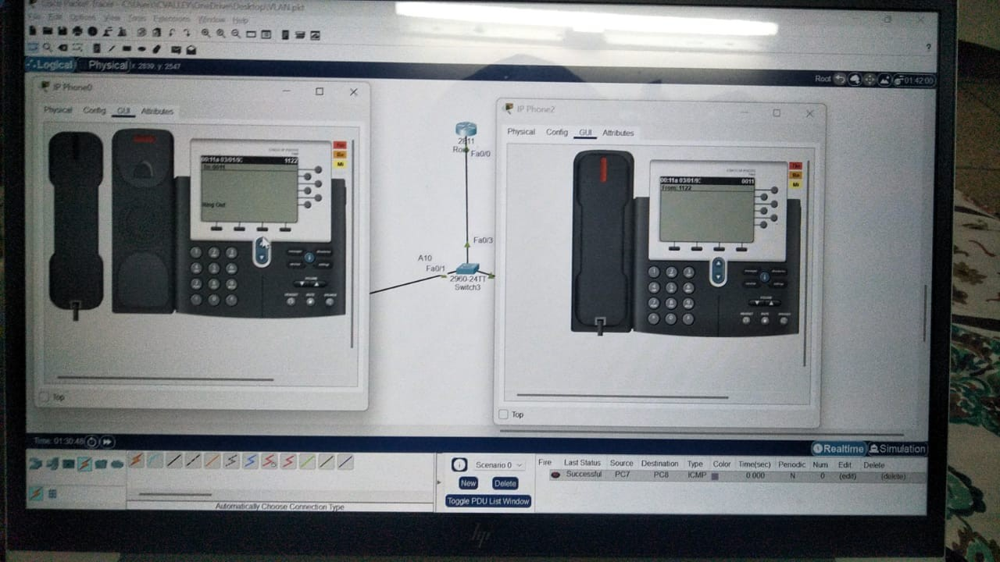
</p>

**Verification:**
```cisco
Switch3# show vlan brief

VLAN Name                             Status    Ports
---- -------------------------------- --------- -------
10   DATA                             active    Fa0/1-10
100  VOICE                            active    Fa0/1-10

Router4# show telephony-service

CONFIG (Version=8.1)
Version 8.1
Max Ephones 20
Max DNs 20
IP Source Address 192.168.100.1 port 2000
Auto Assign 1 to 20

Router4# show ephone

ephone-1 Mac:00E0.8F44.D472
  IP:192.168.100.10 Port:2000
  Extension: 1001

ephone-2 Mac:00E0.A3C5.1234  
  IP:192.168.100.11 Port:2000
  Extension: 1002
```

**Testing:**
```
Phone 1 (Extension 1001):
✓ Registered with Call Manager
✓ IP: 192.168.100.10 (Voice VLAN)
✓ Can dial extension 1002

Phone 2 (Extension 1002):
✓ Registered with Call Manager  
✓ IP: 192.168.100.11 (Voice VLAN)
✓ Can receive calls from 1001

Call Quality: Excellent (QoS priority) ✓
```

**Result:** ✅ Voice and Data VLANs configured successfully, IP phones registered and working

---

## ☎️ VoIP Dial Peering Configuration

### Concept

<div align="center">

| Feature | Details |
|---------|---------|
| **Dial Peering** | Route calls between different sites |
| **Purpose** | Inter-site phone communication |
| **Technology** | VoIP over WAN |
| **Routing** | OSPF for network reachability |
| **Scenario** | Site A ↔ ISP ↔ Site B |

</div>

### 🔑 Key Points:

**What is Dial Peering?**

```
Site A (Karachi Office)          Site B (Lahore Office)
Extension: 2xxx                   Extension: 3xxx
├─ 2001                          ├─ 3001
├─ 2002                          ├─ 3002
└─ 2003                          └─ 3003

Without Dial Peering:
Site A phones can ONLY call within Site A ❌
Site B phones can ONLY call within Site B ❌

With Dial Peering:
Employee in Karachi (2001) can call Lahore (3001) ✓
Cross-site calling works seamlessly! ✓
```

---

### How Dial Peering Works:

```
User in Site A dials 3001 (Site B extension)
     ↓
Site A Router checks dial-peer
     ↓
Matches pattern: destination-pattern 3...
     ↓
Routes call to Site B via IP: 10.0.0.6
     ↓
Site B Router receives VoIP call
     ↓
Routes to local phone extension 3001
     ↓
Phone rings at Site B! ✓
```

---

### Network Topology Overview:

```
Site A (Karachi)          ISP Router          Site B (Lahore)
Extensions: 2xxx    ←→  OSPF Routing  ←→    Extensions: 3xxx
10.1.1.0/24              10.0.0.0/30         10.2.2.0/24
```

---

### Lab Implementation - Dial Peering

#### 📊 Complete Network Topology:

<p align="center">
  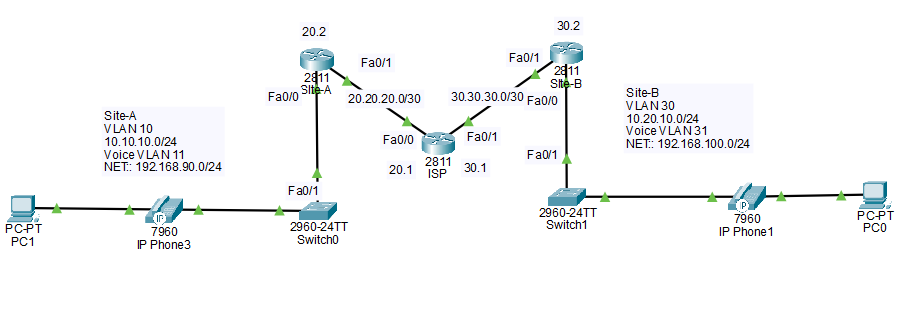
</p>

**Scenario:** Two remote sites connected via ISP, phones can call across sites

---

### Configuration - Left Switch (Switch 0)

<p align="center">
  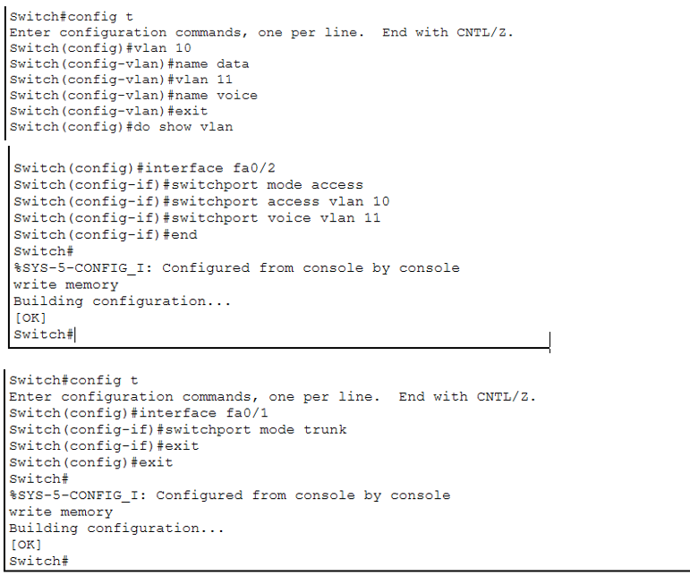
</p>

```cisco
! Switch 0 (Site A Access Switch)
Switch> enable
Switch# configure terminal
Switch(config)# hostname SiteA-Switch

! Create VLANs
SiteA-Switch(config)# vlan 10
SiteA-Switch(config-vlan)# name DATA
SiteA-Switch(config-vlan)# exit

SiteA-Switch(config)# vlan 100
SiteA-Switch(config-vlan)# name VOICE
SiteA-Switch(config-vlan)# exit

! Configure access ports with voice VLAN
SiteA-Switch(config)# interface range fastEthernet 0/1-10
SiteA-Switch(config-if-range)# switchport mode access
SiteA-Switch(config-if-range)# switchport access vlan 10
SiteA-Switch(config-if-range)# switchport voice vlan 100
SiteA-Switch(config-if-range)# exit

! Configure trunk to router
SiteA-Switch(config)# interface gigabitEthernet 0/1
SiteA-Switch(config-if)# switchport mode trunk
SiteA-Switch(config-if)# exit
```

---

### Configuration - Right Switch (Switch 1)

<p align="center">
  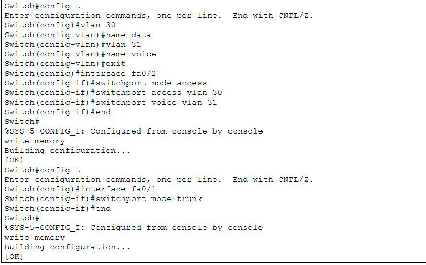
</p>

```cisco
! Switch 1 (Site B Access Switch)
Switch> enable
Switch# configure terminal
Switch(config)# hostname SiteB-Switch

! Create VLANs
SiteB-Switch(config)# vlan 10
SiteB-Switch(config-vlan)# name DATA
SiteB-Switch(config-vlan)# exit

SiteB-Switch(config)# vlan 100
SiteB-Switch(config-vlan)# name VOICE
SiteB-Switch(config-vlan)# exit

! Configure access ports with voice VLAN
SiteB-Switch(config)# interface range fastEthernet 0/1-10
SiteB-Switch(config-if-range)# switchport mode access
SiteB-Switch(config-if-range)# switchport access vlan 10
SiteB-Switch(config-if-range)# switchport voice vlan 100
SiteB-Switch(config-if-range)# exit

! Configure trunk to router
SiteB-Switch(config)# interface gigabitEthernet 0/1
SiteB-Switch(config-if)# switchport mode trunk
SiteB-Switch(config-if)# exit
```

---

## Site A Configuration

### DHCP Pool Configuration

<p align="center">
  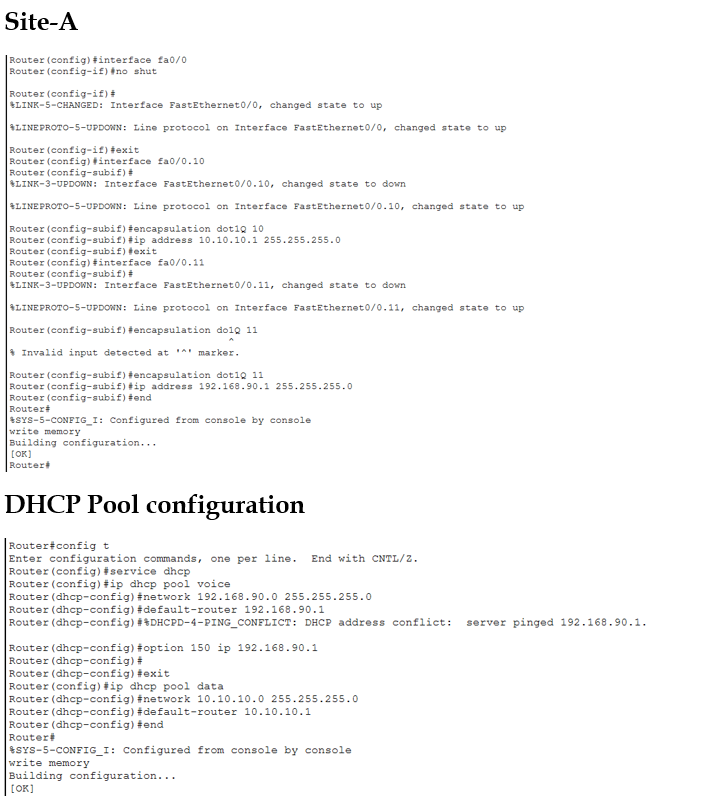
</p>

```cisco
! Site A Router - DHCP Configuration
Router> enable
Router# configure terminal
Router(config)# hostname SiteA-Router

! Subinterface for Data VLAN
SiteA-Router(config)# interface gigabitEthernet 0/0.10
SiteA-Router(config-subif)# encapsulation dot1Q 10
SiteA-Router(config-subif)# ip address 10.1.1.1 255.255.255.0
SiteA-Router(config-subif)# exit

! Subinterface for Voice VLAN
SiteA-Router(config)# interface gigabitEthernet 0/0.100
SiteA-Router(config-subif)# encapsulation dot1Q 100
SiteA-Router(config-subif)# ip address 10.1.100.1 255.255.255.0
SiteA-Router(config-subif)# exit

! Enable physical interface
SiteA-Router(config)# interface gigabitEthernet 0/0
SiteA-Router(config-if)# no shutdown
SiteA-Router(config-if)# exit

! DHCP Pool for Data VLAN
SiteA-Router(config)# ip dhcp pool SITEA-DATA
SiteA-Router(dhcp-config)# network 10.1.1.0 255.255.255.0
SiteA-Router(dhcp-config)# default-router 10.1.1.1
SiteA-Router(dhcp-config)# exit

! DHCP Pool for Voice VLAN
SiteA-Router(config)# ip dhcp pool SITEA-VOICE
SiteA-Router(dhcp-config)# network 10.1.100.0 255.255.255.0
SiteA-Router(dhcp-config)# default-router 10.1.100.1
SiteA-Router(dhcp-config)# option 150 ip 10.1.100.1
SiteA-Router(dhcp-config)# exit
```

---

### Configuring Telephony Service

<p align="center">
  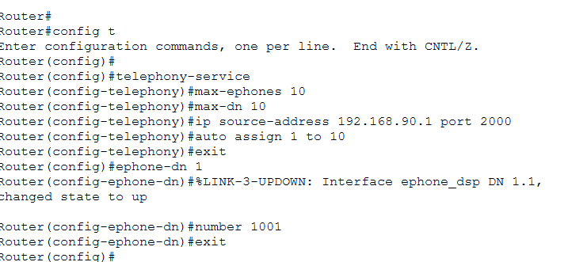
</p>

```cisco
! Telephony Service Configuration
SiteA-Router(config)# telephony-service
SiteA-Router(config-telephony)# max-dn 10
SiteA-Router(config-telephony)# max-ephones 10
SiteA-Router(config-telephony)# ip source-address 10.1.100.1 port 2000
SiteA-Router(config-telephony)# auto assign 1 to 10
SiteA-Router(config-telephony)# exit

! Configure Phone Extensions (2xxx series for Site A)
SiteA-Router(config)# ephone-dn 1
SiteA-Router(config-ephone-dn)# number 2001
SiteA-Router(config-ephone-dn)# exit

SiteA-Router(config)# ephone-dn 2
SiteA-Router(config-ephone-dn)# number 2002
SiteA-Router(config-ephone-dn)# exit

SiteA-Router(config)# ephone-dn 3
SiteA-Router(config-ephone-dn)# number 2003
SiteA-Router(config-ephone-dn)# exit
```

---

### OSPF Setup for Site A

<p align="center">
  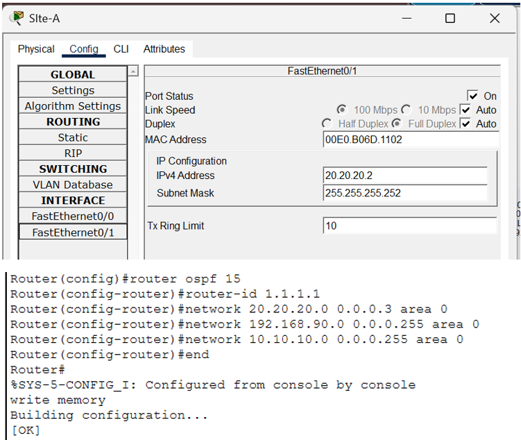
</p>

```cisco
! WAN Interface to ISP
SiteA-Router(config)# interface gigabitEthernet 0/1
SiteA-Router(config-if)# ip address 10.0.0.1 255.255.255.252
SiteA-Router(config-if)# no shutdown
SiteA-Router(config-if)# exit

! OSPF Configuration
SiteA-Router(config)# router ospf 1
SiteA-Router(config-router)# network 10.1.1.0 0.0.0.255 area 0
SiteA-Router(config-router)# network 10.1.100.0 0.0.0.255 area 0
SiteA-Router(config-router)# network 10.0.0.0 0.0.0.3 area 0
SiteA-Router(config-router)# exit
```

---

## Site B Configuration

### DHCP Configuration

<p align="center">
  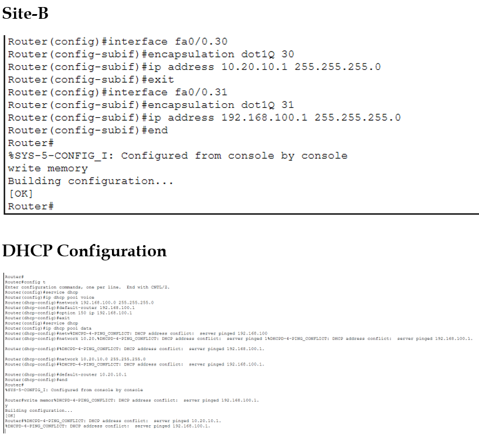
</p>

```cisco
! Site B Router - DHCP Configuration
Router> enable
Router# configure terminal
Router(config)# hostname SiteB-Router

! Subinterface for Data VLAN
SiteB-Router(config)# interface gigabitEthernet 0/0.10
SiteB-Router(config-subif)# encapsulation dot1Q 10
SiteB-Router(config-subif)# ip address 10.2.2.1 255.255.255.0
SiteB-Router(config-subif)# exit

! Subinterface for Voice VLAN
SiteB-Router(config)# interface gigabitEthernet 0/0.100
SiteB-Router(config-subif)# encapsulation dot1Q 100
SiteB-Router(config-subif)# ip address 10.2.100.1 255.255.255.0
SiteB-Router(config-subif)# exit

! Enable physical interface
SiteB-Router(config)# interface gigabitEthernet 0/0
SiteB-Router(config-if)# no shutdown
SiteB-Router(config-if)# exit

! DHCP Pool for Data VLAN
SiteB-Router(config)# ip dhcp pool SITEB-DATA
SiteB-Router(dhcp-config)# network 10.2.2.0 255.255.255.0
SiteB-Router(dhcp-config)# default-router 10.2.2.1
SiteB-Router(dhcp-config)# exit

! DHCP Pool for Voice VLAN
SiteB-Router(config)# ip dhcp pool SITEB-VOICE
SiteB-Router(dhcp-config)# network 10.2.100.0 255.255.255.0
SiteB-Router(dhcp-config)# default-router 10.2.100.1
SiteB-Router(dhcp-config)# option 150 ip 10.2.100.1
SiteB-Router(dhcp-config)# exit
```

---

### Configuring Telephony Service

<p align="center">
  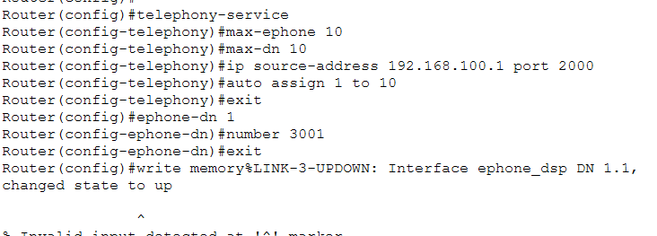
</p>

```cisco
! Telephony Service Configuration
SiteB-Router(config)# telephony-service
SiteB-Router(config-telephony)# max-dn 10
SiteB-Router(config-telephony)# max-ephones 10
SiteB-Router(config-telephony)# ip source-address 10.2.100.1 port 2000
SiteB-Router(config-telephony)# auto assign 1 to 10
SiteB-Router(config-telephony)# exit

! Configure Phone Extensions (3xxx series for Site B)
SiteB-Router(config)# ephone-dn 1
SiteB-Router(config-ephone-dn)# number 3001
SiteB-Router(config-ephone-dn)# exit

SiteB-Router(config)# ephone-dn 2
SiteB-Router(config-ephone-dn)# number 3002
SiteB-Router(config-ephone-dn)# exit

SiteB-Router(config)# ephone-dn 3
SiteB-Router(config-ephone-dn)# number 3003
SiteB-Router(config-ephone-dn)# exit
```

---

### OSPF Setup for Site B

<p align="center">
  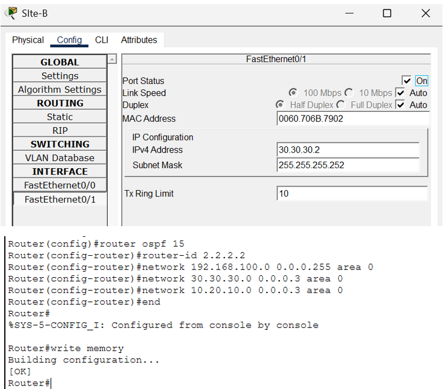
</p>

```cisco
! WAN Interface to ISP
SiteB-Router(config)# interface gigabitEthernet 0/1
SiteB-Router(config-if)# ip address 10.0.0.5 255.255.255.252
SiteB-Router(config-if)# no shutdown
SiteB-Router(config-if)# exit

! OSPF Configuration
SiteB-Router(config)# router ospf 1
SiteB-Router(config-router)# network 10.2.2.0 0.0.0.255 area 0
SiteB-Router(config-router)# network 10.2.100.0 0.0.0.255 area 0
SiteB-Router(config-router)# network 10.0.0.4 0.0.0.3 area 0
SiteB-Router(config-router)# exit
```

---

## ISP Router Configuration

### OSPF on ISP

<p align="center">
  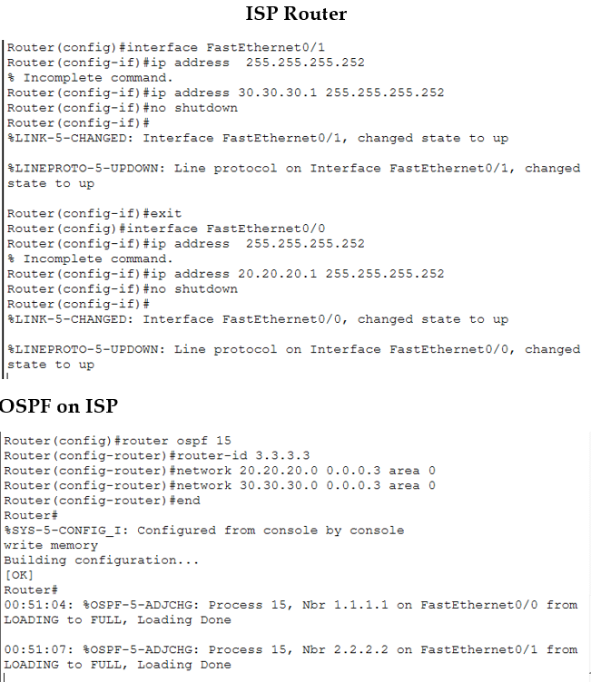
</p>

```cisco
! ISP Router Configuration
Router> enable
Router# configure terminal
Router(config)# hostname ISP-Router

! Interface to Site A
ISP-Router(config)# interface gigabitEthernet 0/0
ISP-Router(config-if)# ip address 10.0.0.2 255.255.255.252
ISP-Router(config-if)# no shutdown
ISP-Router(config-if)# exit

! Interface to Site B
ISP-Router(config)# interface gigabitEthernet 0/1
ISP-Router(config-if)# ip address 10.0.0.6 255.255.255.252
ISP-Router(config-if)# no shutdown
ISP-Router(config-if)# exit

! OSPF Configuration
ISP-Router(config)# router ospf 1
ISP-Router(config-router)# network 10.0.0.0 0.0.0.3 area 0
ISP-Router(config-router)# network 10.0.0.4 0.0.0.3 area 0
ISP-Router(config-router)# exit
```

---

## Output & Verification

### DHCP Check

<p align="center">
  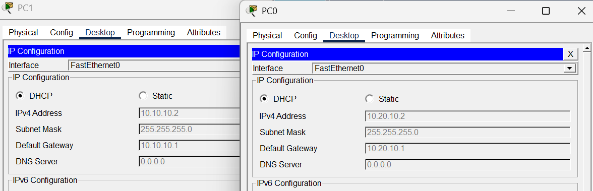
</p>

**Verification:**
```cisco
SiteA-Router# show ip dhcp binding

IP address       Client-ID/              Lease expiration        Type
                 Hardware address
10.1.100.10      00E0.F7B1.2345         Jan 25 2026 10:30 AM    Automatic
10.1.100.11      00E0.A3C6.7890         Jan 25 2026 10:35 AM    Automatic

SiteB-Router# show ip dhcp binding

IP address       Client-ID/              Lease expiration        Type
                 Hardware address
10.2.100.10      00E0.B0A7.4567         Jan 25 2026 10:32 AM    Automatic
10.2.100.11      00E0.C4D2.8901         Jan 25 2026 10:37 AM    Automatic
```

**Result:** ✅ All phones received IP addresses from DHCP

---

### E-Phone Check

<p align="center">
  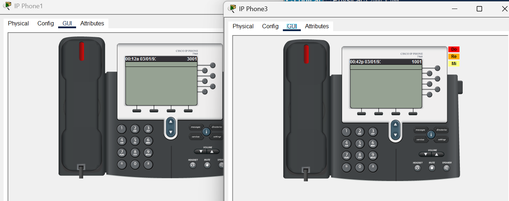
</p>

**Verification:**
```cisco
SiteA-Router# show ephone

ephone-1 Mac:00E0.F7B1.2345
  IP:10.1.100.10 Port:2000
  Extension: 2001
  Registered

ephone-2 Mac:00E0.A3C6.7890
  IP:10.1.100.11 Port:2000
  Extension: 2002
  Registered

SiteB-Router# show ephone

ephone-1 Mac:00E0.B0A7.4567
  IP:10.2.100.10 Port:2000
  Extension: 3001
  Registered

ephone-2 Mac:00E0.C4D2.8901
  IP:10.2.100.11 Port:2000
  Extension: 3002
  Registered
```

**Result:** ✅ All IP phones registered successfully with their respective Call Managers

---

### OSPF Configuration Checking

<p align="center">
  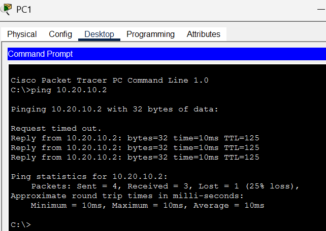
</p>

**Verification:**
```cisco
SiteA-Router# show ip route ospf

O    10.2.2.0/24 [110/2] via 10.0.0.2, 00:15:23, GigabitEthernet0/1
O    10.2.100.0/24 [110/2] via 10.0.0.2, 00:15:23, GigabitEthernet0/1
O    10.0.0.4/30 [110/2] via 10.0.0.2, 00:15:23, GigabitEthernet0/1

SiteB-Router# show ip route ospf

O    10.1.1.0/24 [110/2] via 10.0.0.6, 00:15:18, GigabitEthernet0/1
O    10.1.100.0/24 [110/2] via 10.0.0.6, 00:15:18, GigabitEthernet0/1
O    10.0.0.0/30 [110/2] via 10.0.0.6, 00:15:18, GigabitEthernet0/1

ISP-Router# show ip ospf neighbor

Neighbor ID     Pri   State           Dead Time   Address         Interface
10.1.100.1      1     FULL/  -        00:00:35    10.0.0.1        Gi0/0
10.2.100.1      1     FULL/  -        00:00:38    10.0.0.5        Gi0/1
```

**Result:** ✅ OSPF neighbors formed, routes exchanged successfully

---

## Configuring Dial Peering

### Site A Dial Peer Configuration

<p align="center">
  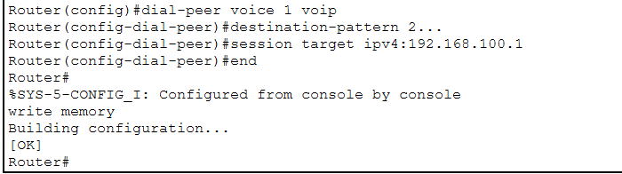
</p>

```cisco
! Site A - Dial Peer to Site B
SiteA-Router(config)# dial-peer voice 1 voip
SiteA-Router(config-dial-peer)# destination-pattern 3...
SiteA-Router(config-dial-peer)# session target ipv4:10.2.100.1
SiteA-Router(config-dial-peer)# exit
```

**Explanation:**
```
dial-peer voice 1 voip
└─ Create VoIP dial peer (ID = 1)

destination-pattern 3...
└─ Match any 4-digit number starting with 3
   (3001, 3002, 3003, etc.)

session target ipv4:10.2.100.1
└─ Send calls to Site B router IP
```

---

### Site B Dial Peer Configuration

<p align="center">
  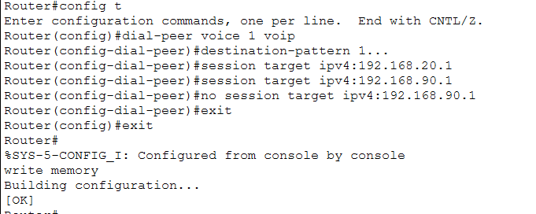
</p>

```cisco
! Site B - Dial Peer to Site A
SiteB-Router(config)# dial-peer voice 1 voip
SiteB-Router(config-dial-peer)# destination-pattern 2...
SiteB-Router(config-dial-peer)# session target ipv4:10.1.100.1
SiteB-Router(config-dial-peer)# exit
```

**Explanation:**
```
destination-pattern 2...
└─ Match any 4-digit number starting with 2
   (2001, 2002, 2003, etc.)

session target ipv4:10.1.100.1
└─ Send calls to Site A router IP
```

---

### Results - Dial Peering

#### ✅ Cross-Site Calling Output:

<p align="center">
  
</p>

**Testing:**
```
Test 1: Site A calls Site B
Phone at Site A (ext 2001) dials 3001
     ↓
SiteA-Router matches dial-peer 1 (destination-pattern 3...)
     ↓
Routes call to 10.2.100.1 (Site B)
     ↓
Phone at Site B (ext 3001) rings! ✓

Test 2: Site B calls Site A
Phone at Site B (ext 3002) dials 2002
     ↓
SiteB-Router matches dial-peer 1 (destination-pattern 2...)
     ↓
Routes call to 10.1.100.1 (Site A)
     ↓
Phone at Site A (ext 2002) rings! ✓
```

**Verification:**
```cisco
SiteA-Router# show dial-peer voice summary

dial-peer voice 1 voip
  destination-pattern 3...
  session target ipv4:10.2.100.1
  Admin State: up
  Operational State: up

SiteB-Router# show dial-peer voice summary

dial-peer voice 1 voip
  destination-pattern 2...
  session target ipv4:10.1.100.1
  Admin State: up
  Operational State: up
```

**Result:** ✅ Dial peering configured successfully, cross-site calling working perfectly

---

## 📝 Quick Reference

### Voice VLAN Commands

```cisco
! Create Voice VLAN
vlan 100
 name VOICE

! Configure port with voice VLAN
interface fastEthernet 0/1
 switchport mode access
 switchport access vlan 10        (Data VLAN)
 switchport voice vlan 100         (Voice VLAN)
```

---

### DHCP with Option 150

```cisco
! DHCP Pool for Voice
ip dhcp pool VOICE_POOL
 network 192.168.100.0 255.255.255.0
 default-router 192.168.100.1
 option 150 ip 192.168.100.1      (TFTP server, NOT gateway!)
```

---

### Telephony Service Commands

```cisco
! Configure Call Manager Express
telephony-service
 max-dn 20                        (Max directory numbers)
 max-ephones 20                   (Max phones)
 ip source-address 192.168.100.1 port 2000
 auto assign 1 to 20

! Configure Phone Extension
ephone-dn 1
 number 1001                      (Extension number)
```

---

### Dial Peer Commands

```cisco
! Create VoIP Dial Peer
dial-peer voice 1 voip
 destination-pattern 3...         (Match pattern: 3xxx)
 session target ipv4:10.2.100.1   (Remote site IP)
```

---

### Verification Commands

```cisco
! Voice VLAN
show vlan brief
show interfaces switchport

! DHCP
show ip dhcp binding
show ip dhcp pool

! Telephony
show telephony-service
show ephone
show ephone-dn

! Dial Peer
show dial-peer voice summary
show voip call

! OSPF
show ip route ospf
show ip ospf neighbor
```

---

### Troubleshooting Tips

**Phone Not Registering:**
```
✓ Check DHCP - phone has IP?
✓ Verify option 150 IP is correct
✓ Check telephony-service IP matches
✓ Ensure voice VLAN configured on port
```

**Cross-Site Calls Not Working:**
```
✓ Check OSPF - routes learned?
✓ Verify dial-peer destination-pattern
✓ Check session target IP is reachable
✓ Test ping between site IPs
```

**No Voice Quality:**
```
✓ Ensure voice VLAN is separate
✓ Check QoS configuration
✓ Verify bandwidth availability
✓ Test network latency
```

---


---

## 🎓 What I Learned

### Voice VLAN Configuration:
✅ Separating voice and data traffic for QoS  
✅ Configuring switchport voice vlan command  
✅ TFTP server setup with Option 150  
✅ Understanding DHCP Option 150 vs default gateway  
✅ Telephony-service configuration on routers  
✅ Phone extension assignment (ephone-dn)  

### VoIP Dial Peering:
✅ Inter-site calling configuration  
✅ Dial-peer voice configuration with destination patterns  
✅ Session target IP addressing  
✅ OSPF for voice network reachability  
✅ Multi-site VoIP architecture  
✅ Complete end-to-end VoIP deployment  

### Integration Skills:
✅ Combining VLANs, DHCP, OSPF, and VoIP  
✅ Router subinterface configuration for voice  
✅ Call Manager Express (CME) setup  
✅ Cross-site communication troubleshooting  

---

## 🚀 How to Use This Repository

1. **Clone the repository:**
   ```bash
   git clone https://github.com/your-username/VoIP-Telephony.git
   ```

2. **Study Voice VLAN first:**
   - Understand voice vs data separation
   - Configure switch with voice VLAN
   - Set up basic telephony service
   - Test local calling

3. **Progress to Dial Peering:**
   - Configure multi-site topology
   - Set up OSPF for reachability
   - Configure dial peers
   - Test cross-site calling

4. **Practice troubleshooting:**
   - Simulate phone registration issues
   - Test DHCP failures
   - Practice dial-peer debugging

---

## 📞 Connect With Me

<div align="center">

[](mailto:a.wahid7860668@gmail.com)
[](https://www.linkedin.com/in/abdul-wahid022)
[](https://github.com/abdul-wahid022)

**💬 Questions? Need Packet Tracer files? Feel free to reach out!**

</div>

---

## 📄 License

This project is created for **educational purposes** and is open-source.

---

<div align="center">

### ⭐ If you found this helpful, please give it a star!

**Made with 💙 by ABDUL WAHID**

*Last Updated: January 2026*

</div>
