# 🔄 HSRP (Hot Standby Router Protocol) - High Availability

<div align="center">


**Router Redundancy and Failover Implementation**

[](.)
[](.)
[](.)

[📖 Overview](#-overview) • [🎯 Concept](#-concept) • [⚙️ Configuration](#-configuration) • [🔧 Implementation](#-implementation) • [📊 Comparison](#-protocol-comparison)

</div>

---

## 📖 Overview

**HSRP (Hot Standby Router Protocol)** is a Cisco proprietary protocol that provides router redundancy and automatic failover.

### Key Features:

| Feature | Details |
|---------|---------|
| **Vendor** | Cisco Proprietary |
| **Purpose** | Router redundancy and high availability |
| **Failover** | Automatic (zero downtime) |
| **Versions** | HSRPv1 (0-255 groups), HSRPv2 (0-4095 groups) |
| **Default Priority** | 100 |

---

## 📚 Table of Contents

- [🎯 Concept](#-concept)
- [⚙️ Configuration](#-configuration)
- [🔧 Implementation](#-implementation)
- [📊 Protocol Comparison](#-protocol-comparison)
- [📝 Quick Reference](#-quick-reference)

---

## 🎯 Concept

### The Problem

#### Without HSRP:

```
[Computers] → [Single Router] → [Internet]
                    ↓
                 (Fails!)
                    ↓
              Network Down! ❌
```

**Issue:** Single point of failure - router fails, entire network goes down.

---

### The Solution

#### With HSRP:

```
[Computers] → [Virtual IP: 192.168.1.1]
                ┌───────┴───────┐
         [Router 1]        [Router 2]
          (Active)         (Standby)
         Priority 110      Priority 100
                ↓                ↓
                [Internet]
```

**Benefit:** Router 1 fails → Router 2 instantly takes over. Users don't notice! ✅

---

### Key Components

#### 1. Virtual IP Address

<div align="center">

| Component | Details |
|-----------|---------|
| **Purpose** | Default gateway for all devices |
| **Example** | 192.168.1.1 (virtual), while routers use .2 and .3 |
| **Handled By** | Active router responds to this IP |

</div>

**How it works:**
```
Physical IPs:
- Router 1: 192.168.1.2
- Router 2: 192.168.1.3

Virtual IP (Clients use this):
- Gateway: 192.168.1.1

Active router owns Virtual IP
If Active fails → Standby takes Virtual IP
```

---

#### 2. Virtual MAC Address

**Format:** `0000.0C07.ACxx` (xx = group number in hex)

**Examples:**
- Group 1 = `0000.0C07.AC01`
- Group 10 = `0000.0C07.AC0A`

**Why?** Ensures seamless failover without ARP cache updates.

---

#### 3. Router Roles

**Active Router:**
- Forwards all traffic
- Responds to Virtual IP
- Highest priority wins
- Sends hello messages every 3 seconds

**Standby Router:**
- Monitors Active router
- Ready to take over instantly
- Second-highest priority
- Takes over if Active fails (10 second timeout)

**Other Routers:**
- Listening mode
- Can become Standby if needed

---

### How HSRP Works

**Normal Operation:**
```
Active Router: "Hello!" (every 3 sec)
Standby Router: "OK" ✓
```

**Failover Process:**
```
Active Router: [SILENCE] ❌
         ↓
Standby waits 10 seconds
         ↓
No hello received!
         ↓
Standby → Active ⚡
         ↓
Network continues ✓ (No downtime!)
```

**Priority Election:**
```
Highest priority = Active
Same priority? → Highest IP wins
```

---

## ⚙️ Configuration

### Basic Commands

#### Router 1 (Active):

```cisco
! Active Router Configuration
Router1(config)# interface fastEthernet 0/0
Router1(config-if)# ip address 192.168.1.2 255.255.255.0
Router1(config-if)# standby 1 ip 192.168.1.1
Router1(config-if)# standby 1 priority 110
Router1(config-if)# standby 1 preempt
Router1(config-if)# no shutdown
```

---

#### Router 2 (Standby):

```cisco
! Standby Router Configuration
Router2(config)# interface fastEthernet 0/0
Router2(config-if)# ip address 192.168.1.3 255.255.255.0
Router2(config-if)# standby 1 ip 192.168.1.1
Router2(config-if)# standby 1 priority 100
Router2(config-if)# standby 1 preempt
Router2(config-if)# no shutdown
```

---

#### Client Configuration:

```
Default Gateway: 192.168.1.1 (Virtual IP)
```

---

### Command Explanation

**1. standby 1 ip 192.168.1.1**
```
- Group number: 1 (0-255)
- Virtual IP: 192.168.1.1
- MUST be same on all routers!
```

**2. standby 1 priority 110**
```
- Range: 0-255
- Default: 100
- Higher = Active router
```

**3. standby 1 preempt**
```
CRITICAL! ⚠️
Allows higher priority router to reclaim Active role
Without this: Lower priority stays Active (not optimal)
```

---

### Optional Commands

#### Custom Timers:
```cisco
Router(config-if)# standby 1 timers 5 15
```
- Hello: 5 seconds
- Hold: 15 seconds

#### Authentication:
```cisco
Router(config-if)# standby 1 authentication md5 key-string MyPassword
```
- Prevents rogue routers
- Same password on all routers

#### Interface Tracking:
```cisco
Router(config-if)# standby 1 track fastEthernet 0/1 20
```
- If fa0/1 goes down, priority decreases by 20
- Automatic failover

---

### Verification Commands

```cisco
! Show HSRP Status
show standby
show standby brief
show standby fastEthernet 0/0

! Debug (use carefully)
debug standby
debug standby events
```

**Example Output:**
```
FastEthernet0/0 - Group 1
  State is Active
  Virtual IP address is 192.168.1.1
  Active virtual MAC address is 0000.0c07.ac01
  Hello time 3 sec, hold time 10 sec
  Preemption enabled
  Active router is local
  Standby router is 192.168.1.3, priority 100
  Priority 110 (configured 110)
```

---

## 🔧 Implementation

### Lab Topology

<p align="center">
  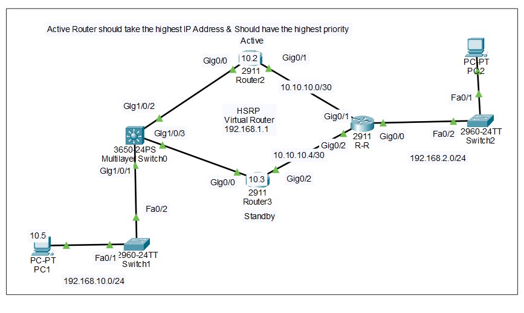
</p>

**Network Design:**
```
Left Network (192.168.10.0/24)
      ↓
   [Switch]
      ↓
  [R-Active]←─────HSRP──────→[R-Standby]
      ↓                           ↓
      └───────────[R-R]───────────┘
                   ↓
         Right Network (192.168.20.0/24)
```

---

### IP Addressing

<p align="center">
  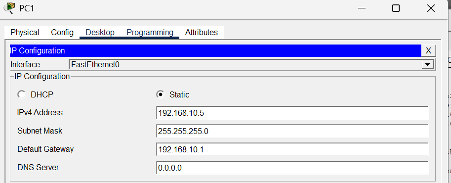
</p>

| Device | Interface | IP Address |
|--------|-----------|------------|
| **R-Active** | Fa0/0 | 192.168.10.2 |
| | Fa0/1 | 10.0.0.1 |
| **R-Standby** | Fa0/0 | 192.168.10.3 |
| | Fa0/1 | 10.0.0.5 |
| **R-R** | Fa0/0 | 10.0.0.2 |
| | Fa0/1 | 10.0.0.6 |
| | Fa1/0 | 192.168.20.1 |
| **Virtual IP** | - | 192.168.10.1 |

---

### Active Router Configuration

<p align="center">
  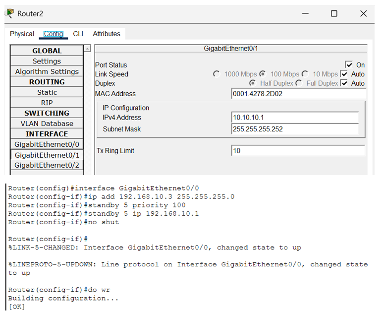
</p>

```cisco
! R-Active Complete Configuration
Router(config)# hostname R-Active

! Left LAN with HSRP
Router(config)# interface fastEthernet 0/0
Router(config-if)# ip address 192.168.10.2 255.255.255.0
Router(config-if)# standby 1 ip 192.168.10.1
Router(config-if)# standby 1 priority 110
Router(config-if)# standby 1 preempt
Router(config-if)# no shutdown
Router(config-if)# exit

! Link to R-R
Router(config)# interface fastEthernet 0/1
Router(config-if)# ip address 10.0.0.1 255.255.255.252
Router(config-if)# no shutdown
Router(config-if)# exit
```

---

#### OSPF Configuration (Active):

<p align="center">
  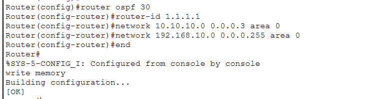
</p>

```cisco
! OSPF for R-Active
Router(config)# router ospf 1
Router(config-router)# network 192.168.10.0 0.0.0.255 area 0
Router(config-router)# network 10.0.0.0 0.0.0.3 area 0
Router(config-router)# exit
```

---

### Standby Router Configuration

<p align="center">
  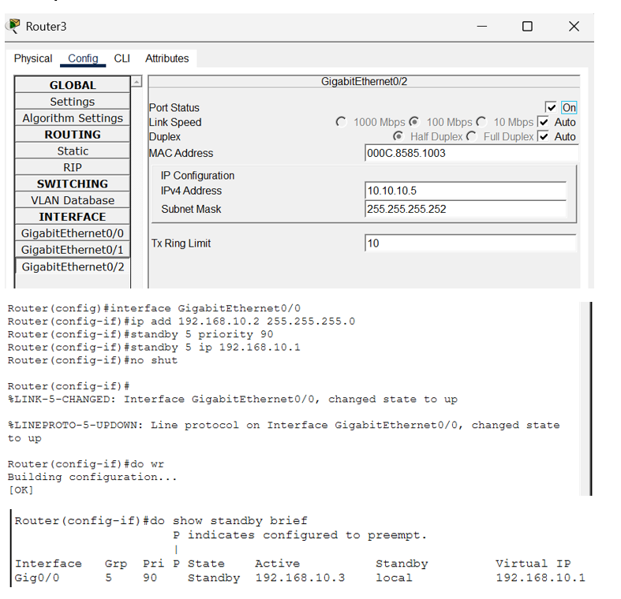
</p>

```cisco
! R-Standby Complete Configuration
Router(config)# hostname R-Standby

! Left LAN with HSRP
Router(config)# interface fastEthernet 0/0
Router(config-if)# ip address 192.168.10.3 255.255.255.0
Router(config-if)# standby 1 ip 192.168.10.1
Router(config-if)# standby 1 priority 100
Router(config-if)# standby 1 preempt
Router(config-if)# no shutdown
Router(config-if)# exit

! Link to R-R
Router(config)# interface fastEthernet 0/1
Router(config-if)# ip address 10.0.0.5 255.255.255.252
Router(config-if)# no shutdown
Router(config-if)# exit
```

---

#### OSPF Configuration (Standby):

<p align="center">
  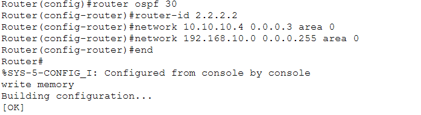
</p>

```cisco
! OSPF for R-Standby
Router(config)# router ospf 1
Router(config-router)# network 192.168.10.0 0.0.0.255 area 0
Router(config-router)# network 10.0.0.4 0.0.0.3 area 0
Router(config-router)# exit
```

---

### R-R Router Configuration

<p align="center">
  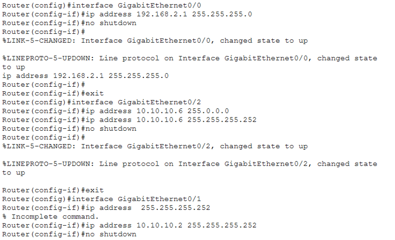
</p>

```cisco
! R-R Configuration
Router(config)# hostname R-R

! Interfaces
Router(config)# interface fastEthernet 0/0
Router(config-if)# ip address 10.0.0.2 255.255.255.252
Router(config-if)# no shutdown
Router(config-if)# exit

Router(config)# interface fastEthernet 0/1
Router(config-if)# ip address 10.0.0.6 255.255.255.252
Router(config-if)# no shutdown
Router(config-if)# exit

Router(config)# interface fastEthernet 1/0
Router(config-if)# ip address 192.168.20.1 255.255.255.0
Router(config-if)# no shutdown
Router(config-if)# exit
```

---

#### OSPF Configuration (R-R):

<p align="center">
  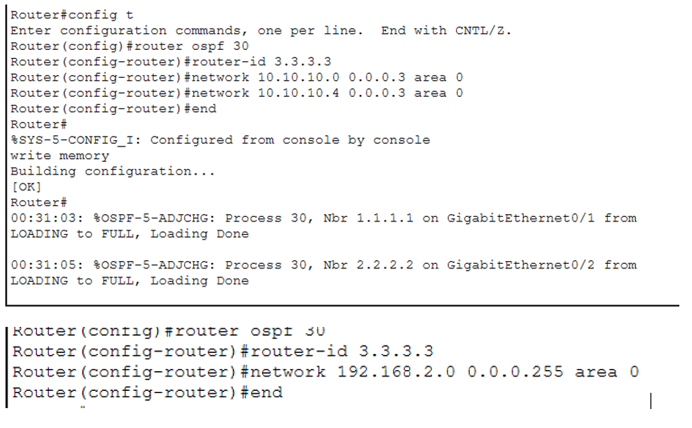
</p>

```cisco
! OSPF for R-R
Router(config)# router ospf 1
Router(config-router)# network 10.0.0.0 0.0.0.3 area 0
Router(config-router)# network 10.0.0.4 0.0.0.3 area 0
Router(config-router)# network 192.168.20.0 0.0.0.255 area 0
Router(config-router)# exit
```

---

### Results - Testing

#### ✅ Initial Connectivity Test (Left to Right):

<p align="center">
  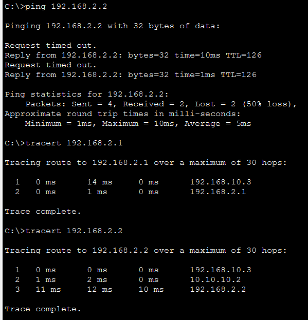
</p>

**Test:** Ping from Left Network (192.168.10.x) to Right Network (192.168.20.x)

```
PC> ping 192.168.20.10

Reply from 192.168.20.10: bytes=32 time<1ms TTL=126
Reply from 192.168.20.10: bytes=32 time<1ms TTL=126
Reply from 192.168.20.10: bytes=32 time<1ms TTL=126
Reply from 192.168.20.10: bytes=32 time<1ms TTL=126

Packets: Sent = 4, Received = 4, Lost = 0 (0% loss)
```

**Result:** ✅ Connectivity successful through R-Active

---

#### 🔴 Remove Active Router:

<p align="center">
  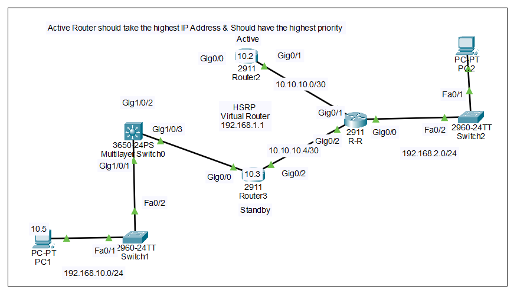
</p>

**Action:** Disconnect or power off R-Active router

**Failover Process:**
```
1. R-Active stops sending hello messages
2. R-Standby waits 10 seconds (hold timer)
3. R-Standby detects failure
4. R-Standby becomes Active
5. R-Standby takes Virtual IP ownership
```

---

#### ✅ Test After Failover:

<p align="center">
  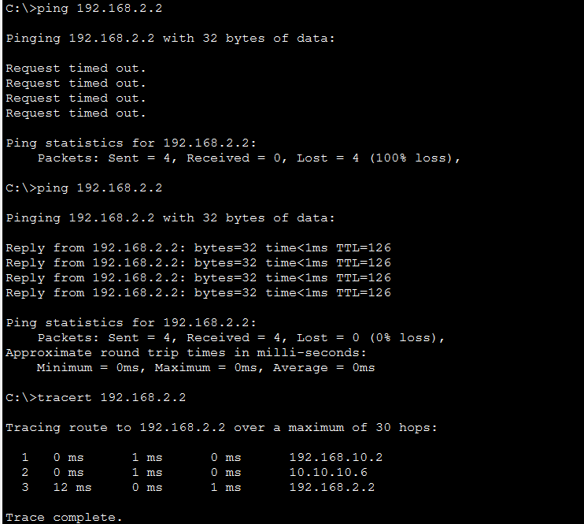
</p>

**Test:** Same ping test with Active Router DOWN

```
PC> ping 192.168.20.10

Reply from 192.168.20.10: bytes=32 time=1ms TTL=126
Reply from 192.168.20.10: bytes=32 time<1ms TTL=126
Reply from 192.168.20.10: bytes=32 time<1ms TTL=126
Reply from 192.168.20.10: bytes=32 time<1ms TTL=126

Packets: Sent = 4, Received = 4, Lost = 0 (0% loss)
```

**Result:** ✅ Zero packet loss! Network continues operating through R-Standby

---

## 📊 Protocol Comparison

### HSRP vs VRRP vs GLBP

<div align="center">

| Feature | HSRP | VRRP | GLBP |
|---------|------|------|------|
| **Vendor** | Cisco Only | Open Standard | Cisco Only |
| **Priority Range** | 0-255 | 1-254 | 1-255 |
| **Default Priority** | 100 | 100 | 100 |
| **Load Balancing** | ❌ No | ❌ No | ✅ Yes |
| **Virtual MAC** | 0000.0C07.ACxx | 0000.5E00.01xx | 0007.B400.xxyy |
| **Hello Timer** | 3 sec | 1 sec | 3 sec |
| **Hold Timer** | 10 sec | 3 sec | 10 sec |
| **Preemption** | Manual enable | Enabled default | Enabled default |
| **Max Groups** | v1: 255, v2: 4095 | 255 | 1024 |

</div>

---

### When to Use:

**HSRP:**
```
✓ Cisco-only environment
✓ Simple active/standby needed
✓ Standard in Cisco networks
```

**VRRP:**
```
✓ Multi-vendor environment
✓ Open standard required
✓ Faster failover needed
```

**GLBP:**
```
✓ Load balancing required
✓ Multiple active routers desired
✓ Cisco environment
```

---

## 📝 Quick Reference

### Configuration Template

```cisco
! Active Router
interface [interface]
 ip address [physical-ip] [mask]
 standby [group] ip [virtual-ip]
 standby [group] priority [110-255]
 standby [group] preempt
 standby [group] authentication md5 key-string [password]

! Standby Router (same, lower priority)
interface [interface]
 ip address [physical-ip] [mask]
 standby [group] ip [virtual-ip]
 standby [group] priority [90-109]
 standby [group] preempt
 standby [group] authentication md5 key-string [password]
```

---

### Troubleshooting

| Issue | Cause | Fix |
|-------|-------|-----|
| **Both routers Active** | Different group numbers | Use same group |
| | Different virtual IPs | Match virtual IP |
| | Layer 2 problem | Check connectivity |
| **No failover** | Preempt not enabled | Add `preempt` command |
| | Hold timer too long | Reduce timers |
| | Wrong priority | Verify priority values |
| **Flapping** | Timers too aggressive | Increase timers |
| | Unstable link | Check physical layer |

---

### Best Practices

1. **Always enable preempt**
   ```cisco
   standby 1 preempt
   ```

2. **Use authentication**
   ```cisco
   standby 1 authentication md5 key-string SecurePass
   ```

3. **Set clear priority hierarchy**
   ```
   Active: 110
   Standby: 100
   Others: 90, 80...
   ```

4. **Implement interface tracking**
   ```cisco
   standby 1 track fa0/1 20
   ```

5. **Document group numbers**
   ```
   Group 1 = VLAN 10
   Group 2 = VLAN 20
   ```

---


---

## 🎓 What I Learned

✅ **HSRP Fundamentals** - Router redundancy and high availability  
✅ **Virtual IP/MAC** - How clients use virtual gateway  
✅ **Priority & Preemption** - Active router election process  
✅ **Failover Mechanism** - Automatic takeover process  
✅ **Configuration** - Complete HSRP implementation  
✅ **Integration** - HSRP with OSPF routing  
✅ **Testing** - Verifying failover and redundancy  
✅ **Troubleshooting** - Common issues and solutions  

---

## 🚀 How to Use This Repository

1. **Clone the repository:**
   ```bash
   git clone https://github.com/your-username/HSRP-Implementation.git
   ```

2. **Study the documentation:**
   - Understand HSRP concepts
   - Review topology and IP addressing
   - Study configuration commands

3. **Replicate in lab:**
   - Build topology in Packet Tracer
   - Apply configurations
   - Test failover scenarios

4. **Experiment:**
   - Try different priorities
   - Test interface tracking
   - Implement authentication

---

## 📞 Connect With Me

<div align="center">

[](mailto:a.wahid7860668@gmail.com)
[](https://www.linkedin.com/in/abdul-wahid022)
[](https://github.com/abdul-wahid022)

**💬 Questions? Need Packet Tracer files? Feel free to reach out!**

</div>

---

## 📄 License

This project is created for **educational purposes** and is open-source.

---

<div align="center">

### ⭐ If you found this helpful, please give it a star!

**Made with 💙 by ABDUL WAHID**

*Last Updated: January 2026*

</div>

