# 🔥 Firewall Configuration - Security Implementation

<div align="center">


**A Complete Guide to Network Security using Cisco ASA Firewall**

[](.)
[](.)

[📖 Overview](#-overview) • [🔧 Basic Configuration](#-basic-firewall-configuration) • [🔐 Firewall Setup](#-firewall-setup) • [🌐 DHCP Configuration](#-dhcp-configuration-on-firewall) • [🔐 SSH Authentication](#-ssh-authentication-on-firewall) • [🚀 OSPF Routing](#-ospf--static-routing-on-firewall) • [🔄 NAT Configuration](#-nat-configuration-on-firewall) • [📋 Firewall Policies](#-firewall-policies)

</div>

---

## 📖 Overview

**Firewalls** are the first line of defense in network security. They act as a barrier between trusted internal networks and untrusted external networks, controlling incoming and outgoing traffic based on predetermined security rules.

This repository covers **complete Cisco ASA Firewall implementation**:
1. **Basic Configuration** - Initial setup and star topology
2. **Firewall Setup** - Complete topology and verification
3. **DHCP Services** - Dynamic IP allocation through firewall
4. **SSH Authentication** - Secure remote access
5. **Routing Protocols** - OSPF and Static routing
6. **NAT Configuration** - Address translation (Inside-to-Outside & DMZ-to-Outside)
7. **Firewall Policies** - Traffic filtering and access control
8. **DHCP Relay** - Cross-network DHCP configuration

---

## 📚 Table of Contents

- [🔧 Basic Firewall Configuration](#-basic-firewall-configuration)
  - [Star Topology](#star-topology)
  - [Output Results](#output-results)
- [🔐 Firewall Setup](#-firewall-setup)
  - [Verification](#verification)
- [🌐 DHCP Configuration on Firewall](#-dhcp-configuration-on-firewall)
- [🔐 SSH Authentication on Firewall](#-ssh-authentication-on-firewall)
- [🚀 OSPF & Static Routing on Firewall](#-ospf--static-routing-on-firewall)
  - [Network Setup](#network-setup)
  - [OSPF on Firewall](#ospf-on-firewall)
  - [Router0 Configuration](#router0-configuration)
  - [Router1 Configuration](#router1-configuration)
- [🔄 NAT Configuration on Firewall](#-nat-configuration-on-firewall)
  - [Inside to Outside](#inside-to-outside-nat)
  - [DMZ to Outside](#dmz-to-outside-nat)
- [📋 Firewall Policies](#-firewall-policies)
  - [Common Protocols & Ports](#common-protocols--ports)
  - [Commands to Pass Policies](#commands-to-pass-policies)
  - [Firewall Policies for Outside](#firewall-policies-for-outside)
  - [DHCP Pool on DMZ Server](#dhcp-pool-on-dmz-server)
  - [DHCP Relay on Inside Router](#dhcp-relay-on-inside-router)
- [❓ FAQ](#-frequently-asked-questions)
- [📝 Best Practices](#-best-practices)
- [🎓 What I Learned](#-what-i-learned)

---

## 🔧 Basic Firewall Configuration

### Star Topology

<div align="center">

| Feature | Details |
|---------|---------|
| **Firewall Type** | Cisco ASA (Adaptive Security Appliance) |
| **Topology** | Star Topology |
| **Models Supported** | ISA-3000, ASA 5506-X, ASA 5505 |
| **Primary Function** | Traffic filtering and access control |
| **Security Zones** | Inside, Outside, DMZ |

</div>

### 🔑 Key Points:

**What is a Firewall?**

A firewall is a network security device that monitors and controls incoming and outgoing network traffic based on predetermined security rules.

#### 🎯 Main Functions:
- 🛡️ **Traffic Filtering** - Block unauthorized access
- 🔒 **Access Control** - Allow only legitimate connections
- 📊 **Logging** - Track network activity
- 🚫 **Attack Prevention** - Stop hackers and malware

#### 🌐 Security Zones:

| Zone | Purpose | Security Level |
|------|---------|----------------|
| **Inside** | Internal trusted network | High (100) |
| **Outside** | External untrusted network (Internet) | Low (0) |
| **DMZ** | Public-facing servers | Medium (50) |

#### ⚠️ Important Rules:
```
✅ Traffic flows from Higher to Lower security levels by default
❌ Traffic from Lower to Higher requires explicit permission
🔐 Always save configuration after changes
```

---

### Lab Implementation - Star Topology

<p align="center">
  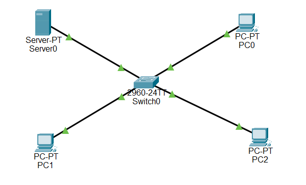
</p>

**Star Topology with Firewall at Center**

---

### Firewall Configuration

<p align="center">
  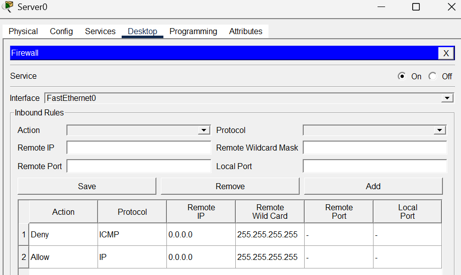
</p>

**Basic Firewall Configuration Interface**

#### Configuration Commands:

```cisco
! Basic Firewall Configuration
ciscoasa> enable
ciscoasa# configure terminal

! Configure Inside Interface
ciscoasa(config)# interface gigabitEthernet 1/1
ciscoasa(config-if)# nameif inside
ciscoasa(config-if)# security-level 100
ciscoasa(config-if)# ip address 192.168.1.1 255.255.255.0
ciscoasa(config-if)# no shutdown
ciscoasa(config-if)# exit

! Configure Outside Interface
ciscoasa(config)# interface gigabitEthernet 1/2
ciscoasa(config-if)# nameif outside
ciscoasa(config-if)# security-level 0
ciscoasa(config-if)# ip address 203.0.113.1 255.255.255.0
ciscoasa(config-if)# no shutdown
ciscoasa(config-if)# exit

! Configure DMZ Interface
ciscoasa(config)# interface gigabitEthernet 1/3
ciscoasa(config-if)# nameif dmz
ciscoasa(config-if)# security-level 50
ciscoasa(config-if)# ip address 192.168.100.1 255.255.255.0
ciscoasa(config-if)# no shutdown
ciscoasa(config-if)# exit

! Save Configuration
ciscoasa(config)# exit
ciscoasa# write memory
```

#### 📝 Explanation:
```
Lines 1-7: Configure inside interface with highest security (100)
Lines 8-13: Configure outside interface with lowest security (0)
Lines 14-19: Configure DMZ with medium security (50)
Line 21: Save configuration permanently
```

---

## Output Results

### ❌ NO ICMP Allowed (Default Behavior)

<p align="center">
  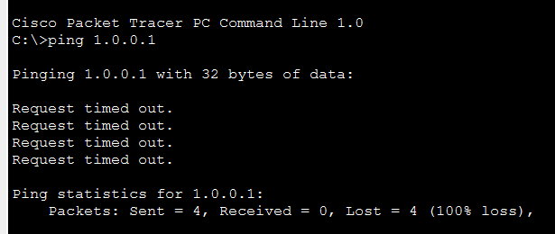
</p>

**Result:** ❌ ICMP (Ping) requests are blocked by default firewall policy

**Why ICMP is Blocked?**
- 🔒 Security measure to prevent network reconnaissance
- 🚫 Stops ping sweeps and network mapping attempts
- ⚠️ Default firewall behavior blocks ICMP from lower to higher security zones

---

### ✅ Allowed Traffic (HTTP)

<p align="center">
  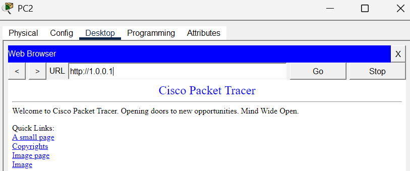
</p>

**Result:** ✅ HTTP traffic is allowed through the firewall

**Why HTTP is Allowed?**
- ✅ Configured policy permits HTTP traffic
- 🌐 Web browsing functionality enabled
- 📊 Traffic flows from higher to lower security zones (Inside → Outside)

---

## 🔐 Firewall Setup

### Complete Network Topology

<p align="center">
  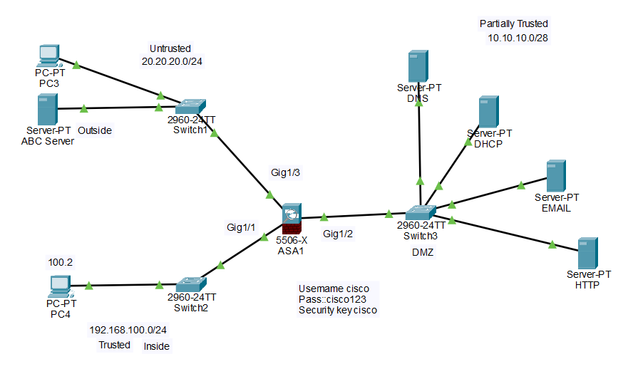
</p>

**Complete Firewall Network Setup with Multiple Zones**

#### 🎯 Network Components:
- **Inside Network** - Internal user network
- **Outside Network** - Internet connection
- **DMZ Network** - Public-facing servers
- **Firewall** - Central security device

---

## Verification

<p align="center">
  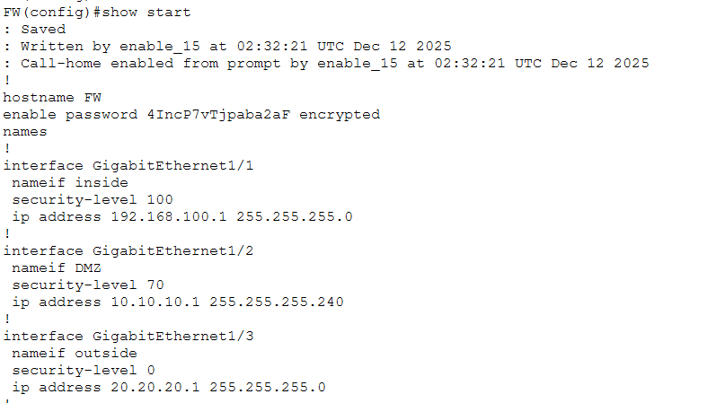
</p>

**Verification of Firewall Configuration**

#### 🔍 Verification Commands:

```cisco
! Verify Interface Configuration
ciscoasa# show interface ip brief
ciscoasa# show nameif

! Verify Security Levels
ciscoasa# show running-config interface

! Verify Connectivity
ciscoasa# show route
ciscoasa# show arp

! Check Firewall Status
ciscoasa# show version
ciscoasa# show failover
```

---

## 🌐 DHCP Configuration on Firewall

<div align="center">

| Feature | Details |
|---------|---------|
| **DHCP** | Dynamic Host Configuration Protocol |
| **Purpose** | Automatic IP address assignment |
| **Firewall Role** | Acts as DHCP server for internal network |
| **Interface** | Configured on Inside interface |

</div>

### 🔑 Key Points:

**What is DHCP on Firewall?**

The firewall can act as a DHCP server, automatically assigning IP addresses to devices on the internal network.

#### 📍 Components:
- 🎯 **Address Pool** - Range of IP addresses to distribute
- 🌐 **DNS Server** - DNS configuration for clients (8.8.8.8)
- 🔧 **Interface Binding** - DHCP enabled on specific interface

---

### Configuration Commands - DHCP

```cisco
! DHCP Configuration on Firewall
ciscoasa> enable
ciscoasa# configure terminal

! Configure Inside Interface
ciscoasa(config)# interface gigabitEthernet 1/1
ciscoasa(config-if)# ip address 192.168.100.1 255.255.255.0
ciscoasa(config-if)# no shutdown
ciscoasa(config-if)# exit

! Set Interface Name
ciscoasa(config)# interface gigabitEthernet 1/1
ciscoasa(config-if)# nameif inside
ciscoasa(config-if)# exit

! Configure DHCP Pool
ciscoasa(config)# dhcpd address 192.168.100.101-192.168.100.199 inside
ciscoasa(config)# dhcpd dns 8.8.8.8 interface inside
ciscoasa(config)# dhcpd enable inside
ciscoasa(config)# exit

! Save Configuration
ciscoasa# write memory

! Verify DHCP Configuration
ciscoasa# show dhcpd state
ciscoasa# show dhcpd binding
```

#### 📝 Explanation:
```
Lines 1-8: Configure inside interface with IP (192.168.100.1)
Lines 10-12: Set interface name as "inside"
Line 14: Configure DHCP pool (192.168.100.101 to .199)
Line 15: Set Google DNS (8.8.8.8)
Line 16: Enable DHCP on inside interface
```

---

### ⚠️ Important Note - Packet Tracer Limitation:

```
❌ DHCP cannot be configured on these firewalls in Packet Tracer:
   - ISA-3000
   - ASA 5506-X
   - ASA 5505

✅ Use the commands above for real hardware or GNS3
✅ In Packet Tracer, use a router as DHCP server instead
```

---

## 🔐 SSH Authentication on Firewall

<div align="center">

| Feature | Details |
|---------|---------|
| **SSH** | Secure Shell Protocol |
| **Purpose** | Encrypted remote access to firewall |
| **Security** | Username/Password authentication |
| **Port** | TCP 22 |
| **Credentials** | Username: **cisco** / Password: **cisco123** |

</div>

### 🔑 Key Points:

**What is SSH on Firewall?**

SSH provides secure, encrypted remote access to the firewall for management and configuration.

#### 🔒 Security Benefits:
- 🔐 **Encrypted Communication** - All data is encrypted
- 👤 **User Authentication** - Username and password required
- 📝 **Session Logging** - Track who accessed the firewall
- 🚫 **No Plain Text** - Unlike Telnet, passwords are encrypted

---

### SSH Configuration

<p align="center">
  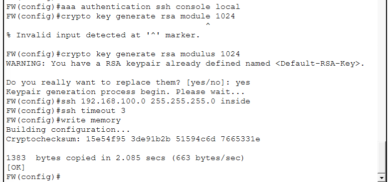
</p>

**SSH Authentication Setup on Firewall**

```cisco
! SSH Configuration on Firewall
ciscoasa> enable
ciscoasa# configure terminal

! Set Hostname and Domain
ciscoasa(config)# hostname Firewall-ASA
Firewall-ASA(config)# domain-name cisco.com

! Generate RSA Key Pair
Firewall-ASA(config)# crypto key generate rsa modulus 1024

! Create Local User Account
Firewall-ASA(config)# username cisco password cisco123 privilege 15

! Configure SSH Access
Firewall-ASA(config)# ssh 192.168.1.0 255.255.255.0 inside
Firewall-ASA(config)# ssh timeout 30
Firewall-ASA(config)# ssh version 2

! Enable AAA Authentication
Firewall-ASA(config)# aaa authentication ssh console LOCAL

! Save Configuration
Firewall-ASA(config)# exit
Firewall-ASA# write memory

! Verify SSH Configuration
Firewall-ASA# show ssh sessions
Firewall-ASA# show running-config | include ssh
```

---

### SSH Login Output

<p align="center">
  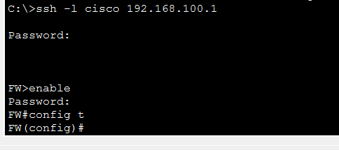
</p>

**SSH Login Screen**

#### ✅ Login Credentials:
```
Username: cisco
Password: cisco123
```

**Result:**
```
✅ Secure connection established
✅ User authenticated successfully
✅ Full CLI access granted
✅ Encrypted communication active
```

---

## 🚀 OSPF & Static Routing on Firewall

<div align="center">

| Feature | Details |
|---------|---------|
| **OSPF** | Open Shortest Path First |
| **Type** | Link-State Routing Protocol |
| **Use Case** | Dynamic routing in enterprise networks |
| **Advantage** | Automatic route updates and redundancy |

</div>

### 🔑 Key Points:

**What is OSPF on Firewall?**

OSPF enables the firewall to dynamically learn network routes and communicate with other routers in the network.

#### 🌐 Routing Basics:

| Type | Description | Use Case |
|------|-------------|----------|
| **Static Routing** | Manually configured routes | Small networks |
| **OSPF** | Dynamic routing protocol | Large networks |
| **Default Route** | Route to unknown destinations | Internet access |

---

### Network Setup

<p align="center">
  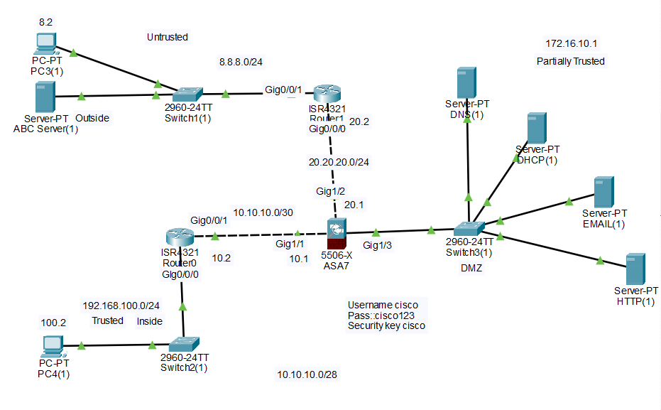
</p>

**OSPF Network Topology with Multiple Routers**

#### 🎯 Network Components:
- **Firewall** - Central security device running OSPF
- **Router0** - Internal network router
- **Router1** - External network router
- **OSPF Area 0** - Backbone area

---

### OSPF on Firewall

<p align="center">
  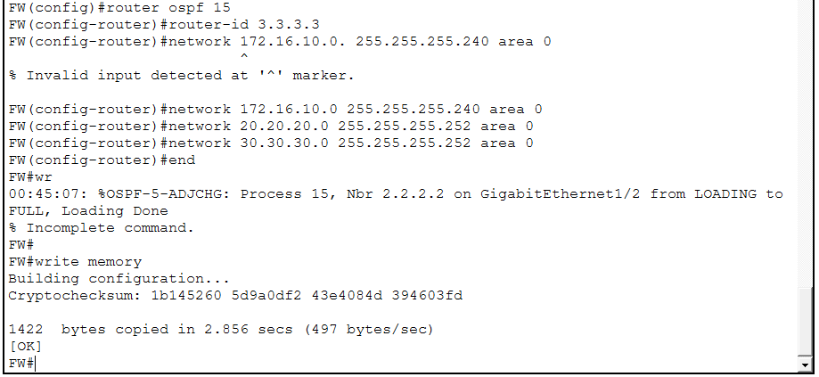
</p>

**OSPF Configuration Interface on Firewall**

```cisco
! OSPF Configuration on Firewall
ciscoasa> enable
ciscoasa# configure terminal

! Enable OSPF Process
ciscoasa(config)# router ospf 1
ciscoasa(config-router)# router-id 1.1.1.1
ciscoasa(config-router)# network 192.168.1.0 255.255.255.0 area 0
ciscoasa(config-router)# network 192.168.100.0 255.255.255.0 area 0
ciscoasa(config-router)# network 203.0.113.0 255.255.255.0 area 0
ciscoasa(config-router)# log-adj-changes
ciscoasa(config-router)# exit

! Configure Static Default Route (if needed)
ciscoasa(config)# route outside 0.0.0.0 0.0.0.0 203.0.113.254

! Save Configuration
ciscoasa(config)# exit
ciscoasa# write memory

! Verify OSPF
ciscoasa# show route ospf
ciscoasa# show ospf neighbor
ciscoasa# show ospf interface
```

#### 📝 Explanation:
```
Line 1: Enable OSPF process ID 1
Line 2: Set router ID for identification
Lines 3-5: Advertise connected networks in Area 0
Line 6: Log OSPF neighbor changes
Line 8: Configure default route to ISP
```

---

### Router0 Configuration

<p align="center">
  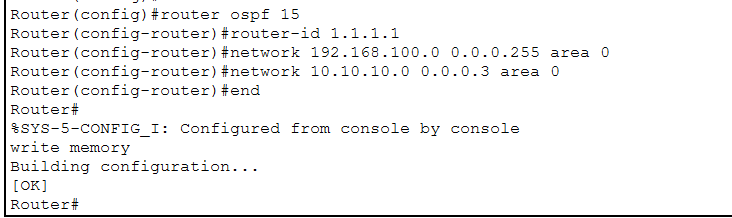
</p>

**OSPF Configuration on Router0**

```cisco
! Router0 OSPF Configuration
Router> enable
Router# configure terminal

! Set Hostname
Router(config)# hostname Router0

! Configure Interfaces
Router0(config)# interface gigabitEthernet 0/0
Router0(config-if)# ip address 192.168.1.254 255.255.255.0
Router0(config-if)# no shutdown
Router0(config-if)# exit

Router0(config)# interface gigabitEthernet 0/1
Router0(config-if)# ip address 10.0.0.1 255.255.255.0
Router0(config-if)# no shutdown
Router0(config-if)# exit

! Configure OSPF
Router0(config)# router ospf 1
Router0(config-router)# router-id 2.2.2.2
Router0(config-router)# network 192.168.1.0 0.0.0.255 area 0
Router0(config-router)# network 10.0.0.0 0.0.0.255 area 0
Router0(config-router)# exit

! Save Configuration
Router0(config)# exit
Router0# write memory

! Verify OSPF
Router0# show ip ospf neighbor
Router0# show ip route ospf
```

#### 📝 Explanation:
```
Lines 1-6: Configure interfaces with IP addresses
Lines 8-12: Enable OSPF and advertise networks
Wildcard mask: 0.0.0.255 (inverse of 255.255.255.0)
Area 0: Backbone area
```

---

### Router1 Configuration

<p align="center">
  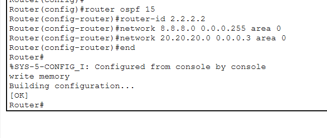
</p>

**OSPF Configuration on Router1**

```cisco
! Router1 OSPF Configuration
Router> enable
Router# configure terminal

! Set Hostname
Router(config)# hostname Router1

! Configure Interfaces
Router1(config)# interface gigabitEthernet 0/0
Router1(config-if)# ip address 10.0.0.2 255.255.255.0
Router1(config-if)# no shutdown
Router1(config-if)# exit

Router1(config)# interface gigabitEthernet 0/1
Router1(config-if)# ip address 172.16.0.1 255.255.255.0
Router1(config-if)# no shutdown
Router1(config-if)# exit

! Configure OSPF
Router1(config)# router ospf 1
Router1(config-router)# router-id 3.3.3.3
Router1(config-router)# network 10.0.0.0 0.0.0.255 area 0
Router1(config-router)# network 172.16.0.0 0.0.255.255 area 0
Router1(config-router)# exit

! Save Configuration
Router1(config)# exit
Router1# write memory

! Verify OSPF
Router1# show ip ospf neighbor
Router1# show ip route ospf
```

#### 📝 Explanation:
```
Lines 1-6: Configure interfaces with IP addresses
Lines 8-12: Enable OSPF and advertise networks
Router ID: Unique identifier for each router (3.3.3.3)
All routers in same Area 0 (backbone)
```

---

## 🔄 NAT Configuration on Firewall

### Inside to Outside NAT

<p align="center">
  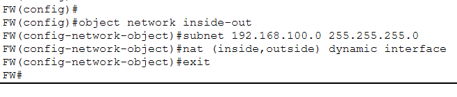
</p>

**NAT Configuration - Inside Network to Outside (Internet)**

**Purpose:** Allow internal network to access the Internet using a public IP address.

```cisco
! NAT Configuration - Inside to Outside
ciscoasa> enable
ciscoasa# configure terminal

! Configure Dynamic PAT (Port Address Translation)
ciscoasa(config)# object network INSIDE-NET
ciscoasa(config-network-object)# subnet 192.168.1.0 255.255.255.0
ciscoasa(config-network-object)# nat (inside,outside) dynamic interface
ciscoasa(config-network-object)# exit

! Alternative: Using NAT Pool
ciscoasa(config)# object network INSIDE-NET-POOL
ciscoasa(config-network-object)# subnet 192.168.1.0 255.255.255.0
ciscoasa(config-network-object)# nat (inside,outside) dynamic 203.0.113.100-203.0.113.200
ciscoasa(config-network-object)# exit

! Save Configuration
ciscoasa(config)# exit
ciscoasa# write memory

! Verify NAT
ciscoasa# show xlate
ciscoasa# show nat
ciscoasa# show nat detail
```

#### 📝 Explanation:
```
Line 1: Create network object for inside network
Line 2: Define the subnet to be translated (192.168.1.0/24)
Line 3: Configure dynamic PAT using outside interface IP
        (All inside hosts share one public IP)
Lines 5-8: Alternative method using a pool of public IPs
```

---

### DMZ to Outside NAT

<p align="center">
  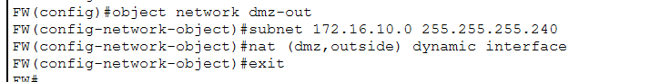
</p>

**NAT Configuration - DMZ Servers to Outside (Internet)**

**Purpose:** Allow DMZ servers to be accessible from the Internet using static NAT.

```cisco
! NAT Configuration - DMZ to Outside (Static NAT)
ciscoasa> enable
ciscoasa# configure terminal

! Configure Static NAT for Web Server
ciscoasa(config)# object network WEB-SERVER
ciscoasa(config-network-object)# host 192.168.100.10
ciscoasa(config-network-object)# nat (dmz,outside) static 203.0.113.10
ciscoasa(config-network-object)# exit

! Configure Static NAT for Mail Server
ciscoasa(config)# object network MAIL-SERVER
ciscoasa(config-network-object)# host 192.168.100.20
ciscoasa(config-network-object)# nat (dmz,outside) static 203.0.113.20
ciscoasa(config-network-object)# exit

! Configure Static NAT for DNS Server
ciscoasa(config)# object network DNS-SERVER
ciscoasa(config-network-object)# host 192.168.100.30
ciscoasa(config-network-object)# nat (dmz,outside) static 203.0.113.30
ciscoasa(config-network-object)# exit

! Save Configuration
ciscoasa(config)# exit
ciscoasa# write memory

! Verify NAT
ciscoasa# show xlate
ciscoasa# show nat detail
ciscoasa# show running-config object network
```

#### 📝 Explanation:
```
Static NAT: One-to-one mapping between private and public IP
Web Server: 192.168.100.10 → 203.0.113.10
Mail Server: 192.168.100.20 → 203.0.113.20
DNS Server: 192.168.100.30 → 203.0.113.30
DMZ servers get dedicated public IPs for Internet access
```

---

## 📋 Firewall Policies

### Common Protocols & Ports

<div align="center">

| Protocol | Port(s) | Type | Usage |
|----------|---------|------|-------|
| **HTTP** | 80, 8080 | TCP | Web traffic |
| **HTTPS** | 443 | TCP | Secure web traffic |
| **DNS** | 53 | TCP & UDP | Domain name resolution |
| **DHCP** | 67 (server), 68 (client) | UDP | IP address assignment |
| **SSH** | 22 | TCP | Secure remote access |
| **FTP** | 20, 21 | TCP | File transfer |
| **SMTP** | 25 | TCP | Email sending |
| **POP3** | 110 | TCP | Email receiving |
| **IMAP** | 143 | TCP | Email access |
| **ICMP** | N/A | ICMP | Ping, diagnostics |

</div>

---

### Commands to Pass Policies

<p align="center">
  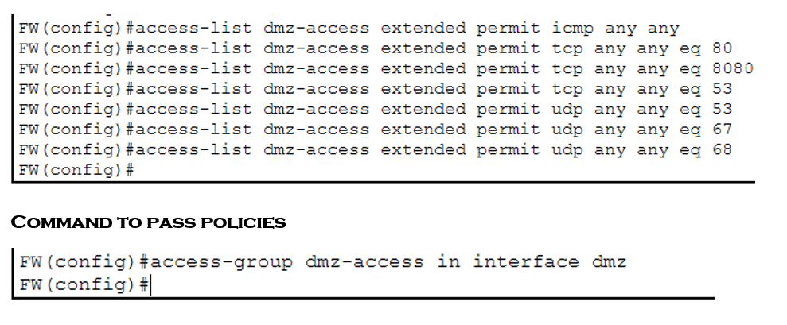
</p>

**Firewall Policy Configuration Commands**

```cisco
! Firewall Policy Configuration
ciscoasa> enable
ciscoasa# configure terminal

! Allow HTTP Traffic (Port 80 & 8080)
ciscoasa(config)# access-list OUTSIDE-IN extended permit tcp any any eq 80
ciscoasa(config)# access-list OUTSIDE-IN extended permit tcp any any eq 8080

! Allow HTTPS Traffic (Port 443)
ciscoasa(config)# access-list OUTSIDE-IN extended permit tcp any any eq 443

! Allow DNS Traffic (Port 53 - TCP & UDP)
ciscoasa(config)# access-list OUTSIDE-IN extended permit tcp any any eq 53
ciscoasa(config)# access-list OUTSIDE-IN extended permit udp any any eq 53

! Allow DHCP Traffic (Port 67 & 68)
ciscoasa(config)# access-list OUTSIDE-IN extended permit udp any any eq 67
ciscoasa(config)# access-list OUTSIDE-IN extended permit udp any any eq 68

! Allow ICMP (Ping)
ciscoasa(config)# access-list OUTSIDE-IN extended permit icmp any any

! Deny All Other Traffic (Implicit)
ciscoasa(config)# access-list OUTSIDE-IN extended deny ip any any

! Apply Access List to Outside Interface
ciscoasa(config)# access-group OUTSIDE-IN in interface outside

! Save Configuration
ciscoasa(config)# exit
ciscoasa# write memory

! Verify Access Lists
ciscoasa# show access-list OUTSIDE-IN
ciscoasa# show running-config access-list
```

#### 📝 Policy Examples:

```cisco
! Allow Web Server in DMZ (from Outside)
ciscoasa(config)# access-list DMZ-IN extended permit tcp any host 192.168.100.10 eq 80
ciscoasa(config)# access-list DMZ-IN extended permit tcp any host 192.168.100.10 eq 443
ciscoasa(config)# access-group DMZ-IN in interface outside

! Block Specific IP Address
ciscoasa(config)# access-list OUTSIDE-IN extended deny ip host 203.0.113.50 any

! Allow All Traffic from Inside to Outside
ciscoasa(config)# access-list INSIDE-OUT extended permit ip any any
ciscoasa(config)# access-group INSIDE-OUT in interface inside

! Allow SSH from Specific Network Only
ciscoasa(config)# access-list MGMT-IN extended permit tcp 192.168.1.0 255.255.255.0 any eq 22
ciscoasa(config)# access-group MGMT-IN in interface inside
```

---

### Firewall Policies for Outside

<p align="center">
  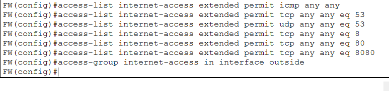
</p>

**Advanced Firewall Policies for Outside Interface**

```cisco
! Advanced Outside Interface Policies
ciscoasa> enable
ciscoasa# configure terminal

! Create Object Groups for Better Management
ciscoasa(config)# object-group service WEB-SERVICES tcp
ciscoasa(config-service-object-group)# port-object eq 80
ciscoasa(config-service-object-group)# port-object eq 8080
ciscoasa(config-service-object-group)# port-object eq 443
ciscoasa(config-service-object-group)# exit

! Create Network Object Group for DMZ Servers
ciscoasa(config)# object-group network DMZ-SERVERS
ciscoasa(config-network-object-group)# network-object host 192.168.100.10
ciscoasa(config-network-object-group)# network-object host 192.168.100.20
ciscoasa(config-network-object-group)# network-object host 192.168.100.30
ciscoasa(config-network-object-group)# exit

! Apply Policy Using Object Groups
ciscoasa(config)# access-list OUTSIDE-IN extended permit tcp any object-group DMZ-SERVERS object-group WEB-SERVICES
ciscoasa(config)# access-group OUTSIDE-IN in interface outside

! Save Configuration
ciscoasa(config)# exit
ciscoasa# write memory
```

---

### DHCP Pool on DMZ Server

<p align="center">
  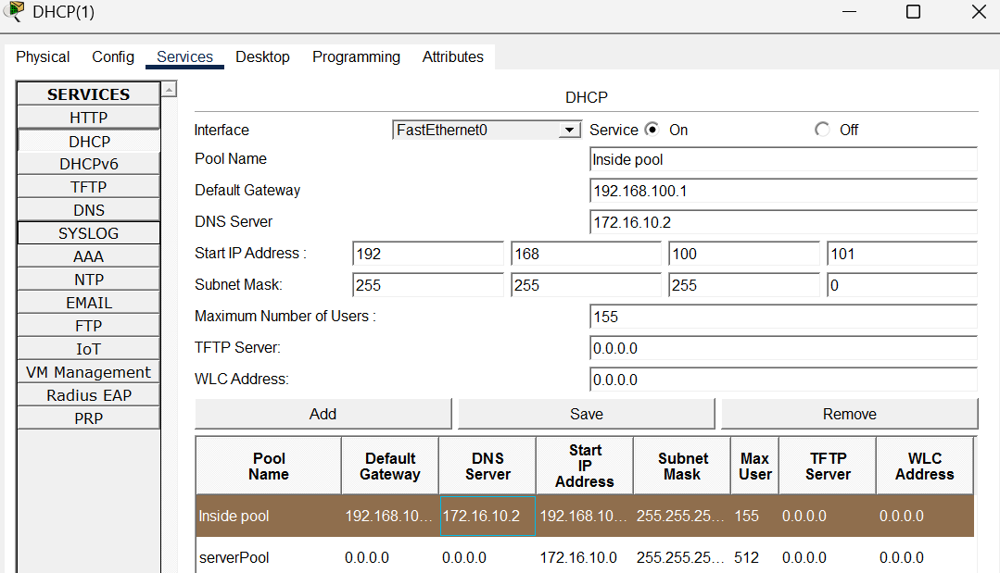
</p>

**DHCP Pool Configuration on DMZ Server**

```cisco
! DHCP Pool Configuration on DMZ Server (Router)
Router> enable
Router# configure terminal

! Configure DHCP Pool for Inside Network
Router(config)# ip dhcp pool INSIDE-POOL
Router(dhcp-config)# network 192.168.1.0 255.255.255.0
Router(dhcp-config)# default-router 192.168.1.1
Router(dhcp-config)# dns-server 8.8.8.8 8.8.4.4
Router(dhcp-config)# domain-name cisco.local
Router(dhcp-config)# lease 7
Router(dhcp-config)# exit

! Exclude Gateway and Server IPs
Router(config)# ip dhcp excluded-address 192.168.1.1 192.168.1.10

! Configure Interface
Router(config)# interface gigabitEthernet 0/0
Router(config-if)# ip address 192.168.100.10 255.255.255.0
Router(config-if)# no shutdown
Router(config-if)# exit

! Save Configuration
Router(config)# exit
Router# write memory

! Verify DHCP Pool
Router# show ip dhcp pool
Router# show ip dhcp binding
Router# show ip dhcp server statistics
```

#### 📝 Explanation:
```
Lines 1-6: Create DHCP pool named "INSIDE-POOL"
Line 2: Network to distribute IPs from (192.168.1.0/24)
Line 3: Default gateway for clients (192.168.1.1)
Line 4: DNS servers (Google DNS)
Line 5: Domain name for clients
Line 6: Lease time (7 days)
Line 8: Exclude IPs from 192.168.1.1 to .10 (reserved)
```

---

### DHCP Relay on Inside Router

<p align="center">
  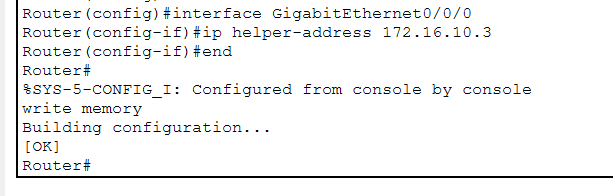
</p>

**Configuring DHCP Relay on Inside Router0**

```cisco
! DHCP Relay Configuration on Inside Router (Router0)
Router> enable
Router# configure terminal

! Set Hostname
Router(config)# hostname Router0

! Configure Inside Interface (Connected to PCs)
Router0(config)# interface gigabitEthernet 0/0
Router0(config-if)# ip address 192.168.1.1 255.255.255.0
Router0(config-if)# no shutdown

! Configure DHCP Helper Address (pointing to DMZ DHCP Server)
Router0(config-if)# ip helper-address 192.168.100.10
Router0(config-if)# exit

! Configure Interface to Firewall
Router0(config)# interface gigabitEthernet 0/1
Router0(config-if)# ip address 10.0.0.1 255.255.255.0
Router0(config-if)# no shutdown
Router0(config-if)# exit

! Save Configuration
Router0(config)# exit
Router0# write memory

! Verify DHCP Relay
Router0# show ip interface gigabitEthernet 0/0
Router0# show running-config interface gigabitEthernet 0/0
Router0# debug ip dhcp server packet
```

#### 📝 Explanation:
```
Line 1-5: Configure inside interface with gateway IP (192.168.1.1)
Line 7: CRITICAL - ip helper-address forwards DHCP requests
        Points to DMZ server (192.168.100.10)
Lines 9-13: Configure interface to firewall
How it works:
1. PC broadcasts DHCP request
2. Router0 receives it on Gi0/0
3. ip helper-address forwards to DMZ server (192.168.100.10)
4. DMZ server responds with IP
5. Router0 relays response back to PC
```

---

### ✅ Final Result:

> **Now open the PC and you will get the IP from the pool automatically!**

**Testing Steps:**
1. Open PC connected to Inside network
2. Set network adapter to DHCP
3. Use `ipconfig /renew` command
4. PC receives IP from DMZ DHCP server (192.168.100.10)
5. Verify with `ipconfig /all`

**Expected Output:**
```
IP Address: 192.168.1.100 (from pool)
Subnet Mask: 255.255.255.0
Default Gateway: 192.168.1.1
DNS Server: 8.8.8.8
DHCP Server: 192.168.100.10
```

---

## ❓ Frequently Asked Questions

### 1. Why is it important to close all windows after configuring a firewall?

Open windows have admin access and create security risks. Closing them ensures changes apply properly and no one can tamper with your settings.

---

### 2. What steps would you take to save a network configuration?

Click "Apply", create a backup file using `write memory` or `copy running-config startup-config`, and verify the settings were saved correctly.

**Verification Commands:**
```cisco
ciscoasa# show running-config
ciscoasa# show startup-config
ciscoasa# dir flash:
```

---

### 3. How does a firewall contribute to network security?

It blocks hackers, viruses, and unauthorized traffic while allowing safe connections through. It's your network's security guard.

**Key Functions:**
- 🛡️ Traffic filtering and inspection
- 🔒 Access control and authentication
- 📊 Logging and monitoring
- 🚫 Attack prevention and mitigation

---

### 4. What might happen if you forget to save your firewall configuration?

All your settings will be lost after a restart, leaving your network vulnerable with default settings.

**Consequences:**
- ❌ All ACLs and policies removed
- ❌ NAT configurations lost
- ❌ Security zones reset to default
- ❌ Network becomes unprotected

---

### 5. Can you list some common features of a basic firewall?

Traffic filtering, port management, IP blocking, basic logging, and preset security rules.

**Complete Features:**
- Access control lists (ACLs)
- Network Address Translation (NAT)
- Virtual Private Network (VPN) support
- Stateful packet inspection
- Application layer filtering
- Intrusion prevention system (IPS)

---

### 6. Why might you need to close all windows after making changes to a network configuration?

Open windows are security risks and some changes only apply when you close them properly.

**Security Risks:**
- Unauthorized access through open sessions
- Configuration tampering
- Credential exposure
- Privilege escalation

---

### 7. What are the potential risks of not having a firewall configured?

Easy hacker access, malware infections, data theft, and zero protection against attacks.

**Detailed Risks:**
- 🚨 Direct exposure to Internet threats
- 🦠 Malware and virus infections
- 🔓 Unauthorized access to internal resources
- 📤 Data exfiltration and theft
- 🎯 DDoS attacks
- 🕵️ Network reconnaissance

---

### 8. What are some signs that your firewall is not configured correctly?

Unauthorized access getting through, unusual traffic, wrong programs connecting, or legitimate apps being blocked.

**Warning Signs:**
- ⚠️ Unexpected network connections
- 📊 Unusual bandwidth usage
- 🚫 Legitimate services not working
- 🔓 Security alerts and logs showing breaches
- 🌐 Users unable to access required resources

---

### 9. What is the difference between a basic and an advanced firewall configuration?

Basic has simple on/off rules with defaults. Advanced lets you create custom rules and detailed control for specific needs.

**Comparison:**

| Feature | Basic Firewall | Advanced Firewall |
|---------|---------------|-------------------|
| **Rules** | Simple allow/deny | Complex conditional rules |
| **Inspection** | Packet filtering | Deep packet inspection |
| **Protocols** | Common protocols only | All protocols with fine control |
| **Logging** | Basic logs | Detailed forensic logs |
| **Management** | Simple interface | Centralized management |
| **IPS/IDS** | Not included | Integrated threat detection |

---

### 10. How can you verify that your firewall configuration has been saved successfully?

Reopen settings to check if they're still there, restart the system, or test if blocked items are actually blocked.

**Verification Methods:**

```cisco
! Compare Running vs Startup Config
ciscoasa# show running-config
ciscoasa# show startup-config

! Check for Differences
ciscoasa# show run | compare

! View Last Save Time
ciscoasa# show version | include Configuration

! Test Specific Configurations
ciscoasa# show access-list
ciscoasa# show nat
ciscoasa# show route
ciscoasa# show interface

! Functional Testing
ciscoasa# ping 8.8.8.8
ciscoasa# test firewall-rules
```

**After Reboot:**
```
1. Restart firewall: reload
2. Check if configs are still present
3. Test blocked/allowed traffic
4. Verify NAT translations working
5. Confirm OSPF neighbors up
```

---

## 📝 Best Practices

<div align="center">

| # | Best Practice | Reason | Implementation |
|---|---------------|--------|----------------|
| 1️⃣ | **Always save configuration** | Prevent loss of settings after reboot | `write memory` after every change |
| 2️⃣ | **Close all windows after configuration** | Ensure changes apply and prevent unauthorized access | Exit all privileged sessions |
| 3️⃣ | **Use strong passwords** | Protect against unauthorized access | Min 12 chars, mixed case, symbols |
| 4️⃣ | **Enable logging** | Track security events and troubleshoot issues | Configure syslog server |
| 5️⃣ | **Test configurations in lab first** | Avoid production network disruptions | Use Packet Tracer/GNS3 |
| 6️⃣ | **Document all changes** | Easier troubleshooting and maintenance | Maintain config changelog |
| 7️⃣ | **Use SSH instead of Telnet** | Encrypted communication for security | Disable Telnet completely |
| 8️⃣ | **Apply principle of least privilege** | Only allow necessary traffic | Start with deny all, add permits |
| 9️⃣ | **Regularly update firmware** | Patch security vulnerabilities | Check Cisco.com for updates |
| 🔟 | **Backup configuration files** | Quick recovery from failures | Weekly backups to TFTP server |

</div>

---

### 🔧 Additional Best Practices:

#### Security:
- 🔐 Change default passwords immediately
- 🚫 Disable unused services and ports
- 📊 Monitor firewall logs daily
- 🔄 Review and update ACLs quarterly
- 🛡️ Enable anti-spoofing protection

#### Configuration Management:
- 📝 Use descriptive names for ACLs and objects
- 🏷️ Add comments to complex rules
- 📋 Maintain configuration baseline
- 🔄 Version control for configs
- ✅ Test before applying to production

#### Monitoring:
- 📊 Set up real-time alerts
- 🔍 Regular security audits
- 📈 Capacity planning and monitoring
- 🚨 Incident response procedures
- 📱 Enable SNMP monitoring

---

## 🔧 Quick Command Reference

### Basic Commands:
```cisco
enable                          # Enter privileged mode
configure terminal              # Enter configuration mode
write memory                    # Save configuration (or copy run start)
show running-config             # View current config
show startup-config             # View saved config
reload                          # Restart firewall
```

### Interface Commands:
```cisco
interface gigabitEthernet 1/1   # Enter interface mode
ip address 192.168.1.1 255.255.255.0  # Set IP address
nameif inside                   # Name the interface
security-level 100              # Set security level (0-100)
no shutdown                     # Enable interface
show interface ip brief         # View interface status
```

### NAT Commands:
```cisco
object network INSIDE-NET       # Create network object
subnet 192.168.1.0 255.255.255.0  # Define subnet
nat (inside,outside) dynamic interface  # Configure PAT
show xlate                      # View active translations
show nat                        # View NAT rules
show nat detail                 # Detailed NAT info
```

### OSPF Commands:
```cisco
router ospf 1                   # Enable OSPF process
router-id 1.1.1.1              # Set router ID
network 192.168.1.0 255.255.255.0 area 0  # Advertise network
show route ospf                 # View OSPF routes
show ospf neighbor              # View OSPF neighbors
show ospf interface             # View OSPF interfaces
```

### Access List Commands:
```cisco
access-list OUTSIDE-IN extended permit tcp any any eq 80
access-group OUTSIDE-IN in interface outside
show access-list                # View all access lists
show access-list OUTSIDE-IN     # View specific ACL
show run access-list            # View running ACL config
clear access-list counters      # Reset ACL counters
```

### Verification Commands:
```cisco
show version                    # Firewall info and uptime
show nameif                     # View interface names
show route                      # View routing table
show arp                        # View ARP table
show conn                       # View active connections
show dhcpd binding              # View DHCP leases
show ssh sessions               # View SSH sessions
show logging                    # View firewall logs
```

### Troubleshooting Commands:
```cisco
packet-tracer input inside tcp 192.168.1.10 1234 8.8.8.8 80
# Simulate packet flow through firewall

debug icmp trace                # Debug ICMP
debug ssh                       # Debug SSH
debug dhcpd event               # Debug DHCP
show tech-support               # Comprehensive output
```

---

## 🎓 What I Learned

✅ **Basic Firewall Configuration** - Star topology implementation with multiple security zones  
✅ **Star Topology** - Central firewall connecting Inside, Outside, and DMZ networks  
✅ **ICMP Blocking** - Default firewall behavior blocks ICMP for security  
✅ **HTTP Policies** - Allowing web traffic through firewall policies  
✅ **Firewall Setup** - Complete network topology with verification  
✅ **DHCP on Firewall** - Dynamic IP allocation for internal networks (Packet Tracer limitations)  
✅ **SSH Authentication** - Secure encrypted remote access with username/password  
✅ **OSPF Routing** - Dynamic routing protocol configuration on firewall and routers  
✅ **Router0 & Router1 OSPF** - Multi-router OSPF implementation  
✅ **NAT Configuration** - Both PAT (Inside-to-Outside) and Static NAT (DMZ-to-Outside)  
✅ **Firewall Policies** - Traffic filtering based on protocols and ports  
✅ **Protocol Knowledge** - HTTP (80, 8080), DNS (53), DHCP (67, 68)  
✅ **Policy Commands** - Creating and applying access lists to interfaces  
✅ **Outside Policies** - Advanced policies for outside interface security  
✅ **DHCP Pool on DMZ** - Configuring DHCP server on DMZ network  
✅ **DHCP Relay** - Forwarding DHCP requests across networks using ip helper-address  
✅ **Security Best Practices** - Configuration management and access control  
✅ **Troubleshooting** - Verification commands and testing procedures  
✅ **Production Testing** - PCs automatically receiving IPs from DMZ DHCP pool  

---

## 📞 Connect With Me

<div align="center">

[](mailto:a.wahid7860668@gmail.com)
[](https://www.linkedin.com/in/abdul-wahid022)
[](https://github.com/abdul-wahid022)

**💬 Questions? Need Packet Tracer files? Feel free to reach out!**

</div>

---

## 📄 License

This project is created for **educational purposes** and is open-source.

---

<div align="center">

### ⭐ If you found this helpful, please give it a star!

**Made with ❤️ by ABDUL WAHID**

*Last Updated: January 2026*

</div>
