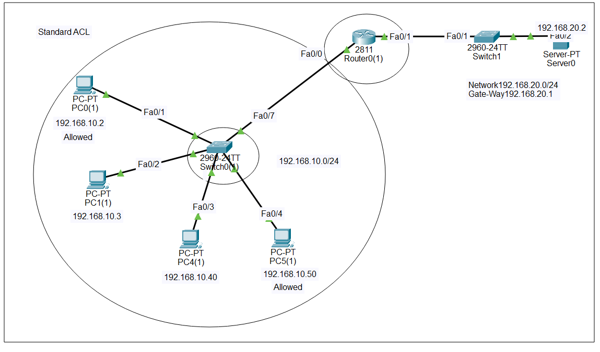
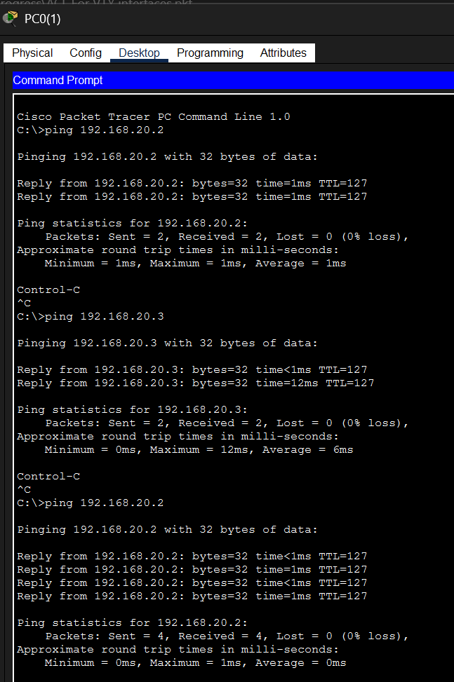
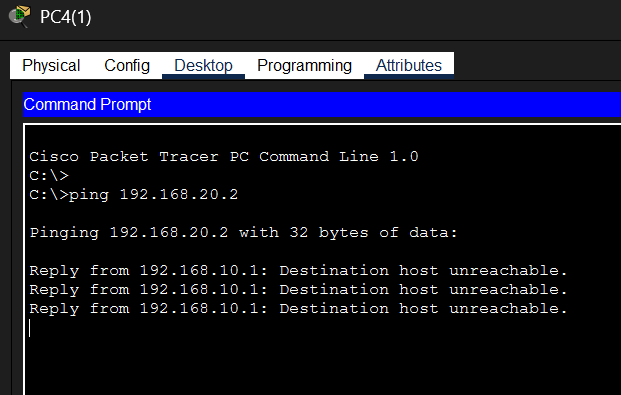
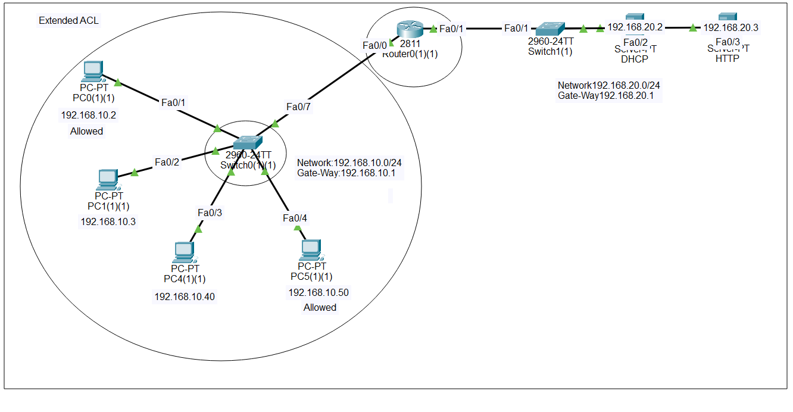
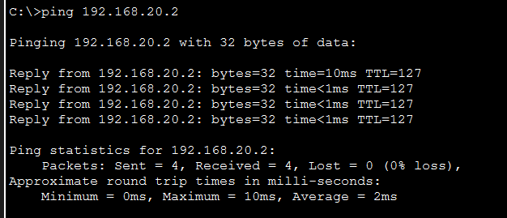
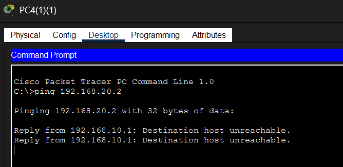
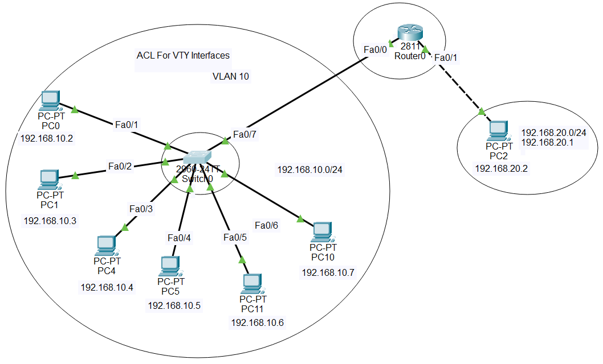
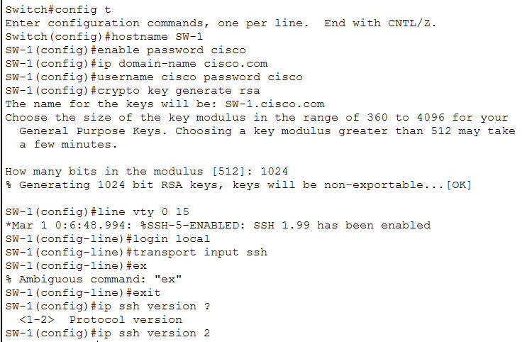
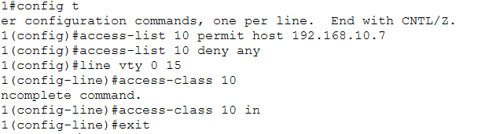

# 🔐 Access Control Lists (ACL) - Security Implementation

<div align="center">


**A Complete Guide to Network Security using Access Control Lists**

[](.)
[](.)

[📖 Overview](#-overview) • [🎯 Standard ACL](#-standard-acl) • [🚀 Extended ACL](#-extended-acl) • [🔐 VTY Security](#-acl-for-vty-interfaces)

</div>

---

## 📖 Overview

**Access Control Lists (ACLs)** are the backbone of network security. They determine:
- ✅ Which traffic is **allowed**
- ❌ Which traffic is **blocked**
- 🔒 Who can **access** network devices

This repository covers **3 types of ACL implementations**:
1. **Standard ACL** - Source-based filtering
2. **Extended ACL** - Advanced protocol & port-based filtering  
3. **VTY ACL** - SSH/Telnet remote access security

---

## 📚 Table of Contents

- [🎯 Standard ACL](#-standard-acl)
  - [Concept](#concept)
  - [Lab Implementation](#lab-implementation---standard-acl)
  - [Configuration](#configuration-commands)
  - [Results](#results---standard-acl)
- [🚀 Extended ACL](#-extended-acl)
  - [Concept](#concept-1)
  - [Lab Implementation](#lab-implementation---extended-acl)
  - [Configuration](#configuration-commands-1)
  - [Results](#results---extended-acl)
- [🔐 ACL for VTY Interfaces](#-acl-for-vty-interfaces)
  - [Concept](#concept-2)
  - [Lab Implementation](#lab-implementation---vty-acl)
  - [Configuration](#configuration-commands-2)
  - [Results](#results---vty-acl)
- [📝 Quick Reference](#-quick-reference)

---

## 🎯 Standard ACL

### Concept

<div align="center">

| Feature | Details |
|---------|---------|
| **Full Form** | Access Control List |
| **Type** | Source-based filtering |
| **Checks** | ✅ Source IP only |
| **Doesn't Check** | ❌ Destination IP, Protocol, Port |
| **Numbering** | 1-99, 1300-1999 |
| **Best Practice** | Apply near **DESTINATION** |

</div>

### 🔑 Key Points:

**Access Control List (ACL)** is a security filter that decides which traffic is allowed and which is blocked.

#### Standard ACL = SOURCE IP based filtering
- ✅ Only checks **source address**
- ❌ Does **NOT** check destination address
- 🎯 Controls **WHO** can pass through router/switch

#### 🔢 Numbering Range:
```
Standard ACL: 1-99 and 1300-1999
```

#### 📍 Where to Apply:
```
Apply NEAR DESTINATION
(Where traffic is RECEIVED)
```

#### 💻 Basic Syntax:
```cisco
access-list <number> <permit|deny> <source-ip> <wildcard-mask>
```

#### 🎭 Wildcard Mask Rules:
| Value | Meaning | Example |
|-------|---------|---------|
| **0** | Must match exactly | 0.0.0.0 = exact IP |
| **255** | Can be anything (ignore) | 0.0.0.255 = any host in subnet |

#### ⛔ Implicit Deny:
```
⚠️ IMPORTANT: Automatic "deny any" at the end
If not explicitly ALLOWED, it's BLOCKED!
```

---

### Lab Implementation - Standard ACL

#### 📊 Network Topology:

<p align="center">
  
</p>

#### 🎯 Scenario:

> **Objective:** Only 2 specific hosts are allowed to pass through the router and reach the server.
>
> **Rule:** If any other PC (other than these 2) tries to reach the server, they **CAN'T**.

#### 🔍 How it Works:

```
✅ Checks: SOURCE IP (PC's IP address)
❌ Doesn't Check: DESTINATION IP (Server's IP)
```

---

### Configuration Commands

```cisco
! Standard ACL Configuration
Router> enable
Router# configure terminal

! Create ACL to allow only specific hosts
Router(config)# access-list 10 permit 192.168.10.10 0.0.0.0
Router(config)# access-list 10 permit 192.168.10.11 0.0.0.0
Router(config)# access-list 10 deny any

! Apply ACL on interface (near destination)
Router(config)# interface gigabitEthernet 0/1
Router(config-if)# ip access-group 10 out
Router(config-if)# exit

! Verify Configuration
Router# show access-lists
Router# show ip interface gigabitEthernet 0/1
```

#### 📝 Explanation:
```
Lines 1-2: Allow only 2 specific IPs
Line 3: Deny everything else (optional, already implicit)
Lines 4-5: Apply ACL on interface (OUTBOUND direction)
```

---

### Results - Standard ACL

#### ✅ Allowed Traffic (Authorized PCs):

<p align="center">
  
</p>

**Result:** ✅ Packets successfully reach the server

---

#### ❌ Blocked Traffic (Unauthorized PCs):

<p align="center">
  
</p>

**Result:** ❌ Packets are denied by the ACL

---

## 🚀 Extended ACL

### Concept

<div align="center">

| Feature | Details |
|---------|---------|
| **Type** | Advanced filtering |
| **Checks** | ✅ Source + Destination IP |
| | ✅ Protocol (TCP/UDP/ICMP) |
| | ✅ Port Numbers (80, 22, 21) |
| **Numbering** | 100-199, 2000-2699 |
| **Best Practice** | Apply near **SOURCE** |

</div>

### 🔑 Key Points:

#### Extended ACL = More POWERFUL than Standard!

**What it checks:**
1. ✅ **SOURCE IP** - Where traffic comes from
2. ✅ **DESTINATION IP** - Where traffic goes to
3. ✅ **PROTOCOL** - TCP, UDP, ICMP, etc.
4. ✅ **PORT NUMBER** - HTTP=80, SSH=22, FTP=21, etc.

#### 🔢 Numbering Range:
```
Extended ACL: 100-199 and 2000-2699
```

#### 📍 Where to Apply:
```
Apply NEAR SOURCE
(Where traffic STARTS)
```

#### 🔌 Port Keywords:

| Keyword | Meaning | Example |
|---------|---------|---------|
| **eq** | Equal to (exact port) | `eq 80` = HTTP |
| **gt** | Greater than | `gt 1024` = ports > 1024 |
| **lt** | Less than | `lt 1024` = ports < 1024 |
| **range** | Port range | `range 20 21` = FTP |

#### 🌐 Common Protocols:

| Protocol | Usage | Example |
|----------|-------|---------|
| **tcp** | Web, Email, SSH, FTP | Reliable connection |
| **udp** | DNS, DHCP, TFTP | Fast, no guarantee |
| **icmp** | Ping, Traceroute | Network diagnostics |
| **ip** | All protocols | Any traffic |

---

### Lab Implementation - Extended ACL

#### 📊 Network Topology:

<p align="center">
  
</p>

#### 🎯 Scenario:

> **Objective:** Allow specific traffic based on protocol and port numbers.
>
> **Example:** Allow only HTTP traffic from Network A to Network B, block everything else.

---

### Configuration Commands

```cisco
! Extended ACL Configuration
Router> enable
Router# configure terminal

! Create Extended ACL
Router(config)# access-list 100 permit tcp 192.168.10.0 0.0.0.255 192.168.20.0 0.0.0.255 eq 80
Router(config)# access-list 100 permit tcp 192.168.10.0 0.0.0.255 192.168.20.0 0.0.0.255 eq 443
Router(config)# access-list 100 permit icmp any any
Router(config)# access-list 100 deny ip any any

! Apply ACL on interface (near source)
Router(config)# interface gigabitEthernet 0/0
Router(config-if)# ip access-group 100 in
Router(config-if)# exit

! Verify Configuration
Router# show access-lists 100
Router# show ip interface gigabitEthernet 0/0
```

#### 📝 Explanation:
```
Line 1: Allow HTTP (port 80) traffic
Line 2: Allow HTTPS (port 443) traffic
Line 3: Allow ICMP (ping)
Line 4: Deny everything else
Lines 5-6: Apply ACL on interface (INBOUND direction)
```

---

### Results - Extended ACL

#### ✅ Allowed Traffic (HTTP/HTTPS):

<p align="center">
  
</p>

**Testing from PC(1)(1):**
- ✅ HTTP traffic successfully passes
- ✅ ICMP (ping) works

---

#### ❌ Blocked Traffic (Other protocols/ports):

<p align="center">
  
</p>

**Result:** ❌ Unauthorized protocols/ports are denied

---

## 🔐 ACL for VTY Interfaces

### Concept

<div align="center">

| Feature | Details |
|---------|---------|
| **VTY** | Virtual Teletype Lines |
| **Purpose** | Remote access security (SSH/Telnet) |
| **Control** | WHO can remotely access device |
| **Command** | `access-class` (not access-group) |
| **ACL Type** | Standard ACL (1-99) |

</div>

### 🔑 Key Points:

#### What is VTY?

**VTY = Virtual Teletype Lines**

- 🖥️ Virtual lines used for **remote access**
- 🔐 Access router/switch via **SSH** or **Telnet**
- 🎯 ACL controls **WHICH IP** can access

#### What does ACL for VTY mean?

When you apply ACL on VTY, you control:
```
✅ Which IP address can remotely access router/switch
❌ Unauthorized IPs are blocked
🔒 Security is greatly enhanced!
```

#### 💻 Basic Syntax:
```cisco
access-list 10 permit 192.168.1.5
access-list 10 deny any
line vty 0 4
 access-class 10 in
```

#### 📌 SSH/Telnet vs ACL - The Difference:

<div align="center">

| Component | Role |
|-----------|------|
| **Standard ACL** | WHO can access? (Permission control) |
| **SSH/Telnet** | Remote access tool |
| **VTY Lines** | Virtual lines for remote connection |
| **access-class** | Applies ACL to VTY |

</div>

```
🎯 KEY POINT:
Standard ACL = WHO can access?
SSH = Remote access method
ACL controls WHO can use SSH!
```

---

### Lab Implementation - VTY ACL

#### 📊 Network Setup:

<p align="center">
  
</p>

**Using VLAN 1 as default**

---

#### Step 1: Configure SSH & Setup Password

<p align="center">
  
</p>

```cisco
! SSH Basic Configuration
Router(config)# hostname R1
Router(config)# ip domain-name cisco.com
Router(config)# crypto key generate rsa
! (Choose 1024 bits)
Router(config)# username admin privilege 15 secret cisco123
Router(config)# line vty 0 4
Router(config-line)# transport input ssh
Router(config-line)# login local
Router(config-line)# exit
```

#### ⚠️ Problem:
**Can be accessed by EVERY PC!**

> Without ACL, any IP can SSH to the router - **Security Risk!** 🚨

---

#### Step 2: Setting up ACL (Solution)

<p align="center">
  
</p>

**NOW: Only PC10 will be able to access it**

```cisco
! Create Standard ACL for VTY
Router(config)# access-list 10 permit 192.168.1.10
Router(config)# access-list 10 deny any

! Apply ACL to VTY lines
Router(config)# line vty 0 4
Router(config-line)# access-class 10 in
Router(config-line)# exit

! Verify
Router# show line vty 0 4
Router# show access-lists 10
```

#### 📝 Explanation:
```
Line 1: Allow only PC10 (192.168.1.10)
Line 2: Deny everything else
Lines 3-4: Apply ACL to VTY lines
NOTE: Use "access-class", not "access-group"!
```

---

### Configuration Commands

```cisco
! ========================================
! COMPLETE VTY ACL CONFIGURATION
! ========================================

! Step 1: SSH Setup
Router> enable
Router# configure terminal
Router(config)# hostname R1
Router(config)# ip domain-name cisco.com
Router(config)# crypto key generate rsa
How many bits in the modulus [512]: 1024
Router(config)# username admin privilege 15 secret cisco123

! Step 2: VTY Configuration (without ACL)
Router(config)# line vty 0 4
Router(config-line)# transport input ssh
Router(config-line)# login local
Router(config-line)# exit

! Step 3: Create ACL for Security
Router(config)# access-list 10 permit 192.168.1.10
Router(config)# access-list 10 deny any

! Step 4: Apply ACL to VTY
Router(config)# line vty 0 4
Router(config-line)# access-class 10 in
Router(config-line)# exit
Router(config)# exit

! Verification Commands
Router# show running-config | section line vty
Router# show access-lists 10
Router# show line vty 0 4
Router# show ip ssh
```

---

### Results - VTY ACL

#### ❌ Testing from Different PC (Blocked):

<p align="center">
  
</p>

**Result:**
```
❌ Connection refused
❌ Access denied by ACL
❌ "Access denied" message appears
```

---

#### ✅ Testing from PC10 (Allowed):

<p align="center">
  
</p>

**Result:**
```
✅ SSH connection successful
✅ Login prompt appears
✅ User can access router CLI
```

---

## 📝 Quick Reference

### 📊 ACL Types Comparison

| Feature | Standard ACL | Extended ACL | VTY ACL |
|---------|-------------|--------------|---------|
| **Checks** | Source IP only | Source + Dest + Protocol + Port | Source IP only |
| **Numbering** | 1-99, 1300-1999 | 100-199, 2000-2699 | 1-99 (Standard) |
| **Apply Where** | Near destination | Near source | VTY lines |
| **Command** | `ip access-group` | `ip access-group` | `access-class` |
| **Use Case** | Basic filtering | Advanced filtering | Remote access control |

---

### 🔧 Common Commands

#### Standard ACL:
```cisco
access-list 10 permit 192.168.1.0 0.0.0.255
access-list 10 deny any
interface gi0/0
 ip access-group 10 out
```

#### Extended ACL:
```cisco
access-list 100 permit tcp any any eq 80
access-list 100 deny ip any any
interface gi0/0
 ip access-group 100 in
```

#### VTY ACL:
```cisco
access-list 10 permit 192.168.1.10
line vty 0 4
 access-class 10 in
```

#### Verification:
```cisco
show access-lists
show ip access-lists
show running-config | include access-list
show line vty 0 4
```

#### Remove ACL:
```cisco
no access-list 10
interface gi0/0
 no ip access-group 10 in
```

---

### 🎯 Best Practices

| # | Best Practice | Reason |
|---|---------------|--------|
| 1️⃣ | Apply Standard ACL near destination | Only checks source, apply at destination |
| 2️⃣ | Apply Extended ACL near source | Filter early, save bandwidth |
| 3️⃣ | Specific to general rules | Top-to-bottom processing, specific first |
| 4️⃣ | Document your ACLs | Easy future troubleshooting |
| 5️⃣ | Test before production | Always test in lab first |
| 6️⃣ | Use named ACLs for complex scenarios | Easier to manage and understand |

---

### 📚 Wildcard Mask Examples

| Subnet Mask | Wildcard Mask | Meaning |
|------------|---------------|---------|
| 255.255.255.255 | 0.0.0.0 | Single host |
| 255.255.255.0 | 0.0.0.255 | /24 network (256 hosts) |
| 255.255.0.0 | 0.0.255.255 | /16 network |
| 255.0.0.0 | 0.255.255.255 | /8 network |
| 0.0.0.0 | 255.255.255.255 | Any host (all) |

**Formula:** `Wildcard = 255.255.255.255 - Subnet Mask`

---

---

## 🎓 What I Learned

✅ **Standard ACL** - Complete implementation of source IP-based filtering  
✅ **Extended ACL** - Advanced security with protocol and port-based filtering  
✅ **VTY ACL** - Securing SSH/Telnet remote access  
✅ **Wildcard Masks** - Understanding 0 = match, 255 = ignore  
✅ **Implicit Deny** - Importance of automatic deny any at the end  
✅ **Best Practices** - ACL placement strategies (source vs destination)  
✅ **Troubleshooting** - Verifying and debugging access-lists  

---

## 📞 Connect With Me

<div align="center">

[](mailto:a.wahid7860668@gmail.com)
[](https://www.linkedin.com/in/abdul-wahid022)
[](https://github.com/abdul-wahid022)

**💬 Questions? Need Packet Tracer files? Feel free to reach out!**

</div>

---

## 📄 License

This project is created for **educational purposes** and is open-source.

---

<div align="center">

### ⭐ If you found this helpful, please give it a star!

**Made by ABDUL WAHID**

*Last Updated: January 2026*

</div>

