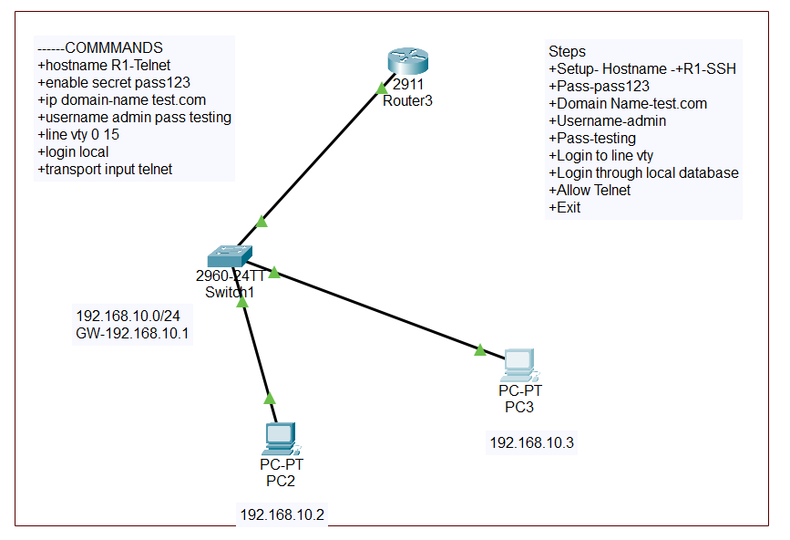
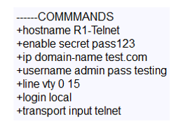
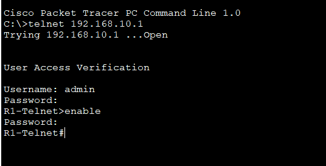
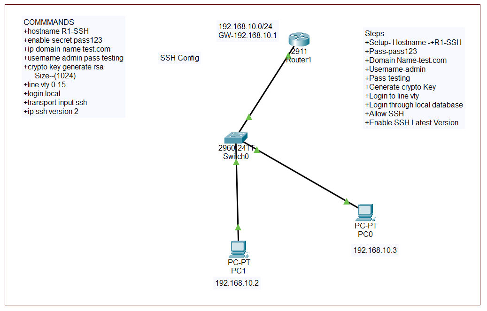
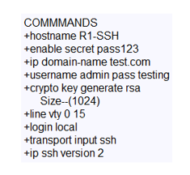
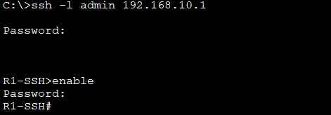

# 🔐 SSH & Telnet - Remote Access Protocols

<div align="center">


**Complete Guide to Remote Device Management**

[](.)
[](.)
[](.)

[📖 Overview](#-overview) • [📞 Telnet](#-telnet) • [🔒 SSH](#-ssh) • [📊 Comparison](#-ssh-vs-telnet) • [📝 Quick Reference](#-quick-reference)

</div>

---

## 📖 Overview

**SSH (Secure Shell)** and **Telnet** are protocols used for remote device management. Both allow administrators to access and configure network devices from anywhere.

### Key Features:

| Feature | Telnet | SSH |
|---------|--------|-----|
| **Port** | 23 | 22 |
| **Encryption** | ❌ No (Plain text) | ✅ Yes (Encrypted) |
| **Security** | ❌ Low | ✅ High |
| **Authentication** | Password only | Password + Keys |
| **Modern Use** | ❌ Deprecated | ✅ Standard |

---

## 📚 Table of Contents

- [📞 Telnet](#-telnet)
  - [Concept](#concept)
  - [Configuration](#configuration---telnet)
  - [Testing](#testing---telnet)
- [🔒 SSH](#-ssh)
  - [Concept](#concept-1)
  - [Configuration](#configuration---ssh)
  - [Testing](#testing---ssh)
- [📊 SSH vs Telnet](#-ssh-vs-telnet)
- [📝 Quick Reference](#-quick-reference)

---

## 📞 Telnet

### Concept

<div align="center">

| Feature | Details |
|---------|---------|
| **Full Name** | Telecommunication Network |
| **Port** | 23 (TCP) |
| **Encryption** | None (Plain text) |
| **Security Level** | Low ❌ |
| **Use Case** | Legacy systems, lab environments only |

</div>

### What is Telnet?

**Telnet** is a protocol that allows remote terminal access to network devices.

#### How It Works:
```
Administrator's PC
        ↓
   Telnet Client
        ↓
    Network
        ↓
  Router/Switch (Telnet Server)
        ↓
   CLI Access Granted
```

#### Real-Life Example:
```
Think of Telnet like sending a postcard:

Message: "username: admin, password: cisco123"
Problem: Anyone can read it! ❌

Postman (hacker) can see:
✓ Your username
✓ Your password
✓ All your commands

No privacy = Security risk!
```

---

### Security Issues

**Major Problems with Telnet:**

```
1. No Encryption:
   Username: admin ← Visible to attackers
   Password: cisco123 ← Visible to attackers
   Commands: show running-config ← Visible to attackers

2. Packet Sniffing:
   Hacker uses Wireshark → Captures all traffic
   Sees everything in plain text ❌

3. Man-in-the-Middle:
   Attacker intercepts connection
   Can modify commands
   Complete control!
```

**Wireshark Capture Example:**
```
Telnet Session Captured:
├─ Username: admin
├─ Password: cisco123
├─ Command: configure terminal
└─ Command: show running-config

Everything visible! ❌
```

---

### When to Use Telnet?

```
✓ Lab environments (practice only)
✓ Isolated networks (no internet connection)
✓ Legacy devices (no SSH support)

❌ NEVER use on production networks!
❌ NEVER use over the internet!
❌ NEVER use for sensitive data!
```

---

### Lab Implementation - Telnet

#### 📊 Network Topology:

<p align="center">
  
</p>

**Network Design:**
```
[PC] ← Telnet → [Router/Switch]
      Port 23
   (Unsecured)
```

---

### Configuration - Telnet

<p align="center">
  
</p>

**Commands from topology:**

```cisco
! Telnet Configuration
Router> enable
Router# configure terminal

! Step 1: Set hostname
Router(config)# hostname R1-Telnet

! Step 2: Set enable password
Router(config)# enable secret pass123

! Step 3: Set domain name
Router(config)# ip domain-name test.com

! Step 4: Create username
Router(config)# username admin password testing

! Step 5: Configure VTY lines
Router(config)# line vty 0 15
Router(config-line)# login
Router(config-line)# transport input telnet
Router(config-line)# exit
Router(config)# exit

! Save configuration
Router# write
```

---

### Command Explanation

**1. hostname R1-Telnet:**
```cisco
Router(config)# hostname R1-Telnet
```
```
Purpose: Sets device name
Result: Prompt changes to R1-Telnet(config)#
```

**2. enable secret pass123:**
```cisco
Router(config)# enable secret pass123
```
```
Purpose: Password for privileged EXEC mode
Password: pass123
Type: Encrypted (secret, not password)
```

**3. ip domain-name test.com:**
```cisco
Router(config)# ip domain-name test.com
```
```
Purpose: Sets domain name
FQDN: R1-Telnet.test.com
```

**4. username admin password testing:**
```cisco
Router(config)# username admin password testing
```
```
Username: admin
Password: testing
Used for: Local authentication
```

**5. line vty 0 15:**
```cisco
Router(config)# line vty 0 15
```
```
VTY Lines: 0 through 15 (16 simultaneous connections)
More than standard 0-4
```

**6. login:**
```cisco
Router(config-line)# login
```
```
Purpose: Enables password checking
Uses: Line password (if set) or local database
```

**7. transport input telnet:**
```cisco
Router(config-line)# transport input telnet
```
```
Purpose: Allow only Telnet connections
Blocks: SSH access
```

---

### Testing - Telnet

<p align="center">
  
</p>

**From PC - Accessing Router via Telnet:**

```
PC> telnet 192.168.1.1

Trying 192.168.1.1...
Connected to 192.168.1.1

User Access Verification

Password: [press enter - no password set on line]

R1-Telnet>
```

**Enter privileged mode:**
```
R1-Telnet> enable
Password: [pass123]
R1-Telnet#
```

**Now you can configure:**
```
R1-Telnet# configure terminal
R1-Telnet(config)# interface gigabitEthernet 0/0
R1-Telnet(config-if)# ip address 10.0.0.1 255.255.255.0
R1-Telnet(config-if)# exit
R1-Telnet(config)# exit
R1-Telnet# write
```

**Result:** ✅ Telnet connection successful, remote access working

---

## 🔒 SSH

### Concept

<div align="center">

| Feature | Details |
|---------|---------|
| **Full Name** | Secure Shell |
| **Port** | 22 (TCP) |
| **Encryption** | Strong (AES, 3DES) |
| **Security Level** | High ✅ |
| **Use Case** | Production networks, all modern systems |

</div>

### What is SSH?

**SSH** is a secure protocol for remote device management with encryption.

#### How It Works:
```
Administrator's PC
        ↓
   SSH Client (Encrypted)
        ↓
    Network
        ↓
  Router/Switch (SSH Server)
        ↓
   Secure CLI Access ✓
```

#### Real-Life Example:
```
SSH is like sending a sealed envelope:

Message: "username: admin, password: cisco123"
Envelope: Locked with encryption ✅

Even if intercepted:
✗ Hacker sees: "kj#$%^&*()_+hfklsdj"
✗ Cannot read username
✗ Cannot read password
✗ Cannot see commands

Complete privacy! ✓
```

---

### SSH Security Features

**Why SSH is Secure:**

```
1. Encryption:
   Username: admin → Encrypted: x8#kL9$mP2
   Password: cisco123 → Encrypted: q4&Hy7!Zn1
   All traffic encrypted ✅

2. Packet Sniffing Protection:
   Hacker uses Wireshark → Sees encrypted data
   Cannot decode anything ✓

3. Authentication Methods:
   ├─ Password-based
   ├─ Key-based (more secure)
   └─ Two-factor (most secure)

4. Data Integrity:
   Detects if data modified
   Prevents man-in-the-middle attacks
```

---

### SSH Requirements

**Prerequisites for SSH:**

```
1. Hostname must be set
   Router(config)# hostname R1

2. Domain name must be set
   Router(config)# ip domain-name cisco.com

3. RSA keys must be generated
   Router(config)# crypto key generate rsa
   
4. Username/password must be created
   Router(config)# username admin secret cisco123

5. VTY lines must allow SSH
   Router(config-line)# transport input ssh
```

**Why these requirements?**
```
Hostname + Domain = FQDN (Fully Qualified Domain Name)
Example: R1.cisco.com

FQDN needed for generating RSA keys
RSA keys needed for encryption
```

---

### Lab Implementation - SSH

#### 📊 Network Topology:

<p align="center">
  
</p>

**Network Design:**
```
[PC] ← SSH → [Router/Switch]
     Port 22
  (Encrypted) ✅
```

---

### Configuration - SSH

<p align="center">
  
</p>

**Commands from topology:**

```cisco
! SSH Configuration
Router> enable
Router# configure terminal

! Step 1: Setup - Hostname
Router(config)# hostname R1-SSH

! Step 2: Set enable password
Router(config)# enable secret pass123

! Step 3: Set domain name
Router(config)# ip domain-name test.com

! Step 4: Create username
Router(config)# username admin password testing

! Step 5: Generate crypto key
Router(config)# crypto key generate rsa
How many bits in the modulus [512]: 1024

! Step 6: Configure VTY lines
Router(config)# line vty 0 15
Router(config-line)# login local
Router(config-line)# transport input ssh
Router(config-line)# exit

! Step 7: Enable SSH version 2
Router(config)# ip ssh version 2
Router(config)# exit

! Save configuration
Router# write
```

---

### Command Explanation

**Step 1: Hostname**
```cisco
Router(config)# hostname R1-SSH
```
```
Purpose: Identifies the router
Required: Yes (for FQDN and SSH)
Result: Prompt changes to R1-SSH(config)#
```

**Step 2: Enable Secret**
```cisco
Router(config)# enable secret pass123
```
```
Purpose: Encrypted password for privileged mode
Password: pass123
Type: secret (encrypted, not plain text)
```

**Step 3: Domain Name**
```cisco
Router(config)# ip domain-name test.com
```
```
Purpose: Creates FQDN (R1-SSH.test.com)
Required: Yes (for RSA key generation)
FQDN = Hostname + Domain
```

**Step 4: Create Username**
```cisco
Router(config)# username admin password testing
```
```
Username: admin
Password: testing
Purpose: Local user authentication for SSH
```

**Step 5: Generate RSA Keys**
```cisco
Router(config)# crypto key generate rsa
How many bits in the modulus [512]: 1024
```
```
Purpose: Creates encryption keys for SSH
Key size: 1024 bits
Result: SSH becomes enabled

Output:
% Generating 1024 bit RSA keys, keys will be non-exportable...
[OK]
```

**Step 6: VTY Lines Configuration**
```cisco
Router(config)# line vty 0 15
Router(config-line)# login local
Router(config-line)# transport input ssh
```
```
line vty 0 15: 16 simultaneous connections
login local: Use local username database
transport input ssh: Only SSH allowed (blocks Telnet)
```

**Step 7: SSH Version 2**
```cisco
Router(config)# ip ssh version 2
```
```
Purpose: Enable SSHv2 (more secure than v1)
Recommended: Always use version 2
```

---

### Testing - SSH

<p align="center">
  
</p>

**From PC - Accessing Router via SSH:**

```
PC> ssh -l admin 192.168.1.1

Password: [testing]

R1-SSH>
```

**Enter privileged mode:**
```
R1-SSH> enable
Password: [pass123]
R1-SSH#
```

**Now you can configure:**
```
R1-SSH# configure terminal
R1-SSH(config)# interface gigabitEthernet 0/0
R1-SSH(config-if)# ip address 10.0.0.1 255.255.255.0
R1-SSH(config-if)# exit
R1-SSH(config)# exit
R1-SSH# write
```

**Result:** ✅ SSH connection successful, encrypted remote access working

---

### SSH Verification Commands

```cisco
! Check if SSH is enabled
Router# show ip ssh

! Check active sessions
Router# show users

! Check VTY line configuration
Router# show running-config | include line vty
```

**Note:** Some advanced show commands may not work in Packet Tracer.

---

## 📊 SSH vs Telnet

### Detailed Comparison

<div align="center">

| Feature | Telnet | SSH |
|---------|--------|-----|
| **Port** | 23 | 22 |
| **Encryption** | ❌ None | ✅ Strong (AES, 3DES) |
| **Data Transmission** | Plain text | Encrypted |
| **Security** | ❌ Very low | ✅ High |
| **Password Visibility** | ❌ Visible in traffic | ✅ Encrypted |
| **Authentication** | Password only | Password + Keys + 2FA |
| **Configuration** | Simple (3 commands) | Complex (6+ commands) |
| **Requirements** | Just password | Hostname, domain, keys, user |
| **Modern Use** | ❌ Deprecated | ✅ Industry standard |
| **Hacking Protection** | ❌ None | ✅ Strong |
| **Compliance** | ❌ Fails audits | ✅ Passes audits |
| **Recommended** | ❌ No | ✅ Yes |

</div>

---

### Visual Security Comparison

**Telnet (Unsecured):**
```
PC → Router

What hacker sees with packet sniffer:
├─ Username: admin ← Visible! ❌
├─ Password: cisco123 ← Visible! ❌
├─ Command: show running-config ← Visible! ❌
└─ Output: [entire config] ← Visible! ❌

Security: NONE
```

**SSH (Secured):**
```
PC → Router

What hacker sees with packet sniffer:
├─ Random data: kj#$%^&*()_+ ← Encrypted ✓
├─ Random data: q4&Hy7!Zn1x8 ← Encrypted ✓
├─ Random data: mP2L9$kL9$mP ← Encrypted ✓
└─ Cannot decode anything! ← Encrypted ✓

Security: STRONG
```

---

### Real-World Analogy

**Telnet = Shouting Across Room:**
```
You: "Hey guard! Password is CISCO123!"
Everyone hears it ❌

Problem:
├─ No privacy
├─ Anyone can hear
└─ Easy to steal password
```

**SSH = Whispering in Sealed Room:**
```
You: [Whisper encrypted]
Only intended person understands ✓

Benefits:
├─ Complete privacy
├─ No one else can hear
└─ Password protected
```

---

### When to Use Which?

**Use Telnet:**
```
⚠️ Lab environment only
⚠️ Isolated network (no internet)
⚠️ Legacy device with no SSH support
⚠️ Quick testing in controlled environment

NEVER in production! ❌
```

**Use SSH:**
```
✅ All production networks
✅ Remote management over internet
✅ Any sensitive configuration
✅ Compliance requirements
✅ Industry best practice
✅ All modern equipment

ALWAYS preferred! ✓
```

---

## 📝 Quick Reference

### Configuration Templates

#### Telnet Configuration:
```cisco
! Telnet Setup (Exact Commands)
Router> enable
Router# configure terminal
Router(config)# hostname R1-Telnet
Router(config)# enable secret pass123
Router(config)# ip domain-name test.com
Router(config)# username admin password testing
Router(config)# line vty 0 15
Router(config-line)# login
Router(config-line)# transport input telnet
Router(config-line)# exit
Router(config)# exit
Router# write
```

#### SSH Configuration:
```cisco
! SSH Setup (Exact Commands)
Router> enable
Router# configure terminal
Router(config)# hostname R1-SSH
Router(config)# enable secret pass123
Router(config)# ip domain-name test.com
Router(config)# username admin password testing
Router(config)# crypto key generate rsa
[Enter 1024]
Router(config)# line vty 0 15
Router(config-line)# login local
Router(config-line)# transport input ssh
Router(config-line)# exit
Router(config)# ip ssh version 2
Router(config)# exit
Router# write
```

---

### Access Commands

#### Telnet Access (from PC):
```
PC> telnet [IP-address]
PC> telnet 192.168.1.1
```
```
No password on VTY line in our config
Enable password: pass123
```

#### SSH Access (from PC):
```
PC> ssh -l [username] [IP-address]
PC> ssh -l admin 192.168.1.1
```
```
Username: admin
Password: testing
Enable password: pass123
```

---

### Verification Commands

**Basic Commands (Work in Packet Tracer):**
```cisco
show running-config
show ip ssh
show users
```

**Check VTY Configuration:**
```cisco
show running-config | include line vty
```

---

### Troubleshooting Guide

| Issue | Possible Cause | Solution |
|-------|---------------|----------|
| **Telnet: Connection refused** | VTY not configured | Configure line vty 0 15 |
| | transport not set | Add `transport input telnet` |
| **SSH: Connection refused** | SSH not fully configured | Complete all 7 SSH steps |
| | RSA keys not generated | Generate crypto keys (1024 bits) |
| | Domain name missing | Set `ip domain-name test.com` |
| **SSH: Access denied** | Wrong username/password | Use admin/testing |
| | login local not set | Add `login local` to vty |
| **RSA key generation fails** | No hostname set | Configure hostname first |
| | No domain name | Set domain name before keys |
| **Can't enter enable mode** | Wrong enable password | Use pass123 |

---

### Security Best Practices

**1. Always Use SSH (Never Telnet):**
```
SSH provides encryption = Security ✓
Telnet has no encryption = Risk ❌
```

**2. Use Strong Passwords:**
```
Weak: cisco, admin, 123456 ❌
Strong: C!sc0@2024#Secure ✓

Include:
├─ Uppercase letters
├─ Lowercase letters
├─ Numbers
└─ Special characters
```

**3. Use 'secret' not 'password':**
```
enable password cisco ← Plain text ❌
enable secret cisco ← Encrypted ✓

Always use 'secret' for better security!
```

**4. Limit VTY Access with ACL:**
```cisco
! Only allow specific IPs to SSH
access-list 10 permit 192.168.1.0 0.0.0.255
line vty 0 4
 access-class 10 in
```

**5. Set Timeout:**
```cisco
! Disconnect idle sessions
line vty 0 4
 exec-timeout 5 0
```
```
5 0 = 5 minutes, 0 seconds
After 5 min idle → Auto disconnect
```

**6. Use SSH Version 2:**
```cisco
ip ssh version 2
```
```
SSHv1 has vulnerabilities ❌
SSHv2 is secure ✓
```

**7. Increase Key Size:**
```cisco
crypto key generate rsa
How many bits: 2048
```
```
Higher bits = More secure
Recommended: 2048 or 4096
```

---

### Important Points

**1. VTY Lines:**
```
line vty 0 15 = 16 simultaneous connections
(Not the standard 0-4)
More connections allowed
```

**2. Credentials Used:**
```
Hostname: R1-SSH / R1-Telnet
Domain: test.com
Username: admin
Password: testing
Enable: pass123
```

**3. SSH Requirements (Must follow order):**
```
Step 1: hostname R1-SSH
Step 2: ip domain-name test.com
Step 3: crypto key generate rsa (1024)
Step 4: username admin password testing
Step 5: line vty 0 15 → login local
Step 6: transport input ssh
Step 7: ip ssh version 2
```

**4. Authentication:**
```
Telnet: login → No password set on line
SSH: login local → Uses username admin/testing
```

**5. Transport Input:**
```
Telnet: transport input telnet
SSH: transport input ssh
Both commands explicitly set!
```

---


---

## 🎓 What I Learned

✅ **Telnet Basics** - Remote access protocol (unsecured)  
✅ **SSH Fundamentals** - Secure remote access with encryption  
✅ **Security Differences** - Why SSH is essential for production  
✅ **Configuration** - Complete setup for both protocols  
✅ **VTY Lines** - Virtual terminal configuration  
✅ **Authentication** - Password vs local user database  
✅ **RSA Keys** - Encryption key generation for SSH  
✅ **Best Practices** - Industry-standard security measures  
✅ **Troubleshooting** - Common issues and solutions  

---

## 🚀 How to Use This Repository

1. **Clone the repository:**
   ```bash
   git clone https://github.com/your-username/SSH-Telnet-Implementation.git
   ```

2. **Study both protocols:**
   - Understand Telnet (for learning only)
   - Master SSH (for production use)
   - Know security differences

3. **Practice in lab:**
   - Configure Telnet (lab only)
   - Configure SSH (recommended)
   - Test remote access

4. **Security awareness:**
   - Never use Telnet in production
   - Always use SSH for real networks
   - Implement access controls

---
## 📞 Connect With Me

<div align="center">

[](mailto:a.wahid7860668@gmail.com)
[](https://www.linkedin.com/in/abdul-wahid022)
[](https://github.com/abdul-wahid022)

**💬 Questions? Need Packet Tracer files? Feel free to reach out!**

</div>

---

## 📄 License

This project is created for **educational purposes** and is open-source.

---

<div align="center">

### ⭐ If you found this helpful, please give it a star!

**Made with 💙 by ABDUL WAHID**

*Last Updated: January 2026*

</div>

