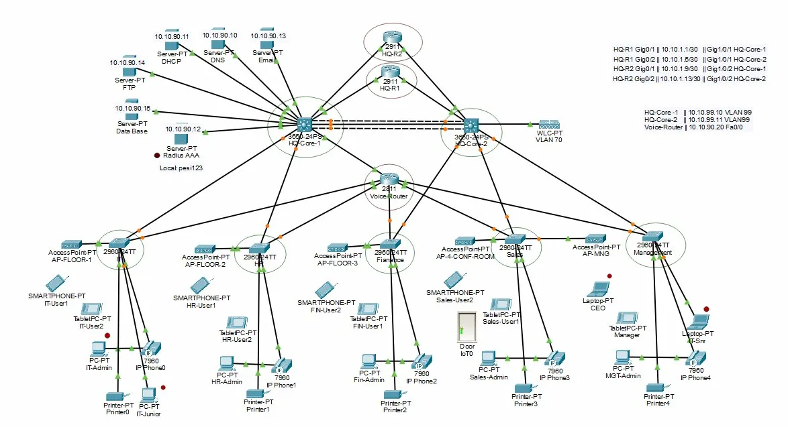

# 🏢 Project 3: Head Quarter Network

<div align="center">


**A Complete Enterprise Headquarters Network Infrastructure**

[🏠 Back to Main Portfolio](README.md)

</div>

---

## 📖 Table of Contents

- [Overview](#-overview)
- [Network Topology](#-network-topology)
- [Project Specifications](#-project-specifications)
- [Network Architecture](#-network-architecture)
- [Department Details](#-department-details)
- [Server Infrastructure](#-server-infrastructure)
- [VoIP Implementation](#-voip-implementation)
- [Wireless Network](#-wireless-network)
- [Configuration](#-configuration)
- [Learning Outcomes](#-learning-outcomes)

---

## 🎯 Overview

The **Head Quarter Network** is a comprehensive enterprise-grade infrastructure supporting 5 departments with complete server infrastructure, VoIP integration, and wireless capabilities. This project demonstrates professional network design with redundancy, scalability, and advanced services.

### Key Features:
✅ 6 Centralized Servers
✅ 5 Departments with full connectivity
✅ VoIP System (IP Phones in every department)
✅ Wireless LAN Controller (WLC)
✅ HSRP for High Availability
✅ LACP Link Aggregation
✅ VLAN Segmentation
✅ Radius AAA Authentication

---

## 🗺 Network Topology

<div align="center">

</div>

### Topology Layout:
- **Center:** Core switches with HSRP (3560-24PS)
- **Top:** Server room with 6 servers
- **Sides:** 5 departments (IT, HR, Finance, Sales, Management)
- **Bottom:** Voice Router (2811) for VoIP
- **Right:** WLC (Wireless LAN Controller) with VLAN70

---

## 📋 Project Specifications

| Specification | Details |
|--------------|---------|
| **Type** | Enterprise Headquarters |
| **Scale** | Medium to Large |
| **Departments** | 5 (IT, HR, Finance, Sales, Management) |
| **Servers** | 6 (DNS, Email, DHCP, FTP, Database, PT) |
| **Core Switches** | 2x Cisco 3560-24PS (HSRP) |
| **Access Switches** | 5x Cisco 2960-24TT |
| **Voice Router** | Cisco 2811 |
| **IP Phones** | 7960 Series (one per dept) |
| **Access Points** | 2901-FTT |
| **IP Scheme** | 10.10.x.x |
| **Redundancy** | HSRP + LACP |

---

## 🏗 Network Architecture

### Three-Tier Hierarchy:

```
┌────────────────────────────────────────────┐
│          CORE LAYER                        │
│   3560-24PS (HSRP Active/Standby)         │
│   - Inter-VLAN Routing                     │
│   - LACP EtherChannel                      │
└────────────┬───────────────────────────────┘
             │
┌────────────▼───────────────────────────────┐
│      DISTRIBUTION LAYER                     │
│   - Server Farm Connection                 │
│   - Voice Router (2811)                    │
│   - WLC for Wireless                       │
└────────────┬───────────────────────────────┘
             │
┌────────────▼───────────────────────────────┐
│         ACCESS LAYER                        │
│   2960-24TT Switches (5 departments)       │
│   - End User Connectivity                  │
│   - Access Points (2901-FTT)               │
└────────────────────────────────────────────┘
```

---

## 🏢 Department Details

### 1. IT Department (IT-User1, IT-User2)

**VLAN:** 10
**IP Range:** 10.10.10.x/24
**Gateway:** 10.10.10.1

**Equipment:**
- Access Switch: 2960-24TT (AccessPoint-PT AP-FLOOR-1)
- PC: IT-Admin, IT-Junior
- IP Phone: 7960 (Extension: 1001)
- Printer: Printer0
- Tablets and Smartphones

**Functions:**
- Network administration
- Technical support
- Server management
- System maintenance

---

### 2. HR Department (HR-User1, HR-User2)

**VLAN:** 20
**IP Range:** 10.10.20.x/24
**Gateway:** 10.10.20.1

**Equipment:**
- Access Switch: 2960-24TT (AccessPoint-PT AP-FLOOR-2)
- PC: HR-Admin, HR-User2
- IP Phone: 7960 (Extension: 1002)
- Printer: Printer1
- Tablets

**Functions:**
- Employee management
- Recruitment
- Payroll administration
- HR records management

---

### 3. Finance Department (Fin-User1, Fin-User2)

**VLAN:** 30
**IP Range:** 10.10.30.x/24
**Gateway:** 10.10.30.1

**Equipment:**
- Access Switch: 2960-24TT (AccessPoint-PT AP-FLOOR-3)
- PC: Fin-Admin, IP Phone2
- IP Phone: 7960 (Extension: 1003)
- Printer: Printer2
- Tablets and Smartphones

**Functions:**
- Financial planning
- Accounting
- Budget management
- Financial reporting

---

### 4. Sales Department (Sales-User1, Sales-User2)

**VLAN:** 40
**IP Range:** 10.10.40.x/24
**Gateway:** 10.10.40.1

**Equipment:**
- Access Switch: 2960-24TT (AccessPoint-PT AP-4-CONTROL-ROOM)
- PC: Sales-Admin, Sales-User1
- Tablet: TabletPC-PT
- IP Phone: 7960 (Extension: 1004)
- Printer: Printer3
- Door IoT device

**Functions:**
- Sales operations
- Customer relations
- Sales reporting
- Revenue management

---

### 5. Management Department (CEO, Manager, MST-Admin)

**VLAN:** 50
**IP Range:** 10.10.50.x/24
**Gateway:** 10.10.50.1

**Equipment:**
- Access Switch: 2960-24TT (AccessPoint-PT AP-MAINT)
- Laptop: CEO, IT-Sr
- PC: MST-Admin
- IP Phone: 7960 (Extension: 1005)
- Printer: Printer4
- Additional IP Phone4

**Functions:**
- Strategic planning
- Decision making
- Company oversight
- Executive operations

---

## 💾 Server Infrastructure

### Server Room Configuration

**Location:** Top of topology
**VLAN:** 90 (Server VLAN)
**IP Range:** 10.10.90.x/24

### 1. DNS Server (Server-PT DNS)
**IP:** 10.10.90.10
**Function:** Domain Name System
- Name resolution
- Forward and reverse lookup
- Internal domain management

### 2. Email Server (Server-PT Email)
**IP:** 10.10.90.13
**Function:** Corporate email
- SMTP/POP3/IMAP services
- Email storage
- User mailboxes

### 3. DHCP Server (Server-PT DHCP)
**IP:** 10.10.90.11
**Function:** IP address management
- Dynamic IP assignment
- IP pool management
- Lease time configuration

### 4. FTP Server (Server-PT FTP)
**IP:** 10.10.90.14
**Function:** File sharing
- File upload/download
- Centralized file storage
- User access control

### 5. Database Server (Server-PT Data Base)
**IP:** 10.10.90.12
**Function:** Data management
- Application databases
- Data storage
- Query processing

### 6. PT Server (Server-PT PT)
**Function:** Additional services
- Backup services
- Testing environment
- Application hosting

### 7. Radius AAA (Local pes#123)
**Function:** Authentication
- User authentication
- Authorization
- Accounting
- Centralized security

---

### VoIP Features:
- ✅ Inter-department calling
- ✅ Extension-based dialing
- ✅ Call transfer
- ✅ Conference calling
- ✅ Voicemail (future)

---

## 📡 Wireless Network (WLC)

### Wireless LAN Controller

**Device:** WLC-PT (VLAN70)
**IP:** 10.10.70.100
**Management VLAN:** 70

### Access Points Deployed:

1. **AP-FLOOR-1** (IT Department)
   - SSID: HQ-IT
   - Security: WPA2
   
2. **AP-FLOOR-2** (HR Department)
   - SSID: HQ-HR
   - Security: WPA2

3. **AP-FLOOR-3** (Finance Department)
   - SSID: HQ-Finance
   - Security: WPA2

4. **AP-4-CONTROL-ROOM** (Sales Department)
   - SSID: HQ-Sales
   - Security: WPA2

5. **AP-MAINT** (Management Department)
   - SSID: HQ-Management
   - Security: WPA2-Enterprise
     
### Wireless Features:
- ✅ Centralized management via WLC
- ✅ Department-specific SSIDs
- ✅ WPA2 encryption
- ✅ Roaming support
- ✅ Guest network capability

---


## 📊 IP Addressing Scheme

| VLAN | Department | Network | Gateway | DHCP Pool |
|------|------------|---------|---------|-----------|
| 10 | IT | 10.10.10.0/24 | 10.10.10.1 | 10.10.10.100-200 |
| 20 | HR | 10.10.20.0/24 | 10.10.20.1 | 10.10.20.100-200 |
| 30 | Finance | 10.10.30.0/24 | 10.10.30.1 | 10.10.30.100-200 |
| 40 | Sales | 10.10.40.0/24 | 10.10.40.1 | 10.10.40.100-200 |
| 50 | Management | 10.10.50.0/24 | 10.10.50.1 | 10.10.50.100-200 |
| 70 | Voice | 10.10.70.0/24 | 10.10.70.1 | 10.10.70.100-200 |
| 90 | Servers | 10.10.90.0/24 | 10.10.90.1 | Static IPs |

---

## 🎓 Learning Outcomes

### Skills Gained:

✅ **Enterprise Network Design:**
- Multi-department infrastructure
- Scalable architecture
- Redundancy planning
- Service integration

✅ **High Availability:**
- HSRP configuration
- LACP implementation
- Redundant core switches
- Failover testing

✅ **VoIP Deployment:**
- Voice router configuration
- IP phone setup
- Voice VLANs
- Dial plan creation

✅ **Wireless Networking:**
- WLC deployment
- AP management
- SSID configuration
- Wireless security

✅ **Server Infrastructure:**
- Server farm design
- Service distribution
- DHCP/DNS integration
- Email and FTP services

✅ **Security:**
- VLAN segmentation
- AAA authentication (Radius)
- Access control
- Network isolation

---

## 🔍 Advanced Features

### 1. Radius AAA Authentication

**Benefits:**
- Centralized user management
- Strong authentication
- Authorization policies
- Accounting and logging

### 2. LACP (Link Aggregation)

**Benefits:**
- Increased bandwidth
- Redundancy
- Load balancing
- Automatic failover

### 3. Inter-VLAN Routing

**Benefits:**
- Department isolation
- Controlled communication
- Security policies
- Traffic management

---

## 📈 Scalability

This design supports:
- Adding more departments (VLANs)
- Increasing users per department
- Adding more servers
- Expanding wireless coverage
- Connecting branch offices
- Implementing WAN links

---

## 🔧 Troubleshooting Guide

### VoIP Issues:

```cisco
! Check voice VLAN
show vlan brief | include 70

! Verify phone registration
show ip dhcp binding

! Test connectivity
ping [phone-ip]
```

### Wireless Issues:

```cisco
! On WLC, check AP status
show ap summary

! Check client connections
show client summary

! Verify SSID
show wlan summary
```

---

## 🎯 Project Complexity

**Difficulty Level:** ⭐⭐⭐⭐ (Advanced)

**Time to Complete:** 8-10 hours

**Prerequisites:**
- Advanced networking knowledge
- VLAN and routing experience
- Understanding of VoIP
- Wireless networking basics
- HSRP/LACP concepts

---

## 📚 Related Projects

- **Previous:** [Project 2 - Smart School Automation](02-SCHOOL-AUTOMATION-README.md)
- **Next:** [Project 4 - HQ V2 Security Enhanced](04-HQ-V2-SECURITY-README.md)
- **Upgrade:** This project gets security enhancements in Project 4

---

## 📞 Connect With Me

<div align="center">

[](mailto:a.wahid7860668@gmail.com)
[](https://www.linkedin.com/in/abdul-wahid022)
[](https://github.com/abdul-wahid022)

**💬 Questions? Need Packet Tracer files? Feel free to reach out!**

[⬅️ Previous Project](02-SCHOOL-AUTOMATION-README.md) | [🏠 Back to Main](README.md) | [➡️ Next Project](04-HQ-V2-SECURITY-README.md)

**Made with ❤️ by Abdul Wahid**

</div>
