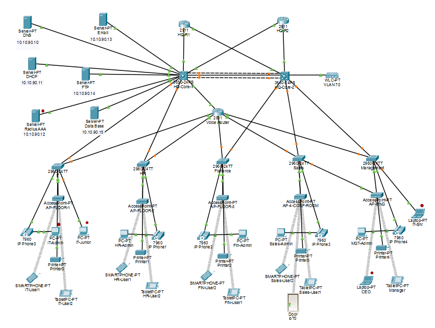

# 🔐 Project 4: Head Quarter V2 - Security Enhanced

<div align="center">


**Enterprise Network with Advanced Security Features**

[🏠 Back to Main Portfolio](README.md)

</div>

---

## 📖 Table of Contents

- [Overview](#-overview)
- [Network Topology](#-network-topology)
- [What's New in V2](#-whats-new-in-v2)
- [Security Enhancements](#-security-enhancements)
- [AAA Implementation](#-aaa-implementation)
- [SSH Configuration](#-ssh-configuration)
- [Network Architecture](#-network-architecture)
- [Configuration](#-configuration)
- [Learning Outcomes](#-learning-outcomes)

---

## 🎯 Overview

**Head Quarter V2** is an upgraded and security-enhanced version of Project 3. This version focuses on implementing enterprise-grade security features including SSH for secure remote access, Telnet for management, and centralized AAA authentication using a Radius server.

### Evolution from V1 to V2:

```
Project 3 (HQ V1)          →          Project 4 (HQ V2)
===================                   ====================
✅ Basic networking                   ✅ Everything from V1
✅ VLANs & routing                    ✅ + SSH (Secure Shell)
✅ VoIP integration                   ✅ + Telnet access
✅ Wireless (WLC)                     ✅ + AAA Authentication
✅ HSRP redundancy                    ✅ + Radius Server
                                     ✅ + Enhanced security policies
```

---

## 🗺 Network Topology

<div align="center">

</div>

### Key Components:
- **Core:** 2x 3560-24PS switches (HSRP enabled)
- **Voice:** Cisco 2811 Router
- **Servers:** 5 servers including Radius AAA
- **Departments:** 5 departments (IT, HR, Finance, Sales, Management)
- **Security:** Centralized AAA with Radius
- **Access:** SSH and Telnet enabled

---

## 📋 What's New in V2?

<div align="center">

| Feature | Project 3 (V1) | Project 4 (V2) |
|---------|----------------|----------------|
| **SSH** | ❌ Not configured | ✅ Enabled on all devices |
| **Telnet** | ❌ Not configured | ✅ Enabled for management |
| **AAA** | ❌ Basic auth only | ✅ Radius server |
| **Centralized Auth** | ❌ No | ✅ Yes (Radius) |
| **Authorization** | ❌ Basic | ✅ Privilege levels |
| **Accounting** | ❌ No | ✅ User tracking |
| **Security Policies** | ⚠️ Basic | ✅ Enhanced |
| **Remote Access** | ⚠️ Unsecure | ✅ Encrypted (SSH) |

</div>

---

## 🔐 Security Enhancements

### 1. SSH (Secure Shell) Implementation

**Why SSH?**
- ✅ Encrypted communication
- ✅ Secure remote management
- ✅ Strong authentication
- ✅ Industry standard

**SSH vs Telnet:**
```
Telnet:
├─ Plain text transmission
├─ Passwords visible in network traffic
├─ No encryption
└─ Security risk

SSH:
├─ Encrypted transmission
├─ Passwords protected
├─ Strong encryption (RSA keys)
└─ Secure and safe
```

**Enabled On:**
- All core switches
- All access switches
- Voice router
- Distribution devices

---

### 2. AAA (Authentication, Authorization, Accounting)

**What is AAA?**

```
┌────────────────────────────────────────────┐
│              AAA FRAMEWORK                 │
├────────────────────────────────────────────┤
│                                            │
│  1. AUTHENTICATION                         │
│     WHO are you?                           │
│     → Username/Password verification       │
│                                            │
│  2. AUTHORIZATION                          │
│     WHAT can you do?                       │
│     → Privilege levels & permissions       │
│                                            │
│  3. ACCOUNTING                             │
│     WHAT did you do?                       │
│     → Logging & audit trails               │
│                                            │
└────────────────────────────────────────────┘
```

---

### 3. Radius Server Implementation

**Server Details:**
- **Location:** Server VLAN (10.10.99.12)
- **Type:** Radius AAA Server
- **Purpose:** Centralized authentication
- **Database:** Local pes#123

**How It Works:**

```
User Login Attempt
        ↓
   Network Device
        ↓
   Radius Server ←→ User Database
        ↓
   Authentication Decision
        ↓
   ┌─────────┬─────────┐
   ↓         ↓         ↓
ALLOW    DENY    ACCOUNTING
(Grant)  (Reject) (Log)
```

**Benefits:**
- ✅ Single user database
- ✅ Centralized management
- ✅ Easy user addition/removal
- ✅ Consistent policies
- ✅ Audit trails
- ✅ Reduced admin overhead

---


---

## 🔧 SSH Configuration

### Step-by-Step SSH Setup:

#### 1. Set Hostname & Domain

```cisco
! Configure hostname
Router(config)# hostname HQ-Core-1

! Configure domain name (required for SSH)
Router(config)# ip domain-name hq.company.com
```

#### 2. Generate RSA Keys

```cisco
! Generate RSA key pair
Router(config)# crypto key generate rsa
How many bits in the modulus [512]: 1024

! Note: 1024 or 2048 recommended for security
```

#### 3. Create Local User (Fallback)

```cisco
! Create admin user with highest privilege
Router(config)# username admin privilege 15 secret SecurePass123
```

#### 4. Configure VTY Lines for SSH

```cisco
! Configure VTY lines (0-4 for telnet/ssh access)
Router(config)# line vty 0 4

! Allow only SSH (disable telnet for security)
Router(config-line)# transport input ssh

! Use local database for login (fallback)
Router(config-line)# login local

! Set timeout
Router(config-line)# exec-timeout 10 0

! Exit
Router(config-line)# exit
```

#### 5. Enable SSH Version 2

```cisco
! Use SSH version 2 (more secure)
Router(config)# ip ssh version 2

! Optional: Set SSH timeout
Router(config)# ip ssh time-out 60

! Optional: Set max authentication attempts
Router(config)# ip ssh authentication-retries 3
```

---

## 🔐 AAA Implementation

### Complete AAA Configuration:

#### 1. Enable AAA

```cisco
! Enable AAA globally
Router(config)# aaa new-model
```

#### 2. Configure Radius Server

```cisco
! Define Radius server
Router(config)# radius server HQ-RADIUS
Router(config-radius-server)# address ipv4 10.10.99.12
Router(config-radius-server)# key RadiusSecretKey123
Router(config-radius-server)# exit
```

#### 3. AAA Authentication

```cisco
! Configure authentication for login
! Try Radius first, then local if Radius fails
Router(config)# aaa authentication login default group radius local

! Configure authentication for enable mode
Router(config)# aaa authentication enable default group radius enable
```

#### 4. AAA Authorization

```cisco
! Configure authorization for exec commands
Router(config)# aaa authorization exec default group radius local

! Configure authorization for network services
Router(config)# aaa authorization network default group radius
```

#### 5. AAA Accounting

```cisco
! Configure accounting to track user actions
Router(config)# aaa accounting exec default start-stop group radius

! Track commands executed
Router(config)# aaa accounting commands 15 default start-stop group radius
```

---

## 🏢 Department Configuration

### All Departments Include:

**Common Equipment per Department:**
- Access Switch: 2960-24TT
- PCs/Laptops: 2-3 per department
- IP Phone: 7960 series
- Printer: 1 per department
- Tablets/Smartphones: Multiple
- Access Point: For wireless devices

**Security Features:**
- SSH enabled on access switches
- AAA authentication required
- VLAN isolation
- Port security (optional)
- Dynamic ARP inspection (optional)

---

## 📞 VoIP Integration

**Voice Router:** Cisco 2811

**Security Features:**
- SSH access enabled
- AAA authentication
- Secure dial-peer configuration
- Voice VLAN (70) isolation

**IP Phones:**
- Authenticate via DHCP Option 150
- Separate voice VLAN
- QoS priority
- Encrypted signaling (optional)

---

## 🎓 Learning Outcomes

### Security Skills Gained:

✅ **SSH Implementation:**
- RSA key generation
- SSH version 2 configuration
- Secure remote access
- Key management

✅ **AAA Framework:**
- Authentication setup
- Authorization policies
- Accounting and logging
- User management

✅ **Radius Server:**
- Server deployment
- Client configuration
- User database management
- Fallback mechanisms

✅ **Access Control:**
- Privilege levels
- Command authorization
- Login security
- Session management

✅ **Network Security:**
- Encrypted management traffic
- Centralized authentication
- User tracking and auditing
- Security policy enforcement

---

## 🔍 Verification Commands

### Check SSH Status:

```cisco
! Verify SSH is enabled
show ip ssh

! Check SSH connections
show ssh

! View RSA keys
show crypto key mypubkey rsa
```

### Verify AAA:

```cisco
! Check AAA configuration
show aaa servers
show aaa sessions

! View authentication methods
show aaa authentication
show aaa authorization

! Check accounting
show aaa accounting
```

### Test Radius:

```cisco
! Test Radius connectivity
test aaa group radius username password new-code

! Debug Radius (use carefully)
debug radius
debug aaa authentication
```

---

## 🔧 Troubleshooting

### Common Issues:

**Issue 1: AAA authentication failing**
```cisco
! Check Radius server reachability
ping 10.10.99.12

! Verify Radius configuration
show aaa servers

! Check if local fallback works
! Try logging in when Radius is down

! Debug (careful in production)
debug aaa authentication
```

**Issue 2: Users can login but have no privileges**
```cisco
! Check authorization
show aaa authorization

! Verify user privilege level
show privilege

! Check authorization on Radius server
! (Server-side configuration)
```

---

## 📈 Advantages Over V1

| Aspect | V1 (Project 3) | V2 (This Project) |
|--------|----------------|-------------------|
| **Remote Access** | Unsecure Telnet | Encrypted SSH |
| **Authentication** | Local only | Centralized Radius |
| **User Management** | Per-device | Single database |
| **Accountability** | None | Full logging |
| **Security** | Basic | Enterprise-grade |
| **Scalability** | Limited | Highly scalable |
| **Compliance** | Basic | Audit-ready |

---

## 🚀 Future Enhancements

This project can be further enhanced with:
- Two-factor authentication (2FA)
- Certificate-based SSH
- TACACS+ for additional security
- Syslog server for centralized logging
- Network Access Control (NAC)
- 802.1X port authentication

---

## 🎯 Project Complexity

**Difficulty Level:** ⭐⭐⭐⭐ (Advanced)

**Time to Complete:** 6-8 hours

**Prerequisites:**
- Completion of Project 3 (HQ V1)
- Understanding of security concepts
- Knowledge of AAA framework
- SSH basics
- Radius server concepts

---

## 📚 Related Projects

- **Previous:** [Project 3 - Head Quarter Network](03-HQ-NETWORK-README.md) (Base version)
- **Next:** [Project 5 - PESI Infrastructure](05-PESI-README.md) (Multi-site with VPN)

---

## 📞 Connect With Me

<div align="center">

[](mailto:a.wahid7860668@gmail.com)
[](https://www.linkedin.com/in/abdul-wahid022)
[](https://github.com/abdul-wahid022)

**💬 Questions? Need Packet Tracer files? Feel free to reach out!**

[⬅️ Previous Project](03-HQ-NETWORK-README.md) | [🏠 Back to Main](README.md) | [➡️ Next Project](05-PESI-README.md)

**Made with ❤️ by Abdul Wahid**

</div>
