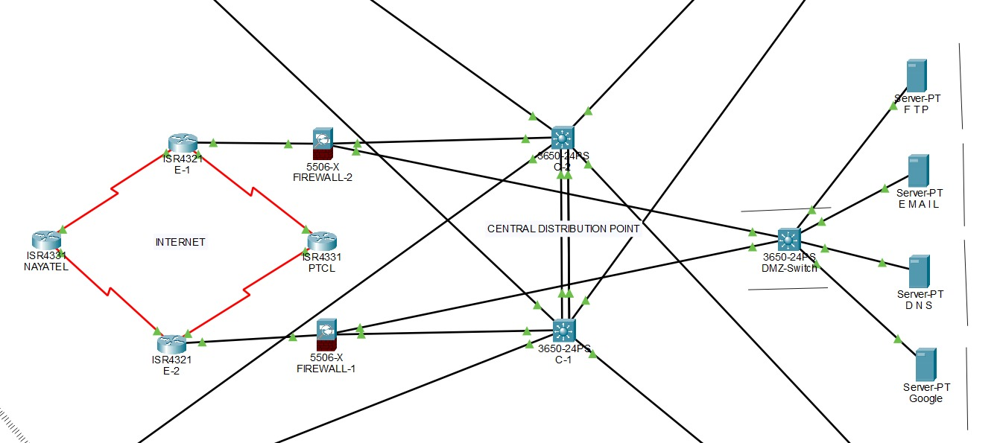
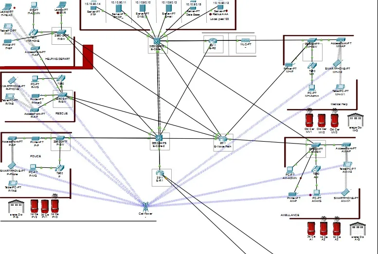
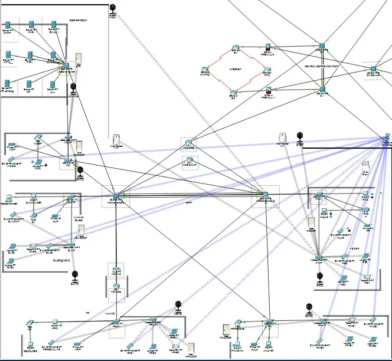
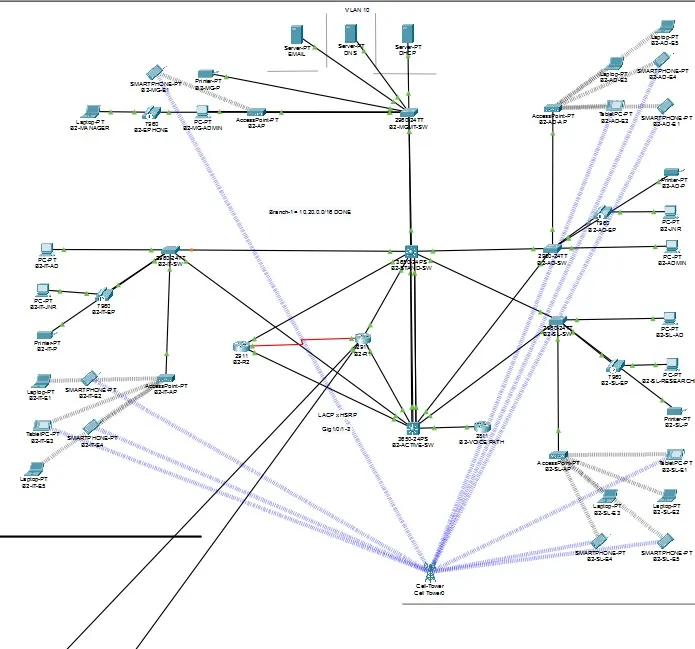
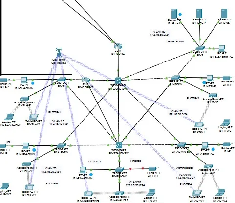

# 🚨 Project 5: PESI - Pakistan Emergency Smart Infrastructure

<div align="center">


**National Emergency Response Infrastructure with Multi-Site Connectivity**

[🏠 Back to Main Portfolio](README.md)

</div>

---

## 📖 Table of Contents

- [Overview](#-overview)
- [Complete Topology](#-complete-topology)
- [Network Architecture](#-network-architecture)
- [Site Details](#-site-details)
  - [Central Distribution Point](#-central-distribution-point-hub)
  - [Emergency Response Center](#-emergency-response-center)
  - [Headquarters](#-headquarters)
  - [Branch Office 1](#-branch-office-1)
  - [Branch Office 2](#-branch-office-2)
- [Technologies](#-technologies-implemented)
- [Network Statistics](#-network-statistics)
- [Configuration](#-configuration-highlights)
- [Learning Outcomes](#-learning-outcomes)

---

## 🎯 Overview

**PESI (Pakistan Emergency Smart Infrastructure)** is the most complex and comprehensive project in this portfolio. It represents a complete national emergency response infrastructure connecting multiple sites including emergency services, corporate headquarters, and branch offices through secure VPN tunnels.

### Project Scale:

```
┌─────────────────────────────────────────────────────────┐
│              PESI INFRASTRUCTURE                        │
├─────────────────────────────────────────────────────────┤
│  Sites: 5 interconnected locations                      │
│  Servers: 21 total across all sites                     │
│  VLANs: 27+ network-wide                                │
│  Users: 3,200+ capacity                                 │
│  Emergency Services: 4 departments                      │
│  Routing: OSPF Multi-Area (0, 1, 3)                     │
│  Security: Dual firewalls, IPSec VPN, NAT/PAT          │
│  Redundancy: Zero single point of failure               │
└─────────────────────────────────────────────────────────┘
```

---

## 🗺 Complete Topology

<div align="center">

</div>

### Topology Layout:
- **Top Left:** 🚨 Emergency Response Center
- **Top Right:** 🏬 Branch Office 1
- **Bottom Left:** 🏢 Headquarters (Largest site)
- **Bottom Right:** 🏬 Branch Office 2
- **Center:** 🌐 Central Distribution Point (Hub)

---

## 🏗 Network Architecture

### Multi-Site Connectivity:

```
                    ┌──────────────────────┐
                    │   🚨 EMERGENCY       │
                    │   RESPONSE CENTER    │
                    │   Area: Emergency    │
                    └──────────┬───────────┘
                               │ IPSec VPN
                               │
    ┌──────────────────────────▼──────────────────────────┐
    │         🌐 CENTRAL DISTRIBUTION POINT               │
    │              (HUB FOR ALL SITES)                    │
    │  ┌────────────────────────────────────────────┐    │
    │  │ • Dual ISP (PTCL + Nayatel)               │    │
    │  │ • Dual Cisco ASA Firewalls                │    │
    │  │ • DMZ with Public Servers                 │    │
    │  │ • IPSec VPN Hub                           │    │
    │  │ • NAT/PAT Gateway                         │    │
    │  └────────────────────────────────────────────┘    │
    └───────┬──────────────────────┬────────────┬─────────┘
            │                      │            │
            │ VPN                  │ VPN        │ VPN
            │                      │            │
    ┌───────▼────────┐    ┌────────▼──────┐    ┌──▼────────────┐
    │  🏢 HQ         │    │ 🏬 BRANCH 1   │    │ 🏬 BRANCH 2   │
    │  OSPF Area 0   │    │ OSPF Area 1   │    │ OSPF Area 3   │
    │  2,000+ users  │    │ Serial backup │    │ 1,200+ users  │
    │  9 Servers     │    │ 3 Servers     │    │ 3 Servers     │
    └────────────────┘    └───────────────┘    └───────────────┘
```

---

## 🌐 CENTRAL DISTRIBUTION POINT (HUB)

<div align="center">

</div>

### Purpose:
The heart of PESI - connects all sites and provides internet connectivity

### Components:

#### 1. Dual ISP Configuration
```
ISP 1: PTCL (Primary)
├─ Main internet connection
├─ Load balancing
└─ Failover to ISP 2

ISP 2: Nayatel (Secondary/Backup)
├─ Redundant connection
├─ Automatic failover
└─ Load sharing
```

#### 2. Dual Cisco ASA Firewalls

**Why Two Firewalls?**
- ✅ Zero downtime
- ✅ Automatic failover
- ✅ Load balancing
- ✅ Maintenance without outage

**Configuration:**
```cisco
! Primary ASA Firewall
hostname ASA-PRIMARY
interface GigabitEthernet0/0
 nameif outside
 security-level 0
 ip address [ISP-IP]

interface GigabitEthernet0/1
 nameif inside
 security-level 100
 ip address 192.168.1.1 255.255.255.0

interface GigabitEthernet0/2
 nameif dmz
 security-level 50
 ip address 172.16.10.1 255.255.255.0

! Failover to Secondary ASA
failover
failover lan interface failover GigabitEthernet0/3
failover link failover
failover interface ip failover 10.0.0.1 255.255.255.252 standby 10.0.0.2
```

#### 3. DMZ Zone (Public Servers)

**Public Servers:**
- **Web Server:** Public website hosting
- **Mail Server:** Email services (SMTP/POP3)
- **DNS Server:** Public DNS resolution
- **FTP Server:** File transfer services

**Security:**
```
Internet → Firewall → DMZ (Security Level 50)
         ↓
    Internal Network (Security Level 100)
```

**DMZ Configuration:**
```cisco
! DMZ Interface
interface GigabitEthernet0/2
 nameif dmz
 security-level 50
 ip address 172.16.10.1 255.255.255.0

! Allow access from Internet to DMZ servers
access-list OUTSIDE-IN extended permit tcp any host 172.16.10.10 eq www
access-list OUTSIDE-IN extended permit tcp any host 172.16.10.11 eq smtp
access-list OUTSIDE-IN extended permit tcp any host 172.16.10.12 eq domain
access-list OUTSIDE-IN extended permit tcp any host 172.16.10.13 eq ftp

! Apply access list
access-group OUTSIDE-IN in interface outside
```

#### 4. IPSec VPN Hub

**Purpose:** Secure site-to-site connectivity

**VPN Tunnels:**
```
Central Hub ←VPN→ Emergency Center
Central Hub ←VPN→ Headquarters
Central Hub ←VPN→ Branch 1
Central Hub ←VPN→ Branch 2
```

**VPN Configuration:**
```cisco
! IKE Phase 1
crypto isakmp policy 10
 encryption aes 256
 hash sha256
 authentication pre-share
 group 5
 lifetime 86400

! Pre-shared key for each site
crypto isakmp key SharedSecretKey123 address [SITE-IP]

! IKE Phase 2 (IPSec)
crypto ipsec transform-set STRONG-SET esp-aes 256 esp-sha256-hmac

! Crypto map
crypto map VPN-MAP 10 ipsec-isakmp
 set peer [REMOTE-SITE-IP]
 set transform-set STRONG-SET
 match address VPN-TRAFFIC

! Apply to interface
interface GigabitEthernet0/0
 crypto map VPN-MAP
```

#### 5. NAT/PAT Configuration

**Purpose:** Allow internal networks to access internet

```cisco
! PAT for all internal networks
nat (inside,outside) dynamic interface

! Static NAT for DMZ servers
static (dmz,outside) [PUBLIC-IP-1] 172.16.10.10 netmask 255.255.255.255
static (dmz,outside) [PUBLIC-IP-2] 172.16.10.11 netmask 255.255.255.255
static (dmz,outside) [PUBLIC-IP-3] 172.16.10.12 netmask 255.255.255.255
static (dmz,outside) [PUBLIC-IP-4] 172.16.10.13 netmask 255.255.255.255
```

---

## 🚨 EMERGENCY RESPONSE CENTER

<div align="center">

</div>

### Overview:
Dedicated center for coordinating emergency services across the country

### Specifications:

| Feature | Details |
|---------|---------|
| **Servers** | 6 (AAA, Email, DHCP, DNS, FTP, Syslog) |
| **Departments** | 4 Emergency Services |
| **IP Phones** | 5 (one per dept + 1 for IT) |
| **Wireless** | WLC enabled |
| **Redundancy** | HSRP + LACP |

### Emergency Departments:

#### 1. 🚔 Police Department
**Function:** Law enforcement coordination
- Emergency police dispatch
- Crime reporting system
- Officer communication
- Evidence management

#### 2. 🏥 Medical Department
**Function:** Medical emergency response
- Ambulance dispatch
- Hospital coordination
- Patient transfer management
- Medical resource allocation

#### 3. 🚒 Rescue Department
**Function:** Fire and rescue operations
- Fire emergency response
- Rescue operations coordination
- Equipment management
- Firefighter communication

#### 4. 🚑 Ambulance Department
**Function:** Ambulance services
- Emergency medical services
- Ambulance fleet management
- Response time optimization
- Medical supply coordination

### Server Infrastructure:

```
┌─────────────────────────────────────────┐
│        EMERGENCY SERVERS                │
├─────────────────────────────────────────┤
│ 1. AAA Server    - Authentication       │
│ 2. Email Server  - Communication        │
│ 3. DHCP Server   - IP management        │
│ 4. DNS Server    - Name resolution      │
│ 5. FTP Server    - File sharing         │
│ 6. Syslog Server - Centralized logging  │
└─────────────────────────────────────────┘
```

### IT Department:
**Main IT Department** handles:
- AAA authentication and device management
- System monitoring
- Network troubleshooting
- User support
- Security management

### Wireless Integration:
**WLC (Wireless LAN Controller)** provides:
- Mobile device connectivity
- Emergency responder devices
- Tablets for field operations
- Laptop connectivity
- Guest network for visitors

### Communication System:
**5 IP Phones (7960 series):**
- Police Dept: Extension 9001
- Medical Dept: Extension 9002
- Rescue Dept: Extension 9003
- Ambulance Dept: Extension 9004
- IT Dept: Extension 9005

---

## 🏢 HEADQUARTERS

<div align="center">

</div>

### Overview:
The largest and most comprehensive site in PESI

### Specifications:

| Feature | Details |
|---------|---------|
| **Servers** | 9 (Most comprehensive) |
| **VLANs** | 9 (Complete segmentation) |
| **IP Phones** | 5 (Extensions 6001-6005) |
| **Capacity** | 2,000+ users |
| **OSPF** | Area 0 (Backbone) |
| **IoT** | Full smart building integration |

### 9 VLANs Structure:

```
VLAN 10: Servers
├─ All server infrastructure
├─ Centralized services
└─ Priority network segment

VLAN 20: HR Department
├─ Human resources
├─ Employee management
└─ Payroll systems

VLAN 30: Finance Department
├─ Financial operations
├─ Accounting
└─ Budget management

VLAN 40: Sales Department
├─ Sales operations
├─ CRM systems
└─ Customer management

VLAN 50: IT Department
├─ Network management
├─ System administration
└─ Technical support

VLAN 60: Management
├─ Executive offices
├─ Decision making
└─ Strategic planning

VLAN 70: Voice (VoIP)
├─ IP phone traffic
├─ Voice communications
└─ QoS priority

VLAN 80: IoT Devices
├─ Smart building devices
├─ Sensors and automation
└─ Environmental control

VLAN 90: WiFi/Wireless
├─ Wireless clients
├─ Guest network
└─ Mobile devices
```

### 9 Server Infrastructure:

```
┌─────────────────────────────────────────────┐
│          HEADQUARTERS SERVERS               │
├─────────────────────────────────────────────┤
│ 1. DHCP Server     - Dynamic IP assignment  │
│ 2. DNS Server      - Name resolution        │
│ 3. Email Server    - Corporate email        │
│ 4. FTP Server      - File sharing           │
│ 5. RADIUS Server   - AAA authentication     │
│ 6. NTP Server      - Time synchronization   │
│ 7. IoT Server      - Smart device mgmt      │
│ 8. Database Server - Data storage           │
│ 9. Syslog Server   - Centralized logging    │
└─────────────────────────────────────────────┘
```

### IoT Security System:

**Smart Building Features:**
- **Motion Detectors:** Entry and movement tracking
- **CCTV Cameras:** 24/7 surveillance
- **Smart Locks:** Automated access control
- **Environmental Sensors:**
  - Temperature monitoring
  - Humidity control
  - Air quality sensors
  - Water leak detection

**IoT Integration:**
```
IoT Server (VLAN 80)
        ↓
┌───────┴────────┬─────────┬────────┐
│                │         │        │
Motion      CCTV     Smart    Sensors
Detectors   Cameras  Locks    (Env)
```

### Voice System:
**IP Phones with Extensions:**
- HR Dept: 6001
- Finance Dept: 6002
- Sales Dept: 6003
- IT Dept: 6004
- Management: 6005

---

## 🏬 BRANCH OFFICE 1

<div align="center">

</div>

### Overview:
Remote branch with dedicated CEO/Admin section

### Specifications:

| Feature | Details |
|---------|---------|
| **VLANs** | 6 (Management, IT, Sales, CEO-Admin, Voice, Servers) |
| **Servers** | 3 (DHCP, DNS, EMAIL) |
| **IP Phones** | 4 (Extensions 2001-2004) |
| **OSPF** | Area 1 |
| **Backup** | Serial link for redundancy |

### 6 VLANs:

```
VLAN 10: Management
├─ Network management
├─ Admin operations
└─ Monitoring

VLAN 20: IT Department
├─ Technical support
├─ System administration
└─ Local IT operations

VLAN 30: Sales Department
├─ Sales team
├─ Customer service
└─ Sales operations

VLAN 40: CEO-Admin
├─ Executive offices
├─ Administrative staff
└─ Management operations

VLAN 50: Voice VLAN
├─ IP phone traffic
├─ VoIP communications
└─ QoS enabled

VLAN 60: Servers VLAN
├─ Local servers
├─ Branch services
└─ Backup systems
```

### Connectivity:

**Primary:** IPSec VPN to Central Distribution Point
**Backup:** Serial link (automatically activates if VPN fails)

```
Branch 1 ──VPN──► Central Hub
    │
    │ (Failover)
    │
    └──Serial──► Backup Route
```

### HSRP Configuration:
```cisco
! Gateway redundancy
interface vlan 10
 ip address 192.168.10.2 255.255.255.0
 standby 10 ip 192.168.10.1
 standby 10 priority 110
 standby 10 preempt
```

---

## 🏬 BRANCH OFFICE 2

<div align="center">

</div>

### Overview:
Medium-sized branch with complete departmental structure

### Specifications:

| Feature | Details |
|---------|---------|
| **VLANs** | 6 (Sales, HR, Finance, Admin, IT, Servers) |
| **Servers** | 3 (DHCP, DNS, Email) |
| **Domain** | b2pesi.com |
| **OSPF** | Area 3 |
| **Capacity** | 1,200+ users |
| **Gateway** | Static configuration |

### 6 VLANs:

```
VLAN 10: Sales Department
├─ Sales operations
├─ Customer management
└─ Revenue generation

VLAN 20: HR Department
├─ Human resources
├─ Employee services
└─ Recruitment

VLAN 30: Finance Department
├─ Financial operations
├─ Accounting services
└─ Budget control

VLAN 40: Admin Department
├─ Administrative operations
├─ Office management
└─ General administration

VLAN 50: IT Department
├─ Technical support
├─ Network management
└─ User support

VLAN 60: Servers VLAN
├─ Local server infrastructure
├─ Branch services
└─ Data storage
```

### Domain Configuration:
**Domain:** b2pesi.com
```cisco
! DNS configuration
ip domain-name b2pesi.com
ip name-server 192.168.20.10
```

### Port Address Translation (PAT):
```cisco
! PAT for internet access
ip nat inside source list 1 interface gi0/0 overload
access-list 1 permit 192.168.20.0 0.0.0.255
```

---

## 🛠 Technologies Implemented

### Routing:
✅ **OSPF Multi-Area**
- Area 0: Headquarters (Backbone)
- Area 1: Branch Office 1
- Area 3: Branch Office 2
- Area design for scalability

### Security:
✅ **Cisco ASA Firewalls (Dual)**
- Active/Standby failover
- Stateful packet inspection
- NAT/PAT
- Access control lists

✅ **IPSec VPN**
- Site-to-site tunnels
- Strong encryption (AES-256)
- Secure key exchange (IKE)
- Perfect Forward Secrecy

✅ **AAA Authentication**
- Radius servers
- Centralized user management
- Authorization policies
- Accounting and logging

### Redundancy:
✅ **HSRP** - Gateway redundancy
✅ **LACP** - Link aggregation
✅ **Dual ISP** - Internet redundancy
✅ **Dual Firewalls** - Security redundancy
✅ **Backup Links** - Serial connections

### Voice:
✅ **VoIP** - IP phones across all sites
✅ **Voice VLANs** - Dedicated voice traffic
✅ **QoS** - Voice priority
✅ **Inter-site Calling** - Through VPN

### Wireless:
✅ **WLC** - Centralized management
✅ **Multiple APs** - Coverage across sites
✅ **Guest Networks** - Visitor access
✅ **Wireless Security** - WPA2-Enterprise

### IoT:
✅ **Smart Security** - Cameras, motion detectors
✅ **Environmental Monitoring** - Sensors
✅ **Automated Controls** - Smart locks
✅ **IoT Server** - Device management

### Services:
✅ **DHCP** - Dynamic IP assignment
✅ **DNS** - Name resolution
✅ **Email** - Corporate communication
✅ **FTP** - File sharing
✅ **Database** - Data storage
✅ **Syslog** - Centralized logging
✅ **NTP** - Time synchronization

---

## 📊 Network Statistics

<div align="center">

| Metric | Value |
|--------|-------|
| **Total Sites** | 5 locations |
| **Total Servers** | 21 servers |
| **Total VLANs** | 27+ VLANs |
| **IP Phones** | 14+ phones |
| **User Capacity** | 3,200+ users |
| **Emergency Departments** | 4 departments |
| **OSPF Areas** | 3 areas (0, 1, 3) |
| **VPN Tunnels** | 4 tunnels |
| **Firewalls** | 2 (redundant) |
| **ISPs** | 2 (PTCL + Nayatel) |

</div>

---

## ⚙️ Configuration Highlights

### OSPF Multi-Area Configuration:

**Headquarters (Area 0 - Backbone):**
```cisco
router ospf 1
 router-id 1.1.1.1
 network 10.10.0.0 0.0.255.255 area 0
 passive-interface default
 no passive-interface gi0/1
 no passive-interface gi0/2
```

**Branch 1 (Area 1):**
```cisco
router ospf 1
 router-id 2.2.2.2
 network 192.168.10.0 0.0.0.255 area 1
 area 1 stub
```

**Branch 2 (Area 3):**
```cisco
router ospf 1
 router-id 3.3.3.3
 network 192.168.20.0 0.0.0.255 area 3
 area 3 stub
```

### VPN Configuration (Central Hub):

```cisco
! IKE Phase 1 Policy
crypto isakmp policy 10
 encryption aes 256
 hash sha256
 authentication pre-share
 group 5
 lifetime 86400

! Pre-shared keys for each site
crypto isakmp key EmergencyKey123 address [EMERGENCY-IP]
crypto isakmp key HQKey123 address [HQ-IP]
crypto isakmp key Branch1Key123 address [BRANCH1-IP]
crypto isakmp key Branch2Key123 address [BRANCH2-IP]

! IPSec Transform Set
crypto ipsec transform-set STRONG-SET esp-aes 256 esp-sha256-hmac
 mode tunnel

! Crypto Maps for each site
crypto map VPN-MAP 10 ipsec-isakmp
 set peer [EMERGENCY-IP]
 set transform-set STRONG-SET
 match address EMERGENCY-TRAFFIC

crypto map VPN-MAP 20 ipsec-isakmp
 set peer [HQ-IP]
 set transform-set STRONG-SET
 match address HQ-TRAFFIC

! Apply crypto map
interface GigabitEthernet0/0
 crypto map VPN-MAP
```

---

## 🎓 Learning Outcomes

### Enterprise Skills:

✅ **Large-Scale Design:**
- Multi-site architecture
- Scalability planning
- Capacity management
- Growth accommodation

✅ **VPN Technologies:**
- IPSec configuration
- Site-to-site tunnels
- Encryption standards
- Key management

✅ **High Availability:**
- Redundancy design
- Failover mechanisms
- Zero downtime architecture
- Disaster recovery

✅ **Emergency Systems:**
- Critical infrastructure design
- Emergency response integration
- Mission-critical networking
- 24/7 availability

✅ **Security:**
- Firewall policies
- DMZ architecture
- Multi-layer security
- Access control

✅ **OSPF Multi-Area:**
- Area design
- Route summarization
- Stub areas
- Backbone configuration

---

## 🎯 Project Complexity

**Difficulty Level:** ⭐⭐⭐⭐⭐ (Expert)

**Time to Complete:** 20-30 hours

**Prerequisites:**
- All previous projects (1-4)
- Advanced routing knowledge
- VPN and firewall experience
- Multi-site design understanding
- OSPF multi-area concepts
- High availability design

---

## 🚀 Real-World Applications

This project demonstrates skills applicable to:
- Government infrastructure
- Emergency services networks
- Multi-national corporations
- Financial institutions
- Healthcare networks
- Critical infrastructure
- Large enterprise networks

---

## 📚 Related Projects

- **Previous:** [Project 4 - HQ V2 Security](04-HQ-V2-SECURITY-README.md)
- **Next:** [Project 6 - HQ & Branch with DMZ](06-HQ-BRANCH-DMZ-README.md)

---
## 📞 Connect With Me

<div align="center">

[](mailto:a.wahid7860668@gmail.com)
[](https://www.linkedin.com/in/abdul-wahid022)
[](https://github.com/abdul-wahid022)

**💬 Questions? Need Packet Tracer files? Feel free to reach out!**

[⬅️ Previous Project](04-HQ-V2-SECURITY-README.md) | [🏠 Back to Main](README.md) | [➡️ Next Project](06-HQ-BRANCH-DMZ-README.md)

**Made with ❤️ by Abdul Wahid**

</div>
