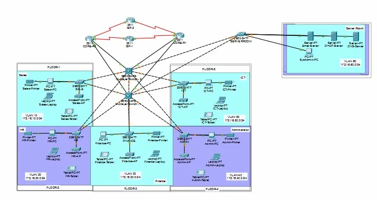
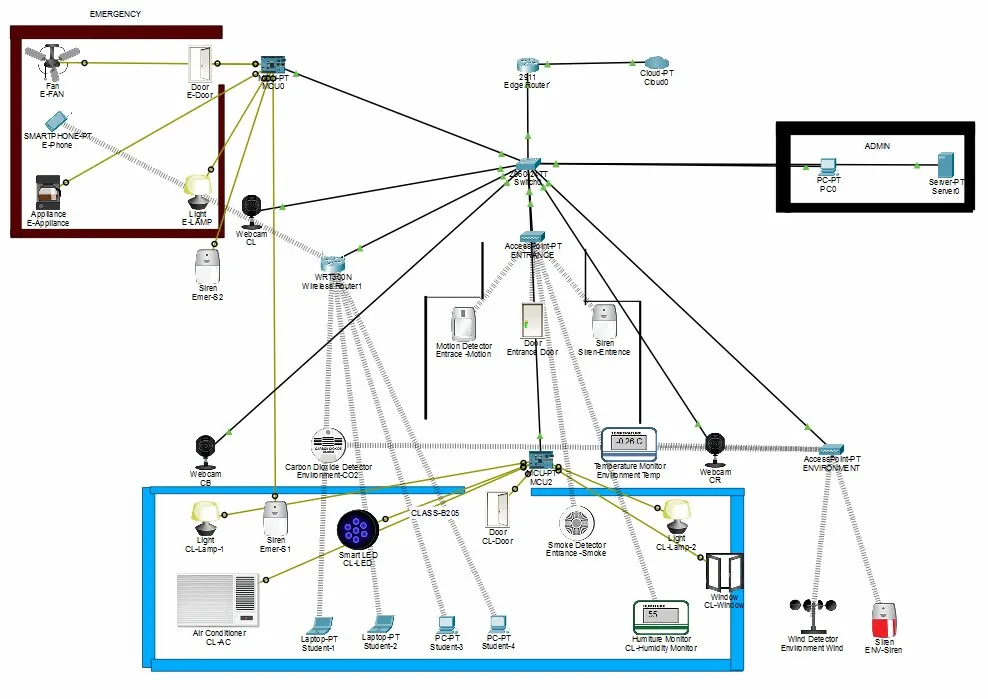
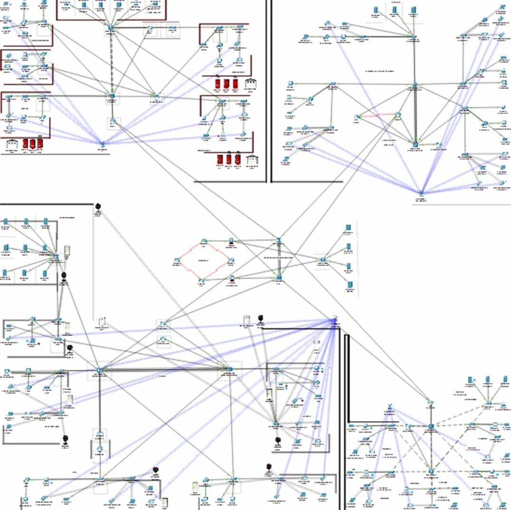
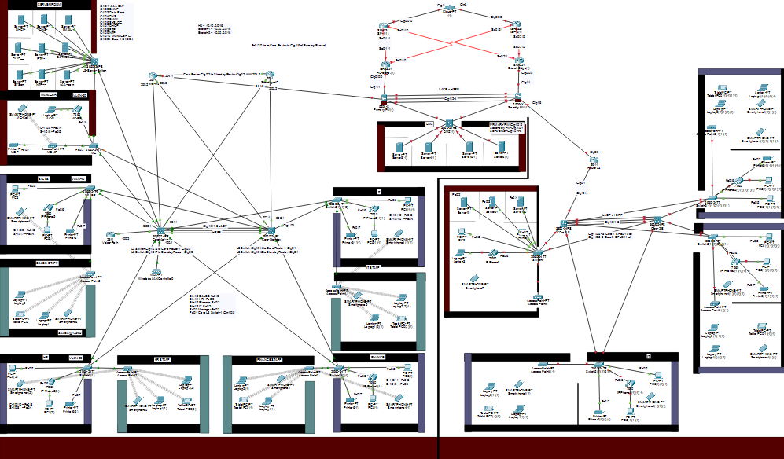

# 🌐 Network Engineering Projects Portfolio

<div align="center">


**A Complete Collection of Enterprise Network Design & Implementation Projects**

[📧 Email](mailto:a.wahid7860668@gmail.com) • [💼 LinkedIn](https://www.linkedin.com/in/abdul-wahid022) • [💻 GitHub](https://github.com/abdul-wahid022)

</div>

---

## 📚 Table of Contents

- [About This Portfolio](#-about-this-portfolio)
- [Projects Overview](#-projects-overview)
- [Technologies Used](#-technologies-used)
- [Project Details](#-project-details)
- [Skills Demonstrated](#-skills-demonstrated)
- [How to Use](#-how-to-use)
- [Contact](#-contact)

---

## 🎯 About This Portfolio

This repository contains **6 comprehensive network engineering projects** designed and implemented using **Cisco Packet Tracer**. Each project demonstrates real-world enterprise networking scenarios, from small branch offices to large-scale emergency infrastructure systems.

**Total Experience:** Spanning from basic networking concepts to advanced enterprise architectures
**Tools:** Cisco Packet Tracer, Cisco IOS
**Focus Areas:** Routing, Switching, Security, VoIP, IoT, Wireless, VPN

---

## 📊 Projects Overview

<div align="center">

| # | Project Name | Complexity | Status | Highlights |
|---|--------------|------------|--------|------------|
| 1 | [Mini Branch Network](#1-mini-branch-network) | ⭐⭐⭐ | ✅ Complete | PAT, HSRP, OSPF, Class B |
| 2 | [Smart School Automation](#2-smart-school-automation) | ⭐⭐⭐ | ✅ Complete | MCU, IoT, Java, Automation |
| 3 | [Head Quarter Network](#3-head-quarter-network) | ⭐⭐⭐⭐ | ✅ Complete | 6 Servers, VoIP, WLC, LACP |
| 4 | [HQ V2 - Security Enhanced](#4-head-quarter-v2-security-enhanced) | ⭐⭐⭐⭐ | ✅ Complete | SSH, Telnet, AAA, Radius |
| 5 | [PESI Infrastructure](#5-pesi-pakistan-emergency-smart-infrastructure) | ⭐⭐⭐⭐⭐ | ✅ Complete | Multi-Site, VPN, Emergency |
| 6 | [HQ & Branch with DMZ](#6-hq--branch-with-dmz) | ⭐⭐⭐⭐ | ⚠️ Incomplete | Internal Complete, DMZ Pending |

</div>

---

## 🛠 Technologies Used

### Routing Protocols
- 🔄 **OSPF** (Open Shortest Path First) - Multi-area
- 🔄 **EIGRP** (Enhanced Interior Gateway Routing Protocol)
- 🔄 **Static Routing**

### Switching Technologies
- 🔀 **VLANs** (Virtual Local Area Networks)
- 🔀 **HSRP** (Hot Standby Router Protocol)
- 🔀 **LACP** (Link Aggregation Control Protocol)
- 🔀 **EtherChannel**

### Security
- 🔐 **AAA** (Authentication, Authorization, Accounting)
- 🔐 **Radius Server**
- 🔐 **SSH** (Secure Shell)
- 🔐 **Telnet**
- 🔐 **ACLs** (Access Control Lists)
- 🔐 **Cisco ASA Firewalls**
- 🔐 **IPSec VPN**
- 🔐 **NAT/PAT**

### Voice & Wireless
- 📞 **VoIP** (Voice over IP)
- 📞 **Cisco IP Phones** (7960 series)
- 📡 **WLC** (Wireless LAN Controller)
- 📡 **Access Points** (2901-FTT)

### IoT & Automation
- 🤖 **MCU** (Microcontroller Unit)
- 🤖 **Smart Sensors**
- 🤖 **Motion Detectors**
- 🤖 **CCTV Integration**
- 🤖 **Environmental Monitoring**

### Services
- 💾 **DHCP** (Dynamic Host Configuration Protocol)
- 💾 **DNS** (Domain Name System)
- 💾 **Email Servers**
- 💾 **FTP** (File Transfer Protocol)
- 💾 **Database Servers**
- 💾 **Syslog**
- 💾 **NTP** (Network Time Protocol)

---

## 📁 Project Details

### 1️⃣ Mini Branch Network

<div align="center">

</div>

**📋 Overview:**
A compact branch office network demonstrating fundamental enterprise networking concepts with 5 departments and a centralized server room.

**🔧 Key Technologies:**
- PAT (Port Address Translation)
- HSRP (High Availability)
- OSPF Routing
- Class B IP Addressing
- VLAN Segmentation

**📖 [View Detailed Documentation →](01-MINI-BRANCH-README.md)**

---

### 2️⃣ Smart School Automation

<div align="center">

</div>

**📋 Overview:**
An innovative IoT-based school automation system featuring MCU-controlled devices, automated bell systems, and smart classroom management.

**🔧 Key Technologies:**
- MCU (Microcontroller Unit)
- Java Programming for MCU
- IoT Sensors & Automation
- Smart Device Control
- Timer-based Systems
- Motion Detection
- Environmental Sensors

**💡 Special Features:**
- Automated bell/siren with timer
- Smart fan control
- Emergency system integration
- Motion detector entrance control

**📖 [View Detailed Documentation →](02-SCHOOL-AUTOMATION-README.md)**

---

### 3️⃣ Head Quarter Network

<div align="center">

</div>

**📋 Overview:**
A comprehensive enterprise head quarter network supporting 5 departments with complete server infrastructure, VoIP, and wireless integration.

**🔧 Key Technologies:**
- 6 Servers (DNS, Email, DHCP, FTP, Database, PT)
- HSRP for Redundancy
- LACP Link Aggregation
- VoIP Integration
- WLC for Wireless
- Radius AAA
- Multiple VLANs

**📊 Scale:**
- 5 Departments (IT, HR, Finance, Sales, Management)
- 6 Centralized Servers
- IP Phones in Every Department
- Wireless Coverage via WLC
- 10.10.x.x IP Scheme

**📖 [View Detailed Documentation →](03-HQ-NETWORK-README.md)**

---

### 4️⃣ Head Quarter V2 - Security Enhanced

<div align="center">

</div>

**📋 Overview:**
An upgraded version of the head quarter network with enhanced security features including SSH, Telnet, and centralized AAA authentication.

**🔧 Key Technologies:**
- SSH (Secure Shell)
- Telnet Remote Access
- AAA Authentication
- Radius Server
- HSRP & LACP
- VLANs (Including VLAN70)
- VoIP (2811 Voice Router)

**🔐 Security Enhancements:**
- Centralized authentication via Radius
- Secure remote management (SSH)
- Enhanced access control
- Improved authorization policies

**📊 Scale:**
- 5 Departments
- 5 Servers (DNS, Email, FTP, Database, Radius AAA)
- Multiple Access Points (2960-24TT)
- IP Phones (7960 series)
- IoT Device Integration

**📖 [View Detailed Documentation →](04-HQ-V2-SECURITY-README.md)**

---

### 5️⃣ PESI (Pakistan Emergency Smart Infrastructure)

<div align="center">

</div>

**📋 Overview:**
The most complex project - A complete national emergency infrastructure system integrating multiple sites including emergency services, headquarters, and branch offices.

**🏗 Architecture:**
- **5 Interconnected Sites:**
  - 🚨 Emergency Response Center
  - 🏢 Headquarters (Main Office)
  - 🏬 Branch Office 1
  - 🏬 Branch Office 2
  - 🌐 Central Distribution Point (Hub)

**🔧 Key Technologies:**
- OSPF Multi-Area (Area 0, 1, 3)
- IPSec VPN Site-to-Site
- Dual Cisco ASA Firewalls
- HSRP + LACP Redundancy
- NAT/PAT
- WLC Wireless
- VoIP Across All Sites
- IoT Integration

**📊 Massive Scale:**
- **21 Total Servers** across all sites
- **27+ VLANs** network-wide
- **14+ IP Phones** for communication
- **3,200+ User Capacity**
- **4 Emergency Departments** (Police, Medical, Rescue, Ambulance)

**🌐 Central Distribution Point:**
- Dual ISP (PTCL + Nayatel)
- Dual Firewalls (Zero downtime)
- DMZ with Public Servers (Web, Mail, DNS, FTP)
- Hub for all site connectivity

**🚨 Emergency Response Center:**
- 6 Servers (AAA, Email, DHCP, DNS, FTP, Syslog)
- 4 Emergency Departments
- 5 IP Phones
- WLC for coordination
- HSRP + LACP

**🏢 Headquarters:**
- 9 Servers (Most comprehensive)
- 9 VLANs (Complete segmentation)
- IoT Security System
- 2,000+ User capacity
- OSPF Area 0 (Backbone)

**🏬 Branch Offices:**
- **Branch 1:** OSPF Area 1, Serial backup, 4 IP Phones
- **Branch 2:** OSPF Area 3, 1,200+ users, Domain: b2pesi.com

**📖 [View Detailed Documentation →](05-PESI-README.md)**

---

### 6️⃣ HQ & Branch with DMZ

<div align="center">

</div>

**📋 Overview:**
An enterprise network project featuring headquarters and branch connectivity. Internal networks are complete, but external connectivity including DMZ, firewalls, and ISP integration is pending.

**⚠️ STATUS: INCOMPLETE (60% Complete)**

**✅ Completed Sections:**
- Internal HQ network (all departments)
- Internal Branch network (all departments)
- VLAN segmentation
- Local switching and routing
- End-user connectivity

**❌ Pending Sections:**
- DMZ Zone Configuration
- Cisco ASA Firewalls
- ISP Connectivity (PTCL/Nayatel)
- IPSec VPN between sites
- NAT/PAT Configuration
- Public-facing servers
- WAN Links (Primary + Backup)

**🎯 Next Steps:**
1. Configure DMZ with public servers
2. Deploy and configure firewalls
3. Connect ISPs with redundancy
4. Establish VPN tunnels
5. Implement NAT/PAT
6. Complete WAN links

**📖 [View Detailed Documentation →](06-HQ-BRANCH-DMZ-README.md)**

---

## 💡 Skills Demonstrated

<div align="center">

| Category | Skills |
|----------|--------|
| **Routing** | OSPF, EIGRP, Static Routing, Multi-Area Design |
| **Switching** | VLANs, HSRP, LACP, EtherChannel, Spanning Tree |
| **Security** | Firewalls, VPN, AAA, Radius, SSH, ACLs, NAT/PAT |
| **Voice** | VoIP, IP Phones, Voice VLANs, Call Management |
| **Wireless** | WLC, Access Points, Wireless Security |
| **IoT** | MCU Programming, Sensors, Automation, Smart Devices |
| **Services** | DHCP, DNS, Email, FTP, Database, NTP, Syslog |
| **Design** | Network Architecture, Redundancy, Scalability |

</div>

---

## 🚀 How to Use

### Prerequisites:
- Cisco Packet Tracer (Latest Version)
- Basic networking knowledge
- Understanding of Cisco IOS commands

### Steps:
1. **Clone or Download** this repository
2. **Open Packet Tracer** 
3. **Select a Project** from the list above
4. **Read Documentation** for detailed configuration
5. **Load .pkt file** in Packet Tracer
6. **Review and Learn** from the implementations

### File Structure:
```
📁 Projects/
├── 📄 README.md (This file)
├── 📄 01-MINI-BRANCH-README.md
├── 📄 02-SCHOOL-AUTOMATION-README.md
├── 📄 03-HQ-NETWORK-README.md
├── 📄 04-HQ-V2-SECURITY-README.md
├── 📄 05-PESI-README.md
├── 📄 06-HQ-BRANCH-DMZ-README.md
└── 📁 images/
    ├── mini-branch-topology.png
    ├── mini-school-automation-topology.png
    ├── head-quarter-network-topology.png
    ├── head-quarter-v2-security-topology.png
    ├── pesi-complete-topology.png
    ├── pesi-emergency-center.png
    ├── pesi-headquarters.png
    ├── pesi-branch1.png
    ├── pesi-branch2.png
    ├── pesi-central-hub.png
    └── hq-branch-incomplete-topology.png
```

---

## 📈 Project Progression

The projects are designed to progressively build networking skills:

```
Level 1: Mini Branch Network
    ↓ (Learn: Basic routing, PAT, HSRP)
    
Level 2: Smart School Automation
    ↓ (Learn: IoT, MCU, Automation)
    
Level 3: Head Quarter Network
    ↓ (Learn: Enterprise design, VoIP, Wireless)
    
Level 4: HQ V2 Security
    ↓ (Learn: AAA, SSH, Advanced security)
    
Level 5: PESI Infrastructure
    ↓ (Learn: Multi-site, VPN, Large-scale design)
    
Level 6: HQ & Branch with DMZ
    (Learn: DMZ, Firewalls, Complete enterprise security)
```

---

## 🎓 Learning Outcomes

By studying these projects, you will learn:

✅ **Network Design:**
- Enterprise network architecture
- Scalable and redundant designs
- Multi-site connectivity
- Hierarchical network models

✅ **Routing & Switching:**
- OSPF implementation and multi-area design
- VLAN design and inter-VLAN routing
- Redundancy protocols (HSRP, LACP)
- Link aggregation and load balancing

✅ **Security:**
- Firewall configuration and policies
- VPN technologies (IPSec)
- AAA authentication systems
- Secure remote access (SSH)
- Network segmentation for security

✅ **Enterprise Services:**
- VoIP deployment and management
- Wireless network design (WLC)
- Server infrastructure planning
- IoT integration in networks

✅ **Advanced Concepts:**
- NAT/PAT configuration
- DMZ architecture
- Emergency communication systems
- High availability designs

---

## 📞 Contact & Support

<div align="center">

**Abdul Wahid**

[](mailto:a.wahid7860668@gmail.com)
[](https://www.linkedin.com/in/abdul-wahid022)
[](https://github.com/abdul-wahid022)

**Need help? Have questions? Want Packet Tracer files?**
**Feel free to reach out!**

</div>

---

## 📜 License

This project is created for **educational purposes** and is open-source. Feel free to use these projects for learning and reference.

---

## 🙏 Acknowledgments

- **Cisco Networking Academy** for Packet Tracer
- **Networking Community** for continuous learning resources
- **Open Source Community** for inspiration and support

---

<div align="center">

### ⭐ If you found this helpful, please give it a star!

**Made with ❤️ by Abdul Wahid**

*Last Updated: January 2026*

---

**📊 Portfolio Stats**


</div>
